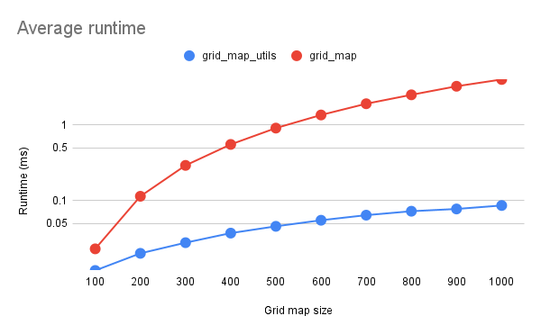

# グリッドマップユーティリティ

## 概要

このパッケージには、いくつかのポリゴン内に含まれるグリッドマップ内のすべてのセルを反復処理するために使用される`grid_map::PolygonIterator`の実装が含まれます。

## アルゴリズム

この実装では、ラスター化された画像にポリゴンを描画するために一般的に使用される[走査線アルゴリズム](https://ja.wikipedia.org/wiki/%E3%82%BD%E3%82%AD%E3%83%9F%E3%81%AE%E3%83%90%E3%83%AB%E3%82%B4%E3%83%AA%E3%82%B0%E3%83%A0)を使用します。
グリッドマップに適応されたアルゴリズムの主な考え方は次のとおりです。

- グリッドマップの行とポリゴンエッジのエッジとの交点を計算する。
- 各行について、交点の各ペア間の列を計算する。
- 結果の`(row, column)`インデックスはポリゴンの内側です。

走査線アルゴリズムの詳細については、参照をご覧ください。

## API

`autoware::grid_map_utils::PolygonIterator`は、元の[`grid_map::PolygonIterator`](https://docs.ros.org/en/kinetic/api/grid_map_core/html/classgrid__map_1_1PolygonIterator.html)と同じAPIに従います。

## 前提条件

`autoware::grid_map_utils::PolygonIterator`の動作は、ポリゴンのエッジがセルの中心を正確には横切らない場合にのみ、`grid_map::PolygonIterator`と一致することが保証されます。
そのような場合、交差したセルがポリゴンの内側または外側と見なされるかどうかは、浮動小数点の誤差により異なる場合があります。

## パフォーマンス

ベンチマークコードは`test/benchmarking.cpp`に実装されており、`autoware::grid_map_utils::PolygonIterator`が`grid_map::PolygonIterator`とまったく同じように動作することを検証するためにも使用されます。

次の図は、このパッケージ(`autoware_grid_map_utils`)の実装とオリジナル実装(`grid_map`)のランタイムを比較したものです。
測定された時間は、イテレータの構築とすべてのインデックスのイテレーションを含み、対数スケールを使用して表示されます。
結果は、辺のサイズが`100 <= n <= 1000`の正方形グリッドマップ (`n`のサイズは`n x n`セルグリッドを意味します)、頂点数が`3 <= m <= 100`のランダムポリゴン、および各パラメータ`(n,m)`を10回繰り返す結果によって得られました。

## 今後の改善

複数のポリゴンに対して走査線アルゴリズムのさまざまなバリエーションが存在します。
これらは、複数のポリゴンの少なくとも1つに含まれるセルを反復処理する場合に実装できます。

現在の実装は、セルの中心位置がポリゴンの内側にある場合にセルを選択する、元の`grid_map::PolygonIterator`の動作を模倣します。
この動作は、たとえばポリゴンと重なるすべてのセルのみを返すように変更できます。

## 参照

- <https://ja.wikipedia.org/wiki/%E3%82%BD%E3%82%AD%E3%83%9F%E3%81%AE%E3%83%90%E3%83%AB%E3%82%B4%E3%83%AA%E3%82%B0%E3%83%A0>
- <https://web.cs.ucdavis.edu/~ma/ECS175_S00/Notes/0411_b.pdf>

