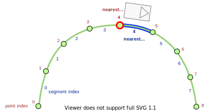
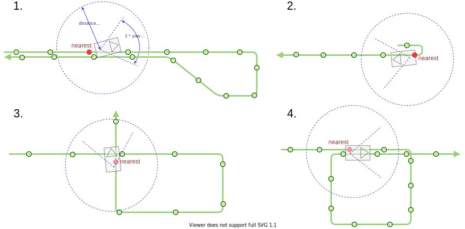

# Motion Utilsパッケージ

## 用語の定義

### セグメント

Autowareにおける`セグメント`は、次のように2つの連続する点の間の線分です。

{: style="width:600px"}

ある位置に対する最も近いセグメントインデックスと最も近いポイントインデックスは、常に同じではありません。そのため、ポイントとセグメントに対して最も近いインデックスを計算するための2つの異なるユーティリティ関数を準備します。

## 最近傍インデックスの検索

このセクションでは、最も近いインデックスと最も近いセグメントインデックスの検索について説明します。

最も近いインデックスの検索と最も近いセグメントインデックスの検索には同じ関数があります。

最も近いインデックス検索を例にとると、2種類の関数があります。

最初の関数は、距離とヨーの閾値を使用して最も近いインデックスを見つけます。


```cpp
template <class T>
size_t findFirstNearestIndexWithSoftConstraints(
  const T & points, const geometry_msgs::msg::Pose & pose,
  const double dist_threshold = std::numeric_limits<double>::max(),
  const double yaw_threshold = std::numeric_limits<double>::max());
```

この関数は、しきい値内にある最初の局所解を求めます。
最初の局所解を求める理由は、次のサブセクションで説明するエッジケースに対応するためです。

関数に渡すしきい値を決定できるように、しきい値引数の既定パラメータがあります。

1. 距離とヨー角の両方のしきい値が与えられている場合
   - まず、距離とヨー角の両方のしきい値を持つ最も近いインデックスを探します。
   - 見つからない場合は、距離しきい値のみで再度検索を試みます。
   - 見つからない場合は、しきい値なしで検索します。
2. 距離のみが指定されている場合
   - まず、距離しきい値を持つ最も近いインデックスを探します。
   - 見つからない場合は、しきい値なしで検索します。
3. しきい値が指定されていない場合
   - 最も近いインデックスを求めます。

2 番目の関数は、`lane_id` が `lane_id` であるレーン内にある最も近いインデックスを見つけるものです。


```cpp
size_t findNearestIndexFromLaneId(
  const tier4_planning_msgs::msg::PathWithLaneId & path,
  const geometry_msgs::msg::Point & pos, const int64_t lane_id);
```

### 様々なオブジェクトへの適用

多くのノードパッケージでは、オブジェクトの最近傍のインデックスが計算されます。
推奨される計算方法を説明します。

#### 自車に対する最近傍のインデックス

自車前のパス長が十分に短い場合、距離しきい値とヨーしきい値の両方を使用した `findFirstNearestIndexWithSoftConstraints` で次のエッジケースで正しい最近傍インデックスが見つかることが期待されます。
青い円は、ベースリンク位置からの距離しきい値を表し、2 本の青い線は、ベースリンクの方位に対するヨーしきい値を表します。
これらのケースの点の中で、赤色の正しい最近傍点が検出できます。



したがって、実装方法は次のとおりです。


```cpp
const size_t ego_nearest_idx = findFirstNearestIndexWithSoftConstraints(points, ego_pose, ego_nearest_dist_threshold, ego_nearest_yaw_threshold);
const size_t ego_nearest_seg_idx = findFirstNearestIndexWithSoftConstraints(points, ego_pose, ego_nearest_dist_threshold, ego_nearest_yaw_threshold);
```

#### ダイナミックオブジェクトの最近傍インデックス

エゴの最近傍インデックスでは、エゴはポイントに従う必要があるため、位置に加えて向きも考慮されます。
ただし、ダイナミックオブジェクト（例：予測オブジェクト）の場合、その向きがポイントの順序と異なる場合があり、例えばエゴが前進しているにもかかわらずダイナミックオブジェクトが後退する場合があります。

したがって、ダイナミックオブジェクトにはヨーしきい値を考慮しないでください。
実装方法は次のとおりです。


```cpp
const size_t dynamic_obj_nearest_idx = findFirstNearestIndexWithSoftConstraints(points, dynamic_obj_pose, dynamic_obj_nearest_dist_threshold);
const size_t dynamic_obj_nearest_seg_idx = findFirstNearestIndexWithSoftConstraints(points, dynamic_obj_pose, dynamic_obj_nearest_dist_threshold);
```

#### 交通オブジェクト用の最近インデックス

レーンの小マップでは、交通オブジェクトは特定の車線に属します。
この特定の車線の ID を使用して、正しい最近インデックスを見つけることができます。

実装は次のとおりです。


```cpp
// first extract `lane_id` which the traffic object belong to.
const size_t traffic_obj_nearest_idx = findNearestIndexFromLaneId(path_with_lane_id, traffic_obj_pos, lane_id);
const size_t traffic_obj_nearest_seg_idx = findNearestSegmentIndexFromLaneId(path_with_lane_id, traffic_obj_pos, lane_id);
```

## 開発者向け

`trajectory.hpp` のテンプレート関数の一部は、特定の型（`autoware_planning_msgs::msg::PathPoint`、`autoware_planning_msgs::msg::PathPoint`、`autoware_planning_msgs::msg::TrajectoryPoint`）に主に使用されるため、`extern template` 関数としてエクスポートされ、コンパイル時間を短縮します。

`autoware_motion_utils.hpp` ヘッダーファイルは、このファイルに直接的・間接的にインクルードされるソースファイルのプレ処理に時間がかかったため、削除されました。

