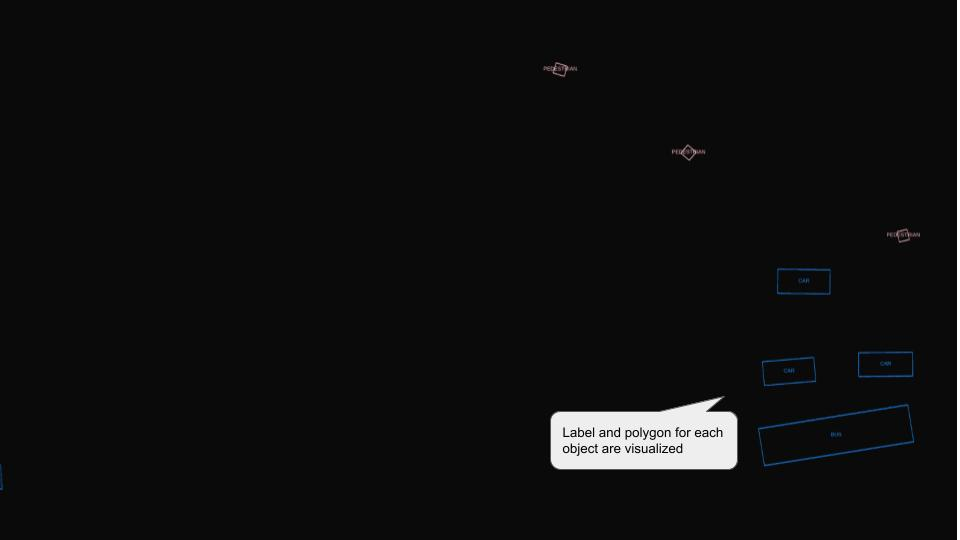
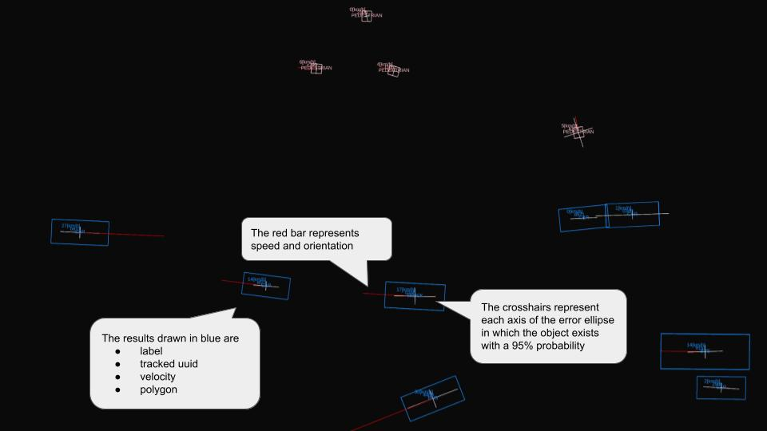
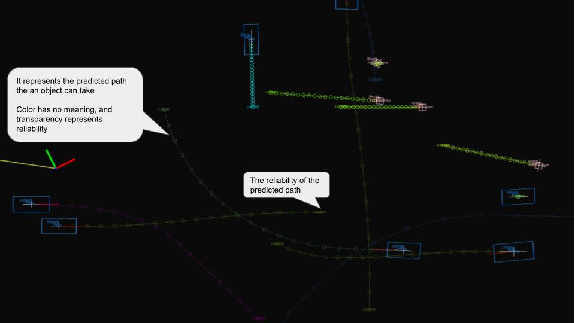

# autoware_perception_rviz_plugin

## 目的

これはパーセプションモジュールの結果を視覚化するRVIZプラグインです。このパッケージは、Autoware.Autoによって開発されたRVIZプラグインの実装をベースにしています。

Autoware.Autoの設計方針については、元の設計ドキュメントを参照してください。[[1]](https://gitlab.com/autowarefoundation/autoware.auto/AutowareAuto/-/blob/master/src/tools/visualization/autoware_rviz_plugins)

<!-- パッケージの目的を記述し、その機能について簡単に説明します。

例:
  {package_name}は障害物を避けるための経路を計画するパッケージです。
  この機能は、障害物のフィルタリングと経路の最適化という2つの手順で構成されています。
-->

## 入力の種類 / 視覚化の結果

### 検出物体

#### 入力の種類

| 名称 | 型                                                   | 説明                |
| ---- | ---------------------------------------------------- | --------------------- |
|      | `autoware_perception_msgs::msg::DetectedObjects` | 検出結果の配列         |

#### 可視化結果

### TrackedObjects

#### 入力タイプ

| 名前 | 型 | 説明 |
|---|---|---|
| | `autoware_perception_msgs::msg::TrackedObjects` | Tracking結果配列 |

#### 可視化結果

検出結果で追跡結果を上書きします。

### PredictedObjects

#### 入力タイプ

| 名称 | 型 | 説明 |
|---|---|---|
|      | `autoware_perception_msgs::msg::PredictedObjects` | 予測結果配列 |

#### 可視化結果

追跡結果で予測結果を上書きします。

## 参考文献 / 外部リンク

[1] <https://gitlab.com/autowarefoundation/autoware.auto/AutowareAuto/-/tree/master/src/tools/visualization/autoware_rviz_plugins>

## 今後の拡張 / 実装されていない部分

