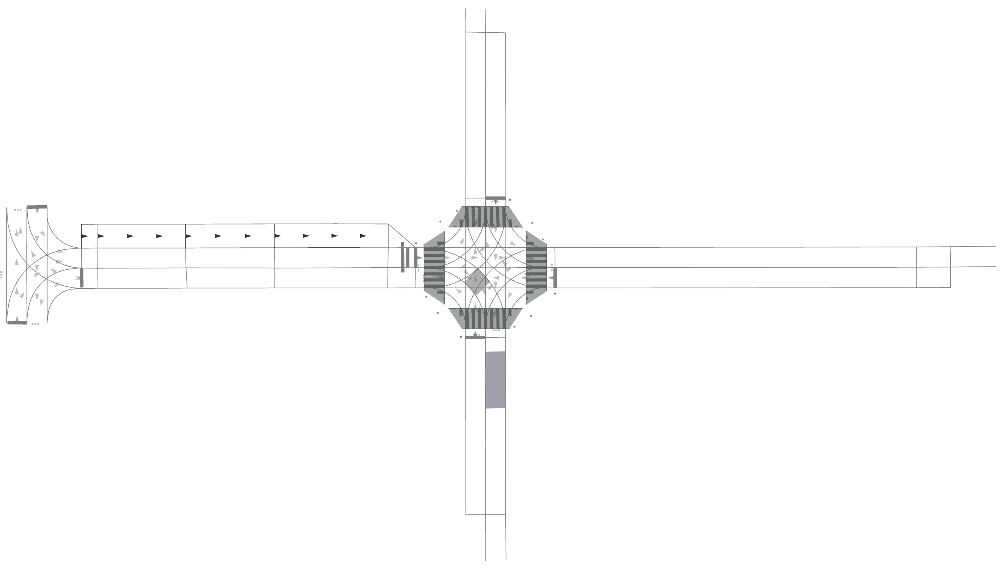
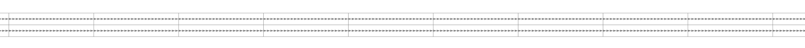
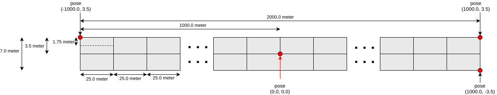
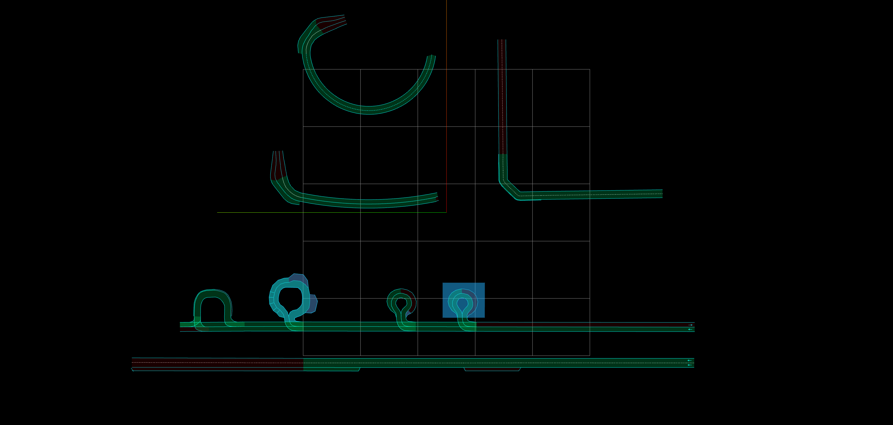
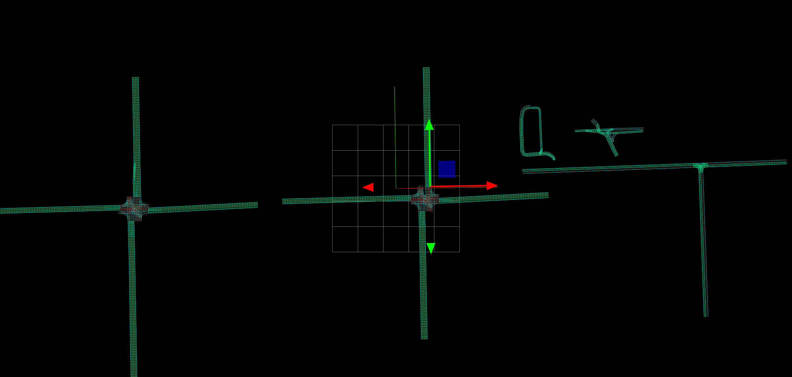

# テストツール

## 背景

Autoware のコンポーネントとモジュールの多くはすでにユニットテストを採用しているので、ユニットテストを記述するプロセスを容易にする共通のライブラリが必要です。

## 目的

`test_utils` の目的は、Autoware コンポーネント用のユニットテストライブラリを開発することです。このライブラリには、次のものが含まれます。

- 一般的に使用される関数
- 入力/モックデータパーサー
- テスト用のマップ
- テスト用の一般的なルートとモックデータ

## 利用可能なマップ

次のマップは [ここ](https://github.com/autowarefoundation/autoware.universe/tree/main/common/autoware_test_utils/test_map) で入手できます。

### Common

Common マップには、路肩、交差点、一部の規制要素を含む、さまざまなタイプの使用可能な入力が含まれています。Common マップはフォルダー内の `lanelet2_map.osm` という名前です。



### 2 km Straight

2 km Straight レーンレットマップは、同じ方向に走る 2 つのレーンで構成されています。このマップは `2km_test.osm` という名前です。



マップの設計を以下に示します。



### road_shoulders

road_shoulders レーンレットマップは、次のような road_shoulder タグを持つさまざまなピックアップ場所/降車地点マップで構成されています。

- 道路側のレーンにあるピックアップ/ドロップオフの場所
- 曲線レーン側のピックアップ/ドロップオフの場所
- 私有地内のピックアップ/ドロップオフの場所



planning_simulator を以下で簡単に起動できます。


```bash
ros2 launch autoware_test_utils psim_road_shoulder.launch.xml vehicle_model:=<> sensor_model:=<> use_sim_time:=true
```

### 交差点

交差点レーンレットマップは、以下を含むさまざまな交差点で構成されています。

- 信号機のある 4 方向交差点
- 信号機のない 4 方向交差点
- 信号機のない T 字交差点
- 輪形の交差点
- 複雑な交差点



planning_simulator は以下で簡単に起動できます。


```bash
ros2 launch autoware_test_utils psim_intersection.launch.xml vehicle_model:=<> sensor_model:=<> use_sim_time:=true
```

## 使用事例

### Autoware Planning Test Manager

[Autoware Planning Test Manager](https://autowarefoundation.github.io/autoware.universe/main/planning/autoware_planning_test_manager/) の目的は、Planningモジュールのノードをテストすることです。`PlanningInterfaceTestManager` クラス ([ソースコード](https://github.com/autowarefoundation/autoware.universe/blob/main/planning/autoware_planning_test_manager/src/autoware_planning_test_manager.cpp)) は、`test_utils` 関数をベースにラッパー関数を生成します。

### 単体テスト用のテストデータを生成する

[PR の説明](https://github.com/autowarefoundation/autoware.universe/pull/9207) で示したように、テストマップで Planning Simulation を実行中に、シーンのスナップショットを yaml ファイルに保存できます。


```bash
ros2 launch autoware_test_utils psim_road_shoulder.launch.xml
ros2 launch autoware_test_utils psim_intersection.launch.xml
```

デフォルトでは、autoware の `sample_vehicle_description` と `sample_sensor_kit` を使用し、`autoware_test_utils/config/test_vehicle_info.param.yaml` は `sample_vehicle_description` と全く同じです。指定されている場合、`vehicle_model`/`sensor_model` 引数を使うことができます。


```bash
ros2 service call /autoware_test_utils/topic_snapshot_saver std_srvs/srv/Empty \{\}
```

トピックの保存対象となるリストとフィールド名は`config/sample_topic_snapshot.yaml`で指定されています。


```yaml
# setting
fields:
  - name: self_odometry # this is the field name for this topic
    type: Odometry # the abbreviated type name of this topic
    topic: /localization/kinematic_state # the name of this topic

# output
self_odometry:
  - header: ...
    ...
```

各フィールドは、`autoware_test_utils/mock_data_parser.hpp` で定義されている関数を使用して ROS メッセージ型に解析できます。

