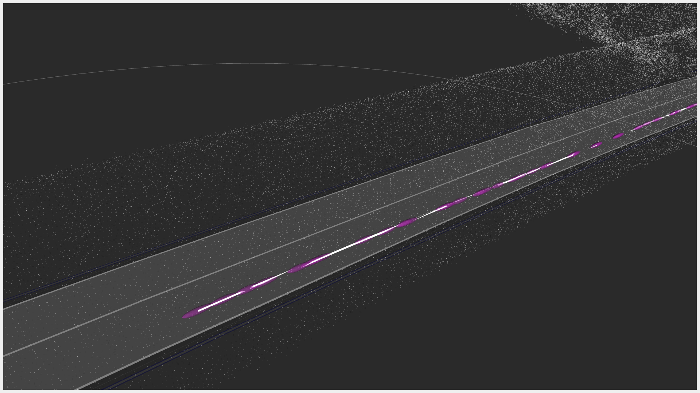

# tier4_localization_rviz_plugin

## 目的

このプラグインは、ekf_localizer、ndt_scan_matching、および GNSS により得られた局在化履歴を表示できます。
推定された姿勢の不確かさを与えれば、それらを表示することもできます。

## 入力/出力

### 入力

###姿勢履歴

| 名称         | 型                                  | 説明                                                                                                        |
| ------------ | ------------------------------------- | --------------------------------------------------------------------------------------------------------------- |
| `input/pose` | `geometry_msgs::msg::PoseStamped` | `input/pose`には、ekf_localizer、ndt_scan_matching、またはGNSSで計算されたローカライゼーションの結果を格納します。 |

### 共分散履歴付きポーズ

| 名称                         | 型                                             | 説明                                                                                                           |
| ---------------------------- | ------------------------------------------------ | --------------------------------------------------------------------------------------------------------------------- |
| `input/pose_with_covariance` | `geometry_msgs::msg::PoseWithCovarianceStamped` | `input/pose_with_covariance`には、`ekf_localizer`、`ndt_scan_matching`、またはGNSSによって計算されたローカリゼーションの結果を設定します。 |

## パラメータ

### コアパラメータ

### 自車位置履歴

| 名前 | タイプ | デフォルト値 | 説明 |
|---|---|---|---|
| `property_buffer_size_` | int | 100 | トピックのバッファーサイズ |
| `property_line_view_` | bool | true | 線プロパティを使用するかどうか |
| `property_line_width_` | float | 0.1 | 線プロパティの幅 [m] |
| `property_line_alpha_` | float | 1.0 | 線プロパティのアルファ |
| `property_line_color_` | QColor | Qt::white | 線プロパティの色 |

### 自車位置と共分散履歴

| 名称                               | タイプ   | デフォルト値  | 説明                                     |
| ------------------------------------ | ------ | -------------- | ----------------------------------------- |
| `property_buffer_size_`             | int    | 100            | トピックのバッファサイズ                       |
| `property_path_view_`                 | bool   | true           | パスプロパティを使用するかどうか             |
| `property_shape_type_`                | string | Line           | LineまたはArrow                              |
| `property_line_width_`                | float  | 0.1            | Line プロパティの幅 [m]                     |
| `property_line_alpha_`                | float  | 1.0            | Line プロパティのアルファ                       |
| `property_line_color_`                | QColor | Qt::white      | Line プロパティの色                           |
| `property_arrow_shaft_length`           | float  | 0.3            | Arrow プロパティのシャフト長                     |
| `property_arrow_shaft_diameter`       | float  | 0.15           | Arrow プロパティのシャフト直径                   |
| `property_arrow_head_length`            | float  | 0.2            | Arrow プロパティのヘッド長                       |
| `property_arrow_head_diameter`          | float  | 0.3            | Arrow プロパティのヘッド直径                   |
| `property_arrow_alpha_`               | float  | 1.0            | Arrow プロパティのアルファ                       |
| `property_arrow_color_`               | QColor | Qt::white      | Arrow プロパティの色                           |
| `property_sphere_scale_`               | float  | 1.0            | Sphere プロパティのスケール                     |
| `property_sphere_alpha_`               | float  | 0.5            | Sphere プロパティのアルファ                     |
| `property_sphere_color_`               | QColor | (204, 51, 204) | Sphere プロパティの色

## 仮定 / 想定される制限

定義待ち（TBD）。

## 使用方法

1. rvizを起動し、「ディスプレイ」パネルで「追加」を選択します。
   
2. tier4_localization_rviz_plugin/PoseHistory または PoseWithCovarianceHistory を選択します。次に、「OK」を押します。
   
3. 軌跡と共分散を表示するトピックの名前を入力します。
   
4. 軌跡と共分散を表示できます。
   

