## コントロールバリデータ

`control_validator`はコントロールコンポーネントの出力の妥当性を確認するモジュールです。検証ステータスは`/diagnostics`トピックで確認できます。

## サポートされている機能

次の機能は検証用にサポートされており、しきい値をパラメータで設定できます。
以下に記載されている機能は必ずしも最新のインプリメンテーションに対応しているとは限りません。

| 説明                                                                        | 引数                                                                                       |                  診断式                  |
| ---------------------------------------------------------------------------------- | ----------------------------------------------------------------------------------------------- | :---------------------------------------: |
| 逆速度: 測定速度が目標速度と符号が異なる。 | 測定速度 $v$、目標速度 $\hat{v}$、速度パラメータ $c$                    |      $v \hat{v} < 0, \quad \lvert v \rvert > c$       |
| 過速度: 測定速度が目標速度を大幅に上回る。                      | 測定速度 $v$、目標速度 $\hat{v}$、比率パラメータ $r$、オフセットパラメータ $c$ | $\lvert v \rvert > (1 + r) \lvert \hat{v} \rvert + c$ |

- **基準軌跡と予測軌跡の偏差チェック** : 予測軌跡と基準軌跡の最大の偏差が所定のしきい値を超えている場合、無効。

## 入出力

### 入力

`control_validator` は、次の入力を受け入れます。

| 名称 | タイプ | 説明 |
|---|---|---|
| `~/input/kinematics` | nav_msgs/Odometry | 自車位置とツイスト |
| `~/input/reference_trajectory` | autoware_planning_msgs/Trajectory | Planningモジュールから出力され、追従する基準軌道 |
| `~/input/predicted_trajectory` | autoware_planning_msgs/Trajectory | Controlモジュールから出力される予測軌道 |

### 出力

以下を出力します:

| Name                               | Type                                        | Description                                                                             |
| ----------------------------------- | ------------------------------------------- | ----------------------------------------------------------------------------------------- |
| `~/output/validation_status`        | control_validator/ControlValidatorStatus  | trajectoryが有効/無効である理由を通知するためのvalidatorステータス |
| `/diagnostics`                    | diagnostic_msgs/DiagnosticStatus            | エラーを報告するための診断                                                                 |

## パラメータ

`control_validator` には、以下のパラメータを設定できます。

### システムパラメータ

| 名前                        | タイプ | 説明                                                                                                                                                                                                                                                   | デフォルト値 |
| :--------------------------- | :--- | :--------------------------------------------------------------------------------------------------------------------------------------------------------------------------------------------------------------------------------------------- | :------------ |
| `publish_diag`               | bool | trueの場合、診断メッセージが公開される。                                                                                                                                                                                                      | true          |
| `diag_error_count_threshold` | int  | 連続する無効な軌跡の数がこのしきい値を超えると、DiagはERRORに設定される。（例：しきい値=1の場合、軌跡が無効であっても、次の軌跡が有効な場合はDiagはERRORにならない。） | true          |
| `display_on_terminal`        | bool | エラーメッセージをターミナルに表示する | true          |

### アルゴリズムパラメータ

#### しきい値

入力トラジェクトリが次のしきい値を超えた場合は無効と検出されます。

| 名前                               | 型      | 説明                                                                                                    | デフォルト値 |
| :---------------------------------- | :----- | :----------------------------------------------------------------------------------------------------- | :------------ |
| `thresholds.max_distance_deviation` | double | 予測パスとリファレンストラジェクトリとの間の最大距離偏差の無効な閾値 [m]                           | 1.0           |
| `thresholds.rolling_back_velocity`  | double | 車両速度を検証するためのしきい値速度 [m/s]                                                             | 0.5           |
| `thresholds.over_velocity_offset`   | double | 車両速度を検証するためのしきい値速度オフセット [m/s]                                                  | 2.0           |
| `thresholds.over_velocity_ratio`    | double | 車両速度を検証するためのしきい値比 [*]                                                                | 0.2           |

