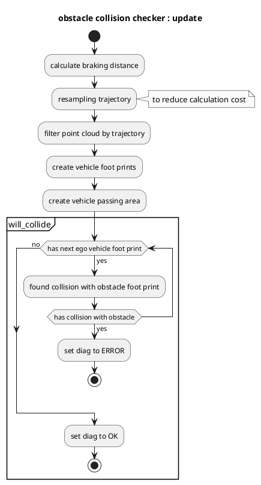

# obstacle_collision_checker

## 目的

`obstacle_collision_checker`モジュールは、予測した経路に対する障害物衝突のチェックを行い、衝突が発生した場合には診断エラーを発行します。

## 内部動作／アルゴリズム

### フローチャート

### アルゴリズム

### データの確認

`obstacle_collision_checker` が以下のデータを受信していないことを確認する。
- 地面ポイントクラウド
- 予測軌道
- 基準軌道
- 現在の速度データ

### 診断更新

予測経路上で衝突が検出された場合、このモジュールは診断ステータスを `ERROR` レベルに設定し、それ以外は `OK` に設定する。

## 入出力

### 入力

| 名前                                              | 型                                          | 説明                                                                |
| ------------------------------------------------- | ------------------------------------------ | ----------------------------------------------------------------------- |
| `~/input/trajectory`                            | `autoware_planning_msgs::msg::Trajectory`  | リファレンストライエクトリ                                          |
| `~/input/trajectory`                            | `autoware_planning_msgs::msg::Trajectory`  | 予測トラジェクトリ                                               |
| `/perception/obstacle_segmentation/pointcloud` | `sensor_msgs::msg::PointCloud2`           | 自車が停止または回避するべき障害物のポイントクラウド                 |
| `/tf`                                           | `tf2_msgs::msg::TFMessage`                 | TF                                                                   |
| `/tf_static`                                    | `tf2_msgs::msg::TFMessage`                 | TF静的                                                            |

## 自動運転ソフトウェアのアーキテクチャ

このドキュメントでは、Autowareの自動運転ソフトウェアのアーキテクチャについて説明します。

### サブシステム

Autowareのアーキテクチャは、次のサブシステムで構成されています。

- **Perception:** 周囲環境のデータ収集および処理
- **Planning:** 車両の経路計画と制御
- **Localization:** 自車位置の追跡
- **Control:** 車両の動作制御

### データフロー

Autowareのデータフローは、次のコンポーネントを通過します。

1. **センサー:** カメラ、レーダー、LiDARなど
2. **Perception:** オブジェクト検出、セグメンテーション、トラッキング
3. **Planning:** パス計画、衝突回避
4. **Localization:** RTK-GPS、SLAM、ビジュアルオドメトリ
5. **Control:** ステアリング、アクセル、ブレーキ

### アーキテクチャ

Autowareのアーキテクチャは、以下によって実装されています。

- **ROS:** ロボットオペレーティングシステム
- **Autoware Planning:** 経路計画と衝突回避
- **Autoware Control:** 車両の動作制御
- **Autoware Localization:** 自車位置の追跡

### 処理フロー

Autowareの処理フローは以下の通りです。

1. センサーからデータを受信
2. Perceptionでデータを処理
3. Planningで経路と制御コマンドを生成
4. Localizationで自車位置を追跡
5. Controlで制御コマンドを車両に送信

### 'post resampling'処理

'post resampling'処理は、Planningコンポーネントによって実行され、次のことを行います。

- センサーデータの高周期化
- 低周期センサーデータの補間

| Name             | Type                                   | Description              |
| ---------------- | -------------------------------------- | ------------------------ |
| `~/debug/marker` | `visualization_msgs::msg::MarkerArray` | 可視化用マーカー                 |

## パラメーター

| 名称                | タイプ     | 説明                                                  | デフォルト値 |
| :------------------ | :------- | :---------------------------------------------------- | :------------ |
| `delay_time`        | `double` | 車両の遅延時間 [s]                                  | 0.3           |
| `footprint_margin`  | `double` | フットプリントの余裕 [m]                               | 0.0           |
| `max_deceleration`  | `double` | 自車停止のための最大減速度 [m/s^2]                     | 2.0           |
| `resample_interval` | `double` | `post resampling` のインターバル [m]                   | 0.3           |
| `search_radius`     | `double` | Trajectory から点群への検索距離 [m]                 | 5.0           |

## 仮定/既知の制限

適切な衝突チェックを行うためには、おそらく予測された軌道とそのノイズを含まない障害物点群を取得することが必要です。

