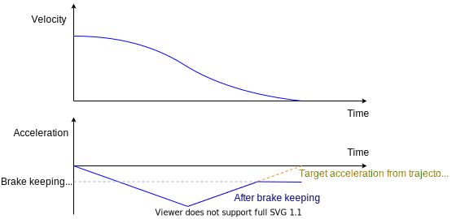
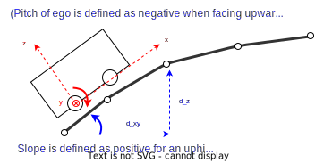

# PID Longitudinal Controller

## 目的 / ユースケース

longitudinal_controllerは、フィードフォワード/バック制御を使用して、目標軌道の各点で設定された目標速度を達成するための目標加速度を計算します。

また、道路勾配情報を考慮した勾配力補正と、遅延補正機能も含まれています。ここで計算された目標加速度は、車両インターフェイスによって適切に実現されることが想定されています。

車両が「目標速度」インターフェイスをサポートしている場合、このモジュールの使用はAutowareにとって必須ではないことに注意してください。

## 設計 / 内部動作 / アルゴリズム

### 状態

このモジュールは、特定の状況での特別な処理を処理するために、以下のように4つの状態遷移があります。

- **DRIVE (走行)**
  - PID制御による目標速度追従を実行します。
  - 遅延補正と勾配補正も適用します。
- **STOPPING (停止中)**
  - 停止直前の動きを制御します。
  - 正確かつスムーズな停止を達成するために特別なシーケンスが実行されます。
- **STOPPED (停止)**
  - 停止状態での動作（例：ブレーキホールド）を実行します。
- **EMERGENCY (緊急)**
  - 特定の条件が満たされたときに緊急状態に入ります（例：車両が停止線の一定距離を過ぎた場合）。
  - 回復条件（車両が完全に停止するまで緊急状態を維持するかどうか）または緊急状態での減速は、パラメータによって定義されます。

状態遷移図を以下に示します。

### ロジック

#### 制御ブロックダイアグラム

#### フィードフォワード (FF)

軌跡に設定された基準加速度と勾配補正項がフィードフォワードとして出力されます。モデリング誤差のない理想的な条件では、このFF項のみで速度追従に十分なはずです。

モデリングまたは離散化誤差による追従誤差は、フィードバック制御（現在はPIDを使用）によって除去されます。

##### ブレーキキープ

乗り心地の観点から、0加速度で停止することが重要です。これは、制動の影響を低減するためです。ただし、停止時の目標加速度が0の場合、車両モデルの誤差または勾配推定の誤差により、車両が停止線を越えてしまったり、停止線の前で少し加速したりする可能性があります。

確実に停止するために、フィードフォワードシステムによって計算された目標加速度は、停止時には負の加速度に制限されます。

#### 勾配補正

勾配情報に基づいて、目標加速度に補正項が追加されます。

パラメータによって切り替えることができる勾配情報のソースは2つあります。

- 予測エゴポーズのピッチ角から現在の勾配を計算する
  - 長所: 容易に利用可能
  - 短所: 車両の振動の影響を受けて正確な勾配情報を抽出できない。
- 軌道の Z 座標
  - ターゲット軌跡の前輪と後輪の位置における Z 座標の差から道路の勾配を計算する
  - 長所: 経路の Z 座標が適切に維持されていれば、ピッチ情報よりも正確
  - 長所: 遅延補償と組み合わせて使用可能 (まだ実装されていません)
  - 短所: 高精度マップの Z 座標が必要。
  - 短所: 現時点ではフリースペースプラニングをサポートしていない

**表記:** この関数は、ローレベル制御システムに加速フィードバックを持たない車両システムでのみ正しく動作します。

この補償では、目標加速に重力補正が加わり、自律走行システムが求める目標加速と一致しなくなります。したがって、ローレベルコントローラーの加速フィードバックの役割と競合します。

たとえば、車両が `1.0 m/s^2` の加速で発進しようとしており、`-1.0 m/s^2` の重力補正が適用されると、出力値は `0` になります。この出力値を誤って目標加速と見なした場合、車両は発進しません。

勾配補償機能に適した車両システムの例は、縦方向コントローラーからの出力加速が、フィードバックなしで目標 accel/ブレーキペダル入力に変換される車両システムです。この場合、出力加速はターゲットペダルの計算にフィードフォワード項として使用されるだけであり、したがって上記の問題は発生しません。

注: 勾配の角度は、上り坂では正と定義されていますが、エゴポーズのピッチ角は上向きを向いているときは負と定義されています。それらは反対の定義を持っています。

#### PID 制御

フィードフォワード制御では処理できない偏差、たとえばモデルエラーに対しては、フィードバックシステムを構築するために PID 制御が使用されます。

この PID 制御は、現在のエゴ速度と目標速度の偏差から目標加速度を計算します。

この PID ロジックは、各項の出力に最大値があります。これは以下のことを防ぐためです。

- 積分項が大きいと、ユーザーによる予期しない動作が発生する。
- 意図しないノイズにより、微分項の出力値が非常に大きくなる。

注: デフォルトでは、車両が停止しているとき、制御システムの積分項は累積されません。この予防措置は、Autoware が車両がエンゲージされていると想定しているが、外部システムが車両を停止して起動手順を開始している場合の積分項の意図しない蓄積を防ぐことを目的としています。

ただし、車両が起動中に路面の凹凸に遭遇した場合や、勾配補償が不正確に見積もられた (必要以上に低い) 場合などの特定の状況が発生し、運動が開始されない場合があります。これらのシナリオに対応するため、`enable_integration_at_low_speed` パラメータを true に設定することで、車両が静止しているときでもエラー積分をアクティブにすることができます。

`enable_integration_at_low_speed` が true に設定されている場合、PID コントローラーは、`current_vel_threshold_pid_integration` パラメータで設定された最小速度を超えることなく、`time_threshold_before_pid_integration` パラメータで定義された特定の時間が経過した後に、加速エラーの積分を開始します。

`time_threshold_before_pid_integration` パラメータの存在は、実用的な PID チューニングに不可欠です。車両が停止している場合や低速の場合はエラーを積分すると、PID チューニングが複雑になる可能性があります。このパラメータは、積分部分がアクティブになるまでの遅延を効果的に導入し、即座に動作しないようにします。この遅延により、PID コントローラーのより制御された効果的なチューニングが可能になります。

現在、PID 制御は開発/保守コストとパフォーマンスのトレードオフという観点から実装されています。今後の開発では、パフォーマンスの高いコントローラー (適応制御またはロバスト制御) に置き換えられる可能性があります。

#### 時間遅延補償

高速では、アクセルペダルやブレーキなどのアクチュエータシステムの遅延が、走行精度に大きな影響を与えます。車両の作動原理によっては、アクセルペダルとブレーキを物理的に制御するメカニズムは通常、約 100 ミリ秒の遅延があります。

このコントローラーでは、時間遅延後の予測エゴ速度と目標速度が計算され、フィードバックに使用して時間遅延の問題に対処します。

### 勾配補償

勾配情報に基づいて、目標加速度に補償項が加えられます。

勾配情報のソースは 2 つあり、パラメータで切り替えることができます。

- 推定エゴポーズのピッチ (デフォルト)
  - 推定エゴポーズのピッチ角から現在の勾配を計算する
  - 長所: 容易に利用可能

## 軌道の Z 座標
  - 対象軌道の前輪と後輪の位置の Z 座標の差から道路勾配を計算する
  - 長所: ルートの Z 座標が適切に維持されている場合、ピッチ情報よりも正確
  - 長所: 遅延補償と組み合わせて使用可能（まだ実装されていません）
  - 短所: 高精細地図の Z 座標が必要です。
  - 短所: フリースペースプランニングには現時点では対応していません

## 仮定 / 制限事項

1. 平滑化された対象速度とその加速度を軌跡に設定すること
   1. 速度コマンドはコントローラー内で平滑化されません（ノイズだけが除去される可能性があります）。
   2. ステップ状の対象信号の場合、トラッキングは可能な限り高速に実行されます。
2. 車両速度は適切な値でなければなりません
   1. 自車速度は前進/後進の方向に対応する符号付き値でなければなりません
   2. 自車速度は適切なノイズ処理によって得られる必要があります。
   3. 自車速度に大量のノイズがあると、追従性能は大幅に低下します。
3. このコントローラーの出力は後続のモジュール（例: 車両インターフェイス）によって達成されなければなりません。
   1. 車両インターフェイスに対象速度または加速度インターフェイスがない場合（例: 車両にアクセルペダルとブレーキインターフェイスしかない場合）、このコントローラーの後に適切な変換を行う必要があります。

## 入出力 / API

### 入力
以下を [controller_node](../autoware_trajectory_follower_node/README.md) から設定します。

- `autoware_planning_msgs/Trajectory`: 追従するリファレンストラジェクトリ
- `nav_msgs/Odometry`: 現在のオドメトリ

### 出力
以下の内容を含む縦断出力（`autoware_control_msgs/Longitudinal`）をコントローラーノードに返します。

- `autoware_control_msgs/Longitudinal`: 車両の縦動を制御するためのコマンドで、目標速度と目標加速度が含まれます。
- 縦断同期データ
  - 速度収束（現在使用されていません）

### `PIDController` クラス

`PIDController` クラスは簡単に使用できます。
最初に、比例（P）、積分（I）、微分（D）成分にゲインと制限を（`setGains()` と `setLimits()` を使用して）設定する必要があります。
次に、現在の誤差と時間ステップの期間を `calculate()` 関数に渡すことで速度を計算できます。

## パラメーターの説明

`param/lateral_controller_defaults.param.yaml` で定義されているデフォルトパラメーターは、時速 40 km 未満の運転用に AutonomouStuff Lexus RX 450h に調整されています。

| 名称                                        | 型   | 説明                                                                                                                                                                           | デフォルト値 |
| :------------------------------------------ | :----- | :-------------------------------------------------------------------------------------------------------------------------------------------------------------------------------------- | :------------ |
| `delay_compensation_time`                     | double | Longitudinal controlの遅延時間[s]                                                                                                                                                 | 0.17          |
| `enable_smooth_stop`                          | bool   | STOPPINGへの遷移を有効にするフラグ                                                                                                                                              | true          |
| `enable_overshoot_emergency`                  | bool   | 自車が停止線から一定距離離れたときにEMERGENCYへの遷移を有効にするフラグ。 `emergency_state_overshoot_stop_dist`を参照。                                        | true          |
| `enable_large_tracking_error_emergency`       | bool   | 軌道と自車位置の大きな偏差により、最も近い軌道点検索に失敗した場合にEMERGENCYへの遷移を有効にするフラグ。                                                              | true          |
| `enable_slope_compensation`                   | bool   | 勾配補正のために出力加速度を変更するフラグ。 勾配角のソースは、自車位置または軌道角度から選択できます。 `use_trajectory_for_pitch_calculation`を参照。 | true          |
| `enable_brake_keeping_before_stop`            | bool   | 自車が停止する前のDRIVE状態での特定の加速度を維持するフラグ。 [Brake keeping](#brake-keeping)を参照。                                                                  | false         |
| `enable_keep_stopped_until_steer_convergence` | bool   | ステアリングが収束するまで停止状態を維持するフラグ。                                                                                                                       | true          |
| `max_acc`                                     | double | 出力加速度の最大値[m/s2]                                                                                                                                                 | 3.0           |
| `min_acc`                                     | double | 出力加速度の最小値[m/s2]                                                                                                                                                 | -5.0          |
| `max_jerk`                                    | double | 出力加速度のジャークの最大値[m/s3]                                                                                                                                           | 2.0           |
| `min_jerk`                                    | double | 出力加速度のジャークの最小値[m/s3]                                                                                                                                           | -5.0          |
| `use_trajectory_for_pitch_calculation`        | bool   | trueの場合、勾配は軌道のzレベルから推定されます。 それ以外の場合は、自車位置のピッチ角が使用されます。                                                                            | false         |
| `lpf_pitch_gain`                              | double | ピッチ推定用のローパスフィルターのゲイン                                                                                                                                           | 0.95          |
| `max_pitch_rad`                               | double | 推定ピッチの最大値[rad]                                                                                                                                                     | 0.1           |
| `min_pitch_rad`                               | double | 推定ピッチの最小値[rad]                                                                                                                                                     | -0.1          |

### ステート遷移

| 名前 | 型 | 説明 | 初期値 |
| --- | --- | --- | --- |
| `drive_state_stop_dist` | double | `drive_state_stop_dist` + `drive_state_offset_stop_dist` [m] より停止地点までの距離が長い場合、DRIVE 状態に移行 | 0.5 |
| `drive_state_offset_stop_dist` | double | `drive_state_stop_dist` + `drive_state_offset_stop_dist` [m] より停止地点までの距離が長い場合、DRIVE 状態に移行 | 1.0 |
| `stopping_state_stop_dist` | double | 停止地点までの距離が `stopping_state_stop_dist` [m] より短い場合、STOPPING 状態に移行 | 0.5 |
| `stopped_state_entry_vel` | double | STOPPED 状態への移行における自車速度の閾値 [m/s] | 0.01 |
| `stopped_state_entry_acc` | double | STOPPED 状態への移行における自車加速度の閾値 [m/s^2] | 0.1 |
| `emergency_state_overshoot_stop_dist` | double | `enable_overshoot_emergency` が true で、停止地点から `emergency_state_overshoot_stop_dist` メートル進んだ場合、EMERGENCY 状態に移行 | 1.5 |
| `emergency_state_traj_trans_dev` | double | 自車位置が、最も近い軌跡点から `emergency_state_traj_tran_dev` メートル離れた場合、EMERGENCY 状態に移行 | 3.0 |
| `emergency_state_traj_rot_dev` | double | 自車の方位が、最も近い軌跡点の方位から `emergency_state_traj_rot_dev` rad 逸れた場合、EMERGENCY 状態に移行 | 0.784 |

### DRIVE パラメータ

| Name                                  | Type   | Description                                                                                                                                                                  | Default value |
| :----------------------------------- | :----- | :----------------------------------------------------------------------------------------------------------------------------------------------------------------------------- | :------------ |
| kp                                    | double | 縦方向制御の p ゲイン                                                                                                                                                | 1.0           |
| ki                                    | double | 縦方向制御の i ゲイン                                                                                                                                                | 0.1           |
| kd                                    | double | 縦方向制御の d ゲイン                                                                                                                                                | 0.0           |
| max_out                               | double | DRIVE 状態における PID 出力加速度の最大値 [m/s^2]                                                                                                                  | 1.0           |
| min_out                               | double | DRIVE 状態における PID 出力加速度の最小値 [m/s^2]                                                                                                                  | -1.0          |
| max_p_effort                          | double | p ゲインによる加速度の最大値                                                                                                                                          | 1.0           |
| min_p_effort                          | double | p ゲインによる加速度の最小値                                                                                                                                          | -1.0          |
| max_i_effort                          | double | i ゲインによる加速度の最大値                                                                                                                                          | 0.3           |
| min_i_effort                          | double | i ゲインによる加速度の最小値                                                                                                                                          | -0.3          |
| max_d_effort                          | double | d ゲインによる加速度の最大値                                                                                                                                          | 0.0           |
| min_d_effort                          | double | d ゲインによる加速度の最小値                                                                                                                                          | 0.0           |
| lpf_vel_error_gain                    | double | 速度誤差のローパスフィルタのゲイン                                                                                                                               | 0.9           |
| enable_integration_at_low_speed       | bool   | `current_vel_threshold_pid_integration` 未満の速度時に加速度誤差の積分を有効にするかどうか                                                                   | false         |
| current_vel_threshold_pid_integration | double | このパラメータを超える絶対速度時のみ、速度誤差の積分を I 項に対して行う [m/s]                                                                                       | 0.5           |
| time_threshold_before_pid_integration | double | 車両の移動がない状態が長時間続いたときにのみ PID 誤差積分を有効にする [s]                                                                                   | 5.0           |
| brake_keeping_acc                     | double | `enable_brake_keeping_before_stop` が `true` の場合、車両が停止する前に DRIVE 状態において特定の加速度を維持する [m/s^2] [ブレーキ維持](#ブレーキ維持) を参照 | 0.2           |

### STOPPING パラメータ（スムーズストップ）

スムーズストップは `enable_smooth_stop` が true の場合に有効になります。
スムーズストップでは、最初に強い加速度 (`strong_acc`) が出力されて自車の速度を減速します。
その後、弱い加速度 (`weak_acc`) が出力されて、自車のジャークを減らしてスムーズに停止します。
自車が停止点に対して一定時間または一定距離を超えて停止しなかった場合は、すぐに弱停止加速度 (`weak_stop_acc`) が出力されて停止します。
自車がそれでも走行している場合は、すぐに停止するための強い停止加速度 (`strong_stop_acc`) が出力されます。

| 名前                         | 型   | 説明                                                                                                          | デフォルト値 |
| :--------------------------- | :----- | :------------------------------------------------------------------------------------------------------------------- | :------------ |
| smooth_stop_max_strong_acc   | double | 最大強加速度 [m/s^2]                                                                                      | -0.5          |
| smooth_stop_min_strong_acc   | double | 最小強加速度 [m/s^2]                                                                                      | -0.8          |
| smooth_stop_weak_acc         | double | 弱加速度 [m/s^2]                                                                                            | -0.3          |
| smooth_stop_weak_stop_acc    | double | 直ちに停止するための弱加速度 [m/s^2]                                                                          | -0.8          |
| smooth_stop_strong_stop_acc  | double | 自車が停止ポイントから `smooth_stop_strong_stop_dist` メートル離れたときに、Planningモジュールが出力するべき強加速度 [m/s^2] | -3.4          |
| smooth_stop_max_fast_vel     | double | 自車が高速走行中と判断する最大速度 [m/s]。自車が高速走行中の場合、強加速度が出力される。 | 0.5           |
| smooth_stop_min_running_vel  | double | 自車が走行中と判断するための最小自車速度 [m/s]                                                         | 0.01          |
| smooth_stop_min_running_acc  | double | 自車が走行中と判断するための最小自車加速度 [m/s^2]                                                   | 0.01          |
| smooth_stop_weak_stop_time   | double | 弱加速度を出力する最大時間 [秒]。この後、強加速度が出力される。                            | 0.8           |
| smooth_stop_weak_stop_dist   | double | 自車が停止ポイントの `smooth_stop_weak_stop_dist` メートル手前にある場合、弱加速度が出力される。 [m]       | -0.3          |
| smooth_stop_strong_stop_dist | double | 自車が停止ポイントから `smooth_stop_strong_stop_dist` メートル離れている場合に、強加速度が出力される。 [m]     | -0.5          |

### STOPPEDパラメーター

`STOPPED`状態は、車両が完全に停止していてブレーキが完全に作動していると仮定しています。
そのため、`stopped_acc`には車両が可能な限り最強のブレーキを適用できる値を設定する必要があります。
`stopped_acc`が十分に低くない場合、急勾配で滑り落ちる可能性があります。

| 名前         | タイプ   | 説明                                          | デフォルト値 |
| :----------- | :----- | :-------------------------------------------- | :------------ |
| stopped_vel  | double | STOPPED状態の目標速度[m/s]                        | 0.0           |
| stopped_acc  | double | STOPPED状態の目標加速度[m/s^2]                    | -3.4          |
| stopped_jerk | double | STOPPED状態の目標ジャーク[m/s^3]                      | -5.0          |

### EMERGENCY パラメータ

| 名前           | タイプ   | 説明                                       | デフォルト値 |
| :------------- | :----- | :------------------------------------------------ | :------------ |
| emergency_vel  | double | EMERGENCY状態のターゲット速度 [m/s]          | 0.0           |
| emergency_acc  | double | EMERGENCY状態のターゲット加速度 [m/s^2] | -5.0          |
| emergency_jerk | double | EMERGENCY状態のターゲットジャーク [m/s^3]         | -3.0          |

## 関連資料 / 外部リンク

## 将来の拡張 / 未対応部分

## 関連課題

