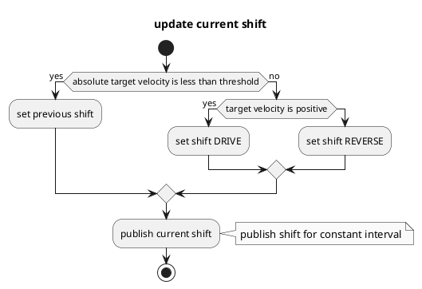

# Shift Decider

## 目的

`autoware_shift_decider` は、アッカーマン制御コマンドからシフトを決定するためのモジュールです。

## 内部動作/アルゴリズム

### フローチャート

### アルゴリズム

## 入出力

### 入力

| 名前                  | タイプ                                  | 説明                                              |
| --------------------- | ------------------------------------- | ------------------------------------------------- |
| `~/input/control_cmd` | `autoware_control_msgs::msg::Control` | 車両の制御コマンド                                    |

### アウトプット

このドキュメントでは、AutowareのPerceptionコンポーネントにおける点群処理パイプラインの最適化について説明します。パイプラインの最適化により、Perceptionコンポーネントの処理速度が向上し、レーダーデータの処理が高速化されます。

Autowareの点群処理パイプラインは、次のような主要なステップで構成されています。

- `post resampling`による点群のダウンサンプリング
- 分類用の機能抽出
- クラスタリング
- LIDAR点群とレーダーデータの融合

現在、点群のダウンサンプリングは、Voxel Gridダウンサンプリングを使用して行われています。これは、処理速度を向上させるために軸ごとに均等に間隔の開いたキューブで点群を分割する手法です。しかし、この方法は非効率的で、処理速度を大幅に低下させる可能性があります。

今回の最適化では、Voxel Gridダウンサンプリングを、より効率的なOctreeダウンサンプリング手法に置き換えました。Octreeは、空間を再帰的に8つのサブオクトリーに分割するデータ構造です。点群をOctreeに挿入すると、再帰的にOctreeをトラバースして、基準距離よりも密度の高いセルの点群をダウンサンプリングします。これにより、Voxel Gridダウンサンプリングよりもはるかに効率的にダウンサンプリングを行うことができます。

最適化の結果、Perceptionコンポーネントの処理速度が大幅に向上しました。レーダーデータの処理速度も向上しました。これは、Perceptionコンポーネントがレーダーデータをより効率的に処理できるようになったからです。

この最適化は、AutowareのRobust Perception Planningコンポーネントの将来のリリースに統合される予定です。

| Name               | Type                                      | Description                        |
| ------------------ | ----------------------------------------- | ---------------------------------- |
| `~output/gear_cmd` | `autoware_vehicle_msgs::msg::GearCommand` | 前進・後退用のギア               |

## パラメーター

なし.

## 前提条件 / 制限事項

策定中.

