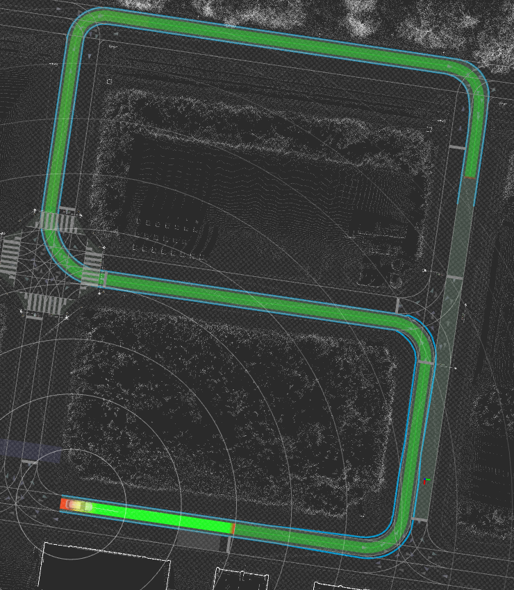
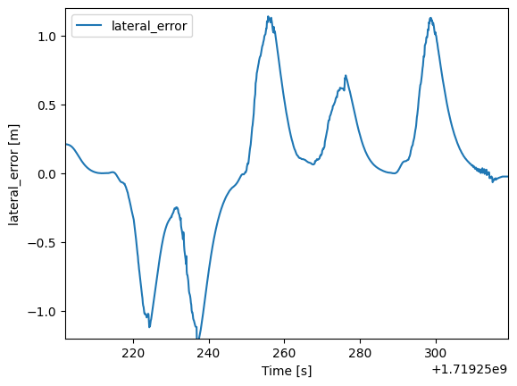
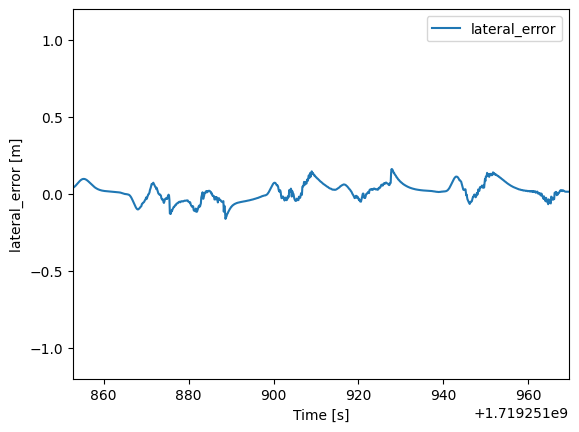
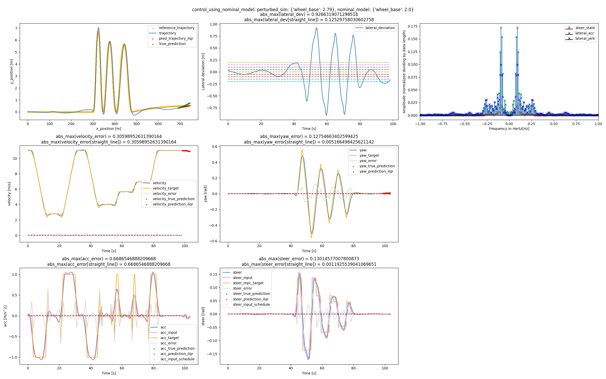
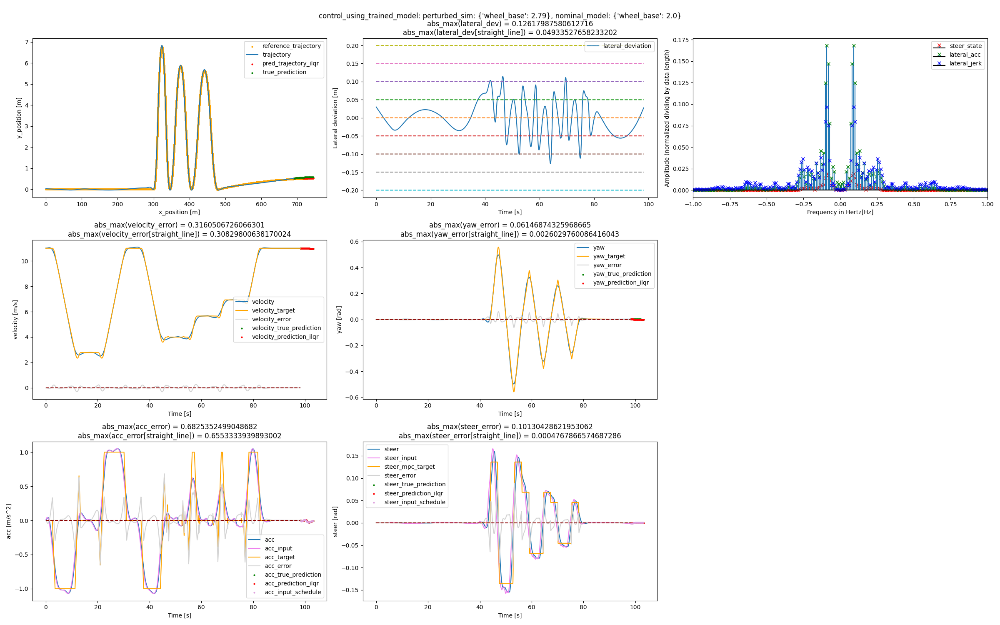
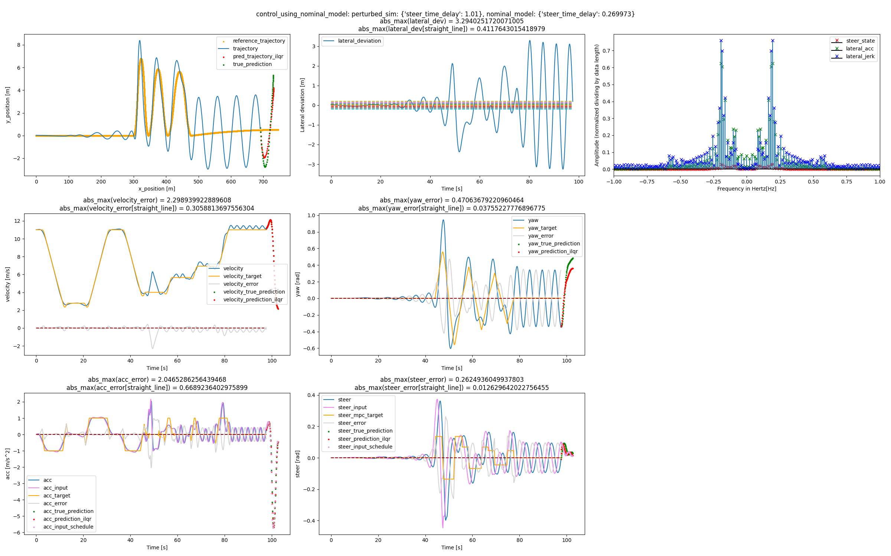
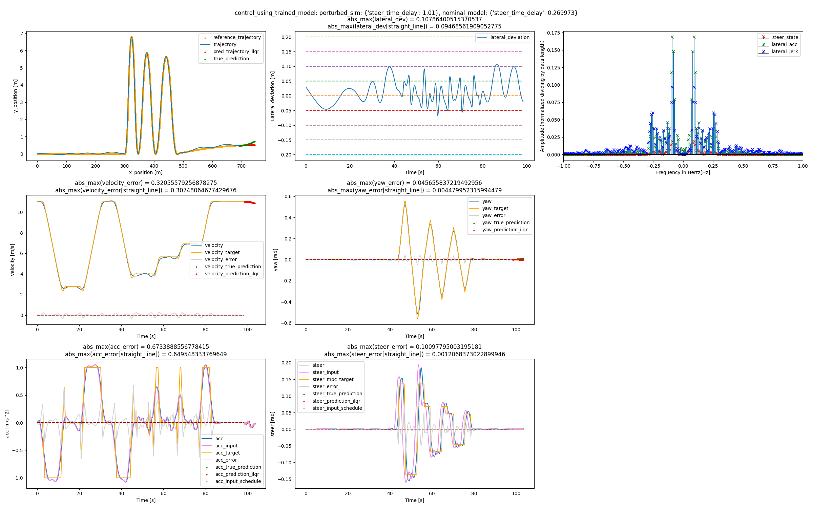
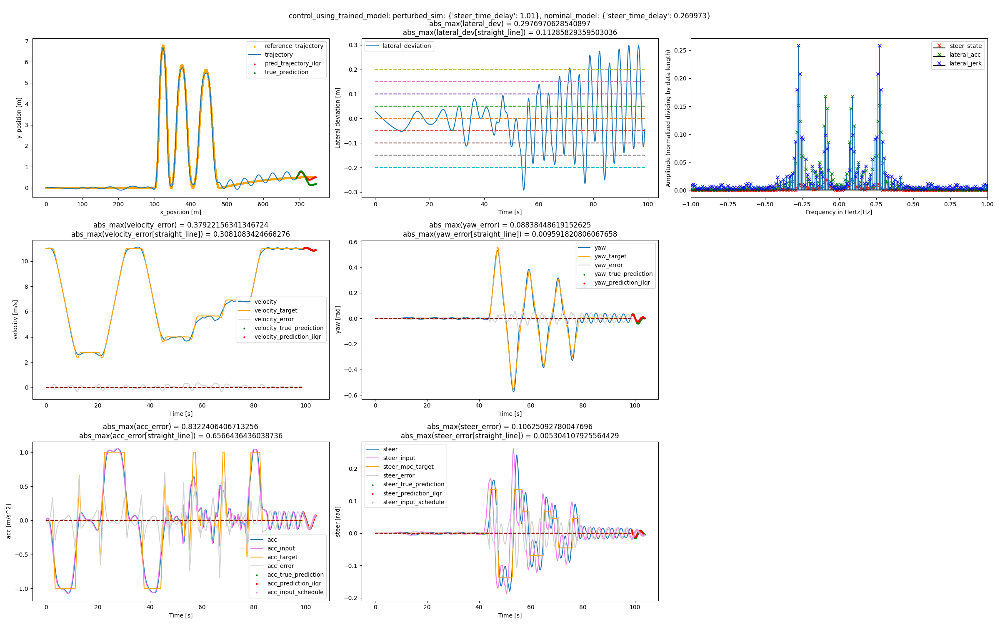
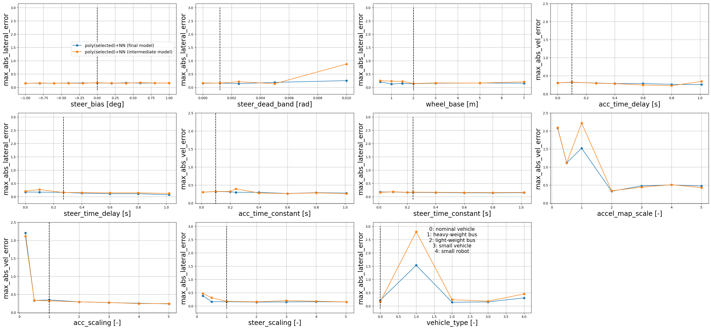

## スマート MPC Trajectory Follower

スマート MPC（Model Predictive Control）は、モデル予測制御と機械学習を組み合わせた制御アルゴリズムです。モデル予測制御の強みを継承しながら、データ駆動手法を用いて機械学習でそのモデリングの難しさを解決しています。

この技術により、実装に時間のかかるモデル予測制御を、データ収集環境さえ整えば比較的手軽に扱うことが可能となります。

<p align="center">
  <a href="https://youtu.be/j7bgK8m4-zg?si=p3ipJQy_p-5AJHOP)">
    <image width="700px" src="./images/autoware_smart_mpc.png">
  </a>
</p>

## 提供される機能

このパッケージでは、経路追従制御向けのスマート MPC ロジック、および学習・評価メカニズムが提供されています。これらの機能を以下に示します。

### iLQR/MPPI ベースの経路追従制御

制御モードは「ilqr」、「mppi」、または「mppi_ilqr」から選択できます。[mpc_param.yaml](./autoware_smart_mpc_trajectory_follower/param/mpc_param.yaml)の`mpc_parameter:system:mode`に設定できます。「mppi_ilqr」モードでは、iLQR の初期値は MPPI ソリューションによって与えられます。

> [!NOTE]
> デフォルト設定では、「mppi」モードのパフォーマンスはサンプル数が不足しているため制限されています。この問題は、GPU サポートを導入するための進行中の作業で対処されています。

シミュレーションを実行するには、次のコマンドを実行します。


```bash
ros2 launch autoware_launch planning_simulator.launch.xml map_path:=$HOME/autoware_map/sample-map-planning vehicle_model:=sample_vehicle sensor_model:=sample_sensor_kit trajectory_follower_mode:=smart_mpc_trajectory_follower
```

[!NOTE]
[nominal_param.yaml](./autoware_smart_mpc_trajectory_follower/param/nominal_param.yaml)で設定した公称モデルで実行する場合は、[trained_model_param.yaml](./autoware_smart_mpc_trajectory_follower/param/trained_model_param.yaml)で`trained_model_parameter:control_application:use_trained_model`を「false」に設定します。トレーニングされたモデルを使用して実行するには、`trained_model_parameter:control_application:use_trained_model`を「true」に設定しますが、トレーニングされたモデルは次の手順に従って生成する必要があります。

### トレーニングされたモデルのトレーニングと制御への反映

トレーニングデータを取得するには、autowareを起動し、走行を実行し、次のコマンドでrosbagデータを記録します。


```bash
ros2 bag record /localization/kinematic_state /localization/acceleration /vehicle/status/steering_status /control/command/control_cmd /control/trajectory_follower/control_cmd /control/trajectory_follower/lane_departure_checker_node/debug/deviation/lateral /control/trajectory_follower/lane_departure_checker_node/debug/deviation/yaw /system/operation_mode/state /vehicle/status/control_mode /sensing/imu/imu_data /debug_mpc_x_des /debug_mpc_y_des /debug_mpc_v_des /debug_mpc_yaw_des /debug_mpc_acc_des /debug_mpc_steer_des /debug_mpc_X_des_converted /debug_mpc_x_current /debug_mpc_error_prediction /debug_mpc_max_trajectory_err /debug_mpc_emergency_stop_mode /debug_mpc_goal_stop_mode /debug_mpc_total_ctrl_time /debug_mpc_calc_u_opt_time
```

上記の recording の rosbag ディレクトリに `rosbag2.bash`（`./autoware_smart_mpc_trajectory_follower/training_and_data_check/rosbag2.bash`）を移動し、ディレクトリ上で以下のコマンドを実行します。


```bash
bash rosbag2.bash
```

この機能は、rosbagデータをモデルのトレーニング用のCSV形式に変換します。

> [!NOTE]
> 実行時に多数のターミナルが自動的に開きますが、rosbagデータの変換が完了すると自動的に閉じます。
> このプロセスを開始してからすべてのターミナルが閉じるまでの間は、Autowareを実行しないでください。

代わりに、Python環境で以下のコマンドを実行すると、同じ結果が得られます:


```python
from autoware_smart_mpc_trajectory_follower.training_and_data_check import train_drive_NN_model
model_trainer = train_drive_NN_model.train_drive_NN_model()
model_trainer.transform_rosbag_to_csv(rosbag_dir)
```

ここで、`rosbag_dir`はrosbagディレクトリを表しています。現時点では、`rosbag_dir`内のすべてのCSVファイルは最初に自動的に削除されます。

次に、モデルのトレーニング方法について説明します。
[trained_model_param.yaml](./autoware_smart_mpc_trajectory_follower/param/trained_model_param.yaml)内の`trained_model_parameter:memory_for_training:use_memory_for_training`が`true`に設定されている場合、トレーニングはLSTMを含むモデルに対して実行され、`false`に設定されている場合はトレーニングはLSTMを含まないモデルに対して実行されます。
LSTMを使用する場合、セル状態と隠れ状態は時系列時系列データに基づいて更新され、予測に反映されます。

トレーニングと検証に使用されるrosbagディレクトリのパス、`dir_0`、`dir_1`、`dir_2`、...、`dir_val_0`、`dir_val_1`、`dir_val_2`、...モデルを保存するディレクトリ`save_dir`にモデルを保存できます。Python環境では次のようにします。


```python
from autoware_smart_mpc_trajectory_follower.training_and_data_check import train_drive_NN_model
model_trainer = train_drive_NN_model.train_drive_NN_model()
model_trainer.add_data_from_csv(dir_0, add_mode="as_train")
model_trainer.add_data_from_csv(dir_1, add_mode="as_train")
model_trainer.add_data_from_csv(dir_2, add_mode="as_train")
...
model_trainer.add_data_from_csv(dir_val_0, add_mode="as_val")
model_trainer.add_data_from_csv(dir_val_1, add_mode="as_val")
model_trainer.add_data_from_csv(dir_val_2, add_mode="as_val")
...
model_trainer.get_trained_model()
model_trainer.save_models(save_dir)
```

`add_mode`が指定されていない場合、または検証データが追加されていない場合、トレーニングデータはトレーニングと検証に使用するために分割されます。

多項式回帰を実行した後、NNは次のように残差に基づいてトレーニングできます。


```python
model_trainer.get_trained_model(use_polynomial_reg=True)
```

>[!NOTE]
>既定の設定では、回帰は複数の事前に選択された多項式によって実行されます。
> `get_trained_model` の引数として `use_selected_polynomial=False` が設定されている場合、 `deg` 引数により、使用される多項式の最大次数を設定できます。

多項式回帰のみが実行され、NN モデルが使用されていない場合は、次のコマンドを実行します:


```python
model_trainer.get_trained_model(use_polynomial_reg=True,force_NN_model_to_zero=True)
```

`model_for_test_drive.pth`および`polynomial_reg_info.npz`を`save_dir`に保存し、ホームディレクトリに設定し、[trained_model_param.yaml](./autoware_smart_mpc_trajectory_follower/param/trained_model_param.yaml)の`trained_model_parameter:control_application:use_trained_model`を`true`に設定して、制御されたトレーニングモデルを反映させます。

### パフォーマンス評価

ここでは、一例として、サンプル車両のホイールベースが2.79mであるときに、不適切な値2.0mがコントローラー側に与えられたときの適応性能の検証について説明します。
コントローラーにホイールベースとして2.0mを与えるには、[nominal_param.yaml](./autoware_smart_mpc_trajectory_follower/param/nominal_param.yaml)の`nominal_parameter:vehicle_info:wheel_base`の値を2.0に設定し、次のコマンドを実行します。


```bash
python3 -m smart_mpc_trajectory_follower.clear_pycache
```

#### Autoware でのテスト

トレーニング前に Autoware において公称モデルによる制御テストを実行するには、[trained_model_param.yaml](./autoware_smart_mpc_trajectory_follower/param/trained_model_param.yaml) 内の `trained_model_parameter:control_application:use_trained_model` が `false` になっていることを確認し、「iLQR/MPPI に基づく軌道追従制御」の説明どおりに Autoware を起動します。今回は、以下のルートがテストに使用されます。

<p></p>

rosbag を記録して、「モデルのトレーニングと制御への反映」の説明に従ってモデルをトレーニングし、生成されたファイル `model_for_test_drive.pth` と `polynomial_reg_info.npz` をホームディレクトリに移動します。[trained_model_param.yaml](./autoware_smart_mpc_trajectory_follower/param/trained_model_param.yaml) 内の `trained_model_parameter:memory_for_training:use_memory_for_training` が `true` に設定されている条件で機能するサンプルモデルは、[sample_models/wheel_base_changed](./sample_models/wheel_base_changed/) で入手できます。

> [!NOTE]
> トレーニングに使用されたデータは小さいですが、単純化のために、この量のデータでどれくらいのパフォーマンスが向上できるかを確認します。

ここで取得したトレーニング済みモデルを使用して制御するには、`trained_model_parameter:control_application:use_trained_model` を `true` に設定し、同様に Autoware を起動して、rosbag を記録しながら同じルートを走行します。
走行が完了した後、rosbag ファイルを「モデルのトレーニングと制御への反映」の説明に従って CSV 形式に変換します。`control/autoware_smart_mpc_trajectory_follower/autoware_smart_mpc_trajectory_follower/training_and_data_check/data_checker.ipynb` 内の `lateral_error_visualize` 関数を、公称モデルの rosbag ファイル `rosbag_nominal` およびトレーニングモデルの rosbag ファイル `rosbag_trained` に対して、以下のように実行すると、2 つのモデルの横方向偏差のグラフが得られます。


```python
lateral_error_visualize(dir_name=rosbag_nominal,ylim=[-1.2,1.2])
lateral_error_visualize(dir_name=rosbag_trained,ylim=[-1.2,1.2])
```

以下の結果が得られました。

<div style="display: flex; justify-content: center; align-items: center;">
    
    
</div>

#### Pythonシミュレーターでのテスト

最初に、Pythonシミュレーターでホイールベースを2.79 mにするには、次のファイルを作成して、`control/autoware_smart_mpc_trajectory_follower/autoware_smart_mpc_trajectory_follower/python_simulator` に `sim_setting.json` という名前で保存します:


```json
{ "wheel_base": 2.79 }
```

次に、`control/autoware_smart_mpc_trajectory_follower/autoware_smart_mpc_trajectory_follower/python_simulator` に移動した後、次のコマンドを実行して基準制御によるパイロンスラローム走行を Python シミュレータでテストします。


```bash
python3 run_python_simulator.py nominal_test
```

走行結果は`test_python_nominal_sim`に保存されます。

以下の結果が得られました。

<p style="text-align: center;">
    
</p>

上段の真ん中は横方向の偏差を表します。

フィギュアイエイト走行データをピュアパーシュートの制御下で行われるよう、trainingを実行するには、次のコマンドを実行します。

フィギュアイエイトの走行と取得されたモデルに基づく走行を使用して、trainingを実行するには、次のコマンドを実行します。


```bash
python3 run_python_simulator.py
```

Drivingの結果は `test_python_trined_sim` に保存されます。

[trained_model_param.yaml](./autoware_smart_mpc_trajectory_follower/param/trained_model_param.yaml) の `trained_model_parameter:memory_for_training:use_memory_for_training` が `true` に設定された場合、以下の結果が得られました。

<p style="text-align: center;">
    
</p>

[trained_model_param.yaml](./autoware_smart_mpc_trajectory_follower/param/trained_model_param.yaml) の `trained_model_parameter:memory_for_training:use_memory_for_training` が `false` に設定された場合、以下の結果が得られました。

<p style="text-align: center;">
    
</p>

横偏差が大幅に改善されたことがわかります。
ただし、LSTMの有無によるDrivingの違いはあまり明らかではありません。

違いを確認するために、たとえば `steer_time_delay` などのパラメータを試すことができます。

最初に、ノミナルモデル設定をデフォルト値に復元するには、[nominal_param.yaml](./autoware_smart_mpc_trajectory_follower/param/nominal_param.yaml) の `nominal_parameter:vehicle_info:wheel_base` の値を 2.79 に設定し、次のコマンドを実行します。


```bash
python3 -m smart_mpc_trajectory_follower.clear_pycache
```

次に、`sim_setting.json` を次のように修正します。


```json
{ "steer_time_delay": 1.01 }
```

この方法により、`steer_time_delay` が 1.01 秒に設定されたときに実験の実行が行われます。

公称モデルを使用した運転の結果は以下のとおりです。

<p style="text-align: center;">
    
</p>

LSTM でトレーニングされたモデルを使用した運転の結果は以下のとおりです。

<p style="text-align: center;">
    
</p>

LSTM なしでトレーニングされたモデルを使用した運転の結果は以下のとおりです。

<p style="text-align: center;">
    
</p>

LSTM を含むモデルが、含まないモデルよりも性能が大幅に向上していることがわかります。

Python シミュレータに渡すことができるパラメータは次のとおりです。

| パラメータ                | タイプ        | 説明                                                                                                                                                                                                                                                                                  |
| ------------------------ | ----------- | -------------------------------------------------------------------------------------------------------------------------------------------------------------------------------------------------------------------------------------------------------------------------------------------- |
| steer_bias               | float       | ステアリング バイアス [rad]                                                                                                                                                                                                                                                                             |
| steer_rate_lim           | float       | ステアリング レート リミット [rad/s]                                                                                                                                                                                                                                                                     |
| vel_rate_lim             | float       | 加速度リミット [m/s^2]                                                                                                                                                                                                                                                                   |
| wheel_base               | float       | ホイール ベース [m]                                                                                                                                                                                                                                                                               |
| steer_dead_band          | float       | ステアリング デッドバンド [rad]                                                                                                                                                                                                                                                                        |
| adaptive_gear_ratio_coef | list[float] | タイヤ角度からステアリング ホイール角度への速度依存ギアレンジ情報を指定する長さ 6 のフロートのリスト。                                                                                                                                                                    |
| acc_time_delay           | float       | 加速度遅延 [s]                                                                                                                                                                                                                                                                  |
| steer_time_delay         | float       | ステアリング遅延 [s]                                                                                                                                                                                                                                                                         |
| acc_time_constant        | float       | 加速度時定数 [s]                                                                                                                                                                                                                                                               |
| steer_time_constant      | float       | ステアリング時定数 [s]                                                                                                                                                                                                                                                                      |
| accel_map_scale          | float       | `control/autoware_smart_mpc_trajectory_follower/autoware_smart_mpc_trajectory_follower/python_simulator/accel_map.csv` に対応情報が格納され、加速度入力値から実際の加速度実現値への歪みを拡大するパラメーター。 |
| acc_scaling              | float       | 加速度スケーリング                                                                                                                                                                                                                                                                         |
| steer_scaling            | float       | ステアリング スケーリング                                                                                                                                                                                                                                                                                |
| vehicle_type             | int         | 事前に設計された車両タイプに対して 0 ～ 4 の値を取ります。<br> 各車両タイプの説明を以下に示します。                                                                                                                                                                              |

例えば、シミュレータ側にステアバイアス0.01 [rad]、ステアデッドバンド0.001 [rad]を与える場合、`sim_setting.json`を次のように編集します。


```json
{ "steer_bias": 0.01, "steer_dead_band": 0.001 }
```

##### vehicle_type_0

この車両タイプは、制御で使用される既定の車両タイプと一致します。

| パラメータ             | 値 |
| ---------------------- | ---- |
| wheel_base             | 2.79 |
| acc_time_delay         | 0.1  |
| steer_time_delay       | 0.27 |
| acc_time_constant     | 0.1  |
| steer_time_constant   | 0.24 |
| acc_scaling            | 1.0  |

##### vehicle_type_1

この車種は大型バスを想定しています。

| パラメータ           | 値 |
| ------------------- | ----- |
| ホイルベース        | 4.76  |
| ACC時間遅れ        | 1.0   |
| ステアリング時間遅れ | 1.0   |
| ACC時定数          | 1.0   |
| ステアリング時定数  | 1.0   |
| ACCスケーリング     | 0.2   |

##### vehicle_type_2

この車両タイプは、小型バス向けです。

| パラメータ               | 値 |
| ------------------------ | --- |
| ホイールベース          | 4.76 |
| 速度制御系時間遅延          | 0.5 |
| 旋回制御系時間遅延        | 0.5 |
| 速度制御系時定数            | 0.5 |
| 旋回制御系時定数            | 0.5 |
| 速度制御系ゲイン              | 0.5 |

##### vehicle_type_3

この車両タイプは小型車両を想定しています。

| パラメータ           | 値 |
| ------------------- | ----- |
| ホイールベース          | 1.335 |
| 加速度タイムディレイ      | 0.3   |
| ステアリングタイムディレイ    | 0.3   |
| 加速度タイムコンスタント   | 0.3   |
| ステアリングタイムコンスタント | 0.3   |
| 加速度スケーリング         | 1.5   |

##### véhicule_type_4

この車両タイプは小型ロボット向けです。

| パラメータ           | 値 |
| --------------------- | ---- |
| wheel_base          | 0.395 |
| acc_time_delay      | 0.2   |
| steer_time_delay    | 0.2   |
| acc_time_constant   | 0.2   |
| steer_time_constant | 0.2   |
| acc_scaling         | 1.0   |

#### Pythonシミュレータでの自動テスト

ここで、制御側に一定のモデルパラメータが与えられている間、シミュレーション側にあらかじめ定義された範囲のモデルパラメータを与えることで、適応性能をテストする方法について説明します。

たとえば、[run_sim.py](./autoware_smart_mpc_trajectory_follower/python_simulator/run_sim.py)で設定されたパラメータ変更範囲内で運転実験を実行するには、`control/autoware_smart_mpc_trajectory_follower/autoware_smart_mpc_trajectory_follower/python_simulator`に移動し、次のコマンドを実行します。


```bash
python3 run_sim.py --param_name steer_bias
```

ステア・バイアスの実験手順を以下に示します。同じ手法を他のパラメータにも使用できます。

制限を除くすべてのパラメータのテストを実行するには、次のコマンドを実行します。


```bash
python3 run_auto_test.py
```

テスト結果は `auto_test` ディレクトリに格納されています。
実行が完了すると、[plot_auto_test_result.ipynb](./autoware_smart_mpc_trajectory_follower/python_simulator/plot_auto_test_result.ipynb) を実行することで以下の結果を得ることができます。

<p style="text-align: center;">
    
</p>

オレンジの線は8の字走行による純粋追求を使用して学習した中間モデルを表しており、青い線は中間モデルと8の字走行の両方からのデータを使用して学習した最終モデルを表しています。
ほとんどの場合で十分な性能が得られていますが、大型バスを想定している `vehicle_type_1` については、横方向の逸脱が約2m程度生じていることが確認されており、十分ではありません。

`run_sim.py` では以下のパラメータを設定できます:

| パラメーター | 型 | 説明 |
|---|---|---|
| USE_TRAINED_MODEL_DIFF | bool | 学習済みモデルの微分を制御に反映するか |
| DATA_COLLECTION_MODE | DataCollectionMode | 学習データの収集に使用される方法 <br> "DataCollectionMode.ff": フィードフォワード入力を用いた直線走行 <br> "DataCollectionMode.pp": ピュアパースート制御を用いた8の字走行 <br> "DataCollectionMode.mpc": mpcを用いたスラローム走行 |
| USE_POLYNOMIAL_REGRESSION | bool | NNの前処理として多項式回帰を実行するか |
| USE_SELECTED_POLYNOMIAL | bool | USE_POLYNOMIAL_REGRESSION がTrueの場合、事前選択された一部の多項式のみを使用して多項式回帰を実行する。<br> 多項式の選択は、車両の公称モデルに基づいて、パラメーターシフトの一部を吸収できることを目的としている。 |
| FORCE_NN_MODEL_TO_ZERO | bool | NNモデルをゼロに強制するか（つまり、NNモデルの寄与を消去するか）。<br> USE_POLYNOMIAL_REGRESSIONがTrueの場合、FORCE_MODEL_TO_ZEROをTrueに設定すると、制御が多項式回帰の結果のみを反映し、NNモデルは使用しなくなる。 |
| FIT_INTERCEPT | bool | 多項式回帰にバイアスを含めるか。<br> Falseの場合、一次以上の多項式で回帰を実行する。 |
| USE_INTERCEPT | bool | バイアスを含む多項式回帰を実行した場合、結果として得られたバイアス情報を採用するか破棄するか。<br> FIT_INTERCEPTがTrueの場合にのみ意味を持つ。<br> Falseの場合、バイアスを含む多項式回帰でバイアスを破棄し、NNモデルがバイアステームを除去できると期待される。 |

```markdown
[!NOTE]
`run_sim.py`が実行されると、`run_sim.py`で設定された`use_trained_model_diff`は、[trained_model_param.yaml](./autoware_smart_mpc_trajectory_follower/param/trained_model_param.yaml)で設定された`trained_model_parameter:control_application:use_trained_model_diff`よりも優先されます。

#### ピュア・パーシュート走行データのカーネル密度推定

ピュア・パーシュート走行から得られたデータの分布は、カーネル密度推定を使用して表示できます。これを行うには、[density_estimation.ipynb](./autoware_smart_mpc_trajectory_follower/python_simulator/density_estimation.ipynb)を実行します。

密度推定の最小値と走行結果の横方向偏差との相関は低いです。横方向偏差の値をより適切に予測するスカラーインジケーターを現在開発中です。

## 公称パラメータの変更とその再読み込み

車両モデルの公称パラメータは、ファイル[nominal_param.yaml](./autoware_smart_mpc_trajectory_follower/param/nominal_param.yaml)を編集することで変更できます。
公称パラメータを変更したら、以下のコマンドを実行してキャッシュを削除する必要があります。
```


```bash
python3 -m smart_mpc_trajectory_follower.clear_pycache
```

標準パラメータには、次に示すものがあります。

| パラメータ | 型 | 説明 |
|---|---|---|
| `nominal_parameter:vehicle_info:wheel_base` | float | ホイールベース [m] |
| `nominal_parameter:acceleration:acc_time_delay` | float | 加速時間遅延 [s] |
| `nominal_parameter:acceleration:acc_time_constant` | float | 加速時間定数 [s] |
| `nominal_parameter:steering:steer_time_delay` | float | 操舵時間遅延 [s] |
| `nominal_parameter:steering:steer_time_constant` | float | 操舵時間定数 [s] |

## 制御パラメータの変更とその再読み込み

制御パラメータはファイル [mpc_param.yaml](./autoware_smart_mpc_trajectory_follower/param/mpc_param.yaml) と [trained_model_param.yaml](./autoware_smart_mpc_trajectory_follower/param/trained_model_param.yaml) を編集して変更できます。Autoware を再起動することでパラメータの変更を反映できますが、次のコマンドにより Autoware を実行したまま変更を行うことができます。


```bash
ros2 topic pub /pympc_reload_mpc_param_trigger std_msgs/msg/String "data: ''" --once
```

制御パラメータにおける主要なパラメータは以下の通りです。

### `mpc_param.yaml`

| パラメータ                                               | 型        | 説明                                                                                                                                                                                                                                       |
| -------------------------------------------------------- | ----------- | ---------------------------------------------------------------------------------------------------------------------------------------------------------------------------------------------------------------------------------------------- |
| mpc_parameter:system:mode                                | str         | 制御モード <br>"ilqr": iLQR モード <br>"mppi": MPPI モード <br>"mppi_ilqr": iLQR の初期値は MPPI ソリューションによって指定される |
| mpc_parameter:cost_parameters:Q                            | list[float] | 状態のステージコスト <br>長さ 8 のリストで、順番に: 直進偏差、横方向偏差、速度偏差、ヨー角偏差、加速度偏差、ステアリング偏差、加速度入力偏差、ステアリング入力偏差のコスト重み |
| mpc_parameter:cost_parameters:Q_c                            | list[float] | 状態のタイミング Q_c に対応する地平上のコスト <br>リストのコンポーネントの対応関係は Q と同じ |
| mpc_parameter:cost_parameters:Q_f                            | list[float] | 状態のターミネーションコスト <br>リストのコンポーネントの対応関係は Q と同じ |
| mpc_parameter:cost_parameters:R                            | list[float] | 長さ 2 のリストで、R[0] は加速度入力値の変化率のコストの重みであり、R[1] はステアリング入力値の変化率のコストの重みである |
| mpc_parameter:mpc_setting:timing_Q_c                         | list[int]   | 状態のステージコストが Q_c に設定されるような地平の数 |
| mpc_parameter:compensation:acc_fb_decay                    | float       | MPC 外部のコンペンセータにおける観測加速度値と予測加速度値の誤差を積分する減衰係数 |
| mpc_parameter:compensation:acc_fb_gain                       | float       | 加速度補償のゲイン |
| mpc_parameter:compensation:max_error_acc                      | float       | 最大加速度補償 (m/s^2) |
| mpc_parameter:compensation:steer_fb_decay                    | float       | MPC 外部のコンペンセータにおける観測ステアリング値と予測ステアリング値の誤差を積分する減衰係数 |
| mpc_parameter:compensation:steer_fb_gain                      | float       | ステアリング補償のゲイン |
| mpc_parameter:compensation:max_error_steer                    | float       | 最大ステアリング補償 (rad) |

### `trained_model_param.yaml`

| パラメータ | 型 | 説明 |
|---|---|---|
| `trained_model_parameter:control_application:use_trained_model` | bool | 学習されたモデルを制御に反映させるかどうか |
| `trained_model_parameter:control_application:use_trained_model_diff` | bool | 学習されたモデルの微分を制御に反映させるかどうか <br> `use_trained_model` が True の場合にのみ意味を持ち、False の場合は、動力学の微分には公称モデルが使用され、学習されたモデルは予測のみに使用されます |
| `trained_model_parameter:memory_for_training:use_memory_for_training` | bool | 学習用に LSTM を含むモデルを使用するかどうか |
| `trained_model_parameter:memory_for_training:use_memory_diff` | bool | LSTM の以前の時刻におけるセル状態と隠れ状態に対する微分を制御に反映させるかどうか |

## 停止モードを解除する要求

予測した経路が目標の経路から大きく逸脱すると、システムは停止モードに入り、車両は動作を停止します。
停止モードを解除し、車両を再度走行可能にするには、次のコマンドを実行します:


```bash
ros2 topic pub /pympc_stop_mode_reset_request std_msgs/msg/String "data: ''" --once
```

## 制限事項

- 初期位置/姿勢がターゲットから大きく離れている場合は開始できない場合があります。

- 最初の制御の開始時に、Planningコンポーネント/モジュールでnumba関数をコンパイルするまでしばらく時間がかかる場合があります。

- 目標近くの停止動作では、当社の制御が別の簡単な制御則に切り替わります。その結果、停止動作は目標近くでなければ動作しない場合があります。加速度マップが大幅にシフトすると、停止も困難になります。

- 重量級バスに使用される`vehicle_type_1`のように、ダイナミクスが公称モデルから大きく逸脱している場合は、制御がうまくいかない場合があります。

