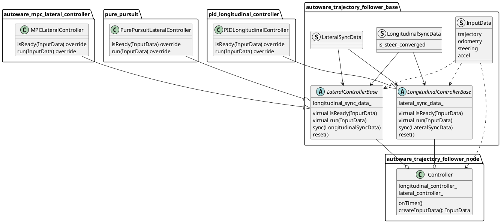

# Trajectory Follower ノード

## 目的

与えられたトラジェクトリに従う制御コマンドを生成します。

## 設計

これは [autoware_trajectory_follower_base](../autoware_trajectory_follower_base/README.md#trajectory-follower) パッケージから派生したコントローラクラスに実装された機能のノードです。計算を実行するためにこれらの機能のインスタンスを持ち、入力データを与え、制御コマンドを公開します。

デフォルトでは、次のような `Controller` クラスを持つコントローラインスタンスが使用されます。




`Controller`クラスのプロセスフローは次のとおりです。


```cpp
// 1. create input data
const auto input_data = createInputData(*get_clock());
if (!input_data) {
  return;
}

// 2. check if controllers are ready
const bool is_lat_ready = lateral_controller_->isReady(*input_data);
const bool is_lon_ready = longitudinal_controller_->isReady(*input_data);
if (!is_lat_ready || !is_lon_ready) {
  return;
}

// 3. run controllers
const auto lat_out = lateral_controller_->run(*input_data);
const auto lon_out = longitudinal_controller_->run(*input_data);

// 4. sync with each other controllers
longitudinal_controller_->sync(lat_out.sync_data);
lateral_controller_->sync(lon_out.sync_data);

// 5. publish control command
control_cmd_pub_->publish(out);
```

停止時にステアリングコンバージェンスに関する情報を縦方向コントローラに提供すると、次のパラメータが `true` の場合に停止時にステアリングを制御できます。

- 横方向コントローラ
  - `keep_steer_control_until_converged`
- 縦方向コントローラ
  - `enable_keep_stopped_until_steer_convergence`

### 入力/出力/API

#### 入力

- `autoware_planning_msgs/Trajectory` : 追従するリファレンストラジェクトリ
- `nav_msgs/Odometry`: 現在のオドメトリ
- `autoware_vehicle_msgs/SteeringReport` 現在のステアリング

#### 出力

- `autoware_control_msgs/Control`: 横方向と縦方向の両方のコマンドを含むメッセージ
- `autoware_control_msgs/ControlHorizon`: 横方向と縦方向の両方のホライゾンコマンドを含むメッセージ。これはデフォルトでは公開されていません。これを使用することで、車両制御のパフォーマンスが向上し、デフォルトをオンにすることで、実験的なトピックとして使用できます。

#### パラメータ

- `ctrl_period`: コントロールコマンドの公開周期
- `timeout_thr_sec`: 入力メッセージが破棄されるまでの秒数。
  - ノードが各コントローラから横方向と縦方向のコマンドを受信するたびに、次の 2 つの条件が満たされている場合に `Control` が公開されます。
    1. 両方のコマンドが受信されている。
    2. 最後を受信したコマンドが `timeout_thr_sec` で定義された値よりも古くない。
- `lateral_controller_mode`: `mpc` または `pure_pursuit`
  - (現在は縦方向コントローラには `PID` のみ)
- `enable_control_cmd_horizon_pub`: `ControlHorizon` を公開するかどうか (デフォルト: false)

## デバッグ

デバッグ情報は、横方向と縦方向のコントローラから `tier4_debug_msgs/Float32MultiArrayStamped` メッセージを使用して公開されます。

[PlotJuggler](https://github.com/facontidavide/PlotJuggler) の設定ファイルは `config` フォルダに用意されています。ロードすると、自動的にデバッグに役立つ情報をサブスクライブして視覚化できます。

さらに、予測された MPC トラジェクトリはトピック `output/lateral/predicted_trajectory` に公開され、Rviz で視覚化できます。

