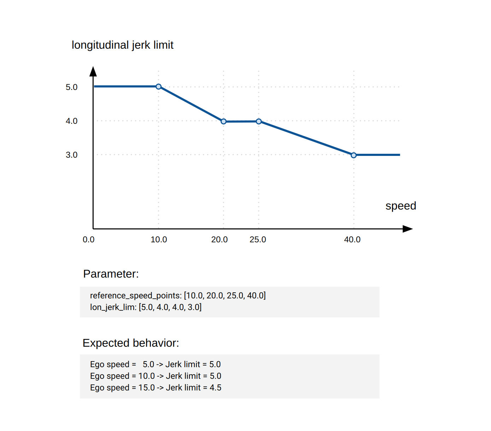

## 自動運転ソフトウェアのvehicle_cmd_gate

## 目的

`vehicle_cmd_gate`は緊急処理ハンドラ、Planningモジュール、外部コントローラから情報を受け取り、車両にメッセージを送信するためのパッケージです。

## 入出力

### 入力

| 名前                                       | 型                                                   | 説明                                                               |
| ------------------------------------------- | --------------------------------------------------- | -------------------------------------------------------------------- |
| `~/input/steering`                          | `autoware_vehicle_msgs::msg::SteeringReport`        | ステアリングのステータス                                            |
| `~/input/auto/control_cmd`                  | `autoware_control_msgs::msg::Control`               | Planningモジュールからの横方向速度と縦方向速度のコマンド             |
| `~/input/auto/turn_indicators_cmd`          | `autoware_vehicle_msgs::msg::TurnIndicatorsCommand` | Planningモジュールからのウインカーのコマンド                           |
| `~/input/auto/hazard_lights_cmd`            | `autoware_vehicle_msgs::msg::HazardLightsCommand`   | Planningモジュールからのハザードランプのコマンド                       |
| `~/input/auto/gear_cmd`                     | `autoware_vehicle_msgs::msg::GearCommand`           | Planningモジュールからのギアのコマンド                                 |
| `~/input/external/control_cmd`              | `autoware_control_msgs::msg::Control`               | 外部からの横方向速度と縦方向速度のコマンド                               |
| `~/input/external/turn_indicators_cmd`      | `autoware_vehicle_msgs::msg::TurnIndicatorsCommand` | 外部からのウインカーのコマンド                                          |
| `~/input/external/hazard_lights_cmd`        | `autoware_vehicle_msgs::msg::HazardLightsCommand`   | 外部からのハザードランプのコマンド                                      |
| `~/input/external/gear_cmd`                 | `autoware_vehicle_msgs::msg::GearCommand`           | 外部からのギアのコマンド                                                 |
| `~/input/external_emergency_stop_heartbeat` | `tier4_external_api_msgs::msg::Heartbeat`           | ハートビート                                                          |
| `~/input/gate_mode`                         | `tier4_control_msgs::msg::GateMode`                 | ゲートモード（AUTOまたはEXTERNAL）                                     |
| `~/input/emergency/control_cmd`             | `autoware_control_msgs::msg::Control`               | エマージェンシーハンドラからの横方向速度と縦方向速度のコマンド           |
| `~/input/emergency/hazard_lights_cmd`       | `autoware_vehicle_msgs::msg::HazardLightsCommand`   | エマージェンシーハンドラからのハザードランプのコマンド                   |
| `~/input/emergency/gear_cmd`                | `autoware_vehicle_msgs::msg::GearCommand`           | エマージェンシーハンドラからのギアのコマンド                               |
| `~/input/engage`                            | `autoware_vehicle_msgs::msg::Engage`                | エンゲージのシグナル                                                |
| `~/input/operation_mode`                    | `autoware_adapi_v1_msgs::msg::OperationModeState`   | Autowareのオペレーションモード                                       |

### 出力

ドキュメントの日本語訳:

### 自動運転ソフトウェア

**概要**

このドキュメントでは、Autowareにおける自動運転ソフトウェアのアーキテクチャとコンポーネントに関する包括的な概要を示します。

**アーキテクチャ**

Autowareのアーキテクチャはモジュール化され、以下のような主要なコンポーネントで構成されています。

* **Perception:** センサーからの生データを処理し、環境を理解します。
* **Planning:** 自車位置や周囲の状況に基づいて、経路と行動を計画します。
* **Control:** 計画された行動を実際の車両動作に変換します。
* **Localization:** 車両の自車位置を推定します。
* **Visualization:** センサーデータ、計画された経路、自車位置を視覚化します。

**コンポーネント**

各コンポーネントは、以下のような特定の機能を担当します。

**Perception**

* カメラ、レーダー、LiDARなどからの生データの処理
* 物体検出、セマンティックセグメンテーション、3D再構築

**Planning**

* `post resampling`トラジェク生成器
* 仮想的な障害物回避、経路計画、行動計画

**Control**

* 車両の速度、ステアリング、ブレーキの制御
* モーションプランニング、トラジェクトリトラッキング

**Localization**

* GPS、IMU、車輪オドメトリからのデータの統合
* 車両の自車位置と姿勢の推定

**Visualization**

* Rvizなどのツールを使用したセンサーデータ、計画された経路、自車位置の視覚化
* デバッグと検証のためのログファイルへのアクセス

| 名前                                   | 型                                                | 説明                                                      |
| -------------------------------------- | --------------------------------------------------- | -------------------------------------------------------- |
| `~/output/vehicle_cmd_emergency`       | `tier4_vehicle_msgs::msg::VehicleEmergencyStamped`  | vehicleコマンドで元の緊急状態                          |
| `~/output/command/control_cmd`         | `autoware_control_msgs::msg::Control`               | 横方向および縦方向速度のvehicleコマンド                 |
| `~/output/command/turn_indicators_cmd` | `autoware_vehicle_msgs::msg::TurnIndicatorsCommand` | vehicleに対するターンインジケーターコマンド             |
| `~/output/command/hazard_lights_cmd`   | `autoware_vehicle_msgs::msg::HazardLightsCommand`   | vehicleに対するハザードランプコマンド                   |
| `~/output/command/gear_cmd`            | `autoware_vehicle_msgs::msg::GearCommand`           | vehicleに対するギアコマンド                               |
| `~/output/gate_mode`                   | `tier4_control_msgs::msg::GateMode`                 | gate mode（AUTOまたはEXTERNAL）                             |
| `~/output/engage`                      | `autoware_vehicle_msgs::msg::Engage`                | engageシグナル                                          |
| `~/output/external_emergency`          | `tier4_external_api_msgs::msg::Emergency`           | 外部緊急シグナル                                        |
| `~/output/operation_mode`              | `tier4_system_msgs::msg::OperationMode`             | vehicle_cmd_gateの現在の動作モード                   |

## パラメータ

| パラメータ                                   | 型       | 説明                                                                                                                                                                                 |
| ------------------------------------------- | -------- | ------------------------------------------------------------------------------------------------------------------------------------------------------------------------------------------- |
| `更新周期`                                  | double   | 更新周期                                                                                                                                                                               |
| `使用緊急処理`                              | bool     | 緊急処理が使用された場合にtrue                                                                                                                                                            |
| `外部緊急ハートビートの確認`                   | bool     | 緊急停止のためのハートビートを確認する場合にtrue                                                                                                                                            |
| `システム緊急ハートビートタイムアウト`     | double   | システム緊急時のタイムアウト                                                                                                                                                                |
| `外部緊急停止ハートビートタイムアウト`     | double   | 外部緊急時のタイムアウト                                                                                                                                                              |
| `フィルターアクティブ化カウントしきい値`     | int      | フィルターアクティブ化のしきい値                                                                                                                                                             |
| `フィルターアクティブ化速度しきい値`       | double   | フィルターアクティブ化の速度しきい値                                                                                                                                                    |
| `停止保持時の加速度`                        | double   | 車両が停止する必要がある場合の縦方向加速度cmd                                                                                                                                      |
| `緊急時の加速度`                             | double   | 車両が緊急時に停止する必要がある場合の縦方向加速度cmd                                                                                                                              |
| `中程度の停止サービスの加速度`                | double   | 車両が中程度の停止サービスで停止する場合の縦方向加速度cmd                                                                                                                  |
| `nominal.vel_lim`                           | double   | 縦速度の制限（AUTONOMOUS運転モードでアクティブ）                                                                                                                     |
| `nominal.reference_speed_point`             | <double> | 制御コマンド制限を計算するときに基準として使用される速度ポイント（AUTONOMOUS運転モードでアクティブ）。この配列のサイズは制限配列のサイズと等しくする必要があります。 |
| `nominal.lon_acc_lim`                       | <double> | 縦方向加速度の制限の配列（AUTONOMOUS運転モードでアクティブ）                                                                                                       |
| `nominal.lon_jerk_lim`                      | <double> | 縦方向ジャークの制限の配列（AUTONOMOUS運転モードでアクティブ）                                                                                                               |
| `nominal.lat_acc_lim`                       | <double> | 横方向加速度の制限の配列（AUTONOMOUS運転モードでアクティブ）                                                                                                            |
| `nominal.lat_jerk_lim`                      | <double> | 横方向ジャークの制限の配列（AUTONOMOUS運転モードでアクティブ）                                                                                                                    |
| `on_transition.vel_lim`                     | double   | 速度の制限（TRANSITION運転モードでアクティブ）                                                                                                                     |
| `on_transition.reference_speed_point`       | <double> | 制御コマンド制限を計算するときに基準として使用される速度ポイント（TRANSITION運転モードでアクティブ）。この配列のサイズは制限配列のサイズと等しくする必要があります。 |
| `on_transition.lon_acc_lim`                 | <double> | 縦方向加速度の制限の配列（TRANSITION運転モードでアクティブ）                                                                                                       |
| `on_transition.lon_jerk_lim`                | <double> | 縦方向ジャークの制限の配列（TRANSITION運転モードでアクティブ）                                                                                                               |
| `on_transition.lat_acc_lim`                 | <double> | 横方向加速度の制限の配列（TRANSITION運転モードでアクティブ）                                                                                                            |
| `on_transition.lat_jerk_lim`                | <double> | 横方向ジャークの制限の配列（TRANSITION運転モードでアクティブ）                                                                                                                    |

## フィルター機能

このモジュールは、Controlコマンドの発行直前にコマンドの範囲を制限する制限フィルターを備えています。主に安全を確保するために、このフィルターはAutoware経由で公開される全てのコントロールコマンドの出力範囲を制限します。

制限値は、制限配列パラメータの1次元補間に基づいて計算されます。 longitudinal jerk制限に対する例を以下に示します。

注意: このフィルターは走行時の快適性を向上させるために設計されていません。その主な目的は、Autowareの最終段階でコントロール出力の異常値を検出して削除することです。このフィルターが頻繁にアクティブになる場合、コントロールモジュールに調整が必要である可能性があります。ローパスフィルタや同様の手法で信号を滑らかにしようとする場合は、コントロールモジュールで処理する必要があります。フィルターがアクティブになると、トピック`~/is_filter_activated`が発行されます。

注意 2: アクセル/ブレーキペダルで駆動力を制御する車両を使用する場合、ペダルレート制限を示すジャーク制限は低速時に十分に緩やかである必要があります。
そうしないと、始動/停止時のペダルの急激な切り替えができなくなり、発進が遅くなったり、坂道でクリープ現象が発生したりします。始動/停止のためのこの機能はソースコードに組み込まれていましたが、複雑でパラメータで実現できるため削除されました。

## 想定事項/既知の制限事項

### 外部緊急ハートビート

`check_external_emergency_heartbeat`パラメータ(デフォルトではtrue)は、外部モジュールからの緊急停止要求を有効にします。
この機能には外部モジュールのヘルスモニタリング用の`~/input/external_emergency_stop_heartbeat`トピックが必要であり、トピックなしではvehicle_cmd_gateモジュールは開始できません。
「外部緊急停止」機能を使用しない場合、`check_external_emergency_heartbeat`パラメータはfalseにする必要があります。

### モード変更時のコマンド

出力コマンドのトピック(`turn_indicators_cmd`、`hazard_light`、および`gear_cmd`)は`gate_mode`に基づいて選択されます。
ただし、コマンドの継続性を確保するために、モードが変更されたとしても、新しい入力コマンドのトピックが届くまでこれらのコマンドは変更されません。

