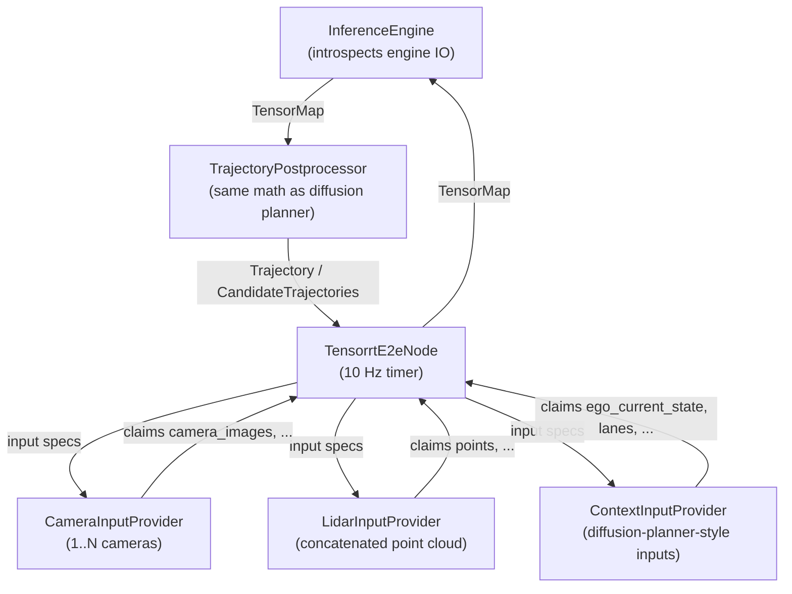

# Design

This document explains the key design concepts of `autoware_tensorrt_e2e`.

## Context and scope

TIER IV is prototyping several end-to-end (E2E) planning models that differ **only in their
sensing inputs** while sharing the rest of the interface:

| Prototype | Sensing input | Other inputs | Output |
| --------------- | ------------------------------------------ | ---------------------------------- | ---------------------------- |
| Front camera | 1 camera (`CAM_FRONT_WIDE`) | Diffusion-planner-style (optional) | Ego trajectory, 40 pts / 4 s |
| Surround camera | 5 cameras (front wide + 4 corner wides) | Diffusion-planner-style (optional) | Ego trajectory, 40 pts / 4 s |
| LiDAR | Concatenated point cloud (as in BEVFusion) | Diffusion-planner-style (optional) | Ego trajectory, 40 pts / 4 s |

Writing one ROS node per model would duplicate subscription handling, TensorRT plumbing,
postprocessing, and diagnostics — and every new model variant (new sensor set, added or removed
context input, different history length) would require another copy. `autoware_tensorrt_e2e`
instead provides **one abstract node** that adapts itself to the model.

## Goals and Non-goals

- Goals
  - Run any single-engine E2E trajectory model without node code changes: sensor modality,
    context inputs, and tensor dimensions are all derived from the TensorRT engine and ROS
    parameters.
  - Keep the trajectory postprocessing identical to `autoware_diffusion_planner`
    (velocity estimation from consecutive poses, smoothing window, force-stop logic) so that
    downstream consumers see consistent trajectories regardless of which planner produced them.
  - Publish stably at 10 Hz.

- Non-goals
  - Generic multi-engine *planner* graphs (e.g. separate encoder/decoder planner engines like
    `autoware_tensorrt_vad`). The planner itself is one ONNX/engine. A sensor *feature
    extractor* owned by an input provider (e.g. the frozen BEVFusion-L stage of ResWorld) is in
    scope — the provider abstraction hides it from the node.
  - Perception outputs as a primary product (detected objects / map polylines). Predicted
    neighbor trajectories are published only when the model provides them.
  - Model-specific GPU preprocessing beyond image resize/normalize and the BEVFusion
    voxelization reused from `autoware_bevfusion`.

## Concepts

The design combines the two proven patterns in this repository:

- From `autoware_diffusion_planner`: timer-driven 10 Hz processing with polling subscribers,
  diagnostics, and the trajectory postprocessing pipeline.
- From `autoware_tensorrt_vad`: strict separation between the ROS domain and the CUDA domain,
  and deployment/model parameter separation.

and adds one new idea that provides the abstraction:

### The engine IO manifest drives everything

A TensorRT engine knows the **names, shapes, and dtypes** of all its IO tensors. At startup the
`InferenceEngine` wrapper introspects the engine and produces `TensorSpec` lists for inputs and
outputs. Nothing about the tensor set is hard-coded in the node.

**Input providers** are components that can produce named tensors from ROS data. After the
engine is loaded, each enabled provider is shown the engine's input specs and *claims* the
tensors it will produce (`claim_inputs()`), validating dimensions against its own configuration
(e.g. camera count) and sizing its internal state from the spec (e.g. history length `T` from
`ego_agent_past: [1, T, 4]`).

Startup fails with an explicit error when:

- an engine input tensor is claimed by no provider (the model needs data the deployment does
  not produce), or
- a tensor is claimed by two providers (ambiguous configuration), or
- a claimed tensor's shape contradicts the provider configuration
  (e.g. `camera_images: [1, 6, 3, H, W]` but `camera.num_cameras: 5`).

This turns model/deployment mismatches into immediate, readable startup errors instead of
silent garbage inference.

### Layered architecture

| Layer | Class | Domain | Responsibility |
| ----------- | ------------------------------ | --------- | ------------------------------------------------------------------ |
| Node | `TensorrtE2eNode` | ROS | Timer, ego state, publishers, diagnostics, orchestration |
| Providers | `InputProviderInterface` impls | ROS→CUDA | Subscriptions, synchronization, conversion of ROS msgs to tensors |
| Inference | `InferenceEngine` | CUDA | Generic TensorRT execution over named tensors |
| Postprocess | `TrajectoryPostprocessor` | ROS | Model output → `Trajectory` / `CandidateTrajectories` / objects |

The boundary type between all layers is `TensorMap` (`std::unordered_map<std::string, Tensor>`),
where a `Tensor` carries a shape plus either host data (`std::vector<float>`) or a pointer to
device-resident data. Camera preprocessing writes directly to GPU memory and hands the engine a
device tensor, so image data never round-trips through the host.

### Input providers

#### `CameraInputProvider` — prototypes 1 and 2

One provider handles any camera count; the front-camera and surround configurations differ only
in parameters (`camera.num_cameras`, topic remaps).

- Subscribes to `~/input/camera{i}/image` via `image_transport`
  (`raw` or `compressed`, per parameter) and stores the latest message per camera
  (callbacks are trivially cheap; all work happens in the timer tick).
- Synchronization follows the `autoware_tensorrt_vad` front-critical strategy: camera 0 in the
  configured list is the anchor. At collection time the anchor image must be fresher than
  `camera.max_delay_ms`, and every other camera must be within `camera.sync_tolerance_ms` of
  the anchor. Non-anchor cameras may optionally be zero-filled when dropped
  (`camera.allow_dropped_cameras`), again following the VAD precedent.
- GPU preprocessing (adapted from VAD's kernels): H2D copy of BGR8 images → bilinear resize to
  the model resolution (taken from the engine spec, not from parameters) → BGR→RGB, mean/std
  normalization, CHW layout. Output is a device tensor shaped `[1, N, 3, H, W]`.
- Optionally claims `camera_intrinsics` (`[1, N, 3, 3]`, from `camera_info`, rescaled to the
  model resolution) and `camera2ego` (`[1, N, 4, 4]`, from TF) when the engine requests them.

The Autoware camera IDs (e.g. xx1's `camera1` = `CAM_FRONT_WIDE`) appear **only** in launch
remaps, mirroring the `autoware_to_vad_camera_mapping` design of `autoware_tensorrt_vad`:
changing the vehicle's camera numbering touches no code.

#### `LidarInputProvider` — prototype 3

- Subscribes to `~/input/pointcloud` (the concatenated cloud, same source as BEVFusion).
- Claims a `points` tensor `[1, P, D]` (`D` = 3–5: x, y, z, intensity, time-lag placeholder)
  padded/truncated to the engine's `P`, and optionally `num_points` (`[1, 1]`) with the valid
  count. Voxelization is intentionally left inside the engine (see Non-goals).

#### `BevFeatureInputProvider` — temporal LiDAR BEV features (ResWorld)

Implements the ResWorld deployment contract (OnePlanner `projects/resworld/deployment`), whose
ONNX boundary is deliberately the **frozen LiDAR BEVFusion feature map** rather than the raw
point cloud:

1. Per new LiDAR frame, a provider-owned TensorRT engine (`TrtBevFeatureExtractor`) runs the
   frozen BEVFusion-L feature extractor once: voxelization reuses the production
   `autoware_bevfusion` preprocessing (`PreprocessCuda`), sparse convolution runs via
   `autoware_tensorrt_plugins`, and the `bev_feature` output (`[1, C, H, W]`, xx1: 512×180×180)
   stays on the GPU.
2. `TemporalBevCache` keeps the last K (=3) feature maps with their source ego poses at a
   contract-checked 0.1 s spacing (a violated gap resets and re-warms the cache), and
   assembles the `[1, K, C, H, W]` current-to-past history: slot 0 is the raw newest map,
   older slots are **SE(2)-warped** from their source ego frame into the newest frame's ego
   frame. The warp kernel replicates the Python reference (`deployment/temporal.py`) exactly:
   pose format `[x, y, cos(yaw), sin(yaw)]`, BEV axes height = x-forward / width = y-left,
   half extent 122.4 m, bilinear sampling with zero padding, `align_corners=False`
   pixel-centre convention. The coordinate math is host-callable and unit-tested.
3. The stack is claimed as `bev_feature_history` (device-resident, no host round-trip of the
   ~200 MB tensor).

When `bev_feature.contract_path` points at the model's `resworld_deployment_contract.json`,
the temporal-cache semantics (frames, interval, half extent, feature tensor name) are read
from it, keeping the model artifact the single source of truth. Warmup follows the contract:
wait for K real frames, or optionally duplicate the current one
(`bev_feature.warmup: duplicate_current`).

#### `ContextInputProvider` — "the diffusion planner inputs"

Produces any subset of the `autoware_diffusion_planner` input tensors:

`ego_current_state`, `ego_agent_past`, `neighbor_agents_past`, `static_objects`,
`lanes(_speed_limit)(_has_speed_limit)`, `route_lanes(_speed_limit)(_has_speed_limit)`,
`polygons`, `line_strings`, `goal_pose`, `ego_shape`, `turn_indicators`.

Every tensor is **optional**: only the ones present in the engine manifest are produced, and
only the subscriptions they need are created (a camera-only model with `ego_current_state`
subscribes to nothing but odometry/acceleration; a model that also takes `route_lanes` adds
map/route subscriptions). Free dimensions (history length, neighbor count, lane segment count)
are taken from the engine spec, so a model trained with e.g. 21 history steps instead of 31
needs no code change.

The implementation **reuses the exported `autoware_diffusion_planner` library** —
`AgentData`, `LaneSegmentContext`, `process_traffic_signals`, `create_ego_current_state`,
`create_ego_agent_past` — rather than copying ~2000 lines of preprocessing. This guarantees
bit-identical context features between the diffusion planner and E2E models trained on the same
feature pipeline. The trade-off (an `e2e` package depending on a `planning` package) is
accepted deliberately; if it becomes a problem the shared code should be extracted into a
common library, not forked.

Diffusion-specific inputs (`sampled_trajectories`, `delay`) are *not* provided; they belong to
the diffusion sampling loop, not to the shared feature set. A model requiring them should run
under `autoware_diffusion_planner`, or a dedicated provider can be added (see
[Adding a new input](#expected-use-cases)).

### Inference engine

`InferenceEngine` is a generic wrapper over `autoware::tensorrt_common::TrtCommon`:

- Loads ONNX (building/caching the engine like other Autoware TensorRT nodes; `build_only`
  supported) with optional `autoware_tensorrt_plugins`.
- Enumerates IO tensors, resolves a dynamic batch dimension to 1, rejects other dynamic
  dimensions, allocates device buffers and pinned host output buffers once, and binds
  addresses once.
- `infer(TensorMap)` validates element counts per tensor, performs H2D (or D2D for
  device-resident tensors) copies with dtype conversion (`float32`, `bool`, `int32` inputs),
  runs `enqueueV3`, and returns outputs as host tensors.

Unlike the diffusion planner's `TensorrtInference` (which hard-codes 19 tensor names), no
tensor identity is known at compile time.

### Trajectory postprocessing — identical to the diffusion planner

The prediction tensor (default name `prediction`) is interpreted exactly like the diffusion
planner output: `[batch, num_agents, T, 4]` with `(x, y, cos(yaw), sin(yaw))` per step in the
ego frame at 0.1 s intervals; agent 0 is ego. `[batch, T, 4]` is accepted as the ego-only
degenerate case. `T` comes from the engine and is validated against
`postprocess.horizon_seconds / postprocess.time_step` (40 for the current models; the
diffusion planner's 80 would work equally).

Pose parsing is a dimension-parameterized re-implementation of `parse_predictions`
(the original hard-codes `OUTPUT_T = 80`); everything downstream —
`postprocess::create_ego_trajectory` (velocity from consecutive poses, smoothing window,
force-stop) and `postprocess::create_predicted_objects` — is **called directly from the
diffusion planner library**, so the postprocessing cannot drift apart. Neighbor predictions
are published only when the model outputs more than one agent *and* the neighbor history
context input is active.

`Trajectory`, `CandidateTrajectories` (one candidate per batch, with generator UUID/name), and
optional `PredictedObjects` are published, mirroring the diffusion planner topics.

### 10 Hz output stability

- The node is **timer-driven** at `planning_frequency_hz` (default 10 Hz) — the same proven
  pattern as `autoware_diffusion_planner`, which runs this rate in production. Sensor
  callbacks only store shared pointers; every expensive operation happens once per tick.
- All context inputs use polling subscribers (no callback storms); camera/lidar data is
  latched under a mutex.
- Per-tick processing time is published (`~/debug/processing_time_ms`) and checked against the
  planning period: exceeding it raises a `WARN` diagnostic
  (`processing time exceeded the planning period`), so rate violations are visible in the
  field instead of silent.
- GPU work is submitted on dedicated CUDA streams; image preprocessing writes directly into
  device memory consumed by the engine (no host round-trip of image tensors).
- If a future model cannot fit the 100 ms budget, the intended extension is a double-buffered
  worker thread (collect on the timer, infer+publish on the worker). The provider/engine
  interfaces already keep all state exchange in `TensorMap` values, so this changes only the
  node orchestration.

### Separation between model architecture and deployment parameters

Following `autoware_tensorrt_vad`:

- **Model architecture** lives in the engine itself (tensor shapes) plus an optional
  normalization JSON (`args_path`, same `observation_normalizer` format as the diffusion
  planner). These ship with the model artifacts.
- **Deployment** parameters (topics, camera count/resolution, sync tolerances, thresholds)
  live in the ROS param YAML (`config/*.param.yaml`), one file per sensor prototype.

## Expected Use Cases

### Switching sensor prototypes

Launch a different launch file / param file. No code changes:
`e2e_planner_front_camera.launch.xml`, `e2e_planner_surround_cameras.launch.xml`,
`e2e_planner_lidar.launch.xml`.

### A retrained model adds or removes a context input

Nothing to do. The new engine's manifest requests a different tensor set; the
`ContextInputProvider` claims accordingly and creates/destroys subscriptions to match.

### A new sensing modality or feature (e.g. radar, HD-map raster)

Implement `InputProviderInterface` (two methods: `claim_inputs`, `collect`), register it in
`TensorrtE2eNode::create_providers()`, and enable it via the `sensor_inputs` parameter.
No changes to the engine wrapper, postprocessing, or existing providers.

### A model with a different horizon

Set `postprocess.horizon_seconds` (the engine's `T` is validated against it). The time step is
fixed at 0.1 s — the same constant baked into the diffusion planner postprocessing that this
package reuses.

## Coding standards

Follows `autoware_tensorrt_vad`'s standards (`int32_t`/`int64_t` over `int` in new interfaces,
RCLCPP throttled logging, `double` for map coordinates) and the common Autoware conventions
(C++17, `autoware_cmake`, Apache-2.0).
