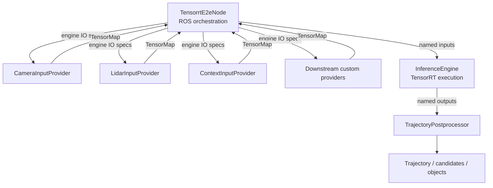

# Design

This document describes the model-agnostic foundation of `autoware_tensorrt_e2e`.

## Scope

The package provides one ROS 2 node for a single-engine end-to-end planner. Different models can
use different sensor layouts and optional context tensors while sharing the same TensorRT
execution, scheduling, diagnostics, and Autoware output path.

The foundation is intentionally independent of any model-vendor feature extractor. A downstream
model branch can add an `InputProviderInterface` implementation and its own dependencies without
coupling the common node to that model.

## Goals

- Load one ONNX/TensorRT planner and inspect its named IO tensors at runtime.
- Connect model inputs to reusable providers with explicit shape validation.
- Keep sensor subscriptions and preprocessing out of the TensorRT wrapper.
- Publish a common trajectory interface at a stable, timer-driven rate.
- Fail early with a readable error when the model and deployment configuration do not match.

## Non-goals

- Generic multi-engine planner graphs. A provider may own a feature extractor, but that extractor
  is a downstream extension rather than part of the foundation.
- A universal decoder for arbitrary model output formats. The common output contract is the
  trajectory representation described below; a different output format needs a downstream
  postprocessor.
- Perception as the primary output. Neighbor trajectories are optional planner outputs.

## Layered architecture

| Layer | Main type | Responsibility |
| --- | --- | --- |
| Node | `TensorrtE2eNode` | Parameters, timer, ego state, orchestration, diagnostics, publishers |
| Providers | `InputProviderInterface` | ROS subscriptions, synchronization, conversion, and model input ownership |
| Inference | `InferenceEngine` | Generic named TensorRT IO, device buffers, copies, and execution |
| Postprocess | `TrajectoryPostprocessor` | Common trajectory decoding, velocity calculation, smoothing, and publication messages |

`TensorMap` is the boundary between layers. A `Tensor` contains a shape and either host data or a
device pointer. Providers may keep expensive data on the GPU; the engine performs the required
host-to-device or device-to-device transfer.

## Engine IO manifest

`InferenceEngine` enumerates every engine input and output and exposes it as a `TensorSpec`:

- tensor name;
- static shape including batch;
- data type (`float32`, `bool`, or `int32`).

A dynamic batch dimension is resolved to one. Other dynamic dimensions are rejected because the
provider and buffer contracts need deterministic sizes. Device buffers and pinned output buffers
are allocated once during initialization.

The engine does not know what a tensor means. It only checks that each required input is present,
has the expected element count, and can be copied to the engine's data type. Extra entries in a
`TensorMap` are ignored, which lets multiple providers share a common collection path.

## Input provider contract

Providers have two phases:

1. `claim_inputs(engine_inputs)` runs once after the engine is loaded. The provider selects the
   tensor names it understands, validates their shapes, sizes state, and creates only the
   subscriptions it needs.
2. `collect(ego, now, inputs, error)` runs once per planning tick and inserts the claimed tensors.

The node checks that every engine input has exactly one provider. It rejects both unclaimed and
multiply claimed tensors before the node is marked ready.

### Included providers

#### Camera

`CameraInputProvider` supports one or more synchronized cameras. It obtains image dimensions from
the engine manifest, uses the configured sensor dimensions for source-image validation, and
performs resize, color conversion, normalization, and CHW packing on a CUDA stream. It can also
produce camera intrinsics and camera-to-ego transforms when the engine requests them.

The camera tensor names are parameters, so model exports with different names do not require code
changes. Camera topics are selected by launch remaps, keeping vehicle-specific camera numbering
out of the provider.

#### LiDAR

`LidarInputProvider` converts a `PointCloud2` message into a fixed `[1, P, D]` tensor, padding or
truncating to the engine's point capacity. It can also publish the valid point count as `[1, 1]`.
The provider does not assume a particular downstream voxelizer.

#### Context

`ContextInputProvider` produces the optional, shared context tensors used by the diffusion-planner
feature pipeline. It claims only tensors present in the engine manifest and creates subscriptions
on demand. History lengths and capacity dimensions are taken from the model spec where the
feature contract allows them. The implementation reuses the exported diffusion-planner utility
functions so the feature encoding remains consistent with the source pipeline.

## Common input contract

The following tensor names and shapes are understood by the foundation providers:

| Provider | Tensor | Shape |
| --- | --- | --- |
| camera | `camera_images` | `[1, N, 3, H, W]` |
| camera | `camera_intrinsics` | `[1, N, 3, 3]` |
| camera | `camera2ego` | `[1, N, 4, 4]` |
| LiDAR | `points` | `[1, P, D]`, `D` in 3–5 |
| LiDAR | `num_points` | `[1, 1]` |

Context tensors are optional and are listed in the package schema. The camera and LiDAR names
are configurable. A model with a new sensor or feature should add a provider in a downstream
branch, rather than adding model-specific conditionals to the engine.

## Common output contract

The primary output tensor is `prediction` by default and may be renamed with
`postprocess.prediction_tensor`. It has one of these shapes:

- `[B, T, 4]` for ego-only models;
- `[B, A, T, 4]` for models that also predict neighbors.

Each pose is `(x, y, cos(yaw), sin(yaw))` in the model reference frame. The point interval is
currently fixed at 0.1 seconds to match the shared postprocessing implementation. The horizon,
velocity smoothing window, stopping threshold, and generator name are deployment parameters.

Additional ego-only trajectory tensors can be listed in
`postprocess.extra_trajectory_tensors`; each becomes another candidate trajectory.

The postprocessor converts poses to `Trajectory` and `CandidateTrajectories`. When the prediction
contains neighbors and neighbor history is available, it also produces `PredictedObjects`.

## Scheduling and failure behavior

The node is timer-driven at `planning_frequency_hz` (10 Hz by default). Sensor callbacks only
cache messages. Each timer tick:

1. takes the latest ego state;
2. collects all provider tensors;
3. applies optional normalization and rejects NaN/Inf host values;
4. runs TensorRT inference;
5. decodes and publishes the trajectory;
6. publishes processing time and diagnostics.

Missing sensor data is reported as a warning and skips that tick. Initialization errors disable
inference and publish an error diagnostic. Processing that exceeds the timer period raises a
warning so an output-rate regression is visible.

## Extending the foundation

### New model with existing providers

Use a new parameter YAML and launch remaps. If the model follows the common input/output
contracts, no C++ changes are required.

### New input modality or feature

Implement `InputProviderInterface`, add the provider to the node's provider factory in the
downstream branch, and document its tensor contract. The provider can own its subscriptions,
CUDA preprocessing, feature extractor, and model-specific deployment parameters.

### New output representation

Keep the common node orchestration and add a postprocessor/adapter in the downstream branch when
the model does not emit `(x, y, cos(yaw), sin(yaw))` trajectories.

This separation keeps the foundation small and lets each model branch carry only the code and
runtime dependencies that its artifact actually needs.
