## tier4_control_launch

## 構造



## パッケージの依存関係

`<package.xml>`の`<exec_depend>`を参照してください。

## 使用方法

`*.launch.xml`に次の記述を含めて`control.launch.py`を使用できます。

`PACKAGE_param_path`としてパラメータパスを提供する必要があることに注意してください。提供する必要があるパラメータパスのリストは、`planning.launch.xml`の先頭に記載されています。


```xml
<include file="$(find-pkg-share tier4_control_launch)/launch/control.launch.py">
  <!-- options for lateral_controller_mode: mpc_follower, pure_pursuit -->
  <!-- Parameter files -->
  <arg name="FOO_NODE_param_path" value="..."/>
  <arg name="BAR_NODE_param_path" value="..."/>
  ...
  <arg name="lateral_controller_mode" value="mpc_follower" />
</include>
```

## メモ

処理負荷を削減するため、ROS 2 の [Component](https://docs.ros.org/en/galactic/Concepts/About-Composition.html) 機能を使用します（ROS 1 の Nodelet に類似）

