# tier4_system_launch

## 構造



## パッケージの依存関係

`package.xml` の `<exec_depend>` を参照してください。

## 使用方法

パラメーターパスを `PACKAGE_param_path` として提供する必要があることに注意してください。提供する必要があるパラメーターパスのリストは `system.launch.xml` の先頭部に記載されています。


```xml
  <include file="$(find-pkg-share tier4_system_launch)/launch/system.launch.xml">
    <arg name="run_mode" value="online"/>
    <arg name="sensor_model" value="SENSOR_MODEL"/>

    <!-- Parameter files -->
    <arg name="FOO_param_path" value="..."/>
    <arg name="BAR_param_path" value="..."/>
    ...
  </include>
```

