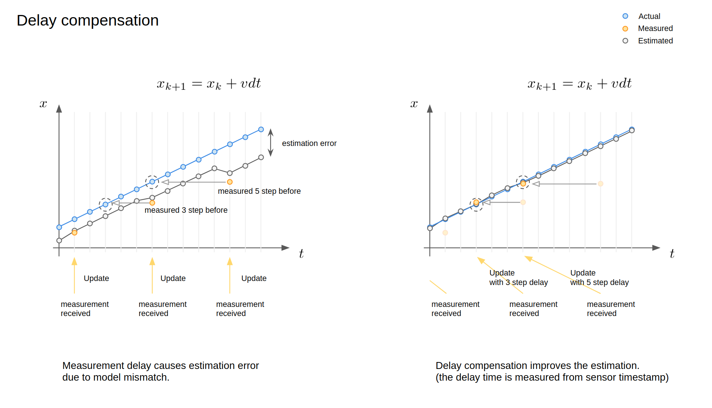
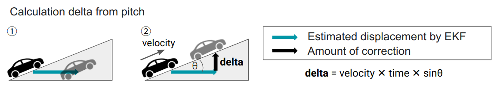
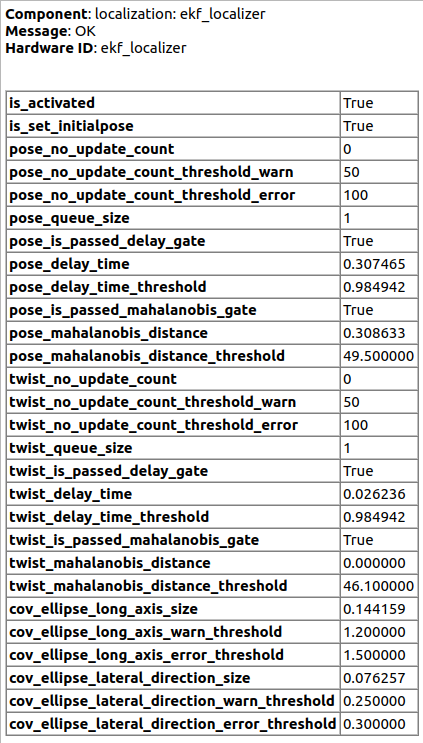
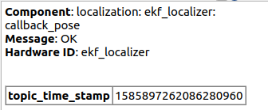

# 概要

**Extend Kalman Filter Localizer**は、自己位置姿勢及び自己運動のメッセージを入力として、2D車両ダイナミクスモデルと統合することによって、堅牢でノイズの少ないロボットの姿勢と運動量を推定します。本アルゴリズムは、自動運転システムなどの高速移動するロボット向けに設計されています。

## フローチャート

autoware_ekf_localizerの全体的なフローチャートを以下に示します。

  

## 特徴

本パッケージには、以下の機能が含まれています。

- 入力メッセージの**時差補正**により、変化する時差を持った入力情報を適切に統合できます。これは、自動運転車などの高速で移動するロボットに特に重要です（以下の図を参照）。
- **ヨーバイアスの自動推定**により、センサー取り付け角度の誤差によるモデリングエラーを防ぐことができ、推定精度が向上します。
- **マハラノビス距離ゲート**により、どの入力を利用するか無視するかを判断するための確率的な外れ値検出が可能になります。
- **滑らかな更新**、カルマンフィルタの測定値更新は通常測定値が取得されたときに行われますが、これにより推定値が大きく変化する可能性があります。特に低頻度の測定値の場合です。本アルゴリズムは測定時間を考慮できるため、測定値データを複数の部分に分割し、一貫性を維持しながら滑らかに統合できます（以下の図を参照）。
- **ピッチからの垂直補正量の算出**により、勾配上の位置推定の不安定性が軽減されます。例えば、上り坂ではEKFが3DoF（x、y、ヨー）のみを考慮するため、地面に埋もれているかのように挙動します（「ピッチからのdeltaの算出」図の左側を参照）。したがって、EKFは数式に従ってz座標を修正します（「ピッチからのdeltaの算出」図の右側を参照）。

  

  

## ノード

### サブスクライブトピック

| 名称                             | タイプ                                             | 説明                                                                                                                                     |
| -------------------------------- | ------------------------------------------------ | ------------------------------------------------------------------------------------------------------------------------------------------------ |
| `measured_pose_with_covariance`  | `geometry_msgs::msg::PoseWithCovarianceStamped`  | 計測共分散行列を持つ入力ポーズソース。                                                                                                       |
| `measured_twist_with_covariance` | `geometry_msgs::msg::TwistWithCovarianceStamped` | 計測共分散行列を持つ入力ツイストソース。                                                                                                      |
| `initialpose`                    | `geometry_msgs::msg::PoseWithCovarianceStamped`  | EKFの初期ポーズ。推定されたポーズは、開始時にゼロで初期化されます。このメッセージが発行されるたびに、このメッセージで初期化されます。 |

## 配信トピック

- `/tf`: フレーム間の変換行列
- `/current_pose`: 自車位置
- `/planning/scenario`: シナリオプランニングモジュールの結果
- `/planning/trajectory`: トラジェクトリプランニングモジュールの結果
- `/planning/obstacle`: オブジェクト検出とトラッキングモジュールの結果
- `/planning/speed`: スピードプランニングモジュールの結果
- `/planning/debug`: プランニングモジュールのデバッグ情報
- `/lidar_points`: LiDAR点群データ（'post resampling'` 後)
- `/image/front_color`: フロントカメラのカラー画像
- `/image/side_color`: サイドカメラのカラー画像
- `/ndt_map`: ND マップ
- `/route`: ルート情報

| 名前 | タイプ | 説明 |
|:---|:---|:---|
| `ekf_odom` | `nav_msgs::msg::Odometry` | 推定オドメトリ |
| `ekf_pose` | `geometry_msgs::msg::PoseStamped` | 推定ポーズ |
| `ekf_pose_with_covariance` | `geometry_msgs::msg::PoseWithCovarianceStamped` | 推定ポーズ（共分散あり） |
| `ekf_biased_pose` | `geometry_msgs::msg::PoseStamped` | ヨーバイアスを含んだ推定ポーズ |
| `ekf_biased_pose_with_covariance` | `geometry_msgs::msg::PoseWithCovarianceStamped` | ヨーバイアスを含んだ推定ポーズ（共分散あり） |
| `ekf_twist` | `geometry_msgs::msg::TwistStamped` | 推定ツイスト |
| `ekf_twist_with_covariance` | `geometry_msgs::msg::TwistWithCovarianceStamped` | 推定ツイスト（共分散あり） |
| `diagnostics` | `diagnostics_msgs::msg::DiagnosticArray` | 診断情報 |
| `debug/processing_time_ms` | `tier4_debug_msgs::msg::Float64Stamped` | 処理時間 [ms] |

### 公開されたTF

- base_link
  `map`座標から推定された姿勢へのTF.

## 機能

### 予測

現在のロボットの状態は、与えられた予測モデルを使用して、以前の推定データから予測されます。この計算は、一定の間隔（`predict_frequency[Hz]`）で呼び出されます。予測方程式はこのページの最後に記載されています。

### 計測の更新

更新の前に、測定された入力と予測された状態との間のマハラノビス距離が計算されます。マハラノビス距離が与えられたしきい値を超える入力に対しては、測定更新は実行されません。

予測された状態は、最新の測定された入力、測定された姿勢、測定されたツイストで更新されます。更新は、通常、高周波で行われる予測と同じ周波数で行われ、滑らかな状態推定が可能になります。

## パラメータの説明

パラメータは`launch/ekf_localizer.launch`に設定されています。

### ノード用

{{ json_to_markdown("localization/autoware_ekf_localizer/schema/sub/node.sub_schema.json") }}

### 姿勢の測定用

{{ json_to_markdown("localization/autoware_ekf_localizer/schema/sub/pose_measurement.sub_schema.json") }}

### ツイストの測定用

{{ json_to_markdown("localization/autoware_ekf_localizer/schema/sub/twist_measurement.sub_schema.json") }}

### プロセスノイズ用

{{ json_to_markdown("localization/autoware_ekf_localizer/schema/sub/process_noise.sub_schema.json") }}

注：位置のxおよびyのプロセスノイズは、非線形動力学から自動的に計算されます。

### 単純な1Dフィルタパラメータ

{{ json_to_markdown("localization/autoware_ekf_localizer/schema/sub/simple_1d_filter_parameters.sub_schema.json") }}

### 診断用

{{ json_to_markdown("localization/autoware_ekf_localizer/schema/sub/diagnostics.sub_schema.json") }}

### その他

{{ json_to_markdown("localization/autoware_ekf_localizer/schema/sub/misc.sub_schema.json") }}

## EKFパラメータの調整方法

### 0. 準備

- ヘッダー時刻が姿勢メッセージとツイストメッセージで適切にセンサー時刻に設定されているかどうかを確認します。時間遅延はこの値から計算されるからです。タイマーの同期問題により適切な時間を設定することが難しい場合は、`twist_additional_delay`と`pose_additional_delay`を使用して時間を補正します。
- 計測された姿勢とツイストの関係が適切であるかどうか（姿勢の微分がツイストと同様の値を持っているかどうか）を確認します。この不一致は、主に単位エラー（ラジアン/度数の混同など）またはバイアスノイズによって引き起こされ、大きな推定エラーが発生します。

### 1. センサーパラメータの調整

### それぞれのセンサーの標準偏差の設定

`pose_measure_uncertainty_time` はヘッダタイムスタンプデータの不確かさ用です。

`*_smoothing_steps` のチューニングによって、それぞれの観測センサーデータのスムージングステップ数をチューニングすることもできます。ステップ数が増えると推定の滑らかさが向上しますが、推定性能に悪影響を与える場合があります。

- `pose_measure_uncertainty_time`
- `pose_smoothing_steps`
- `twist_smoothing_steps`

### 2. プロセスモデルパラメータのチューニング

- `proc_stddev_vx_c` : 最大線形加速度に設定
- `proc_stddev_wz_c` : 最大角加速度に設定
- `proc_stddev_yaw_c` : このパラメータはヨーとヨーレートの相関関係を示します。値が大きいほど、ヨーの変化が推定ヨーレートと相関しません。これを 0 に設定すると、推定ヨーの変化がヨーレートに等しくなります。通常、これは 0 に設定する必要があります。
- `proc_stddev_yaw_bias_c` : このパラメータはヨーバイアスの変化率に対する標準偏差です。ほとんどの場合、ヨーバイアスは一定なので非常に小さくなりますが、0 以外である必要があります。

### 3. ゲートパラメータのチューニング

EKF は観測値で更新する前にマハラノビス距離を使用してゲーティングを行います。ゲートサイズは `pose_gate_dist` パラメータと `twist_gate_dist` によって決定されます。マハラノビス距離がこの値より大きい場合、観測値は無視されます。

このゲーティングプロセスは、カイ二乗分布を使用した統計的テストに基づいています。モデリングすると、マハラノビス距離は姿勢に対して自由度 3 のカイ二乗分布、ねじれに対して自由度 2 のカイ二乗分布に従うと想定されます。

現在、共分散推定自体の精度はあまり良くないので、偽陽性によるリジェクトを抑えるために有意水準を非常に小さい値に設定することをお勧めします。

| 有意水準 | 2 dof の閾値 | 3 dof の閾値 |
| --------- | ------------- | ------------- |
| $10 ^ {-2}$ | 9.21 | 11.3 |
| $10 ^ {-3}$ | 13.8 | 16.3 |
| $10 ^ {-4}$ | 18.4 | 21.1 |
| $10 ^ {-5}$ | 23.0 | 25.9 |
| $10 ^ {-6}$ | 27.6 | 30.7 |
| $10 ^ {-7}$ | 32.2 | 35.4 |
| $10 ^ {-8}$ | 36.8 | 40.1 |
| $10 ^ {-9}$ | 41.4 | 44.8 |
| $10 ^ {-10}$ | 46.1 | 49.5 |

## カルマンフィルタモデル

### 更新関数における運動学モデル

ここで, $\theta_k$は車両の進行方向角を表し、取り付け角バイアスを含みます。
$b_k$はヨーバイアスの補正項であり、$(\theta_k+b_k)$がベースリンクの進行方向角になるようにモデル化されています。
pose_estimatorはベースリンクをマップ座標系でパブリッシュすると予想されています。ただし、ヨー角はキャリブレーションエラーによりオフセットされる場合があります。このモデルはこのエラーを補正し、推定精度を向上させます。

### タイムディレイモデル

測定タイムディレイは拡張状態によって処理されます [1] (セクション7.3 FIXED-LAG SMOOTHINGを参照)。

拡張状態の特定の構造に基づいて解析的展開を適用できるため、次元が高くなっても、計算上の複雑さは大幅には変化しません。

## Autoware NDTでのテスト結果

## 診断

### WARN状態となる条件

- ノードがアクティブ状態ではない。
- Pose/Twistトピックを介した連続的な測定更新がない回数が`pose_no_update_count_threshold_warn`/`twist_no_update_count_threshold_warn`を超える。
- Pose/Twistトピックのタイムスタンプがディレイ補正範囲を超える。
- Pose/Twistトピックが共分散推定のマハラノビス距離の範囲を超える。
- 共分散楕円が縦軸で閾値`warn_ellipse_size`、または横方向で`warn_ellipse_size_lateral_direction`よりも大きい。

### ERROR状態となる条件

- Pose/Twistトピックを介した連続的な測定更新がない回数が`pose_no_update_count_threshold_error`/`twist_no_update_count_threshold_error`を超える。
- 共分散楕円が縦軸で閾値`error_ellipse_size`、または横方向で`error_ellipse_size_lateral_direction`よりも大きい。

## 既知の問題

- 複数のpose_estimatorが使用されている場合、EKFへの入力には各ソースに対応する複数のヨーバイアスが含まれます。ただし、現在のEKFでは、1つのヨーバイアスしか存在しないと想定されています。そのため、現在のEKF状態のヨーバイアス`b_k`は意味を成さず、これらの複数のヨーバイアスを正しく扱うことができません。したがって、今後の作業にはヨー推定を使用した各センサーのヨーバイアスの導入が含まれます。

## 参照

[1] Anderson, B. D. O., & Moore, J. B. (1979). Optimal filtering. Englewood Cliffs, NJ: Prentice-Hall.

