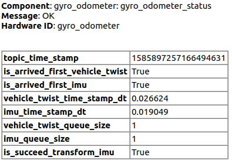

# autoware_gyro_odometer

## 目的

`autoware_gyro_odometer` は IMU と車速を組み合わせ、ねじれを推定するパッケージです。

## 入出力

### 入力
- imu_scaled/imu: IMU データ（角速度、加速度）
- map_odom_tf: Map から Odom への変換行列（オプション）
- odom_tf: Odom から Imu への変換行列（オプション）
- vehicle_speed: 車速（オプション）
- current_pose: 自車位置（オプション）

### 出力
- odom_tf: Odom から Base_footprint への変換行列
- odom: Odom のトランスレートとクォータニオン

| 名称                           | タイプ                                          | 説明                                                           |
| ------------------------------- | ----------------------------------------------- | ----------------------------------------------------------- |
| `vehicle/twist_with_covariance` | `geometry_msgs::msg::TwistWithCovarianceStamped` | Fahrzeugから得られる共分散付きねじり                       |
| `imu`                           | `sensor_msgs::msg::Imu`                         | センサーから得られる IMU                                    |

### 出力

**自動運転ソフトウェアドキュメンテーション**

**Planningコンポーネント**

**目的**

Planningコンポーネントは、自車位置から目的地までの安全で効率的なパスを生成します。

**機能**

- グローバルパス計画
- ローカルパス計画
- 'post resampling'による計画の再生成

**障害物回避**

障害物を検出し、安全な回避パスを生成します。

**モジュール**

- **パスプランナー:** グローバルおよびローカルパスを生成します。
- **障害物検出:** 障害物を検出し、そのタイプと位置を推定します。
- **障害物回避:** 障害物を回避する最適なパスを生成します。

**Autowareとの統合**

Planningコンポーネントは、PerceptionコンポーネントおよびVehicle Controlコンポーネントと緊密に統合されており、より包括的な自動運転システムを構築しています。

| 名前                    | タイプ                                           | 説明                           |
| ----------------------- | ------------------------------------------------ | ------------------------------- |
| `twist_with_covariance` | `geometry_msgs::msg::TwistWithCovarianceStamped` | 共分散付きの推定されたひねり |

## パラメーター

{{ json_to_markdown("localization/autoware_gyro_odometer/schema/gyro_odometer.schema.json") }}

## 想定事項/既知の限界

- [想定] 入力ツイストメッセージのframe_idはbase_linkに設定されている必要があります。

- [想定] 入力メッセージの共分散は適切に割り当てられている必要があります。

- [想定] 縦方向の車速とヨー軸周りの角速度の両方が十分に小さい場合、角速度はゼロに設定されます。これはIMU角速度バイアスの抑制のためです。この処理がなければ、静止時に車両の状態を誤って見積もります。

- [制限] 出力メッセージの頻度は入力IMUメッセージの頻度に依存します。

- [制限] 横方向速度と鉛直速度の信頼できる値を生成できません。したがって、出力共分散行列の対応する要素には大きな値が割り当てられます。

## 診断

| 名称                             | 説明                                                                               | 警告への遷移条件 | エラーへの遷移条件                     |
| -------------------------------- | ----------------------------------------------------------------------------------------- | ------------------------------- | ------------------------------------------------- |
| `topic_time_stamp`               | サービス呼び出しのタイムスタンプ。（ナノ秒）                                        | なし                            | なし                                              |
| `is_arrived_first_vehicle_twist` | ビークル ツイスト トピックが一度でも受信されたかどうか。                            | 未受信                          | なし                                              |
| `is_arrived_first_imu`           | IMU トピックが一度でも受信されたかどうか。                                        | 未受信                          | なし                                              |
| `vehicle_twist_time_stamp_dt`    | 現在時刻と最新のビークル ツイスト トピックとの時間差。（秒） | なし                            | 時間差が `message_timeout_sec` より **長い**       |
| `imu_time_stamp_dt`              | 現在時刻と最新の IMU トピックとの時間差。（秒）                                    | なし                            | 時間差が `message_timeout_sec` より **長い**       |
| `vehicle_twist_queue_size`       | vehicle_twist_queue のサイズ。                                                          | なし                            | なし                                              |
| `imu_queue_size`                 | gyro_queue のサイズ。                                                                   | なし                            | なし                                              |
| `is_succeed_transform_imu`       | IMU 変換が成功したかどうか。                                                      | なし                            | 失敗                                            |

