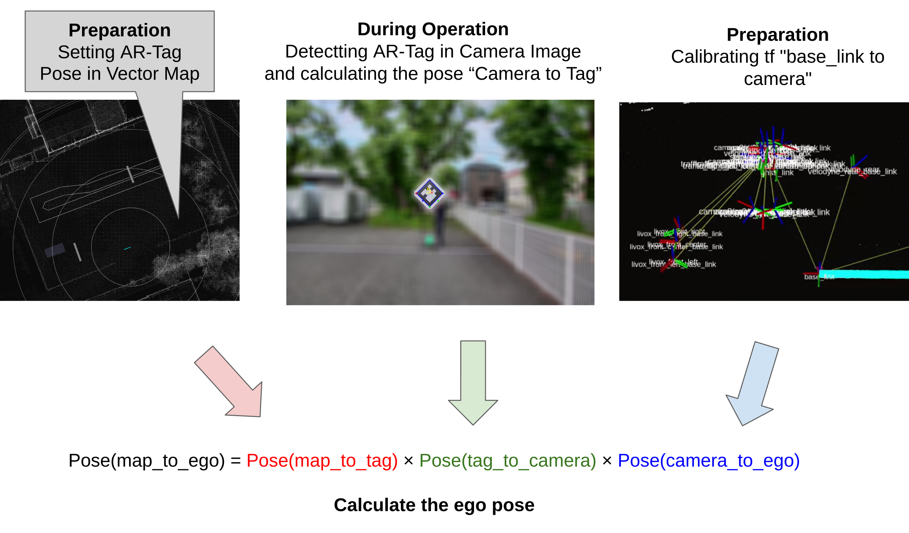
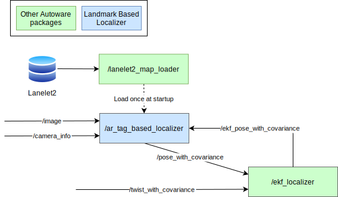
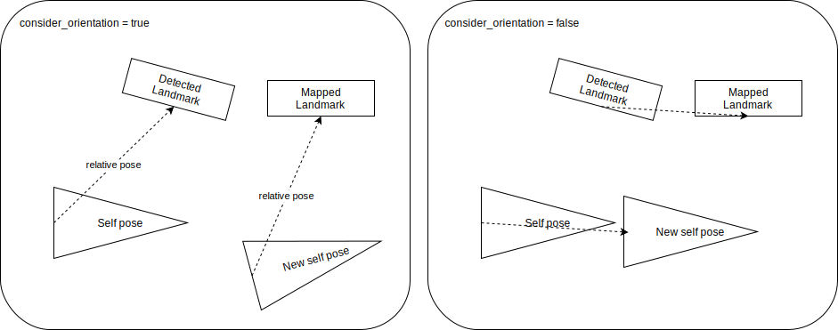

# ランドマークベースのLocalizer

このディレクトリには、ランドマークベースのローカリゼーション用のパッケージが含まれています。

ランドマークとは、以下のようなものです。

- カメラで検出されたARタグ
- LiDARで検出された強度によって特徴付けられたボード

など

これらのランドマークは検出と姿勢推定が容易であるため、ランドマークの姿勢が事前にマップに記載されている場合、検出されたランドマークの姿勢から自車姿勢を計算できます。

現在、ランドマークは平面であると仮定しています。

次の図は、`ar_tag_based_localizer`の場合のローカリゼーションの原理を示しています。

この計算された自車姿勢はEKFに渡され、そこでツイスト情報と融合されて、より正確な自車姿勢を推定するために使用されます。

## ノード図

### `landmark_manager`

マップに記載されたランドマークの定義については、次のセクションの「マップ仕様」を参照してください。

`landmark_manager`は、マップからランドマークをロードするためのユーティリティパッケージです。

- 平行移動: ランドマークの4つの頂点の中心
- 回転: 頂点の番号が次のセクションに示すように、反時計回りに1、2、3、4とします。方向は、1から2へのベクトルと2から3へのベクトルの外積として定義されます。

ユーザーは、ランドマークをLanelet2の4頂点ポリゴンとして定義できます。
この場合、4つの頂点が同じ平面上にないと想定される配置を定義できます。その場合のランドマークの方向は計算が困難です。
したがって、4つの頂点が四面体として形成され、その体積がパラメーター`volume_threshold`を超える場合、ランドマークはtf_staticを公開しません。

### ランドマークベースのLocalizerパッケージ

- ar_tag_based_localizer
- etc.

## マップ仕様

<https://github.com/autowarefoundation/autoware_lanelet2_extension/blob/main/autoware_lanelet2_extension/docs/lanelet2_format_extension.md#localization-landmarks>を参照してください。

## `consider_orientation`について

`LandmarkManager`クラスの`calculate_new_self_pose`関数は、`consider_orientation`という名前のブール値引数を含みます。この引数は、検出されたランドマークとマップされたランドマークに基づいて新しい自車姿勢を計算するために使用されるメソッドを決定します。次の画像は、2つのメソッドの違いを示しています。

### `consider_orientation = true`

このモードでは、新しい自車姿勢は、「現在の自車姿勢から検出されたランドマーク」の相対姿勢が「新しい自車姿勢からマップされたランドマーク」の相対姿勢と同じになるように計算されます。
この方法は向きを補正できますが、ランドマーク検出の向き誤差の影響を強く受けます。

### `consider_orientation = false`

このモードでは、x、y、z の相対位置のみが正しいように、新しい自車位置が計算されます。

この手法では、向きを補正することはできませんが、ランドマーク検出の向き誤差の影響を受けません。

