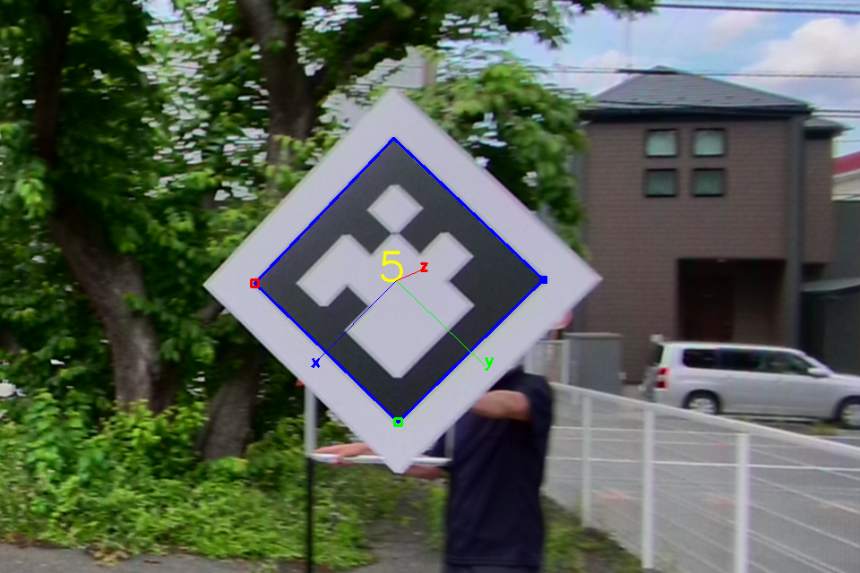
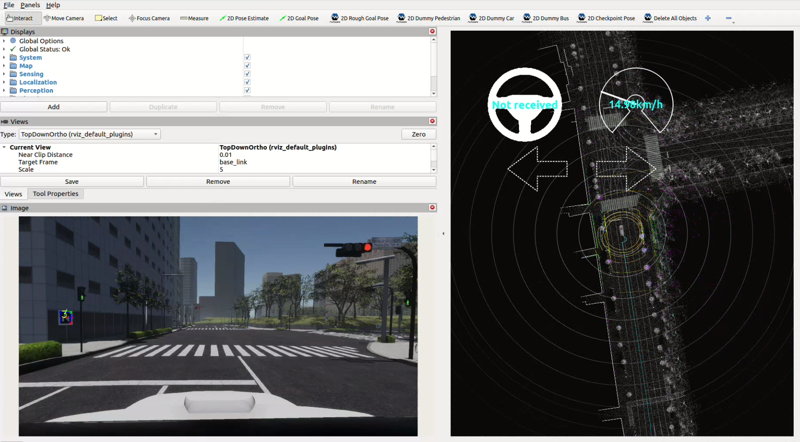
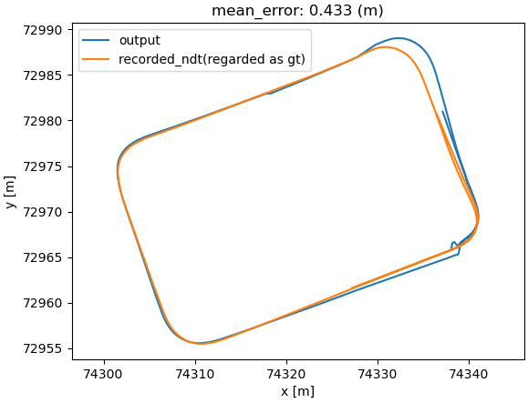

## ARタグベースの局所化器

**ArTagBasedLocalizer** は、画像ベースの局所化ノードです。



このノードは [ArUcoライブラリ](https://index.ros.org/p/aruco/) を使用してカメラ画像からARタグを検出し、これらの検出に基づいて自車位置の推定とパブリッシュを行います。
ARタグの位置と姿勢はLanelet2形式で記述されていることが前提です。

## 入出力

### `ar_tag_based_localizer` ノード

#### 入力

| 名前                   | タイプ                                             | 説明                                                                                                                                                                                                                                                               |
| :--------------------- | :----------------------------------------------- | :------------------------------------------------------------------------------------------------------------------------------------------------------------------------------------------------------------------------------------------------------------------------ |
| `~/input/lanelet2_map` | `autoware_map_msgs::msg::LaneletMapBin`          | lanelet2のデータ                                                                                                                                                                                                                                                          |
| `~/input/image`        | `sensor_msgs::msg::Image`                        | カメラ画像                                                                                                                                                                                                                                                              |
| `~/input/camera_info`  | `sensor_msgs::msg::CameraInfo`                   | カメラ情報                                                                                                                                                                                                                                                               |
| `~/input/ekf_pose`     | `geometry_msgs::msg::PoseWithCovarianceStamped` | IMUによる修正が加えられていないEKFのPose。偽陽性をフィルタリングして検出されたARタグの妥当性を検証するために使用される。EKFのPoseとARタグによって検出されたPoseがある一定の時間的・空間的範囲内にある場合にのみ、ARタグによって検出されたPoseが有効と見なされパブリッシュされる。 |

#### 出力

**日本語訳**

**Autoware 自動運転ソフトウェア ドキュメント**

**Planning モジュール**

**イントロダクション**

Planning モジュールは、自車位置と事前に定義されたレーン情報を基に、安全かつ効率的な経路を生成する責任を負っています。モジュールは、以下の手順で動作します。

1. 自車位置とレーン情報を取得する。
2. 'post resampling'されたレーザー点群データを、周囲環境の障害物の検出に使用します。
3. 障害物情報を考慮し、複数の経路候補を生成します。
4. 経路を評価し、最適な経路を選択します。
5. 選択した経路をControl モジュールに渡します。

**機能**

* **自車位置トラッキング:** GPS、IMU、オドメトリを使用して自車位置を推定します。
* **レーン情報取得:** カメラ画像を使用して、道路上のレーンマーキングを検出し、レーン情報を抽出します。
* **障害物検出:** レーザー点群データを使用して、周囲の障害物を検出します。
* **経路生成:** 自車位置、レーン情報、障害物情報に基づいて、複数の経路候補を生成します。
* **経路評価:** 速度、曲率、安全性を考慮して経路候補を評価します。
* **経路選択:** 評価結果に基づいて、最適な経路を選択します。

**インターフェース**

* **入力:**
    * 自車位置
    * レーン情報
    * `post resampling`レーザー点群データ
* **出力:**
    * 最適な経路

**実装**

Planning モジュールは、ROS Python で実装されています。モジュールは、以下のノードで構成されています。

* **localization:** 自車位置を推定します。
* **lane_detector:** レーン情報を抽出します。
* **obstacle_detector:** 障害物を検出します。
* **path_planner:** 経路を生成します。
* **path_evaluator:** 経路を評価します。
* **path_selector:** 最適な経路を選択します。

| 名称                                | タイプ                                       | 説明                                                                                      |
| ---------------------------------- | ------------------------------------------- | ------------------------------------------------------------------------------------------- |
| `~/output/pose_with_covariance`       | `geometry_msgs::msg::PoseWithCovarianceStamped` | 推定 poses                                                                                   |
| `~/debug/result`                   | `sensor_msgs::msg::Image`                    | [デバッグトピック] マーカー検出の結果が入力画像に重ねた画像                             |
| `~/debug/marker`                   | `visualization_msgs::msg::MarkerArray`       | [デバッグトピック] ランドマークを薄型のボードとして Rviz で視覚化するために読み込まれる |
| `/tf`                                | `geometry_msgs::msg::TransformStamped`       | [デバッグトピック] カメラから検出されたタグへの TF                                       |
| `/diagnostics`                   | `diagnostic_msgs::msg::DiagnosticArray`        | 診断結果                                                                                    |

## パラメータ

{{ json_to_markdown("localization/autoware_landmark_based_localizer/autoware_ar_tag_based_localizer/schema/ar_tag_based_localizer.schema.json") }}

## 起動方法

Autowareを起動するときは、「`pose_source`」に「`artag`」を設定します。


```bash
ros2 launch autoware_launch ... \
    pose_source:=artag \
    ...
```

### Rosbag

#### [サンプル rosbag と地図 (AWSIM データ)](https://drive.google.com/file/d/1ZPsfDvOXFrMxtx7fb1W5sOXdAK1e71hY/view)

このデータは [AWSIM](https://tier4.github.io/AWSIM/) で作成されたシミュレーションデータです。基本的に、AR タグベースの自己位置推定は、このような一般道の走行を目的としたものではなく、狭い範囲での走行を目的としているため、最大走行速度は 15 km/h に設定されています。

各 AR タグが検出され始めるタイミングにより、推定値が大きく変化する可能性があることが知られています。



#### [サンプル rosbag と地図 (実世界データ)](https://drive.google.com/file/d/1VQCQ_qiEZpCMI3-z6SNs__zJ-4HJFQjx/view)

トピック名をリマップして再生してください。


```bash
ros2 bag play /path/to/ar_tag_based_localizer_sample_bag/ -r 0.5 -s sqlite3 \
     --remap /sensing/camera/front/image:=/sensing/camera/traffic_light/image_raw \
             /sensing/camera/front/image/info:=/sensing/camera/traffic_light/camera_info
```

このデータセットには、IMUデータの欠落などの問題が含まれており、全体的な精度は低いです。ARタグベースの自己位置推定を実行しても、真の軌跡との大きな差が認められます。

サンプルが実行およびプロットされたときの軌跡を下の画像に示します。



以下のプルリクエストのビデオも参考になるはずです。

<https://github.com/autowarefoundation/autoware.universe/pull/4347#issuecomment-1663155248>

## 原理


