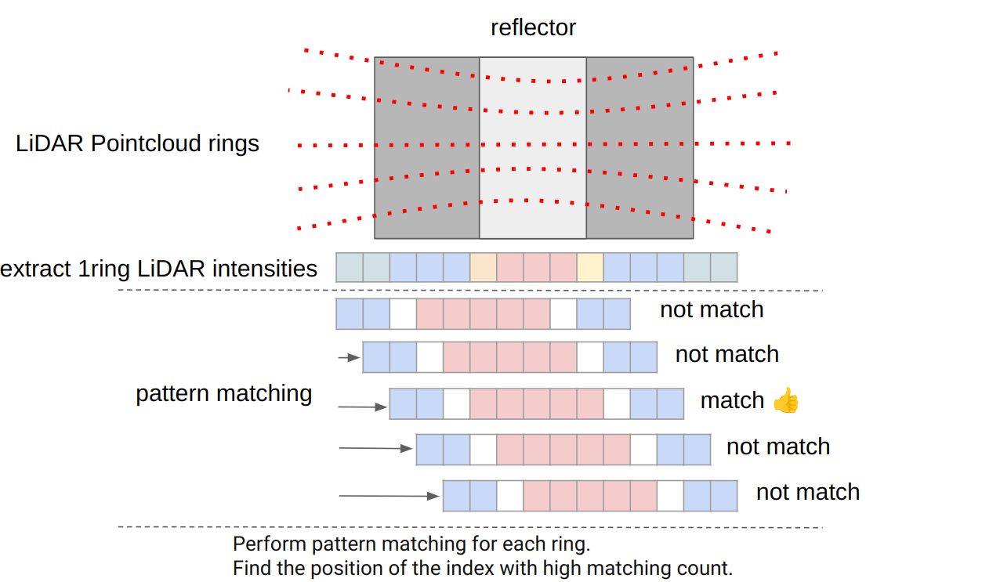

# LiDAR Marker Localizer

**LiDARMarkerLocalizer** はリフレクター検出ベースの局所化ノードです。

## 入出力

### `lidar_marker_localizer` ノード

#### 入力

| 名前 | タイプ | 説明 |
|---|---|---|
| ~/input/lanelet2_map | autoware_map_msgs::msg::HADMapBin | lanelet2データ |
| ~/input/pointcloud | sensor_msgs::msg::PointCloud2 | 点群 |
| ~/input/ekf_pose | geometry_msgs::msg::PoseWithCovarianceStamped | EKFによる自車位置 |

## 自動運転ソフトウェアドキュメント

このドキュメントは、Autoware自動運転ソフトウェアの仕様と設計を説明します。

### Planningモジュール

Planningモジュールは、環境を検出し、障害物を回避し、安全で効率的な経路を生成します。

### Motion Planning

モーションプランニングは、障害物を回避しながら目的地までの経路を生成するプロセスです。Autowareでは、以下のアルゴリズムを使用しています。

- DWA：動的窓アプローチ
- RRT：急速探索ランダム木

### Path Planning

パスプランニングは、モーションプランを滑らかな経路に変換するプロセスです。Autowareでは、以下のアルゴリズムを使用しています。

- スプライン補完
- 'post resampling'

### Localization

ローカリゼーションモジュールは、自車位置と向きを推定します。以下を使用します。

- GPS
- IMU
- オドメトリ

### Perception

パーセプションモジュールは、カメラ、LiDAR、レーダーなどのセンサーから環境情報を取得します。Autowareでは、以下のアルゴリズムを使用しています。

- 物体検出
- レーン検出
- セマンティックセグメンテーション

### Control

コントロールモジュールは、計画された経路に従って車両を制御します。以下を使用します。

- ステアリング制御
- アクセル/ブレーキ制御
- スタビリティ制御

### System Architecture

Autowareシステムは、以下のようなモジュールで構成されています。

- Perception
- Localization
- Planning
- Control
- Vehicle Interface

### Conclusion

Autowareは、堅牢で用途の広い自動運転ソフトウェアスタックです。障害物の回避、安全で効率的な経路生成、および車両制御を提供します。

| Name                            | Type                                            | Description                                                        |
| :------------------------------ | :---------------------------------------------- | :----------------------------------------------------------------- |
| `~/output/pose_with_covariance` | `geometry_msgs::msg::PoseWithCovarianceStamped` | 自車位置                                                      |
| `~/debug/pose_with_covariance`  | `geometry_msgs::msg::PoseWithCovarianceStamped` | [デバッグトピック] 自車位置                                       |
| `~/debug/marker_detected`       | `geometry_msgs::msg::PoseArray`                 | [デバッグトピック] 検出されたマーカーの姿勢                       |
| `~/debug/marker_mapped`         | `visualization_msgs::msg::MarkerArray`          | [デバッグトピック] Rvizに薄いボードとして可視化するための読み込まれたランドマーク |
| `~/debug/marker_pointcloud`     | `sensor_msgs::msg::PointCloud2`                 | [デバッグトピック] 検出されたマーカーの点群                       |
| `/diagnostics`                  | `diagnostic_msgs::msg::DiagnosticArray`         | 診断出力                                                        |

## パラメータ

{{ json_to_markdown("localization/autoware_landmark_based_localizer/autoware_lidar_marker_localizer/schema/lidar_marker_localizer.schema.json") }}

## 起動方法

Autowareを起動するとき、`pose_source`に`lidar-marker`を設定してください。


```bash
ros2 launch autoware_launch ... \
    pose_source:=lidar-marker \
    ...
```

## 設計

### フローチャート


## 検出アルゴリズム



1. `resolution`サイズの`x`軸の`base_link`座標系に沿って、LiDARポイントクラウドをリングに分割します。
2. `intensity_pattern`に一致する強度の一部を見つけます。
3. 各リングで1と2の手順を実行し、一致するインデックスを集め、カウントが`vote_threshold_for_detect_marker`を超える部分をマーカーとして検出します。

## サンプルデータセット

- [サンプルrosbag と map](https://drive.google.com/file/d/1FuGKbkWrvL_iKmtb45PO9SZl1vAaJFVG/view?usp=sharing)

このデータセットは、国立土木研究所の実物大トンネル実験施設で取得されました。
反射器は[大成建設](https://www.taisei.co.jp/english/)によって設置されました。

## 協力者

- [TIER IV](https://tier4.jp/en/)
- [大成建設](https://www.taisei.co.jp/english/)
- [清水 優里](https://github.com/YuriShimizu824)

