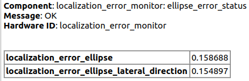

## autoware_localization_error_monitor

## 目的

autoware_localization_error_monitor は、ローカリゼーション結果の不確かさを監視することで、ローカリゼーションエラーを診断するためのパッケージです。
このパッケージは、次の 2 つの値を監視します。

- 信頼領域の長い半径の大きさ
- 横方向 (ボディーフレーム) に沿った信頼領域の大きさ

## 入出力

### 入力

| 名前         | 種別                      | 説明         |
| ------------ | ------------------------- | ------------------- |
| `input/odom` | `nav_msgs::msg::Odometry` | ローカリゼーション結果 |

### 出力

**自動運転ソフトウェア**

[URL]

**目的**

このドキュメントは、自動運転ソフトウェアアーキテクチャの要件と設計を定義します。

**内容**

- システム全体設計
- Planningコンポーネント
- Perceptionコンポーネント
- Vehicle Controlコンポーネント
- Safetyコンポーネント
- システム検証とテスト

**システム全体設計**

システム全体設計は、[図1](#図1)で示すように、以下で構成されます。

- Planningコンポーネント: 現在の経路を計画し、自車位置に基づいて決定を行います。
- Perceptionコンポーネント: センサー情報を処理し、周囲環境の理解を提供します。
- Vehicle Controlコンポーネント: 実際の車両制御を実行します。
- Safetyコンポーネント: システムの安全性と健全性を確保します。

**Planningコンポーネント**

Planningコンポーネントは、以下のサブコンポーネントで構成されます。

- Trajectory Planner: 現在の経路を計算します。
- Behavior Planner: 予想される障害物や交通状況に基づいて決定を行います。
- Path Planner: 制約のある環境での移動用の経路を計算します。

**Perceptionコンポーネント**

Perceptionコンポーネントは、以下のサブコンポーネントで構成されます。

- Sensor Preprocessing: センサーデータのフィルタリングと`post resampling`を行います。
- Object Detection: 物体を識別して追跡します。
- Scene Understanding: 周囲環境の状況を把握します。

**Vehicle Controlコンポーネント**

Vehicle Controlコンポーネントは、以下のサブコンポーネントで構成されます。

- Motion Planner: 車両の運動に関する計画を行います。
- Vehicle Controller: 車両のステアリング、アクセル、ブレーキを制御します。
- Vehicle Dynamics Model: 車両のダイナミクスをモデル化します。

**Safetyコンポーネント**

Safetyコンポーネントは、以下のサブコンポーネントで構成されます。

- Safety Monitoring: システムの状態を監視し、危険な状態を検出します。
- Safety Intervention: 危険な状態が検出されると、車両を停止または制御します。
- Redundancy Management: システムの重要な機能の冗長性を管理します。

**システム検証とテスト**

システム検証とテストには、以下の活動が含まれます。

- ユニットテスト
- 統合テスト
- シミュレーションテスト
- 車両テスト

**付録**

- 用語集
- 略語リスト

**謝辞**

このドキュメントの作成に貢献してくれた次の個人に感謝します。

- [名前1]
- [名前2]

**著作権**

このドキュメントは、Autoware Foundationの著作物です。無断転載・複製を禁じます。

| 名                   | 型                                     | 説明         |
| ---------------------- | --------------------------------------- | ------------------- |
| `debug/ellipse_marker` | `visualization_msgs::msg::Marker`       | ellipseマーカー      |
| `diagnostics`          | `diagnostic_msgs::msg::DiagnosticArray` | 診断出力 |

## パラメータ

{{ json_to_markdown("localization/autoware_localization_error_monitor/schema/localization_error_monitor.schema.json") }}
