# autoware_ndt_scan_matcher

## 目的

autoware_ndt_scan_matcherはNDTスキャンマッチング手法を使用した位置推定用のパッケージです。

このパッケージには主に2つの機能があります。

- スキャンマッチングによる位置推定
- モンテカルロ法を使用したROSサービスによる初期位置推定

オプションの機能として正則化があります。詳細は後述の正則化の章を参照してください。デフォルトでは無効になっています。

## 入出力

### 入力

| 名                               | 型                                              | 説明                                  |
| ----------------------------------- | ------------------------------------------------ | --------------------------------------- |
| `ekf_pose_with_covariance`          | `geometry_msgs::msg::PoseWithCovarianceStamped` | 初期位置                                |
| `points_raw`                        | `sensor_msgs::msg::PointCloud2`                  | センサ点群                                |
| `sensing/gnss/pose_with_covariance` | `sensor_msgs::msg::PoseWithCovarianceStamped`    | 正則化項の基本位置                        |

`sensing/gnss/pose_with_covariance` は、正則化が有効になっている場合にのみ必要です。

### 出力

| Name                              | Type                                            | Description                                                                                                                              |
| --------------------------------- | ----------------------------------------------- | ---------------------------------------------------------------------------------------------------------------------------------------- |
| `ndt_pose`                        | `geometry_msgs::msg::PoseStamped`               | 推定された姿勢                                                                                                                           |
| `ndt_pose_with_covariance`        | `geometry_msgs::msg::PoseWithCovarianceStamped` | 推定された姿勢（共分散付き）                                                                                                           |
| `/diagnostics`                    | `diagnostic_msgs::msg::DiagnosticArray`         | 診断                                                                                                                              |
| `points_aligned`                  | `sensor_msgs::msg::PointCloud2`                 | [デバッグトピック] スキャンマッチングで整列した点群                                                                                        |
| `points_aligned_no_ground`        | `sensor_msgs::msg::PointCloud2`                 | [デバッグトピック] スキャンマッチングで整列した地面以外の点群                                                                              |
| `initial_pose_with_covariance`    | `geometry_msgs::msg::PoseWithCovarianceStamped` | [デバッグトピック] スキャンマッチングで使用される初期姿勢                                                                                         |
| `multi_ndt_pose`                  | `geometry_msgs::msg::PoseArray`                 | [デバッグトピック] リアルタイム共分散推定における複数の初期姿勢からの推定姿勢                                             |
| `multi_initial_pose`              | `geometry_msgs::msg::PoseArray`                 | [デバッグトピック] リアルタイム共分散推定のための初期姿勢                                                                          |
| `exe_time_ms`                     | `tier4_debug_msgs::msg::Float32Stamped`         | [デバッグトピック] スキャンマッチングの実行時間 [ms]                                                                                      |
| `transform_probability`           | `tier4_debug_msgs::msg::Float32Stamped`         | [デバッグトピック] スキャンマッチングのスコア                                                                                                     |
| `no_ground_transform_probability` | `tier4_debug_msgs::msg::Float32Stamped`         | [デバッグトピック] 地面以外のLiDARスキャンのスキャンマッチングのスコア                                                                       |
| `iteration_num`                   | `tier4_debug_msgs::msg::Int32Stamped`           | [デバッグトピック] スキャンマッチングの反復回数                                                                                         |
| `initial_to_result_relative_pose` | `geometry_msgs::msg::PoseStamped`               | [デバッグトピック] 初期点と収束点間の相対姿勢                                                                                         |
| `initial_to_result_distance`      | `tier4_debug_msgs::msg::Float32Stamped`         | [デバッグトピック] 初期点と収束点間の距離差 [m]                                                                               |
| `initial_to_result_distance_old`  | `tier4_debug_msgs::msg::Float32Stamped`         | [デバッグトピック] 線形補間で使用される2つの初期点のうち古い方の点と収束点間の距離差 [m]                                                |
| `initial_to_result_distance_new`  | `tier4_debug_msgs::msg::Float32Stamped`         | [デバッグトピック] 線形補間で使用される2つの初期点のうち新しい方の点と収束点間の距離差 [m]                                                |
| `ndt_marker`                      | `visualization_msgs::msg::MarkerArray`          | [デバッグトピック] デバッグマーカー                                                                                                      |
| `monte_carlo_initial_pose_marker` | `visualization_msgs::msg::MarkerArray`          | [デバッグトピック] 初期位置推定に使用される粒子の`post resampling`                                                                              |

### サービス

| 名称            | 種別                                                         | 説明                      |
| --------------- | ------------------------------------------------------------ | -------------------------------- |
| `ndt_align_srv` | `autoware_localization_srvs::srv::PoseWithCovarianceStamped` | 初期姿勢の推定サービス |

## パラメータ

### コアパラメータ

#### フレーム

{{ json_to_markdown("localization/autoware_ndt_scan_matcher/schema/sub/frame.json") }}

#### センサーポイント

{{ json_to_markdown("localization/autoware_ndt_scan_matcher/schema/sub/sensor_points.json") }}

#### Ndt

{{ json_to_markdown("localization/autoware_ndt_scan_matcher/schema/sub/ndt.json") }}

#### 初期姿勢推定

{{ json_to_markdown("localization/autoware_ndt_scan_matcher/schema/sub/initial_pose_estimation.json") }}

#### 検証

{{ json_to_markdown("localization/autoware_ndt_scan_matcher/schema/sub/validation.json") }}

#### スコア推定

{{ json_to_markdown("localization/autoware_ndt_scan_matcher/schema/sub/score_estimation.json") }}

#### 共分散

{{ json_to_markdown("localization/autoware_ndt_scan_matcher/schema/sub/covariance.json") }}

## 正規化

### 概要

これは、正則化項をNDT最適化問題に追加する関数です。

$$
\begin{align}
    \min_{\mathbf{R},\mathbf{t}}
    \mathrm{NDT}(\mathbf{R},\mathbf{t})
    +\mathrm{scale\ factor}\cdot \left|
        \mathbf{R}^\top
        (\mathbf{t_{base}-\mathbf{t}})
        \cdot
        \begin{pmatrix}
            1\\
            0\\
            0
        \end{pmatrix}
        \right|^2
\end{align}
$$

ここで、t_base は GNSS またはその他の手段で測定された基準位置です。
NDT(R, t) は純粋な NDT コスト関数を表します。
正規化項は、最適解を車両の縦方向の基準位置にシフトします。
基準位置に対する**縦方向**の誤差のみが考慮され、Z 軸および横軸の誤差は考慮されません。

**正規化の仕組み**

正規化項は回転をパラメータとして持ちますが、これに関連する勾配とヘッセン行列は最適化の安定化のために計算されません。
具体的には、勾配は以下の通りに計算されます。

$$
\begin{align}
    &g_x=\nabla_x \mathrm{NDT}(\mathbf{R},\mathbf{t}) + 2 \mathrm{scale\ factor} \cos\theta_z\cdot e_{\mathrm{longitudinal}}
    \\
    &g_y=\nabla_y \mathrm{NDT}(\mathbf{R},\mathbf{t}) + 2 \mathrm{scale\ factor} \sin\theta_z\cdot e_{\mathrm{longitudinal}}
    \\
    &g_z=\nabla_z \mathrm{NDT}(\mathbf{R},\mathbf{t})
    \\
    &g_\mathbf{R}=\nabla_\mathbf{R} \mathrm{NDT}(\mathbf{R},\mathbf{t})
\end{align}
$$

**正規化のデフォルト設定**

正規化はデフォルトでは無効になっています。
正規化を使用する場合は、以下のパラメータを編集して有効にしてください。

#### 正規化の有効範囲

この機能は以下のようなGNSSが利用可能な特徴のない道路に効果的です。

- ブリッジ
- 高速道路
- 農道

以下の説明のように、ベース位置トピックをGNSS以外のものに変更することで、これらの範囲外でも有効にすることができます。

#### 他のベース位置の使用

GNSS以外にも、周囲環境で利用可能な磁気マーカーやビジュアルマーカーなどから得られる他のグローバルな位置トピックを指定できます。
（現在、Autowareではこのようなポーズを提供するノードは提供していません。）
正規化にトピックを使用するには、`ndt_scan_matcher.launch.xml`で`input_regularization_pose_topic`をトピックにリマップする必要があります。
デフォルトでは、`/sensing/gnss/pose_with_covariance`にリマップされています。

#### 制限事項

この機能は、最近受信したポーズから線形補間によってベース位置を決定するため、走行速度に対して低い周波数で公開されるトピックは使用できません。
不適切な線形補間は、最適化結果の悪化につながる可能性があります。

ベース位置にGNSSを使用する場合、正規化はトンネル、屋内、高層ビルの近くで悪影響を与える可能性があります。
これは、ベース位置が真の値から大きく離れている場合、NDTスキャンマッチングが不適切な最適位置に収束する可能性があるためです。

### パラメータ

{{ json_to_markdown("localization/autoware_ndt_scan_matcher/schema/sub/ndt_regularization.json") }}

正規化は、GNSSがどのシーンでも適切なベース位置を提供するのに十分に正確ではない場合があるため、デフォルトでは無効になっています。

`scale_factor`が大きすぎると、NDTはベース位置に引き寄せられ、スキャンマッチングが失敗する可能性があります。
逆に小さすぎる場合、正規化の利点は失われます。

`scale_factor`を0に設定すると、正規化が無効になることに注意してください。

### 例

次の図は、テストされたマップを示しています。

- 右側のマップは，NDT がうまく局所化できないほど特徴が少ないです。

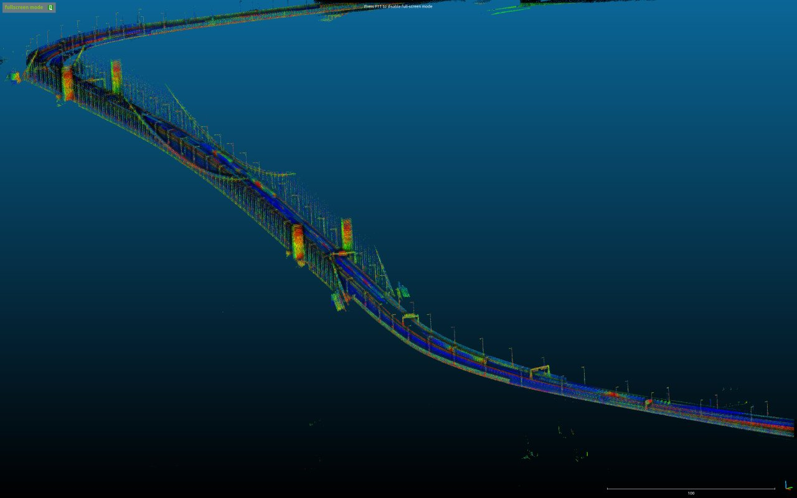 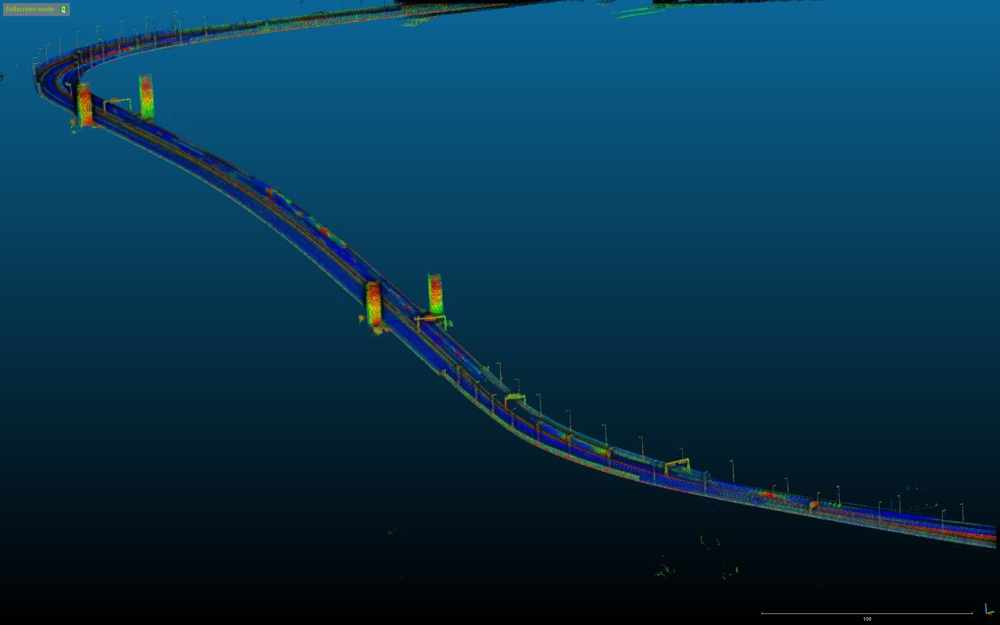

以下の図は、特徴の少ないマップにおいて推定された軌道で、それぞれ標準 NDT と正則化対応 NDT を示しています。
軌道の色は、特徴の多いマップで算出された基準軌道からの誤差（メートル）を示しています。

- 左側の図は、純粋な NDT は橋で縦方向の誤差を引き起こし、回復できないことを示します。
- 右側の図は、正則化が縦方向の誤差を抑制することを示します。

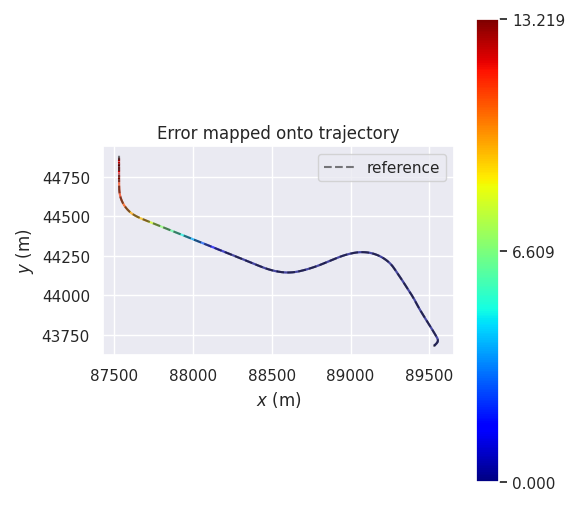 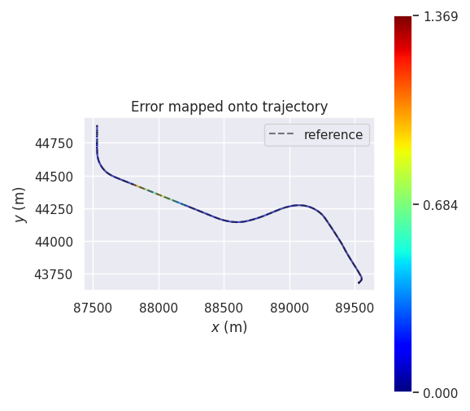

## 動的マップ読み込み

Autoware は `ndt_scan_matcher` の動的マップ読み込み機能をサポートします。この機能を使用すると、NDT は周辺の点群マップを `pointcloud_map_loader` に動的に要求し、マップを受信してオンラインで前処理します。

この機能を使用することで、`ndt_scan_matcher` は理論的にはメモリ使用の観点から、任意の大きなサイズのマップを処理できます。（他の要因によって制限が生じる可能性があることに注意してください。例：浮動小数点誤差）

### 追加のインターフェース

#### 追加の出力

| 名前                          | 種類                            | 説明                                       |
| ----------------------------- | ------------------------------- | ------------------------------------------------- |
| `debug/loaded_pointcloud_map` | `sensor_msgs::msg::PointCloud2` | ローカリゼーションに使用されるポイントクラウドマップ（デバッグ用） |

#### 追加クライアント

| 名称                | タイプ                                                 | 説明        |
| ------------------- | ------------------------------------------------------ | ------------------ |
| `client_map_loader` | `autoware_map_msgs::srv::GetDifferentialPointCloudMap` | マップロードククライアント |

### パラメータ

{{ json_to_markdown("localization/autoware_ndt_scan_matcher/schema/sub/dynamic_map_loading.json", "ja") }}

### ダイナミックマップロードの注意事項

`ndt_scan_matcher`のダイナミックマップロード機能を使用するには、PCDファイルをグリッドに分割する必要があります（推奨サイズ：20[m] x 20[m]）。

マップが2つ以上の大きなサイズ（例：1000[m] x 1000[m]）に分割された場合、ダイナミックマップロードがFAILする場合があります。以下のいずれかを提供してください。

- 1つのPCDマップファイル
- 小さいサイズ（~20[m]）に分割された複数のPCDマップファイル

以下はAutowareチュートリアルからの`sample-map-rosbag`の分割されたPCDマップです：[`sample-map-rosbag_split.zip`](https://github.com/autowarefoundation/autoware.universe/files/10349104/sample-map-rosbag_split.zip)

| PCDファイル | NDTがマップを読み込む方法 |
| :------------: | :------------------: |
| 単一ファイル | 一度に（標準） |
| 複数のファイル | 動的に |

## 地面LiDARスキャンなしでのスキャンマッチングスコア

### 概要

この関数は、地面LiDARスキャンなしでスキャンマッチングスコアを推定します。このスコアは、現在の局在化パフォーマンスをより正確に反映できます。
[関連する問題](https://github.com/autowarefoundation/autoware.universe/issues/2044)。

### パラメータ

{{ json_to_markdown("localization/autoware_ndt_scan_matcher/schema/sub/score_estimation_no_ground_points.json") }}

## 2Dリアルタイム共分散推定

### 概要

当初、NDTスキャンマッチングの共分散は固定値（`FIXED_VALUE`モード）でした。
そのため、リアルタイムで2D共分散（`xx`、`xy`、`yx`、`yy`）を推定するために3つのモードが用意されています。`LAPLACE_APPROXIMATION`、`MULTI_NDT`、および`MULTI_NDT_SCORE`です。
`LAPLACE_APPROXIMATION`は、NDTスキャンマッチングによって得られるヘシアン行列の `XY`（2x2）部分の逆行列を計算し、共分散行列として使用します。
一方、`MULTI_NDT`と`MULTI_NDT_SCORE`は複数の初期姿勢からのNDT収束を使用して2D共分散を取得します。
理想的には、複数の初期姿勢の配置はNDTスコア関数のヘシアン行列によって効率的に制限されます。
この実装では、コードを単純化するために初期位置の数が固定されています。
共分散を取得するために、`MULTI_NDT`は各初期位置で収束するまで計算しますが、`MULTI_NDT_SCORE`は最近接ボクセルの変換尤度を使用します。
共分散は、rviz2で`ndt_pose_with_covariance`を設定したエラー楕円として表示できます。
[オリジナルペーパー](https://www.fujipress.jp/jrm/rb/robot003500020435/)。

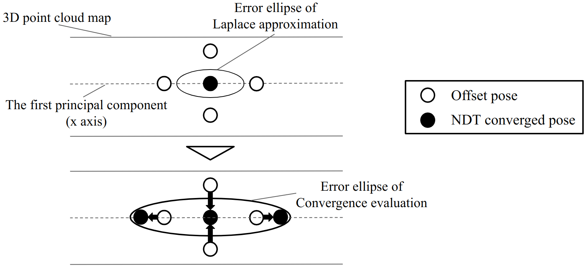

この機能は、計算リソースを大量に消費すると、健全なシステム動作を損なう可能性があることに注意してください。

### パラメータ

リアルタイムで2D共分散を計算するには3つのタイプがあります。`covariance_estimation_type`を変更してメソッドを選択できます。
`initial_pose_offset_model`は、ヘシアン行列の最初の主成分の方向に（`x`、`y`）=（0、0）を中心に回転します。
`initial_pose_offset_model_x`と`initial_pose_offset_model_y`は同じ数の要素を持つ必要があります。
`MULTI_NDT_SCORE`モードでは、出力2D共分散のスケールは温度に応じて調整できます。

{{ json_to_markdown("localization/autoware_ndt_scan_matcher/schema/sub/covariance_covariance_estimation.json") }}

## 診断

### スキャンマッチングステータス

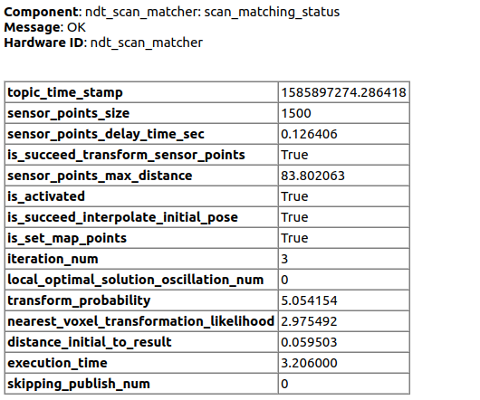

| Name                                             | Description                                                                            | Transition condition to Warning                                                                                                                                                                                                                                                                                                                                          | Transition condition to Error | Whether to reject the estimation result (affects `skipping_publish_num`)                            |
| ------------------------------------------------ | -------------------------------------------------------------------------------------- | ------------------------------------------------------------------------------------------------------------------------------------------------------------------------------------------------------------------------------------------------------------------------------------------------------------------------------------------------------------------------ | ----------------------------- | --------------------------------------------------------------------------------------------------- |
| `topic_time_stamp`                               | 入力トピックのタイムスタンプ                                                        | なし                                                                                                                                                                                                                                                                                                                                                                     | なし                          | いいえ                                                                                                |
| `sensor_points_size`                             | センサーポイントのサイズ                                                            | サイズが `sensor_points.timeout_sec` より **長い**                                                                                                                                                                                                                                                                                                                                                            | なし                          | はい                                                                                                 |
| `sensor_points_delay_time_sec`                   | センサーポイントの遅延時間                                                        | 時間が `sensor_points.required_distance` **より短い**                                                                                                                                                                                                                                                                                                                  | なし                          | はい                                                                                                 |
| `is_succeed_transform_sensor_points`             | センサーポイントの変換が成功したかどうか                                          | なし                                                                                                                                                                                                                                                                                                                                                                     | 成功しない場合                        | はい                                                                                                 |
| `sensor_points_max_distance`                     | センサーポイントの最大距離                                                          | 最大距離が `sensor_points.required_distance` **より短い**                                                                                                                                                                                                                                                                                                   | なし                          | はい                                                                                                 |
| `is_activated`                                   | ノードがアクティブ状態になっているかどうか                                          | アクティブ状態ではない                                                                                                                                                                                                                                                                                                                                                     | なし                          | `is_activated` が false の場合、推定は実行されず、`skipping_publish_num` が 0 に設定されます。 |
| `is_succeed_interpolate_initial_pose`            | 初期ポーズの補完が成功したかどうか                                                | 失敗。   (1) `initial_pose_buffer_` のサイズが **2 より小さい**。   (2) initial_pose とセンサーポイントクラウドのタイムスタンプ差が `validation.initial_pose_timeout_sec` **より長い**。   (3) 線形補完に使用される 2 つの初期ポーズ間の距離差が `validation.initial_pose_distance_tolerance_m` **より長い** | なし                          | はい                                                                                                 |
| `is_set_map_points`                              | マップポイントが設定されているかどうか                                            | 設定されていない                                                                                                                                                                                                                                                                                                                                                                  | なし                          | はい                                                                                                 |
| `iteration_num`                                  | アライメントを計算する回数                                                        | 回数が `ndt.max_iterations` **より大きい**                                                                                                                                                                                                                                                                                                              | なし                          | はい                                                                                                 |
| `local_optimal_solution_oscillation_num`         | 解が振動していると判断される回数                                                  | 回数が **10 より大きい**                                                                                                                                                                                                                                                                                                                                | なし                          | はい                                                                                                 |
| `transform_probability`                          | マップがセンサーポイントとどれだけうまくアラインするかを示すスコア                  | スコアが `score_estimation.converged_param_transform_probability` **より小さい**（`score_estimation.converged_param_type` が 0=TRANSFORM_PROBABILITY の場合のみ）                                                                                                                                                                                           | なし                          | はい                                                                                                 |
| `transform_probability_diff`                     | 現在の ndt 最適化のための tp スコア差                                                | なし                                                                                                                                                                                                                                                                                                                                                                     | なし                          | いいえ                                                                                                |
| `transform_probability_before`                   | 現在の ndt 最適化前の tp スコア                                                      | なし                                                                                                                                                                                                                                                                                                                                                                     | なし                          | いいえ                                                                                                |
| `nearest_voxel_transformation_likelihood`        | マップがセンサーポイントとどれだけうまくアラインするかを示すスコア                  | スコアが `score_estimation.converged_param_nearest_voxel_transformation_likelihood` **より小さい**（`score_estimation.converged_param_type` が 1=NEAREST_VOXEL_TRANSFORMATION_LIKELIHOOD の場合のみ）                                                                                                                                                      | なし                          | はい                                                                                                 |
| `nearest_voxel_transformation_likelihood_diff`   | 現在の ndt 最適化のための nvtl スコア差                                             | なし                                                                                                                                                                                                                                                                                                                                                                     | なし                          | いいえ                                                                                                |
| `nearest_voxel_transformation_likelihood_before` | 現在の ndt 最適化前の nvtl スコア                                                 | なし                                                                                                                                                                                                                                                                                                                                                                     | なし                          | いいえ                                                                                                |
| `distance_initial_to_result`                     | 収束処理前の位置と後の位置の距離                                                 | 距離が `validation.initial_to_result_distance_tolerance_m` **より大きい**                                                                                                                                                                                                                                                                                      | なし                          | いいえ                                                                                                |
| `execution_time`                                 | 収束処理の時間                                                                  | 時間が `validation.critical_upper_bound_exe_time_ms` **より長い**                                                                                                                                                                                                                                                                                                | なし                          | いいえ                                                                                                |
| `skipping_publish_num`                           | 推定結果が連続して棄却された回数                                                  | 回数が `validation.skipping_publish_num` 以上                                                                                                                                                                                                                                                                                                         | なし                          | -                                                                                                   |

※ `sensor_points_callback`は、`trigger_node_service`と`ndt_align_service`と同じコールバックグループを共有しています。そのため、初期姿勢推定に時間がかかりすぎると、この診断が古くなる可能性があります。

### initial_pose_subscriber_status

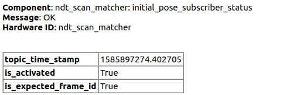

| 名称                   | 説明                                                                | 警告への遷移条件 | エラーへの遷移条件 |
| ---------------------- | ---------------------------------------------------------------------- | ------------------------ | ---------------------- |
| `topic_time_stamp`     | 入力トピックのタイムスタンプ                                              | なし                       | なし                     |
| `is_activated`         | ノードが「アクティブ化」状態にあるかどうかの情報                         | 「アクティブ化」状態ではない | なし                     |
| `is_expected_frame_id` | 入力frame_idが`frame.map_frame`と同じであるかどうかの情報            | なし                       | 同じでない              |

### regularization_pose_subscriber_status

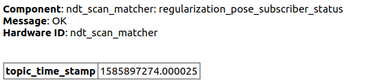

| 名前 | 説明 | 警告への遷移条件 | エラーへの遷移条件 |
|---|---|---|---|
| `topic_time_stamp` | 入力トピックのタイムスタンプ | なし | なし |

### trigger_node_service_status

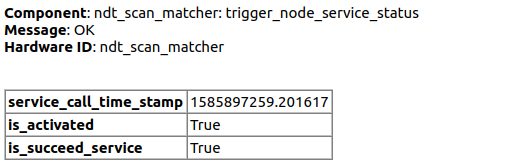

| 名前                    | 説明                                        | 警告への遷移条件 | エラーへの遷移条件 |
| ------------------------- | -------------------------------------------------- | ------------------------------- | ----------------------------- |
| `service_call_time_stamp` | サービス呼び出しのタイムスタンプ                  | なし                            | なし                          |
| `is_activated`            | ノードが "activate" 状態であるかどうか        | なし                            | なし                          |
| `is_succeed_service`      | サービスのプロセスの成功/失敗                | なし                            | なし                          |

※
この診断はサービスが呼び出された場合にのみ発行されるため、初期の自己位置推定が完了した後は最新ではなくなります。

### ndt_align_service_status

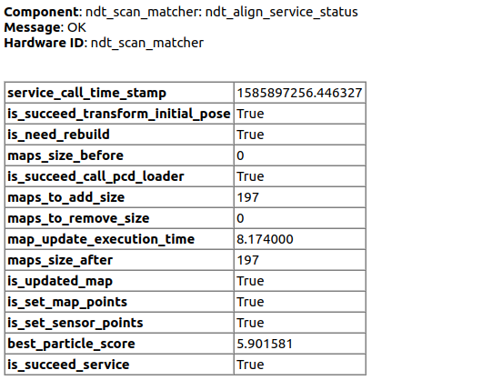

| 名称                              | 説明                                                                                                                                                                                                                                                                                                                                     | 警告への移行条件 | エラーへの移行条件                                                                                                                                                                                                                                                                                                                                   |
| --------------------------------- | -------------------------------------------------------------------------------------------------------------------------------------------------------------------------------------------------------------------------------------------------------------------------------------------------------------------------------------------------------------------------------------------------------- | ------------------- | ------------------------------------------------------------------------------------------------------------------------------------------------------------------------------------------------------------------------------------------------------------------------------------------------------------------------------------------------------------------------------------------------------------------------------------------ |
| `service_call_time_stamp`         | サービス呼び出しのタイムスタンプ                                                                                                                                                                                                                                                                                                                                                                                                                                               | なし | なし |
| `is_succeed_transform_initial_pose` | 初期ポーズの変換が成功したか否か                                                                                                                                                                                                                                                                                                                                                                                                                                                    | なし | なし |
| `is_need_rebuild`                 | マップの再構築が必要かどうか。マップがまだロードされていない場合、または`distance_last_update_position_to_current_position encounters`がエラー状態の場合、マップの再構築が必要と見なされ、`is_need_rebuild`は`True`になります | なし | なし |
| `maps_size_before`                 | マップ更新前のマップの数                                                                                                                                                                                                                                                                                                                                                                                                                                                             | なし | なし |
| `is_succeed_call_pcd_loader`       | pcd_loaderサービスの呼び出しが成功したか否か                                                                                                                                                                                                                                                                                                                                                                                                                                                 | 失敗 | なし |
| `maps_to_add_size`                 | 追加するマップの数                                                                                                                                                                                                                                                                                                                                                                                                                                                                | なし | なし |
| `maps_to_remove_size`              | 削除するマップの数                                                                                                                                                                                                                                                                                                                                                                                                                                                                | なし | なし |
| `map_update_execution_time`        | マップ更新時間                                                                                                                                                                                                                                                                                                                                                                                                                                                                   | なし | なし |
| `maps_size_after`                  | マップ更新後のマップの数                                                                                                                                                                                                                                                                                                                                                                                                                                                             | なし | なし |
| `is_updated_map`                    | マップが更新されたかどうか。マップの更新を実行できなかった場合、またはマップの更新の必要がなかった場合、`False`になります | なし | `is_updated_map`は`False`だが`is_need_rebuild`は`True` |
| `is_set_map_points`                | マップポイントが設定されているかどうか                                                                                                                                                                                                                                                                                                                                                                                                                                                   | 設定されていない | なし |
| `is_set_sensor_points`             | センサーポイントが設定されているかどうか                                                                                                                                                                                                                                                                                                                                                                                                                                                 | 設定されていない | なし |
| `best_particle_score`              | 粒子の最高スコア                                                                                                                                                                                                                                                                                                                                                                                                                                                     | なし | なし |
| `is_succeed_service`               | サービスのプロセスの成功可否                                                                                                                                                                                                                                                                                                                                                                                                                                                     | 失敗 | なし |

※
この診断情報はサービスが呼び出されたときにのみ公開されるため、最初の自車位置推定が完了した後には非アクティブになります。

### map_update_status

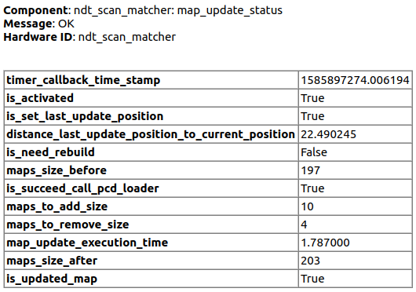

| 名前                                              | 説明                                                                                                                                                                                                         | ワーニングへの遷移条件 | エラーへの遷移条件                                                                        |
| ------------------------------------------------- | ----------------------------------------------------------------------------------------------------------------------------------------------------------------------------------------------------------------------- | ---------------------------- | ----------------------------------------------------------------------------------------------- |
| `timer_callback_time_stamp`                        | timer_callback呼び出しのタイムスタンプ                                                                                                                                                                            | 「アクティブ」状態ではない | なし                                                                                             |
| `is_activated`                                    | ノードが「アクティブ」状態であるかどうか                                                                                                                                                                                      | 「アクティブ」状態でない | なし                                                                                             |
| `is_set_last_update_position`                     | `last_update_position`が設定されているかどうか                                                                                                                                                                              | 設定されていない | なし                                                                                             |
| `distance_last_update_position_to_current_position` | `last_update_position`から現在の位置までの距離                                                                                                                                                                  | なし | (距離 + `dynamic_map_loading.lidar_radius`)が`dynamic_map_loading.map_radius`より**大きい** |
| `is_need_rebuild`                                 | マップを再構築する必要があるかどうか。まだマップがロードされていないか、または`distance_last_update_position_to_current_position`がエラーの状態の場合、マップの再構築が必要とみなし、`is_need_rebuild`は`True`になります | なし | なし                                                                                             |
| `maps_size_before`                                | マップ更新前のマップの数                                                                                                                                                                                           | なし | なし                                                                                             |
| `is_succeed_call_pcd_loader`                      | pcd_loaderサービスの呼び出しが成功したかどうか                                                                                                                                                                           | 失敗 | なし                                                                                             |
| `maps_to_add_size`                                | 追加されるマップの数                                                                                                                                                                                           | なし | なし                                                                                             |
| `maps_to_remove_size`                             | 削除されるマップの数                                                                                                                                                                                           | なし | なし                                                                                             |
| `map_update_execution_time`                       | マップ更新にかかった時間                                                                                                                                                                                            | なし | なし                                                                                             |
| `maps_size_after`                                 | マップ更新後のマップの数                                                                                                                                                                                           | なし | なし                                                                                             |
| `is_updated_map`                                  | マップが更新されたかどうか。マップ更新が実行できなかった場合、またはマップの更新の必要がなかった場合、`False`になります                                                                                                       | なし | `is_updated_map`が`False`で、`is_need_rebuild`が`True`                                     |

