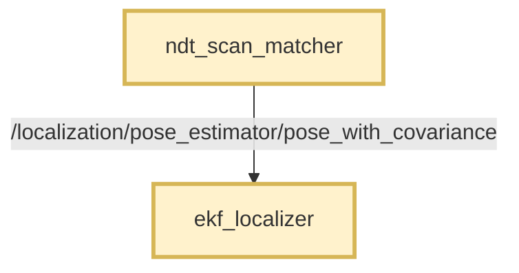
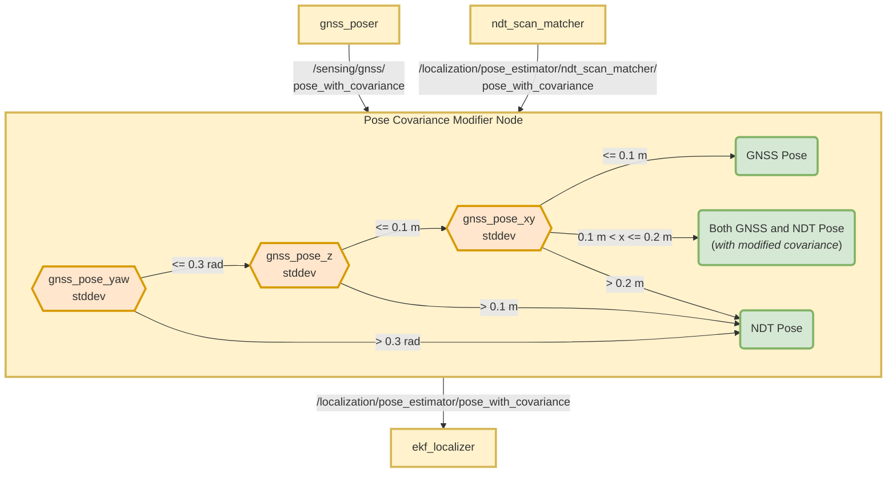
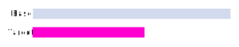

# Autoware Pose Covariance Modifier Node

## 目的

このパッケージは、GNSS と NDT のポーズを組み合わせたリアルタイムの局所化を可能にします。

## 機能

このパッケージは、共分散を持つ GNSS（全地球航法衛星システム）と NDT（正規分布変換）のポーズを受け入れます。

それは、共分散を持つ一意のポーズを出力します。

- 直接的な GNSS ポーズとその共分散。
- 直接的な NDT ポーズとその共分散。
- 修正された共分散を持つ GNSS と NDT 両方のポーズ。

> - このパッケージは受信するポーズ情報を変更しません。
> - 特定の条件で NDT の共分散値のみを変更します。

## 仮定

- NDT マッチャは固定された共分散を持つポーズを提供します。
- NDT マッチャは動的で信頼できる共分散値を提供できません。

## 要件

- GNSS/INS モジュールは、位置と方向の標準偏差値（エラー/RMSE）を提供する必要があります。
- 正確な位置と方向情報を提供するには、おそらく RTK のサポートが必要です。
- ジオリファレンスされたマップが必要です。
- GNSS/INS モジュールと `base_link` フレームは、十分に較正する必要があります。
- GNSS/INS システムと NDT システムが良好に機能する環境では、両方のシステムの `base_link` ポーズは互いに近い必要があります。

## 説明

GNSS と NDT ノードは、拡張カルマンフィルター（EKF）で使用される共分散データを持つポーズを提供します。

正確な共分散値は、状態を推定するための EKF の有効性に不可欠です。

GNSS システムは、共分散指標に変換できる信頼できる標準偏差値を生成します。

しかし現在、NDT ポーズの共分散値を決定する方法はありません。
Autoware の NDT マッチングシステムは、所定の共分散値を持つポーズを出力します。

このため、このパッケージは GNSS システムによって提供される標準偏差値に基づいて、ポーズソースの選択を管理するように設計されています。

また、GNSS の標準偏差値に基づいて NDT ポーズの共分散値を調整します。

## フローチャート

### このパッケージがない場合

ローカリゼーションでは NDT ポーズのみが使用されます。GNSS ポーズは初期化にのみ使用されます。

### このパッケージの特徴

NDTおよびGNSSのポーズは、GNSSシステムから来る標準偏差の値に応じて、ローカリゼーションで利用されます。

これは処理および事前に定義されたしきい値を示すフローチャートです。

## このパッケージの使用方法

> **このパッケージは Autoware では既定で無効となっているため、手動で有効にする必要があります。**

このパッケージを有効にするには、[pose_twist_estimator.launch.xml](../../launch/tier4_localization_launch/launch/pose_twist_estimator/pose_twist_estimator.launch.xml#L3)
内の `use_autoware_pose_covariance_modifier` パラメータを `true` に変更する必要があります。

### この条件がない場合（既定）

- [ndt_scan_matcher](../../localization/autoware_ndt_scan_matcher) の出力が [ekf_localizer](../../localization/autoware_ekf_localizer) に直接送信されます。
    - 事前に設定された共分散値があります。
    - **トピック名:** `/localization/pose_estimator/pose_with_covariance`
- GNSS の姿勢は ekf_localizer に入りません。
- このノードは起動しません。

### この条件がある場合

- [ndt_scan_matcher](../../localization/autoware_ndt_scan_matcher) の出力が名前変更されます。
    - **元:** `/localization/pose_estimator/pose_with_covariance`
    - **先:** `/localization/pose_estimator/ndt_scan_matcher/pose_with_covariance`
- `ndt_scan_matcher` の出力が `autoware_pose_covariance_modifier` に入ります。
- このパッケージの出力が [ekf_localizer](../../localization/autoware_ekf_localizer) に次のものとともに送信されます。
    - **トピック名:** `/localization/pose_estimator/pose_with_covariance`

## ノード

### サブスクライブするトピック

| 名前                             | 型                                            | 説明            |
| -------------------------------- | ----------------------------------------------- | ---------------------- |
| `input_gnss_pose_with_cov_topic` | `geometry_msgs::msg::PoseWithCovarianceStamped` | GNSS姿勢の入力トピック. |
| `input_ndt_pose_with_cov_topic`  | `geometry_msgs::msg::PoseWithCovarianceStamped` | NDT姿勢の入力トピック.  |

### Published topics

| Name                                | Type                                            | Description                                                                                                       |
| ----------------------------------- | ----------------------------------------------- | ----------------------------------------------------------------------------------------------------------------- |
| `output_pose_with_covariance_topic` | `geometry_msgs::msg::PoseWithCovarianceStamped` | 出力姿勢トピック。このトピックはekf_localizerパッケージによって使用されます。                             |
| `selected_pose_type`                | `std_msgs::msg::String`                         | このパッケージの出力でどの姿勢のソースが使用されているかを宣言します。                                   |
| `output/ndt_position_stddev`        | `std_msgs::msg::Float64`                        | 出力姿勢ndt平均標準偏差（位置xy）。`enable_debug_topics`がtrueの場合にのみ公開されます。             |
| `output/gnss_position_stddev`       | `std_msgs::msg::Float64`                        | 出力姿勢gnss平均標準偏差（位置xy）。`enable_debug_topics`がtrueの場合にのみ公開されます。              |

### パラメータ

パラメータは
[config/pose_covariance_modifier.param.yaml](config/pose_covariance_modifier.param.yaml) で設定します。

{{ json_to_markdown(
  "localization/autoware_pose_covariance_modifier/schema/pose_covariance_modifier.schema.json") }}

## FAQ

### 異なる周波数レートはどのように処理されますか?

GNSSとNDTのポーズトピックは異なる周波数を持つ場合があります。
GNSSのポーズトピックはNDTよりも高い周波数を持つ場合があります。

入力の周波数が次のようであると仮定します。

| ソース | 周波数 |
| ------ | -------- |
| GNSS   | 200 Hz   |
| NDT    | 10 Hz    |

このパッケージはモードに応じて、出力ポーズが入力されるたびに公開します。

結果:

| モード       | 出力周波数 |
| ---------- | ----------- |
| GNSS のみ  | 200 Hz      |
| GNSS + NDT | 210 Hz      |
| NDT のみ   | 10 Hz       |

### NDT 協分散値はどのようにして、いつ上書きされるか?

| モード | 出力、共分散 |
|---|---|
| GNSSのみ | GNSS、変更なし |
| GNSS + NDT | **GNSS:** 変更なし、**NDT:** 補完 |
| NDTのみ | NDT、変更なし |

NDT共分散値は、`GNSS + NDT`モードの場合にのみ上書きされます。

これにより、`GNSS Only`モードと`NDT Only`モード間のスムーズな移行が実現されます。

このモードでは、このノードからNDTとGNSSの両方のポーズが公開されます。

#### NDT共分散の計算

`gnss_std_dev`がその範囲内で上昇すると、`ndt_std_dev`はその範囲内で比例的に低下する必要があります。

これを実現するために、最初に線形補間を行います。

- 基本値: `gnss_std_dev`
- 基本範囲: [`threshold_gnss_stddev_xy_bound_lower`, `threshold_gnss_stddev_xy_bound_upper`]
- 目標範囲: [`ndt_std_dev_bound_lower`, `ndt_std_dev_bound_upper`]
- 目標値: `ndt_std_dev_target`

- 最終値 = `ndt_std_dev_bound_lower` + `ndt_std_dev_bound_upper` - `ndt_std_dev_target`（逆を得るために）

