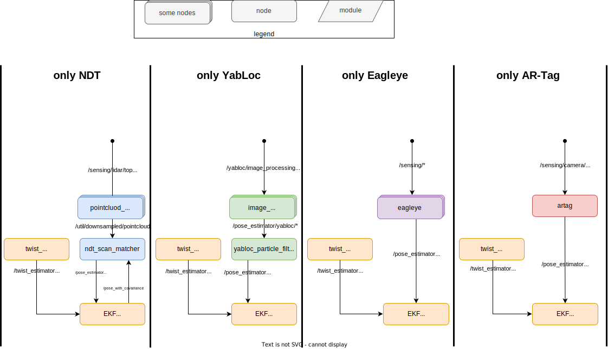
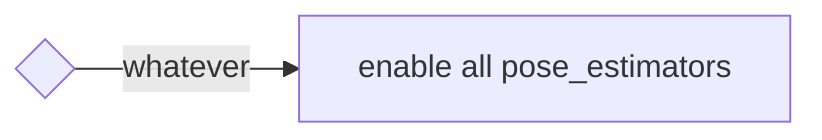

## autoware_pose_estimator_arbiter

目的:

- [概要](#概要)
- [インターフェース](#インターフェース)
- [アーキテクチャ](#アーキテクチャ)
- [起動方法](#起動方法)
- [切り替えルール](#切り替えルール)
- [姿勢初期化](#姿勢初期化)
- [将来の計画](#将来の計画)

## 概要

このパッケージは、複数の姿勢推定器を起動し、状況に応じて特定の姿勢推定器を停止または再開する機能を提供します。
仮の切り替えルールを提供しており、将来的にはさまざまなルールに適応できます。

実装に関する他のアイデアについては、[このディスカッション](https://github.com/orgs/autowarefoundation/discussions/3878)を参照してください。

### なぜ停止/再開メカニズムが必要ですか?

起動ファイルを変更することで、複数のpose_estimatorsを起動し、それらをカルマンフィルタを使用して融合することができます。
ただし、これは計算コストが高いため、好まれません。

特に、NDTとYabLocは計算集約的で、同時実行は推奨されません。
また、両方を同時にアクティブにしても、その1つから誤った出力が供給されたときにカルマンフィルタが影響を受ける可能性があります。

> [!注意]
> 現在、**すべてのpose_estimatorsを常に有効にするルールのみが実装されています。**
> ユーザーが独自ルールでpose_estimatorを切り替えたい場合は、example_ruleを参照して新しいルールを追加する必要があります。
> [example_rule](example_rule/README.md)には、ルール実装の参照として使用できるソースコードが含まれています。

### サポートされるpose_estimators

- [ndt_scan_matcher](https://github.com/autowarefoundation/autoware.universe/tree/main/localization/autoware_ndt_scan_matcher)
- [eagleye](https://autowarefoundation.github.io/autoware-documentation/main/how-to-guides/integrating-autoware/launch-autoware/localization/eagleye/)
- [yabloc](https://github.com/autowarefoundation/autoware.universe/tree/main/localization/yabloc)
- [landmark_based_localizer](https://github.com/autowarefoundation/autoware.universe/tree/main/localization/autoware_landmark_based_localizer)

### デモンストレーション

次の動画は、4つのさまざまな姿勢推定器の切り替えを示しています。

<div><video controls src="https://github.com/autowarefoundation/autoware.universe/assets/24854875/d4d48be4-748e-4ffc-bde2-d498911ed3a1" muted="false" width="800"></video></div>

ユーザーは、以下のデータと起動コマンドを使用してデモンストレーションを再現できます。

[サンプルデータ（rosbagと地図）](https://drive.google.com/file/d/1ZNlkyCtwe04iKFREdeZ5xuMU_jWpwM3W/view)
rosbagは、[AWSIM](https://tier4.github.io/AWSIM/)によって作成されたシミュレーションデータです。
マップは、AWSIMドキュメントページで公開された[元のマップデータ](https://github.com/tier4/AWSIM/releases/download/v1.1.0/nishishinjuku_autoware_map.zip)を編集したもので、複数のpose_estimatorsに適したものとなっています。


```bash
ros2 launch autoware_launch logging_simulator.launch.xml \
  map_path:=<your-map-path> \
  vehicle_model:=sample_vehicle \
  sensor_model:=awsim_sensor_kit \
  pose_source:=ndt_yabloc_artag_eagleye
```

## インターフェイス

<details>
<summary>詳細を表示</summary>

### パラメータ

パラメータはありません。

### サービス

| 名称             | 種別                            | 説明                     |
| ---------------- | ------------------------------- | ------------------------------- |
| `/config_logger` | logging_demo::srv::ConfigLogger | ログレベルを変更するサービス |

### クライント

- ROS service: /planning/get_trajectory_status
- ROS topic: /planning/status


| 名称                  | タイプ                  | 説明                       |
| --------------------- | --------------------- | --------------------------------- |
| `/yabloc_suspend_srv` | `std_srv::srv::SetBool` | yablocを停止または再起動するためのサービス |

### サブスクリプション

ポーズ推定器アービトレーション用:

| 名前 | 種類 | 説明 |
|---|---|---|
| `/input/artag/image` | sensor_msgs::msg::Image | ArTag入力 |
| `/input/yabloc/image` | sensor_msgs::msg::Image | YabLoc入力 |
| `/input/eagleye/pose_with_covariance` | geometry_msgs::msg::PoseWithCovarianceStamped | Eagleye出力 |
| `/input/ndt/pointcloud` | sensor_msgs::msg::PointCloud2 | NDT入力 |

**切り替えルール：**

| 名称                          | タイプ                                                         | 説明                       |
| ----------------------------- | ------------------------------------------------------------ | --------------------------------- |
| `/input/vector_map`           | autoware_map_msgs::msg::LaneletMapBin                        | vector map                        |
| `/input/pose_with_covariance` | geometry_msgs::msg::PoseWithCovarianceStamped                | localization final output         |
| `/input/initialization_state` | autoware_adapi_v1_msgs::msg::LocalizationInitializationState | localization initialization state |

### 論文

'post resampling` 推定器は、[確率ロボティクス](https://www.cs.ox.ac.uk/people/kyprianos.kourousis/pub/rothnie2012kld.pdf)に説明があります。

| 名前                                 | タイプ                                        | 説明                                                  |
| ------------------------------------- | ------------------------------------------- | ---------------------------------------------------------- |
| `/output/artag/image`                  | sensor_msgs::msg::Image                     | リレーされた ArTag 入力                                    |
| `/output/yabloc/image`                 | sensor_msgs::msg::Image                     | リレーされた YabLoc 入力                                 |
| `/output/eagleye/pose_with_covariance` | geometry_msgs::msg::PoseWithCovarianceStamped | リレーされた Eagleye 出力                                 |
| `/output/ndt/pointcloud`               | sensor_msgs::msg::PointCloud2                 | リレーされた NDT 入力                                  |
| `/output/debug/marker_array`           | visualization_msgs::msg::MarkerArray          | [デバッグトピック] 視覚化のためのすべて                    |
| `/output/debug/string`                 | visualization_msgs::msg::MarkerArray          | [デバッグトピック] 現在の状態などのデバッグ情報          |

```markdown
## トラブルシューティング

動作しないと思われる場合は、以下の方法で追加情報を取得できます。

> [!TIP]
```


> ```bash
> ros2 service call /localization/autoware_pose_estimator_arbiter/config_logger logging_demo/srv/ConfigLogger \
>   '{logger_name: localization.autoware_pose_estimator_arbiter, level: debug}'
> ```

## アーキテクチャ

<details>
<summary>詳細を表示する</summary>

### 1つのポーズ推定器の実行の場合

各 `pose_estimator` が単独で実行されるとき、このパッケージは何もしません。
次の図は、NDT、YabLoc Eagleye、AR-Tagが独立して実行されるときのノード構成を示しています。



### 複数のポーズ推定器の実行の場合

複数の `pose_estimator` を実行すると、`autoware_pose_estimator_arbiter` が実行されます。
これには、各 `pose_estimator` に対応する **切り替えルール** と **ストッパー** が含まれます。

- ストッパーは、入出力を中継したり、中断サービスを要求したりして、`pose_estimator` のアクティビティを制御します。
- 切り替えルールは、使用する `pose_estimator` を決定します。

インスタンス化するストッパーと切り替えルールは、スタートアップ時のランタイム引数によって異なります。

次の図は、すべての `pose_estimator` が同時に実行されるときのノード構成を示しています。


- **NDT**

NDT ストッパーは、ポイントクラウドプリプロセッサの前面にあるトピックを中継します。

- **YabLoc**

YabLoc ストッパーは、画像プリプロセッサのフロントエンドにある入力画像トピックを中継します。
YabLoc には、タイマーで動作する粒子フィルタプロセスが含まれており、画像トピックがストリーミングされていない場合でも、粒子の予測プロセスは引き続き動作します。
これを解決するために、YabLoc ストッパーには、YabLoc を明示的に停止および再開するためのサービスクライアントもあります。

- **Eagleye**

Eagleye ストッパーは、Eagleye の推定処理のバックエンドにある Eagleye の出力ポーズトピックを中継します。
Eagleye は内部で時系列処理を実行するため、入力ストリームを停止できません。
さらに、Eagleye の推定プロセスは継続的に実行しても大きな負荷をかけずに済むほど軽量であるため、リレーはバックエンドに挿入されます。

- **ArTag**

ArTag ストッパーは、ランドマークローカルライザの前面にある画像トピックを中継します。

</details>

## 起動方法

<details>
<summary>詳細を表示する</summary>

ユーザーは、ランタイム引数 `pose_source` としてアンダースコアで連結された `pose_estimator` 名を指定することで、目的の `pose_estimator` を起動できます。
</details>


```bash
ros2 launch autoware_launch logging_simulator.launch.xml \
  map_path:=<your-map-path> \
  vehicle_model:=sample_vehicle \
  sensor_model:=awsim_sensor_kit \
  pose_source:=ndt_yabloc_artag_eagleye
```

たとえ `pose_source` に想定外の文字列が含まれていても、適切にフィルタリングされます。
詳細は以下の表を参照してください。

| 与えられたランタイム引数 | 解析された autoware_pose_estimator_arbiter のパラメータ (pose_sources) |
| ----------------------- | ----------------------------------------------------------------- |
| `pose_source:=ndt` | `["ndt"]` |
| `pose_source:=nan` | `[]` |
| `pose_source:=yabloc_ndt` | `["ndt","yabloc"]` |
| `pose_source:=yabloc_ndt_ndt_ndt` | `["ndt","yabloc"]` |
| `pose_source:=ndt_yabloc_eagleye` | `["ndt","yabloc","eagleye"]` |
| `pose_source:=ndt_yabloc_nan_eagleye_artag` | `["ndt","yabloc","eagleye","artag"]` |

## 切り替えルール

<details>
<summary>詳細を表示</summary>

現在は、**1 つのルール** (`enable_all_rule`) のみ実装されています。将来は、複数のルールを実装する予定であり、ユーザーはルールを選択できるようになります。

> [!TIP]
> ルールを拡張するためのプリセットがあります。ルールを拡張する場合は、[example_rule](./example_rule/README.md) を参照してください。

### すべて有効にするルール

これはデフォルトかつ最も簡単なルールです。このルールは、現在の状態に関係なくすべての pose_estimators を有効にします。




## 姿勢初期化

複数の pose_estimators を使用する場合、`pose_initializer` に渡されるパラメータを適切に調整する必要があります。

<details>
<summary>クリックで詳細を表示</summary>

次の表は、run time 引数 "pose_source" に基づいており、初期姿勢推定法の種類と pose_initialization ノードに提供する必要があるパラメータを示しています。アプリケーションを複雑にしすぎないように、NDT が使用可能な場合は常に NDT が使用されるように優先順位が設定されています。（pose_initializer は `ndt_enabled` と `yabloc_enabled` が両方 `true` の場合にのみ NDT ベースの初期姿勢推定を実行します）。

この表の使い方は、3 つの観点から説明されています。

- **Autoware ユーザー:** Autoware ユーザーはこの表を参照する必要はありません。姿勢推定器の必要な組み合わせを指定するだけで、適切なパラメータが pose_initializer に自動的に提供されます。
- **Autoware 開発者:** Autoware 開発者は、どのパラメータが割り当てられているかを知るためにこの表を参照できます。
- **新しい姿勢推定器の切り替えを実装している開発者:** 開発者はこの表を拡張し、適切なパラメータを pose_initializer に割り当てる必要があります。
</details>

|         `pose_source`         |    `invoked initialization method`    |         `ndt_enabled`         |         `yabloc_enabled`         |         `gnss_enabled`         |          `sub_gnss_pose_cov`           |
| :-------------------------: | :------------------------------------: | :--------------------------: | :----------------------------: | :--------------------------: | :----------------------------------------: |
|             `ndt`             |             `ndt`             |           `true`            |           `false`            |           `true`            |    `/sensing/gnss/pose_with_covariance`    |
|           `yabloc`            |           `yabloc`            |           `false`           |           `true`             |           `true`            |    `/sensing/gnss/pose_with_covariance`    |
|           `eagleye`           |           `vehicle needs run for a while` |           `false`           |           `false`            |           `true`            | `/localization/pose_estimator/eagleye/...` |
|            `artag`            |         `2D Pose Estimate (RViz)`         |           `false`           |           `false`            |           `true`            |    `/sensing/gnss/pose_with_covariance`    |
|         `ndt`, `yabloc`         |             `ndt`             |           `true`            |           `true`             |           `true`            |    `/sensing/gnss/pose_with_covariance`    |
|        `ndt`, `eagleye`         |             `ndt`             |           `true`            |           `false`            |           `true`            |    `/sensing/gnss/pose_with_covariance`    |
|         `ndt`, `artag`          |             `ndt`             |           `true`            |           `false`            |           `true`            |    `/sensing/gnss/pose_with_covariance`    |
|       `yabloc`, `eagleye`       |           `yabloc`            |           `false`           |           `true`             |           `true`            |    `/sensing/gnss/pose_with_covariance`    |
|        `yabloc`, `artag`        |           `yabloc`            |           `false`           |           `true`             |           `true`            |    `/sensing/gnss/pose_with_covariance`    |
|       `eagleye`, `artag`        |           `vehicle needs run for a while` |           `false`           |           `false`            |           `true`            | `/localization/pose_estimator/eagleye/pose...` |
|    `ndt`, `yabloc`, `eagleye`     |             `ndt`             |           `true`            |           `true`             |           `true`            |    `/sensing/gnss/pose_with_covariance`    |
|     `ndt`, `eagleye`, `artag`     |             `ndt`             |           `true`            |           `false`            |           `true`            |    `/sensing/gnss/pose_with_covariance`    |
|   `yabloc`, `eagleye`, `artag`    |           `yabloc`            |           `false`           |           `true`             |           `true`            |    `/sensing/gnss/pose_with_covariance`    |
| `ndt`, `yabloc`, `eagleye`, `artag` |             `ndt`             |           `true`            |           `true`             |           `true`            |    `/sensing/gnss/pose_with_covariance`    |

## 今後の予定

<details>
<summary>詳細を表示</summary>

### 漸次切り替え

将来、このパッケージは単なるオン/オフ切り替えだけでなく、50% NDT と 50% YabLoc などの低周波動作のためのメカニズムを提供します。

### 今後追加される pose_estimator のストッパー

基本的な戦略は、その pose_estimator の入力または出力トピックを中継することでオン/オフ切り替えを実現することです。
pose_estimator が大量の計算を伴う時系列処理を含む場合、トピックの中継だけでポーズと再開をすることは不可能です。

そのような場合、一般的に適用可能な解決策はないかもしれませんが、以下の方法が役立つ可能性があります。

1. YabLoc の場合に見られるように、時系列処理を完全に停止して**再初期化**します。
2. `localization/kinematic_state` を subscribe して**状態を更新し続けます**。これにより、推定が中断しないようにします（アクティブな pose_estimator の出力に依存します）。
3. 複数の pose_estimator は、その特定の pose_estimator を**サポートしません**。

この問題は複数の pose_estimator を実現するための根本的な問題であることに注意してください。この場合に提案されたアーキテクチャに関係なく発生します。

</details>

