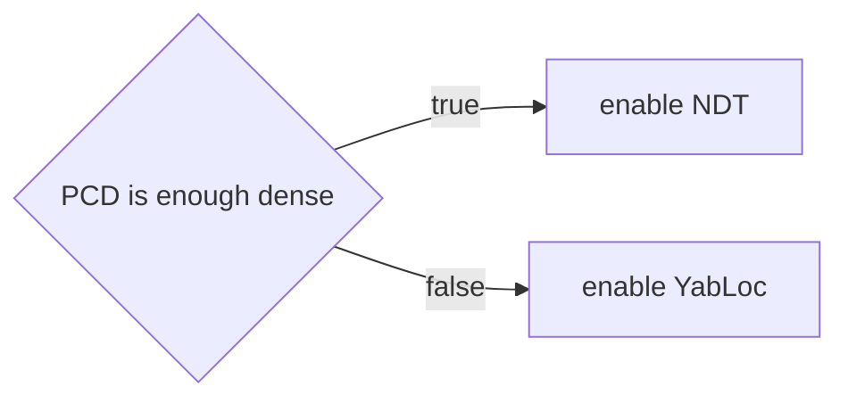
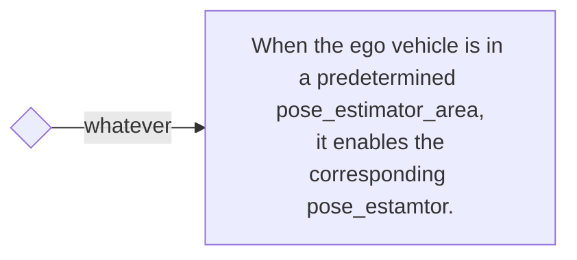
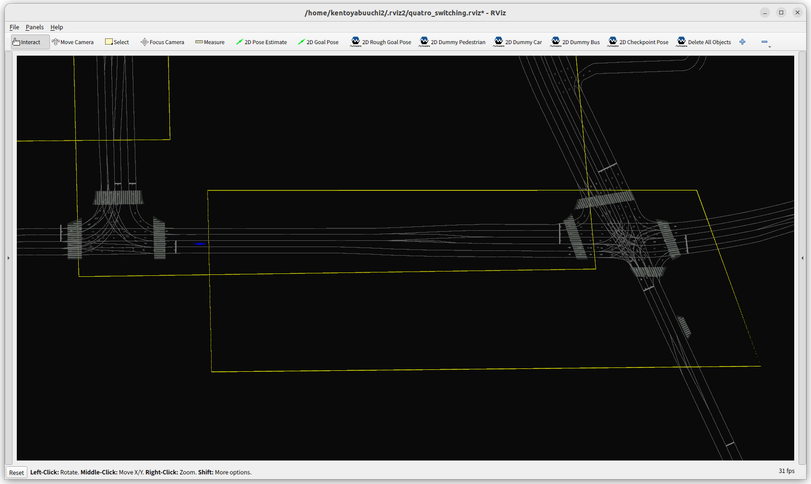

# サンプルルール

サンプルルールはアービターを制御するためのサンプルルールを提供します。提供されるルールを組み合わせることで、以下のようなデモを実現できます。ユーザーは必要に応じてこのコードを参照してルールを拡張でき、目的通りにアービターを制御できます。

## デモ

次のビデオは、4つの異なるポーズ推定器の切り替えを示しています。

<div><video controls src="https://github-production-user-asset-6210df.s3.amazonaws.com/24854875/295755577-62b26fdd-dcf0-4b1c-a1a0-ecd633413196.mp4" muted="false" width="600"></video></div>

## 切り替えルール

### Pcd Mapベースルール




### ベクターマップベースルール

---




### ルールヘルパー

ルールヘルパーは、切り替えルールを記述するための補助ツールです。

- [PCD占有度](#pcd-occupancy)
- [Poses推定エリア](#pose-estimator-area)

#### PCD占有度


#### Poses推定エリア

pose_estimator_areaは、lanelet2内のポリゴンで記述される平面領域です。
領域の高さは意味を持ちません。自車位置の投影がポリゴン内に含まれているかどうかを判定します。



サンプルのpose_estimator_areaを以下に示します。以下に提供する値はプレースホルダーです。
正しく読み取るには、この領域のタイプは「pose_estimator_specify」で、サブタイプはndt、yabloc、eagleye、またはartagのいずれかである必要があります。


```xml
  <node id="1" lat="35.8xxxxx" lon="139.6xxxxx">
    <tag k="mgrs_code" v="54SUE000000"/>
    <tag k="local_x" v="10.0"/>
    <tag k="local_y" v="10.0"/>
    <tag k="ele" v="1.0"/>
  </node>
  <node id="2" lat="35.8xxxxx" lon="139.6xxxxx">
    <tag k="mgrs_code" v="54SUE000000"/>
    <tag k="local_x" v="10.0"/>
    <tag k="local_y" v="20.0"/>
    <tag k="ele" v="1.0"/>
  </node>
  <node id="3" lat="35.8xxxxx" lon="139.6xxxxx">
    <tag k="mgrs_code" v="54SUE000000"/>
    <tag k="local_x" v="20.0"/>
    <tag k="local_y" v="20.0"/>
    <tag k="ele" v="1.0"/>
  </node>
  <node id="4" lat="35.8xxxxx" lon="139.6xxxxx">
    <tag k="mgrs_code" v="54SUE000000"/>
    <tag k="local_x" v="10.0"/>
    <tag k="local_y" v="20.0"/>
    <tag k="ele" v="1.0"/>
  </node>

...

  <way id="5">
    <nd ref="1"/>
    <nd ref="2"/>
    <nd ref="3"/>
    <nd ref="4"/>
    <tag k="type" v="pose_estimator_specify"/>
    <tag k="subtype" v="eagleye"/>
    <tag k="area" v="yes"/>
  </way>

  <way id="6">
    <nd ref="7"/>
    <nd ref="8"/>
    <nd ref="9"/>
    <nd ref="10"/>
    <tag k="type" v="pose_estimator_specify"/>
    <tag k="subtype" v="yabloc"/>
    <tag k="area" v="yes"/>
  </way>

```

