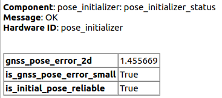
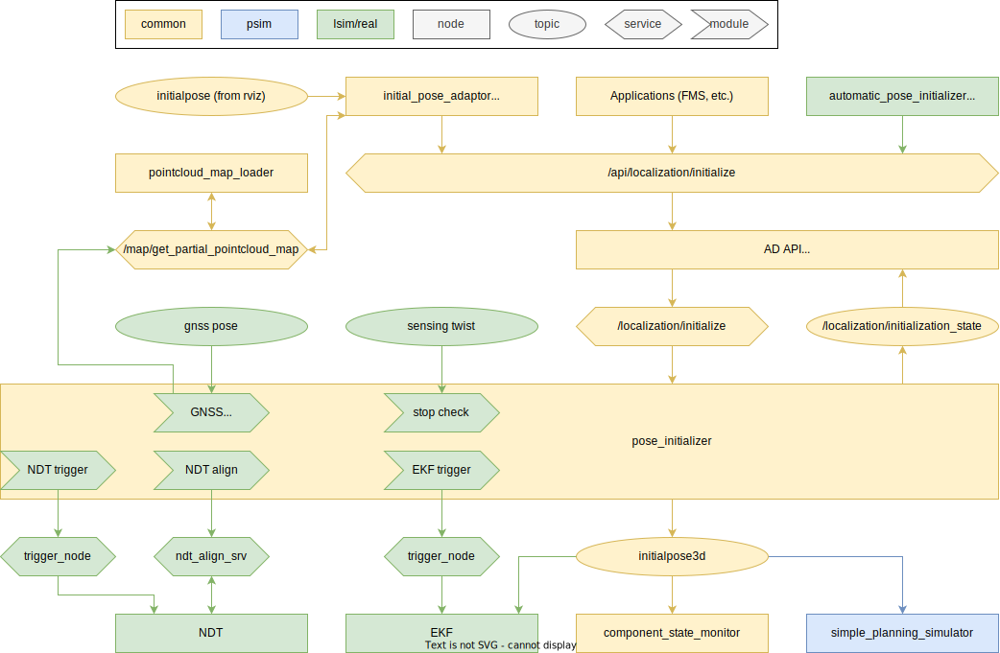

# autoware_pose_initializer

## 用途

`autoware_pose_initializer`は、初期姿勢を`ekf_localizer`に送るためのパッケージです。
GNSS/ユーザーから初期姿勢のおおよその推定値を受け取ります。
姿勢を`ndt_scan_matcher`に渡し、`ndt_scan_matcher`からサービス経由で自己位置の計算値を取得します。
最後に、初期姿勢を`ekf_localizer`にパブリッシュします。
このノードはマップ高フィットライブラリに依存しています。
[詳細はこちらをご覧ください。](../../map/autoware_map_height_fitter/README.md)

## インターフェイス

### パラメーター

{{ json_to_markdown("localization/autoware_pose_initializer/schema/pose_initializer.schema.json") }}

### サービス

| 名称                       | 型                                                 | 説明           |
| -------------------------- | ---------------------------------------------------- | --------------------- |
| `/localization/initialize` | tier4_localization_msgs::srv::InitializeLocalization | APIからの初期位置 |

### クライアント

| 名称                                         | 種類                                                    | 説明                   |
| -------------------------------------------- | ------------------------------------------------------- | ----------------------- |
| `/localization/pose_estimator/ndt_align_srv` | tier4_localization_msgs::srv::PoseWithCovarianceStamped | 自車位置推定サービス |

### サブスクリプション

| 名前                                                        | タイプ                                            | 説明                                      |
| ----------------------------------------------------------- | ----------------------------------------------- | ----------------------------------------- |
| `/sensing/gnss/pose_with_covariance`                        | geometry_msgs::msg::PoseWithCovarianceStamped | GNSSの現在姿勢                           |
| `/sensing/vehicle_velocity_converter/twist_with_covariance` | geometry_msgs::msg::TwistStamped                  | 停止チェック用の角速度                   |

### Publication

-------------------

| 名称                                 | タイプ                                                       | 説明                  |
| ------------------------------------ | ---------------------------------------------------------- | ----------------------- |
| `/localization/initialization_state` | autoware_adapi_v1_msgs::msg::LocalizationInitializationState | 姿勢初期化状態      |
| `/initialpose3d`                     | geometry_msgs::msg::PoseWithCovarianceStamped                | 計算された初期自車位置 |
| `/diagnostics`                       | diagnostic_msgs::msg::DiagnosticArray                        | 診断                    |

## Diagnostics

### pose_initializer_status

初期ポーズ推定の結果のスコアがスコアしきい値を下回った場合、ERRORメッセージが`/diagnostics`トピックに出力されます。



## Default AD APIとの接続

この`autoware_pose_initializer`は、デフォルトのAD APIを介して使用されます。APIの説明については、[autoware_default_adapiの説明](https://github.com/autowarefoundation/autoware.universe/blob/main/system/autoware_default_adapi/document/localization.md)を参照してください。



## CLIを介したPoseの初期化

### GNSS推定位置を使用する


```bash
ros2 service call /localization/initialize tier4_localization_msgs/srv/InitializeLocalization
```

GNSS推定位置は初期予測として使用され、ローカライゼーションアルゴリズムは、より正確な位置を自動的に推定します。

### 入力位置を使用する


```bash
ros2 service call /localization/initialize tier4_localization_msgs/srv/InitializeLocalization "
pose_with_covariance:
  - header:
      frame_id: map
    pose:
      pose:
        position:
          x: 89571.1640625
          y: 42301.1875
          z: -3.1565165519714355
        orientation:
          x: 0.0
          y: 0.0
          z: 0.28072773940524687
          w: 0.9597874433062874
      covariance: [0.25, 0, 0, 0, 0, 0, 0, 0.25, 0, 0, 0, 0, 0, 0, 0, 0, 0, 0, 0, 0, 0, 0, 0, 0, 0, 0, 0, 0, 0, 0, 0, 0, 0, 0, 0, 0.06853891909122467]
method: 0
"
```

入力された位置を初期推測として使用し、ローカリゼーションアルゴリズムは自動的により正確な位置を推定します。

### 直接初期位置の設定


```bash
ros2 service call /localization/initialize tier4_localization_msgs/srv/InitializeLocalization "
pose_with_covariance:
  - header:
      frame_id: map
    pose:
      pose:
        position:
          x: 89571.1640625
          y: 42301.1875
          z: -3.1565165519714355
        orientation:
          x: 0.0
          y: 0.0
          z: 0.28072773940524687
          w: 0.9597874433062874
      covariance: [0.25, 0, 0, 0, 0, 0, 0, 0.25, 0, 0, 0, 0, 0, 0, 0, 0, 0, 0, 0, 0, 0, 0, 0, 0, 0, 0, 0, 0, 0, 0, 0, 0, 0, 0, 0, 0.06853891909122467]
method: 1
"
```

初期位置は、ローカリゼーションアルゴリズムを通過せずに、入力位置により直接設定されます。

### ROS2トピック購読経由


```bash
ros2 topic pub --once /initialpose geometry_msgs/msg/PoseWithCovarianceStamped "
header:
  frame_id: map
pose:
  pose:
    position:
      x: 89571.1640625
      y: 42301.1875
      z: 0.0
    orientation:
      x: 0.0
      y: 0.0
      z: 0.28072773940524687
      w: 0.9597874433062874
"
```

「initialpose (rvizから)」と同様に動作します。
position.zと共分散は[ad_api_adaptors](https://github.com/autowarefoundation/autoware.universe/tree/main/system/default_ad_api_helpers/ad_api_adaptors)で上書きされるため、それらを入力する必要はありません。

