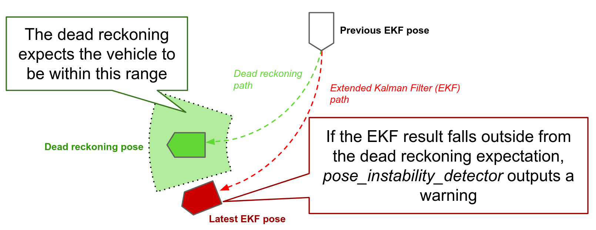
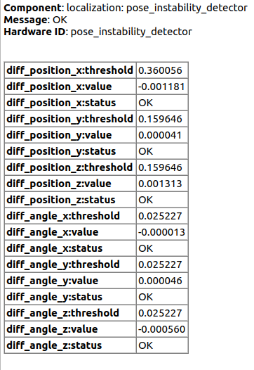
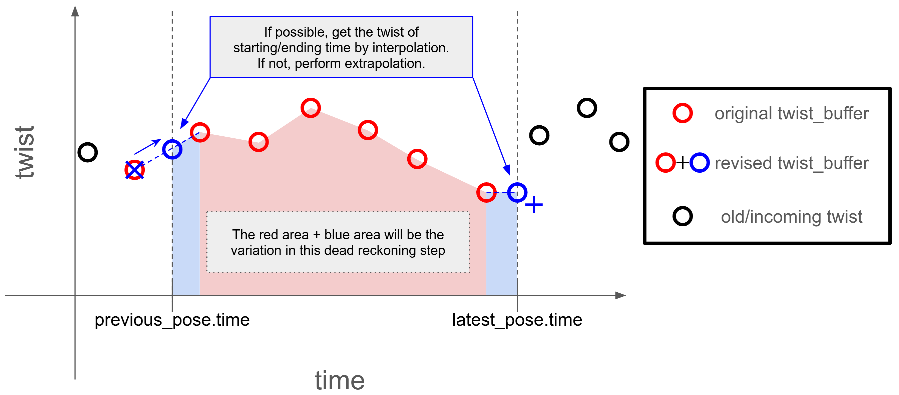
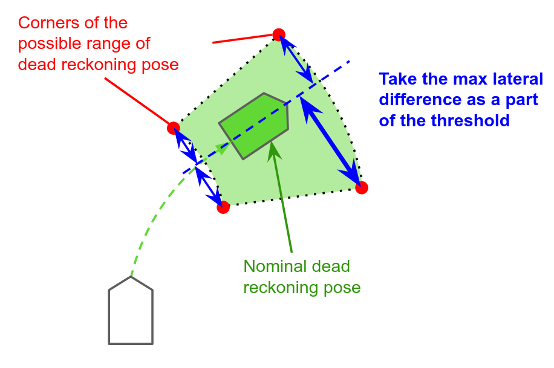

# autoware_pose_instability_detector

`pose_instability_detector`ノードは、拡張カルマンフィルタ（EKF）の出力トピックである`/localization/kinematic_state`の安定性を監視するように設計されています。

このノードは定期的なタイマークールバックをトリガーして2つのポーズを比較します。

- `timer_period`秒前に取得された`/localization/kinematic_state`のポーズからデッドレコニングによって計算されたポーズ。
- `/localization/kinematic_state`からの最新のポーズ。

この比較結果は、`/diagnostics`トピックに出力されます。

このノードが`/diagnostics`にWARNメッセージを出力する場合、EKF出力が統合ねじれ値と大きく異なっていることを意味します。
つまり、WARN出力が、車両のねじれ値に基づいて予想される範囲外の場所に移動したことを示します。
この差異は、推定ポーズまたは入力ねじれに問題がある可能性を示唆しています。

次の図は、手順の概要を示しています。

## デッドレコニングアルゴリズム

デッドレコニングは、過去の位置と速度に基づいて車両の位置を推定する方法です。
デッドレコニングの手順は次のとおりです。

1. `/input/twist`トピックから必要なねじれ値を取得します。
2. ねじれ値を積分してポーズ遷移を計算します。
3. ポーズ遷移を前のポーズに適用して、現在のポーズを取得します。

### ねじれ値の収集

`pose_instability_detector`ノードは、デッドレコニングを実行するために`~/input/twist`トピックからねじれ値を収集します。
理想的には、`pose_instability_detector`には前回のポーズと現在のポーズの間のねじれ値が必要です。
したがって、`pose_instability_detector`はねじれ値バッファをスニップし、補間と外挿を使用して目的の時点でのねじれ値を取得します。

### 線形変換と角変換

ねじれ値が収集されると、ノードはねじれ値に基づいて線形変換と角変換を計算し、それらを前のポーズに追加します。

## しきい値の定義

`pose_instability_detector`ノードは、デッドレコニングによって計算されたポーズを、EKF出力からの最新のポーズと比較します。
これら2つのポーズは理想的には同じですが、実際にはねじれ値の誤りとポーズの観測のため異なります。
これらの2つのポーズが大きく異なり、絶対値がしきい値を超える場合、ノードは`/diagnostics`トピックにWARNメッセージを出力します。
ポーズが有意に異なるかどうかを判断するためのしきい値は6つ（x、y、z、ロール、ピッチ、ヨー）あり、これらのしきい値は次のサブセクションで決定されます。

### `diff_position_x`

このしきい値は、2つのポーズ間の縦軸の方向の差を調べ、車両が予想される誤差を超えていないかどうかを確認します。
このしきい値は「速度スケールファクタ誤差による最大縦方向誤差」と「ポーズ推定許容誤差」の合計です。

$$
\tau_x = v_{\rm max}\frac{\beta_v}{100} \Delta t + \epsilon_x\\
$$

| 記号 | 説明 | 単位 |
|---|---|---|
| $\tau_x$ | 縦軸方向の差分のしきい値 | m |
| $v_{\rm max}$ | 最大速度 | m/s |
| $\beta_v$ | 最大速度のスケールファクター耐性 | % |
| $\Delta t$ | 時間間隔 | s |
| $\epsilon_x$ | Pose estimator (例: ndt_scan_matcher) の縦軸方向の誤差許容値 | m |

### `diff_position_y` と `diff_position_z`

これらのしきい値は、2つの姿勢間の横方向軸と鉛直方向軸の差を調べ、車両が予想誤差を超えているかどうかを確認します。
`pose_instability_detector` は、車両が移動する可能性のある範囲を計算し、公称の推測姿勢と最大限界姿勢の間の最大差を取得します。

さらに、`pose_instability_detector` ノードは、姿勢推定誤差許容値を考慮してしきい値を決定します。

$$
\tau_y = l + \epsilon_y
$$

| 記号       | 説明                                                                                     | 単位 |
| ------------ | ----------------------------------------------------------------------------------------------- | ---- |
| $\tau_y$     | 横軸の差のしきい値                                                                               | $m$  |
| $l$          | 上記の画像で示す最大横方向距離 (この計算方法については付録を参照)                      | $m$  |
| $\epsilon_y$ | Pose 推定器 (例: ndt_scan_matcher) の横軸でのエラー許容範囲                              | $m$  |

`pose_instability_detector` は、垂直軸のしきい値を横軸と同じに設定することに注意してください。ポーズ推定器の許容誤差だけが異なります。

### `diff_angle_x`, `diff_angle_y`, `diff_angle_z`

これらのしきい値は、2 つのポーズの間のロール、ピッチ、ヨー角の差を調べます。
このしきい値は、「速度の縮尺係数のエラーとバイアスのエラーによる最大の角度誤差」と「ポーズ推定誤差許容値」の合計です。

$$
\tau_\phi = \tau_\theta = \tau_\psi = \left(\omega_{\rm max}\frac{\beta_\omega}{100} + b \right) \Delta t + \epsilon_\psi
$$

| 記号             | 説明                                                              \| 単位          |
| ------------------ | ------------------------------------------------------------------------ | ------------- |
| $\tau_\phi$        | ロール角の差のしきい値                                                        \| ${\rm rad}$   |
| $\tau_\theta$      | ピッチ角の差のしきい値                                                       \| ${\rm rad}$   |
| $\tau_\psi$        | ヨー角の差のしきい値                                                         \| ${\rm rad}$   |
| $\omega_{\rm max}$ | 最大角速度                                                                 \| ${\rm rad}/s$ |
| $\beta_\omega$     | 最大角速度のスケールファクター許容度                                      \| $\%$          |
| $b$                | 角速度のバイアス許容度                                                      \| ${\rm rad}/s$ |
| $\Delta t$         | 時間間隔                                                                 \| $s$           |
| $\epsilon_\psi$    | 位相推定器 (例: ndt_scan_matcher) のヨー角の許容誤差           \| ${\rm rad}$   |

## パラメータ

{{ json_to_markdown("localization/autoware_pose_instability_detector/schema/pose_instability_detector.schema.json") }}

## 入力

| 名前              | タイプ                                         | 説明                                              |
| ---------------- | ------------------------------------------- | ------------------------------------------------- |
| `~/input/odometry` | nav_msgs::msg::Odometry                     | EKF による自車位置推定の結果                      |
| `~/input/twist`    | geometry_msgs::msg::TwistWithCovarianceStamped | Twist                                                 |

## 自動運転ソフトウェア
**ドキュメント：** [日本語URL]

### Planning機能

* **概要:**
  * Planningコンポーネントは、自動運転車の経路計画と軌道生成を担当します。
  * 入力として、現在の環境認識、車載センサーデータ、高精度地図を使用します。

* **主要機能:**
  * **パス計画:** 目的地までの安全で効率的な経路を計画します。
  * **軌道生成:** 経路に沿った安定したかつ快適な軌道を生成します。
  * **リアルタイム調整:** 環境の変化や障害物に対応するために、経路と軌道を継続的に調整します。

* **サブコンポーネント:**
  * **ローカルパス計画:** 車両の直近領域での経路計画を行います。
  * **グローバルパス計画:** 遠距離の経路計画を行います。
  * **軌道最適化:** 軌道の滑らかさ、快適性、安全性を最適化します。

### ナビゲーション機能

* **概要:**
  * ナビゲーション機能は、自車位置の正確な推定と、高精度地図とのマッチングを担当します。
  * 入力として、車載センサーデータ、GNSS（全地球航法衛星システム）、高精度地図を使用します。

* **主要機能:**
  * **位置推定:** GNSSと車載センサーデータを融合し、自車位置を推定します。
  * **地図マッチング:** 自車位置を高精度地図に照合します。
  * **ランドマーク認識:** 視覚的またはレーダーベースのランドマークを使用して、自車位置を検証します。

* **サブコンポーネント:**
  * **粒子フィルタ:** GNSSと車載センサーデータを融合し、位置の確率分布を推定します。
  * **カルマンフィルタ:** GNSSと車載センサーデータを融合し、位置と速度の推定を更新します。
  * **トランスフォーマー:** `post resampling`トランスフォーマーを使用して、粒子フィルタの出力を変換します。

### Autowareのアーキテクチャ

* **概要:**
  * Autowareは、オープンソースの自動運転ソフトウェアプラットフォームです。
  * Planning、ナビゲーション、制御などのコンポーネントをモジュール化して提供します。

* **モジュール構成:**
  * **Perception:** 環境認識を担当します。
  * **Planning:** 経路計画と軌道生成を担当します。
  * **Navigation:** 自車位置推定と地図マッチングを担当します。
  * **Control:** 車両の制御を担当します。

* **インターフェイス:**
  * ROS（Robot Operating System）を使用して、各モジュール間で通信します。
  * メッセージのトピックを使用して、データを共有します。

| Name                | タイプ                                  | 説明 |
| ------------------- | ------------------------------------- | -------- |
| `~/debug/diff_pose` | geometry_msgs::msg::PoseStamped       | diff_pose |
| `/diagnostics`      | diagnostic_msgs::msg::DiagnosticArray | Diagnostics |

## 付録

最大横方向距離$l$を計算するときに、 `pose_instability_detector` ノードは、以下の姿勢を推定します。

| 自車位置                       | 進行方向速度 $v$                           | 進行方向角速度 $\omega$                                      |
| ------------------------------ | ----------------------------------------------- | ------------------------------------------------------------- |
| 慣性航法の通常位置             | $v_{\rm max}$                                  | $\omega_{\rm max}$                                             |
| コーナー A の慣性航法位置 | $\left(1+\frac{\beta_v}{100}\right) v_{\rm max}$ | $\left(1+\frac{\beta_\omega}{100}\right) \omega_{\rm max} + b$ |
| コーナー B の慣性航法位置 | $\left(1-\frac{\beta_v}{100}\right) v_{\rm max}$ | $\left(1+\frac{\beta_\omega}{100}\right) \omega_{\rm max} + b$ |
| コーナー C の慣性航法位置 | $\left(1-\frac{\beta_v}{100}\right) v_{\rm max}$ | $\left(1-\frac{\beta_\omega}{100}\right) \omega_{\rm max} - b$ |
| コーナー D の慣性航法位置 | $\left(1+\frac{\beta_v}{100}\right) v_{\rm max}$ | $\left(1-\frac{\beta_\omega}{100}\right) \omega_{\rm max} - b$ |

指定された速度 $v$ と $\omega$ が与えられると、前回のポーズから見た 2D 理論的な変動は次のように計算されます。

$$
\begin{align*}
\left[
    \begin{matrix}
    \Delta x\\
    \Delta y
    \end{matrix}
\right]
&=
\left[
    \begin{matrix}
    \int_{0}^{\Delta t} v \cos(\omega t) dt\\
    \int_{0}^{\Delta t} v \sin(\omega t) dt
    \end{matrix}
\right]
\\
&=
\left[
    \begin{matrix}
    \frac{v}{\omega} \sin(\omega \Delta t)\\
    \frac{v}{\omega} \left(1 - \cos(\omega \Delta t)\right)
    \end{matrix}
\right]
\end{align*}
$$

各コーナーについてこの変動を計算し、基準の推測位置とコーナーの位置との間の距離を比較することによって、横方向の距離 $l$ の最大値を得ます。

