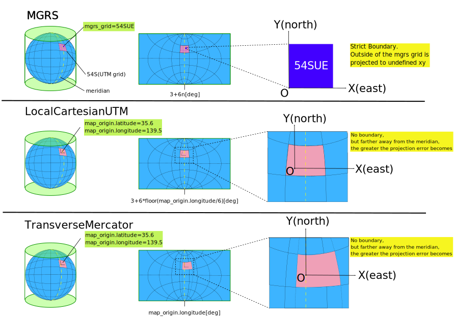

# autoware_map_projection_loader

## 機能

`autoware_map_projection_loader` は、Autoware が動作している座標のタイプを定義する `map_projector_info` を公開する役割を担っています。
これは、とりわけ、グローバル (地球楕円体) 座標からローカル座標、またはその逆への変換を行う場合に必要となる情報です。

- `map_projector_info_path` が存在する場合、このノードはこのパスから情報を読み込んで、それに応じて地図投影情報を公開します。
- `map_projector_info_path` が存在しない場合、このノードは `MGRS` 投影を使用していると想定して、代わりに lanelet2 マップを読み込んで、MGRS グリッドを抽出します。
  - **非推奨** この lanelet2 マップを使用するインターフェイスは推奨されません。代わりに YAML ファイルを用意してください。

## 地図投影者情報ファイル仕様

`map_path` ディレクトリの下に `map_projector_info.yaml` という YAML ファイルを用意する必要があります。 `pointcloud_map_metadata.yaml` については、`autoware_map_loader` の README を参照してください。


```bash
sample-map-rosbag
├── lanelet2_map.osm
├── pointcloud_map.pcd
├── map_projector_info.yaml
└── pointcloud_map_metadata.yaml
```

緯度経度からXYZ座標系への変換には、次の図に示すように3つのタイプがあります。各プロジェクタタイプの必須パラメータの詳細については、以下を参照してください。



### ローカル座標の使用


```yaml
# map_projector_info.yaml
projector_type: local
```

#### 制限

緯度と経度を必要とする機能は利用できなくなります。

現在、利用できないことが確認されている機能は次のとおりです。

- GNSS ローカリゼーション
- ADAPIを使用して緯度と経度で自車位置を送信する

### MGRSの使用

MGRSを使用する場合は、MGRSグリッドも指定してください。


```yaml
# map_projector_info.yaml
projector_type: MGRS
vertical_datum: WGS84
mgrs_grid: 54SUE
```

#### 制限事項

1 つの MGRS グリッドにまたがるマップでは使用できません。1 つの MGRS グリッドの範囲内のみで使用してください。

### `LocalCartesianUTM` の使用

ローカルデカルト UTM を使用する場合は、マップ原点も指定してください。


```yaml
# map_projector_info.yaml
projector_type: LocalCartesianUTM
vertical_datum: WGS84
map_origin:
  latitude: 35.6762 # [deg]
  longitude: 139.6503 # [deg]
  altitude: 0.0 # [m]
```

### 横メルカトル投影方式の使用

横メルカトル投影方式を使用する場合、地図の原点を指定してください。


```yaml
# map_projector_info.yaml
projector_type: TransverseMercator
vertical_datum: WGS84
map_origin:
  latitude: 35.6762 # [deg]
  longitude: 139.6503 # [deg]
  altitude: 0.0 # [m]
```

## 発行トピック

- `~/map_projector_info` (tier4_map_msgs/MapProjectorInfo) : このトピックは、マッププロジェクター情報の定義を示します

## パラメータ

これらのパラメータは起動引数から渡されると想定されており、`map_projection_loader.param.yaml`に直接書き込むことは推奨されていません。

```json
{
  "$schema": "http://json-schema.org/draft-04/schema#",
  "title": "Autoware map projection loader parameter",
  "description": "Map projector schema for autoware",
  "type": "object",
  "properties": {
    "base_frame_id": {
      "type": "string",
      "default": "map",
      "description": "base frame id"
    },
    "frame_id": {
      "type": "string",
      "default": "projection",
      "description": "projection frame id"
    },
    "linear_velocity_threshold": {
      "type": "number",
      "default": 1,
      "minimum": 0,
      "description": "minimum linear velocity of vehicle for project"
    },
    "angular_velocity_threshold": {
      "type": "number",
      "default": 0.5,
      "minimum": 0,
      "description": "minimum angular velocity of vehicle for project"
    },
    "resample_period": {
      "type": "number",
      "default": 1,
      "minimum": 0,
      "description": "when vehicle: linear velocity < linear_velocity_threshold or angular velocity > angular_velocity_threshold, project only within `resample_period`"
    },
    "resample_distance": {
      "type": "number",
      "default": 5,
      "minimum": 0,
      "description": "when vehicle: linear velocity < linear_velocity_threshold or angular velocity > angular_velocity_threshold, project only when displacement from `post resampling` position is more than this"
    },
    "publish_interval": {
      "type": "number",
      "default": 0.1,
      "minimum": 0,
      "description": "publish projected map interval"
    },
    "debug_mode": {
      "type": "boolean",
      "default": false,
      "description": "enable debug logging"
    },
    "publish_projected_lane": {
      "type": "boolean",
      "default": true,
      "description": "publish projected lane or not"
    },
    "publish_projected_road": {
      "type": "boolean",
      "default": true,
      "description": "publish projected road or not"
    },
    "collision_detection": {
      "type": "object",
      "properties": {
        "enabled": {
          "type": "boolean",
          "default": false,
          "description": "Enable/Disable collision detection. Requires the following collision detection parameter"
        },
        "distance": {
          "type": "number",
          "default": 5.0,
          "description": "Collision detection distance in meter"
        },
        "cyclone_dist": {
          "type": "number",
          "default": 10.0,
          "description": "Considering the Planning cycli (ie. prediction horizon) into account for collision check"
        }
      }
    }
  }
}
```

