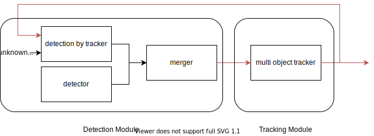
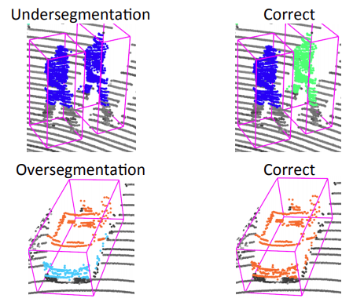

# autoware_detection_by_tracker

## 目的

このパッケージは追跡されたオブジェクトを検出モジュールにフィードバックして、モジュールの安定性を保ち、オブジェクトを検出し続けます。

autoware_detection_by_trackerは、点群の集まりを含む未知のオブジェクトとトラッカーを入力として使用します。
未知のオブジェクトはトラッカーの大きさに合わせて最適化され、検出され続けます。

## 内部機構 / アルゴリズム

autoware_detection_by_trackerは、点群とトラッカーを含む未知のオブジェクトを受け取ります。未知のオブジェクトは主にユークリッドクラスタリングを使用して形状に適合させられます。
ユークリッドクラスタリングや他の手法を使用した形状適合には、低分割と高分割という問題があります。

[3]より引用

未知のオブジェクトとトラッカーの間の重複を単に確認するだけでは機能しません。低分割と高分割に対策を講じる必要があります。

### 高分割に対処するためのポリシー

1. トラッカー内の未知のオブジェクトを1つのオブジェクトとしてマージする。
2. トラッカーの角度やサイズなどの情報を参照情報として形状を調整する。

### 低分割に対処するためのポリシー

1. トラッカーと未知のオブジェクトを比較し、リコールが高く、精度が低くなるものを分割されていないオブジェクトとする。
2. 分割されていないオブジェクトのクラスタを分割するためにパラメータを反復処理して小さなクラスタを作成する。
3. パラメータを何度も調整し、IoUが最も高いものを採用する。

## 入出力

### 入力

| Name                  | Type                                                   | Description       |
| --------------------- | -------------------------------------------------------- | ----------------- |
| `~/input/initial_objects` | `tier4_perception_msgs::msg::DetectedObjectsWithFeature` | 未知のオブジェクト |
| `~/input/tracked_objects` | `tier4_perception_msgs::msg::TrackedObjects`             | トラッカー         |

### 出力

自動運転ソフトウェアに関するドキュメント
[Autoware](https://github.com/autowarefoundation/autoware.auto/wiki)

**Planningコンポーネント/モジュール**

Planningコンポーネントは、周囲環境を認識し、現在の走行状況に基づいて、車両の走行経路を計画します。

**知覚モジュール**

* LiDARおよびカメラデータから周囲環境を検出し、オブジェクトを分類およびトラッキングします。

**地図モジュール**

* HDマップまたは勾配マップから、道路境界線、車線、交差点などの地図情報を提供します。

**自車位置モジュール**

* GPS、IMU、またはLiDARスラムを使用して、自車位置を決定します。

**計画モジュール**

* 知覚データ、地図情報、自車位置情報に基づいて、安全で効率的な走行経路を計画します。

**挙動生成**

* 計画された走行経路に基づいて、アクセル、ブレーキ、ステアリングコマンドを生成します。

**その他のモジュール**

* **'post resampling'モジュール**：知覚データのノイズを除去します。
* **衝突回避モジュール**：障害物との衝突を防止するための回避策を計算します。
* **駐車支援モジュール**：車両の駐車を支援します。

| 名称       | 型                                                   | 説明 |
| ---------- | ---------------------------------------------------- | ----------- |
| `~/output` | `autoware_perception_msgs::msg::DetectedObjects` | 検出物 |

## パラメータ

| 名前                              | 型   | 説明                                                                        | デフォルト値 |
| --------------------------------- | ------ | --------------------------------------------------------------------------- | ------------- |
| `tracker_ignore_label.UNKNOWN`    | `bool` | ラベルが不明の場合、ノードはトラッカーを無視します。                        | `true`        |
| `tracker_ignore_label.CAR`        | `bool` | ラベルが CAR の場合、ノードはトラッカーを無視します。                        | `false`       |
| `tracker_ignore_label.PEDESTRIAN` | `bool` | ラベルが pedestrian の場合、ノードはトラッカーを無視します。               | `false`       |
| `tracker_ignore_label.BICYCLE`    | `bool` | ラベルが bicycle の場合、ノードはトラッカーを無視します。                    | `false`       |
| `tracker_ignore_label.MOTORCYCLE` | `bool` | ラベルが MOTORCYCLE の場合、ノードはトラッカーを無視します。                | `false`       |
| `tracker_ignore_label.BUS`        | `bool` | ラベルが bus の場合、ノードはトラッカーを無視します。                        | `false`       |
| `tracker_ignore_label.TRUCK`      | `bool` | ラベルが truck の場合、ノードはトラッカーを無視します。                      | `false`       |
| `tracker_ignore_label.TRAILER`    | `bool` | ラベルが TRAILER の場合、ノードはトラッカーを無視します。                    | `false`       |

## 前提条件 / 既知の制限

## （任意）障害の検出と処理

## （任意）パフォーマンス特性

## （任意）参照/外部リンク

[1] M. Himmelsbach, et al. "Tracking and classification of arbitrary objects with bottom-up/top-down detection." (2012).

[2] Arya Senna Abdul Rachman, Arya. "3D-LIDAR Multi Object Tracking for Autonomous Driving: Multi-target Detection and Tracking under Urban Road Uncertainties." (2017).

[3] David Held, et al. "A Probabilistic Framework for Real-time 3D Segmentation using Spatial, Temporal, and Semantic Cues." (2016).

## （任意）今後の拡張 / 未実装部分

