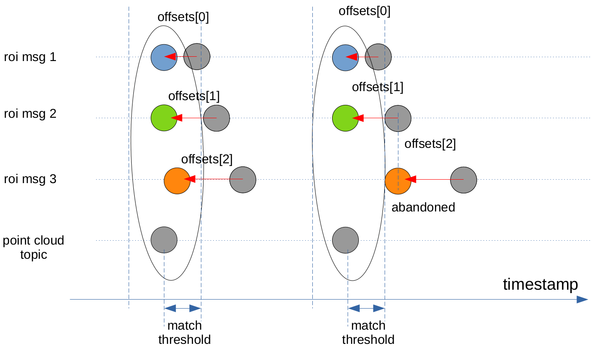
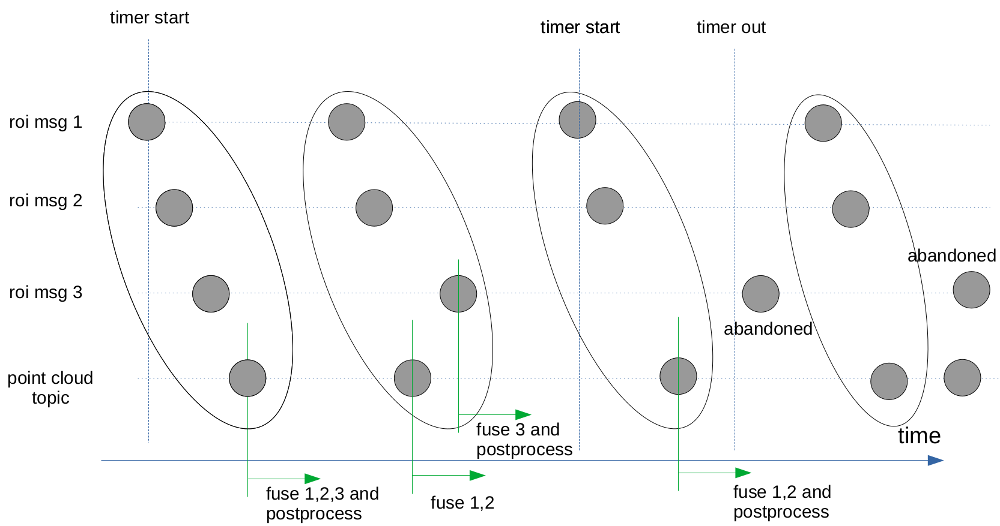

## autoware_image_projection_based_fusion

## 目的

`autoware_image_projection_based_fusion` は、画像と 3D 点群から検出された障害物（バウンディングボックスまたはセグメンテーション）をフュージョンするパッケージです。

## 内部動作 / アルゴリズム

### 同期アルゴリズム

#### マッチング

各カメラとライダー間のオフセットは、シャッタータイミングに基づいて設定されます。
タイムスタンプにオフセットを適用した後、点群トピックのタイムスタンプと ROI メッセージ間のインターバルが一致しきい値未満の場合、2 つのメッセージは一致します。



TIER IV Robotaxi の autoware.universe の現在のデフォルト値は次のとおりです。
- input_offset_ms: [61.67, 111.67, 45.0, 28.33, 78.33, 95.0]
- match_threshold_ms: 30.0

#### フュージョンとタイマー



メッセージのサブスクリプションステータスには「O」が付けられます。

1. 次の条件下で点群メッセージがサブスクライブされた場合:

|                     | pointcloud | roi msg 1 | roi msg 2 | roi msg 3 |
| :-----------------: | :--------: | :-------: | :-------: | :-------: |
| サブスクリプションステータス |            |     O     |     O     |     O     |

roi メッセージが一致する場合、それらを結合し、ポイントクラウド メッセージのポストプロセスを行います。一致しない場合、一致した roi メッセージを結合してポイントクラウドをキャッシュします。

2.以下条件下でポイントクラウド メッセージをサブスクライブする場合:

|                       | 点群 | roiメッセージ1 | roiメッセージ2 | roiメッセージ3 |
| :--------------------: | :---------: | :-------------: | :-------------: | :-------------: |
| サブスクリプショステータス |                |          O       |          O       |                |

roi msg とマッチングできる場合は、それらを融合して点群をキャッシュします。

3.以下の条件下で点群メッセージがサブスクライブされた場合:

|                     | pointcloud | roi msg 1 | roi msg 2 | roi msg 3 |
| :--------------: | :--------: | :-------: | :-------: | :-------: |
| 登録ステータス |     参     |     参    |     参    |          |

roi msg 3 が次の pointcloud メッセージの到着、またはタイムアウトが発生する前にサブスク ライブされた場合、一致したら融合を行い、一致しなかった場合は次の roi msg 3 を待ちます。
roi msg 3 が次の pointcloud メッセージの到着、またはタイムアウトが発生する前にサブスク ライブされない場合、pointcloud メッセージをそのまま後処理します。

タイムアウトのしきい値は後処理時間に応じて設定する必要があります。
たとえば、後処理時間が約 50 ミリ秒の場合は、タイムアウトのしきい値を 50 ミリ秒未満に設定して、全体の処理時間を 100 ミリ秒未満にする必要があります。
autoware.universe での現在の XX1 のデフォルト値: - timeout_ms: 50.0

#### `build_only` オプション

`pointpainting_fusion` ノードには、ONNX ファイルから TensorRT エンジン ファイルを構築する `build only` オプションがあります。Autoware Universe の `.param.yaml` ファイル内のすべての ROS パラメータを移動するのが望ましいですが、`build_only` オプションは現時点では `.param.yaml` ファイルには移動されていません。これは、タスクの前の段階としてビルドを実行するためのフラグとして使用される可能性があるためです。以下のコマンドで実行できます。


```bash
ros2 launch autoware_image_projection_based_fusion pointpainting_fusion.launch.xml model_name:=pointpainting model_path:=/home/autoware/autoware_data/image_projection_based_fusion model_param_path:=$(ros2 pkg prefix autoware_image_projection_based_fusion --share)/config/pointpainting.param.yaml build_only:=true
```

#### 制限事項

rclcpp::TimerBase タイマーは for ループを中断できません。そのため、真ん中で roi メッセージを融合するときに時間が切れても、すべてのメッセージが融合されるまでプログラムは実行されます。

### 各融合アルゴリズムの詳細については、次のリンクを参照してください

| フュージョン名            | 説明                                                                                      | 詳細                                       |
| ------------------------- | ---------------------------------------------------------------------------------------------- | -------------------------------------------- |
| roi_cluster_fusion         | 2Dオブジェクト検出器のROIによってクラスタの分類ラベルを上書きします。         | [link](./docs/roi-cluster-fusion.md)         |
| roi_detected_object_fusion | 2Dオブジェクト検出器のROIによって検出されたオブジェクトの分類ラベルを上書きします。 | [link](./docs/roi-detected-object-fusion.md) |
| pointpainting_fusion       | 2Dオブジェクト検出器のROIで点群にペイントし、3Dオブジェクト検出器に入力します。 | [link](./docs/pointpainting-fusion.md)       |
| roi_pointcloud_fusion      | 2Dオブジェクト検出器のROIと点群をマッチングして、未知のラベルのオブジェクトを検出します | [link](./docs/roi-pointcloud-fusion.md)      |

