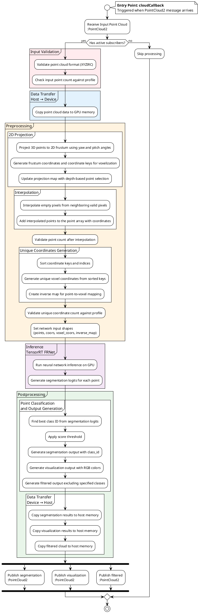

# autoware_lidar_frnet

## Purpose

The `autoware_lidar_frnet` package is used for 3D semantic segmentation based on LiDAR data (x, y, z, intensity).

## Inner-workings / Algorithms

The implementation is based on the FRNet [1] project. It uses TensorRT library for data processing and network inference.

We trained the models using AWML [2].

### Processing Flow

The following diagram shows the processing flow of the `autoware_lidar_frnet` package using UML Activity Diagram notation:



**Legend:**

- **Group title**: Shows the concept name
- **Group content**: The actual processing step executed
- Each group represents a single processing unit
- **Color coding**:
  - Red (#FFEBEE): Input validation
  - Blue (#E3F2FD): Data transfer operations
  - Orange (#FFF3E0): Preprocessing operations
  - Purple (#F3E5F5): Neural network inference
  - Green (#E8F5E9): Postprocessing operations

## Inputs / Outputs

### Input

| Name                 | Type                            | Description       |
| -------------------- | ------------------------------- | ----------------- |
| `~/input/pointcloud` | `sensor_msgs::msg::PointCloud2` | Input pointcloud. |

### Output

| Name                                   | Type                                                | Description                                                  |
| -------------------------------------- | --------------------------------------------------- | ------------------------------------------------------------ |
| `~/output/pointcloud/segmentation`     | `sensor_msgs::msg::PointCloud2`                     | XYZ cloud with class ID field.                               |
| `~/output/pointcloud/visualization`    | `sensor_msgs::msg::PointCloud2`                     | XYZ cloud with RGB field.                                    |
| `~/output/pointcloud/filtered`         | `sensor_msgs::msg::PointCloud2`                     | Input format cloud after removing specified point's class.   |
| `debug/cyclic_time_ms`                 | `autoware_internal_debug_msgs::msg::Float64Stamped` | Cyclic time (ms).                                            |
| `debug/pipeline_latency_ms`            | `autoware_internal_debug_msgs::msg::Float64Stamped` | Pipeline latency time (ms).                                  |
| `debug/processing_time/preprocess_ms`  | `autoware_internal_debug_msgs::msg::Float64Stamped` | Preprocess (ms).                                             |
| `debug/processing_time/inference_ms`   | `autoware_internal_debug_msgs::msg::Float64Stamped` | Inference time (ms).                                         |
| `debug/processing_time/postprocess_ms` | `autoware_internal_debug_msgs::msg::Float64Stamped` | Postprocess time (ms).                                       |
| `debug/processing_time/total_ms`       | `autoware_internal_debug_msgs::msg::Float64Stamped` | Total processing time (ms).                                  |
| `/diagnostics`                         | `diagnostic_msgs::msg::DiagnosticArray`             | Node diagnostics with respect to processing time constraints |

## Parameters

### FRNet node

{{ json_to_markdown("perception/autoware_lidar_frnet/schema/frnet.schema.json") }}

### FRNet model

{{ json_to_markdown("perception/autoware_lidar_frnet/schema/ml_package_frnet.schema.json") }}

### FRNet diagnostics

{{ json_to_markdown("perception/autoware_lidar_frnet/schema/diagnostics_frnet.schema.json") }}

### The `build_only` option

The `autoware_lidar_frnet` node has `build_only` option to build the TensorRT engine file from the ONNX file.

```bash
ros2 launch autoware_lidar_frnet lidar_frnet.launch.xml build_only:=true
```

## Assumptions / Known limits

This library operates on raw cloud data (bytes). It is assumed that the input pointcloud message has XYZIRC format:

```python
[
  sensor_msgs.msg.PointField(name='x', offset=0, datatype=7, count=1),
  sensor_msgs.msg.PointField(name='y', offset=4, datatype=7, count=1),
  sensor_msgs.msg.PointField(name='z', offset=8, datatype=7, count=1),
  sensor_msgs.msg.PointField(name='intensity', offset=12, datatype=2, count=1),
  sensor_msgs.msg.PointField(name='ring', offset=13, datatype=2, count=1),
  sensor_msgs.msg.PointField(name='channel', offset=14, datatype=4, count=1)
]
```

This input may consist of other fields as well - shown format is required minimum.
For debug purposes, you can validate your pointcloud topic using simple command:

```bash
ros2 topic echo <input_topic> --field fields
```

## Trained Models

The model was trained on the NuScenes dataset and is available in the Autoware artifacts.

## References/External links

[1] X. Xu, L. Kong, H. Shuai and Q. Liu, "FRNet: Frustum-Range Networks for Scalable LiDAR Segmentation" in IEEE Transactions on Image Processing, vol. 34, pp. 2173-2186, 2025, doi: 10.1109/TIP.2025.3550011. <!-- cspell:disable-line -->

[2] <https://github.com/tier4/AWML.git>

[3] <https://xiangxu-0103.github.io/FRNet>
