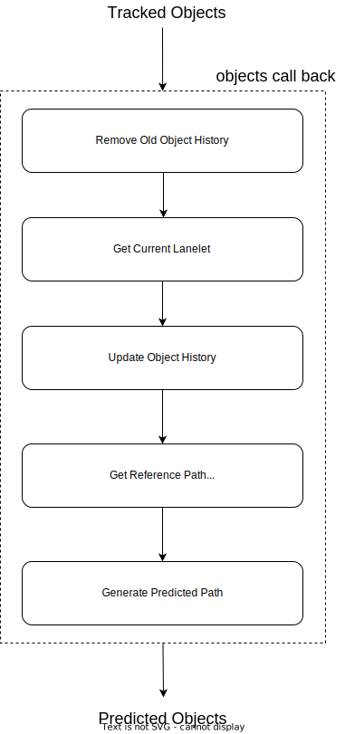
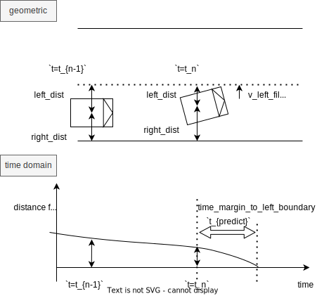

# map_based_prediction

## 役割

`map_based_prediction`は、地図の形状と周囲の環境に応じて、他の車両や歩行者の将来の経路（とそれらの確率）を予測するモジュールです。

## 仮定

- ターゲット障害物に関する次の情報が必要です。
  - ラベル（人物、車などのタイプ）
  - 現在の時点でのオブジェクトの位置と将来の時点での予測位置
- 周囲の環境に関する次の情報が必要です。
  - Lanelet2形式の道路網情報

## 内部構造 / アルゴリズム

### フローチャート

  

### 道路利用者の経路予測

#### 古いオブジェクトの履歴削除

オブジェクトの経路を決定し、レーン変更を一定時間検出するために、オブジェクトの時間系列データを格納します。オブジェクトデータには、オブジェクトの位置、速度、および時間の情報が含まれます。

#### 現在のレーンレットの取得とオブジェクト履歴の更新

各対象オブジェクトに対して、次の条件を満たす1つまたは複数のレーンレットを検索し、それらをObjectDataに格納します。

- オブジェクトの重心はレーンレット内になければなりません。
- レーンレットの中心線には2つ以上の点が必要です。
- レーンレットとオブジェクトの方向の角度差は、パラメータで指定されたしきい値内になければなりません。
  - 角度の反転が許可され、条件は `diff_yaw < threshold or diff_yaw > pi - threshold` です。
- レーンレットは、過去の履歴に記録されたレーンレットから到達可能でなければなりません。

#### 予測リファレンスパスの取得

- リファレンスパスの取得:
  - 関連するレーンレットからオブジェクトのリファレンスパスを作成します。
- オブジェクトの操作の予測:
  - オブジェクトの予測経路を生成します。
  - 過去の履歴と最初のステップで取得したリファレンスパスに基づいて、`Lane Follow`、`Left Lane Change`、および`Right Lane Change`の各操作に確率を割り当てます。
  - レーン変更の決定は、次の2つのドメインに基づいています。
    - 幾何学的ドメイン：オブジェクトの重心とレーンの左右の境界との間の横方向の距離。
    - 時間ドメイン：オブジェクトが左右の境界に到達するまでの推定時間の余裕。

左車線変更検出の条件は次のとおりです。

- 左車線境界までの距離が右車線境界までの距離よりも小さいことを確認します。
- 左車線境界までの距離が `dist_threshold_to_bound_` より小さいことを確認します。
- 横方向の速度方向が左車線境界に向かってであることを確認します。
- 左車線境界に到達するまでの時間が `time_threshold_to_bound_` より短いことを確認します。

レーン変更のロジックは、以下の図で示します。パラメータの調整方法の例を後で説明します。

- 物体確率の計算:
  - 上記で得られた経路確率は、物体の現在の位置と角度に基づいて計算されます。
- 滑らかな移動のための予測経路の調整:
  - 生成された予測経路は、車両の動力学を考慮して再計算されます。
  - 経路は、横・縦動に4次/5次スプラインを実装した最小ジャーク軌跡で計算されます。

### 車線変更検出ロジックのチューニング

現在、車線変更検出をチューニングするためのパラメータを3つ提供しています:

- `dist_threshold_to_bound_`: 車線変更車両が車線境界線から離れて走行できる最大の距離
- `time_threshold_to_bound_`: 車線変更車両が境界線に達するまで許容される最大の時間
- `cutoff_freq_of_velocity_lpf_`: 横方向速度のローパスフィルタのカットオフ周波数

以下のテーブルでロスパラメータ内のこれらのパラメータを変更できます。

| パラメータ名                                         | デフォルト値 |
| ----------------------------------------------------- | ------------ |
| `車線変更検出の距離しきい値`                          | `1.0` [m]     |
| `車線変更検出の時間しきい値`                          | `5.0` [s]     |
| `車線変更検出の速度のカットオフ周波数`                  | `0.1` [Hz]    |

#### しきい値パラメータの調整

この2つのパラメータを大きくすると、車線変更推定が遅くなり安定します。

通常、車線変更の決定に重要な要因であるため、`time_threshold_for_lane_change_detection` のみを調整することをお勧めします。

#### 横速度計算の調整

横速度の計算も、時間領域での決定に使用されるため、車線変更の決定において非常に重要な要因です。

車線境界に到達する予測時間は次のように計算されます。

$$
t_{predicted} = \dfrac{d_{lat}}{v_{lat}}
$$

ここで、`d_lat` と `v_lat` はそれぞれ車線境界までの横方向距離と横方向速度を表します。

横方向速度のローパスフィルタのカットオフ周波数を下げると、車線変更の決定はより安定しますが遅くなります。弊社ではこの設定を非常に慎重に行っていますので、車線変更の決定をより速くしたい場合はこのパラメータを増やすことができます。

さらに詳しく説明すると、横方向速度の計算方法を以下に示します。

| 横方向速度計算手法 | 数式 | 説明 |
|---|---|---|
| [**採用中**] 横方向距離の時間微分 | $\dfrac{\Delta d_{lat}}{\Delta t}$ | 現在、この手法で曲がりくねった道路に対処しています。この時間微分はノイズが発生しやすいため、ローパスフィルタを使用して速度を平滑化しています。 |
| [非採用] 車両方向へのオブジェクト速度投影 | $v_{obj} \sin(\theta)$ | 通常、オブジェクトの速度は横方向距離の時間微分よりもノイズが少なくなります。しかし、レーンとオブジェクトの方向間のヨー差$\theta$が時々不連続になるため、この手法を採用しませんでした。 |

現時点では、ローパスフィルタによる上位手法を用いて横方向速度を計算しています。

### パス生成

パス生成はフレネ座標系で生成されます。パスは次の手順で生成します。

1. 基準パスのフレネ座標系を取得します。
2. オブジェクトの現在位置と終了位置のフレネ座標系を生成します。
3. フレネ座標系の各縦方向および横方向座標におけるパスを最適化します。（スタート条件と終了条件に 5 次多項式を適用します。）
4. パスをグローバル座標に変換します。

詳細は論文 [2] を参照してください。

#### 横方向パスの形状調整

`lateral_control_time_horizon` パラメータは、横方向パスの形状調整をサポートします。このパラメータは、基準パスに到達する時間を計算するために使用されます。値が小さいほど、基準パスに素早く到達するためのパスが生成されます。（主に車線のセンター。）

#### 横方向加速度制約による予測パスの剪定（車両障害物向け）

生成された車両パスに最大横方向加速度の制約を適用することができます。このチェックは、車両が曲線を通過するときに横方向加速度しきい値 `max_lateral_accel` を超えずに予測パスを実行できるかどうかを確認します。実行不可能な場合は、車両が `min_acceleration_before_curve` の減速で曲線を通過するためにタイムリーに減速できるかどうかを確認します。それでも不可能な場合は、パスは削除されます。

現在、横方向加速度制約を調整するための 3 つのパラメータを提供しています。

- `check_lateral_acceleration_constraints_`：制約チェックを有効にする。
- `max_lateral_accel_`：予測パスにおける最大許容横方向加速度（絶対値）。
- `min_acceleration_before_curve_`：車両が曲線を通過する前に減速するために理論上使用する最小加速度（負の値にする必要があります）。

次の表の rosparam でこれらのパラメータを変更できます。

| パラメータ名 | デフォルト値 |
| ---------------- | ---------- |
| `check_lateral_acceleration_constraints` | `false` [bool] |
| `max_lateral_accel` | `2.0` [m/s^2] |
| `min_acceleration_before_curve` | `-2.0` [m/s^2] |

## 車両加速度を使用した経路予測（車両障害物用）

デフォルトでは、`map_based_prediction`モジュールは、現在の障害物の速度を使用して、予測パス長を計算します。ただし、障害物の現在の加速度を使用して、予測パス長を計算することもできます。

### 減衰加速度モデル

このモジュールは車両の経路を未来の何秒か予測しようと試みるため、現在の車両加速度を一定と見なすことは現実的ではありません（検出後、車両が`prediction_time_horizon`秒間加速し続けることは想定されていません）。代わりに、減衰加速度モデルが使用されます。減衰加速度モデルを使用すると、車両の加速度は次のようにモデル化されます。

$a(t) = a\_{t0} \cdot e^{-\lambda \cdot t}$

ここで、$a\_{t0}$は検出時刻$t0$における車両加速度、$\lambda$は減衰定数$\lambda = \ln(2) / hl$、$\hl$は指数関数半減期です。

さらに、時間に対する$a(t)$の積分により、速度を表す式$v(t)$と距離を表す式$x(t)$が得られます。

$v(t) = v*{t0} + a*{t0} \* (1/\lambda) \cdot (1 - e^{-\lambda \cdot t})$

および

$x(t) = x*{t0} + (v*{t0} + a*{t0} \* (1/\lambda)) \cdot t + a*{t0}(1/λ^2)(e^{-\lambda \cdot t} - 1)$

このモデルでは、検出された車両の瞬時加速度が予測パス長に及ぼす影響は減少しますが、それでも考慮されます。この機能では、障害物が道路の制限速度（調整可能な係数で乗算）を超えて加速しない可能性も考慮されます。

現在、経路予測に障害物加速度を使用するための調整可能なパラメーターを3つ提供しています。

- `use_vehicle_acceleration`: 機能を有効にします。
- `acceleration_exponential_half_life`: 減衰加速度モデルは、現在の車両加速度が数秒後に半分になると想定しています。
- `speed_limit_multiplier`: 車両タイプの障害物の最大予測速度は、車線の速度制限にこの値を乗じた値として設定します。この値は少なくとも1.0以上である必要があります。

以下の表で、`rosparam`でこれらのパラメーターを変更できます。

| パラメータ名 | デフォルト値 |
|---|---|
| `use_vehicle_acceleration` | `false` [bool] |
| `acceleration_exponential_half_life` | `2.5` [s] |
| `speed_limit_multiplier` | `1.5` [] |

### 横断歩道ユーザーの経路予測

このモジュールは、**歩行者**と**自転車**を横断歩道を使用するオブジェクトとして扱い、そのオブジェクトが横断歩道を渡る意図を持ち、少なくとも以下の条件の 1 つを満たす場合、地図と推定オブジェクト速度に基づいて予測経路を出力します。

- 横断歩道に向かって移動
- 横断歩道の近くで停止

  

オブジェクトが `prediction_time_horizon` 内の到達可能な横断歩道エントリポイントがあり、上記の条件を満たしている場合、このモジュールは横断歩道エントリポイントを介して反対側を渡る追加の予測経路を出力します。

このモジュールは、対応する信号機情報を考慮に入れます。赤信号が表示されている場合、対象オブジェクトは横断しないと想定します。さらに、対象オブジェクトが青信号に対して停止（移動しない）している場合、対象オブジェクトも横断しないと想定します。この予測は、信号が青で対象オブジェクトが横断することを意図している場合、オブジェクトは移動する必要があるという仮定に基づいています。

  

対象オブジェクトが道路または横断歩道内にある場合、このモジュールは横断歩道の出口に到達する 1 つまたは 2 つの追加の予測経路を出力します。予測経路の数は、オブジェクトが移動しているかどうかに依存します。オブジェクトが移動している場合、このモジュールはオブジェクトの移動方向にある出口に向けた 1 つの予測経路を出力します。一方、オブジェクトが停止している場合、オブジェクトがどちらの出口に向かうか推測することは不可能なので、このモジュールは両側の出口に向けた 2 つの予測経路を出力します。

  

## 入力と出力

### 入力

| 名称                                                    | タイプ                                                    | 説明                                                      |
| -------------------------------------------------------- | ------------------------------------------------------- | ---------------------------------------------------------- |
| `~/perception/object_recognition/tracking/objects`       | `autoware_perception_msgs::msg::TrackedObjects`         | 予測経路のない追跡対象                                 |
| `~/vector_map`                                           | `autoware_map_msgs::msg::LaneletMapBin`                 | Lanelet2 Mapのバイナリデータ                               |
| `~/perception/traffic_light_recognition/traffic_signals` | `autoware_perception_msgs::msg::TrafficLightGroupArray` | 該当する信号に関する再構成情報                            |

### 出力

**自動運転ソフトウェアのドキュメント**

**システムアーキテクチャ**

Autowareは、モジュール式のアーキテクチャに基づくオープンソースの自動運転ソフトウェアスタックです。各モジュールは、特定の機能を担当します。

**Planningコンポーネント**

* **Planningモジュール**：センサーデータから環境を解釈し、自車位置に基づいて経路を生成します。
* **PathSmootherモジュール**：経路を滑らかにし、車両の動的特性を考慮します。
* **BehaviorPlanerモジュール**：経路に沿って安全な軌跡を生成します。
* **TrajectoryOptimizerモジュール**：軌跡を最適化して、車両の動的特性と環境の制約を考慮します。

**Controlコンポーネント**

* **MotionPlannerモジュール**：軌跡に基づいて、車両の速度と操舵角を制御します。
* **Localizationモジュール**：センサーデータを使用して、自車位置と姿勢を推定します。
* **Perceptionモジュール**：センサーデータから周囲の環境を認識します。

**センシングコンポーネント**

* **センサーインターフェースモジュール**：センサーデータを受け取り、他のコンポーネントに提供します。
* **PreProcessingモジュール**：'post resampling'処理などのセンサーデータの事前処理を実行します。

**インターフェース**

* **ROSインターフェース**：モジュール間および外部システムとの通信に使用されます。
* **CANインターフェース**：車両ハードウェアとの通信に使用されます。

**評価**

Autowareは、現実世界のテスト環境とシミュレーション環境の両方で評価されています。結果は、以下で報告されています。

* [Autowareの評価レポート](https://git.autoware.ai/autoware/autoware.ai/blob/master/docs/evaluation_reports/evaluation_report.md)

| 名前                          | 型                                              | 説明                                                                          |
| ---------------------------- | ------------------------------------------------- | ------------------------------------------------------------------------------ |
| `~/input/objects`            | `autoware_perception_msgs::msg::TrackedObjects`   | 追跡オブジェクト。デフォルトは `/perception/object_recognition/tracking/objects` に設定されます |
| `~/output/objects`           | `autoware_perception_msgs::msg::PredictedObjects` | 予測パスを持つ追跡オブジェクト                                                  |
| `~/objects_path_markers`     | `visualization_msgs::msg::MarkerArray`            | 視覚化用のマーカー                                                                |
| `~/debug/processing_time_ms` | `std_msgs::msg::Float64`                          | このモジュールの処理時間                                                      |
| `~/debug/cyclic_time_ms`     | `std_msgs::msg::Float64`                          | このモジュールのサイクリック時間                                                  |

## パラメータ

| パラメータ                                                      | 単位  | タイプ   | 説明                                                                                                                                                                |
| ---------------------------------------------------------------- | ----- | ------ | ------------------------------------------------------------------------------------------------------------------------------------------------------------------------- |
| `enable_delay_compensation`                                     | [-]   | bool   | オブジェクトの位置時間の遅延補正を有効にするフラグ                                                                                                                   |
| `prediction_time_horizon`                                       | [s]   | double | 予測パスの予測時間間隔                                                                                                                                           |
| `lateral_control_time_horizon`                                  | [s]   | double | 予測パスがリファレンスパス（主に車線のセンター）に到達するまでの時間間隔                                                                                     |
| `prediction_sampling_delta_time`                                | [s]   | double | 予測パス内の時点のサンプリング時間                                                                                                                               |
| `min_velocity_for_map_based_prediction`                         | [m/s] | double | この値よりも速度の高いオブジェクトにマップベースの予測を適用する                                                                                                |
| `min_crosswalk_user_velocity`                                   | [m/s] | double | 横断歩道利用者の速度を計算するときに使用する最小速度                                                                                                        |
| `max_crosswalk_user_delta_yaw_threshold_for_lanelet`            | [rad] | double | 横断歩道利用者のパス予測で使用する横断歩道利用者と車線との最大ヨー角差                                                                                       |
| `dist_threshold_for_searching_lanelet`                          | [m]   | double | オブジェクトが属する車線を検索するときに使用する角度のしきい値                                                                                            |
| `delta_yaw_threshold_for_searching_lanelet`                     | [rad] | double | オブジェクトが属する車線を検索するときに使用する角度のしきい値                                                                                            |
| `sigma_lateral_offset`                                          | [m]   | double | オブジェクトの横方向位置の標準偏差                                                                                                                           |
| `sigma_yaw_angle_deg`                                           | [deg] | double | オブジェクトのヨー角の標準偏差                                                                                                                               |
| `object_buffer_time_length`                                     | [s]   | double | オブジェクトの履歴情報を格納する時間間隔                                                                                                                        |
| `history_time_length`                                           | [s]   | double | 予測に使用されるオブジェクト情報の時間間隔                                                                                                                    |
| `prediction_time_horizon_rate_for_validate_shoulder_lane_length` | [-]   | double | 予測されたパスの長さが車線長の範囲を超えた場合に予測パスを無効にする。このパラメータは予測されたパスの長さを制御する

## 仮定/既知の制限

- 乗用車、バス、トラックのオブジェクトタイプについて
  - オブジェクトの予測経路は道路構造に従う。
  - 道路上にいないオブジェクトの場合、予測経路は直線予測によって生成される。
  - レーンレット上にいるが道路と異なる方向に移動しているオブジェクトの場合、予測経路は直線のみである。
  - 予測経路では車両の動特性が適切に考慮されていない可能性がある。
- 人と二輪車のオブジェクトタイプについて
  - 「横断歩道付近」以外は、あらゆる状況で予測経路は直線のみで生成される。
- すべての障害物について
  - 加速度情報の欠如により、予測では車両の運動が一定速度であると仮定される。

## 参考資料

1. M. Werling, J. Ziegler, S. Kammel, and S. Thrun, “Optimal trajectory generation for dynamic street scenario in a frenet frame,” IEEE International Conference on Robotics and Automation, Anchorage, Alaska, USA, May 2010.
2. A. Houenou, P. Bonnifait, V. Cherfaoui, and Wen Yao, “Vehicle trajectory prediction based on motion model and maneuver recognition,” in 2013 IEEE/RSJ International Conference on Intelligent Robots and Systems. IEEE, nov 2013, pp. 4363-4369.

