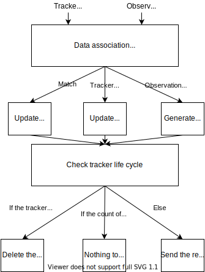
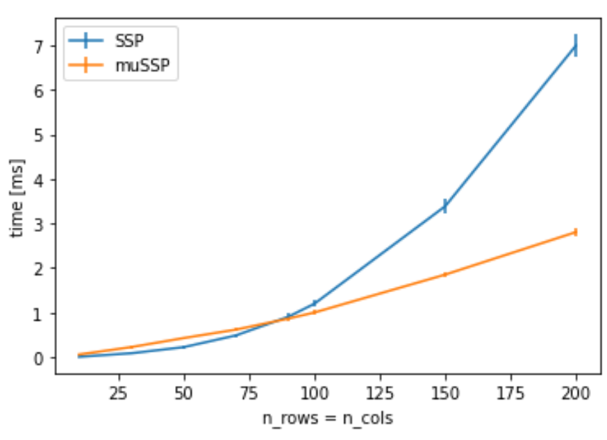
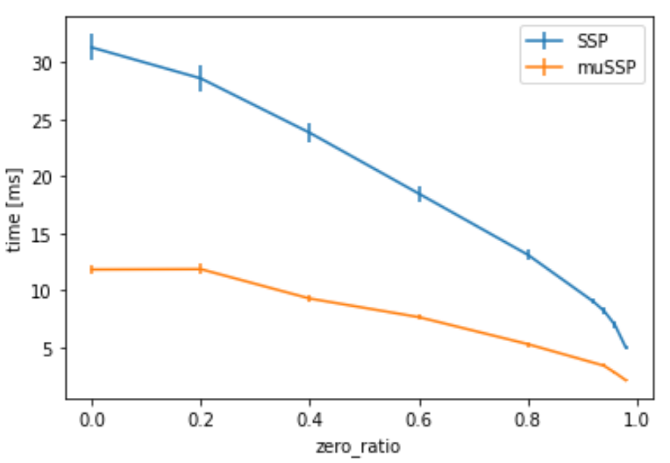

# multi_object_tracker

## 目的

検出結果は時系列で処理されます。主な目的はIDの付与と速度の推定です。

## 内部動作/アルゴリズム

このマルチオブジェクトトラッカーは、データ関連付けとEKFで構成されています。

### データ関連付け

データ関連付けは、最小コスト最大フロー問題と呼ばれる、最大スコアマッチングを実行します。
このパッケージでは、mussp[1]をソルバーとして使用します。
さらに、観測結果をトレーサーに関連付ける場合、クラスラベルに応じて、BEVのオブジェクト領域、マハラノビス距離、最大距離などのゲートがデータ関連付けに設けられます。

### EKFトラッカー

歩行者、自転車（オートバイ）、自動車、未知のモデルが利用できます。
歩行者または自転車トラッカーは、歩行者の追跡と自転車の追跡の間の移行を可能にするために、それぞれのEKFモデルと同時に実行されます。
トラックやバスなどの大型車両については、乗用車と区別が難しく、安定しないため、乗用車と大型車両のモデルを分けています。そのため、乗用車と大型車両に別々のモデルを用意し、それらのモデルをそれぞれのEKFモデルと同時に実行して安定性を確保しています。

<!-- このパッケージの仕組みを記述します。フローチャートや図が適しています。サブセクションを適宜追加してください。

例:
  ### フローチャート

  ...(PlantUMLなど)

  ### 状態遷移

  ...(PlantUMLなど)

  ### ターゲット障害物のフィルタリング方法

  ...

  ### 軌道の最適化方法

  ...
-->

## 入出力

### 入力

複数の入力が入力チャネルパラメータ（以下で説明）で事前に定義されており、入力は設定できます

| 名称                       | タイプ                       | 説明             |
| ------------------------- | -------------------------- | ---------------- |
| `selected_input_channels` | `std::vector<std::string>` | チャンネル名の配列 |

- デフォルト値: `selected_input_channels:="['detected_objects']"`, マージされたDetectedObjectメッセージ
- 複数入力例: `selected_input_channels:="['lidar_centerpoint','camera_lidar_fusion','detection_by_tracker','radar_far']"`

### 出力

| 名称       | 型                                                | 内容     |
| ---------- | ------------------------------------------------ | --------------- |
| `~/output` | `autoware_perception_msgs::msg::TrackedObjects` | 追跡対象物 |

## パラメータ

### 入力チャンネルパラメータ

{{ json_to_markdown("perception/autoware_multi_object_tracker/schema/input_channels.schema.json") }}

### コアパラメーター

{{ json_to_markdown("perception/autoware_multi_object_tracker/schema/multi_object_tracker_node.schema.json") }}
{{ json_to_markdown("perception/autoware_multi_object_tracker/schema/data_association_matrix.schema.json") }}

#### シミュレーションパラメータ

{{ json_to_markdown("perception/autoware_multi_object_tracker/schema/simulation_tracker.schema.json") }}

## 仮定 / 制限事項

[モデルの説明](models.md)をご参照ください。

## (任意) エラー検出と処理

<!-- エラー検出方法とエラーからの回復方法を記述します。

例:
このパッケージでは最大20個の障害物に対応できます。障害物はこの数を超えた場合、このノードは処理を放棄し、診断エラーを発生させます。
-->

## (任意) パフォーマンスの特性評価

### muSSP の評価

評価によると、muSSP はマトリックスサイズが 100 を超える場合、通常の [SSP](src/data_association/successive_shortest_path) より高速です。

95% のスパース性でさまざまなマトリックスサイズでの実行時間。実際のデータでは、スパース性は多くの場合 95% 前後でした。

マトリックスサイズ 100 でスパース性を変えたときの作業時間。

## (任意) 参考文献 / 外部リンク

このパッケージは外部コードを使用しています。

| 名前                                                     | ライセンス                                               | 元のリポジトリ                                           |
| ---------------------------------------------------------- | --------------------------------------------------------- | ------------------------------------------------------------- |
| [muSSP](src/data_association/mu_successive_shortest_path) | [Apache-2.0](https://www.apache.org/licenses/LICENSE-2.0) | <https://github.com/yu-lab-vt/muSSP> |

[1] Wang, C.、Wang, Y.、Wang, Y.、Wu, C.-t.、および Yu, G.、 “muSSP: 多物体追跡のための効率的な最小費用フローアルゴリズム” NeurIPS, 2019

## (オプション) 今後の拡張 / 未実装部分

<!-- このパッケージの今後の拡張を記述します。

例:
  現在、このパッケージはチャタリング障害物を適切に処理できません。認識レイヤーに確率フィルタを追加して改善する予定です。
  また、グローバルにする必要があるパラメータがいくつかあります（例: 車両サイズ、最大操舵角など）。これらはリファクタリングされ、グローバルパラメータとして定義されるため、さまざまなノード間で同じパラメータを共有できます。
-->

