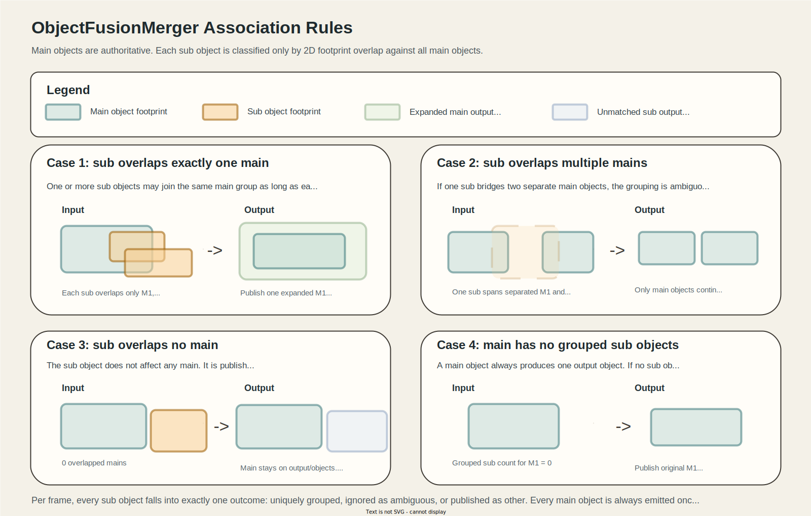

# object_fusion_merger

## Purpose

`object_fusion_merger` groups sub detected objects by footprint overlap with main detected objects and keeps the main stream as the base output.
For each main object, it expands the main object's shape so that the main region and all uniquely overlapped sub regions are enclosed by the main shape type.

The node is stateless across frames.

## Inputs / Outputs

### Input

| Name                | Type                                             | Description           |
| ------------------- | ------------------------------------------------ | --------------------- |
| `input/main_object` | `autoware_perception_msgs::msg::DetectedObjects` | Main detected objects |
| `input/sub_object`  | `autoware_perception_msgs::msg::DetectedObjects` | Sub detected objects  |

### Output

| Name            | Type                                             | Description                                                       |
| --------------- | ------------------------------------------------ | ----------------------------------------------------------------- |
| `output/objects` | `autoware_perception_msgs::msg::DetectedObjects` | Main-based detected objects after association and shape expansion |
| `output/other_objects` | `autoware_perception_msgs::msg::DetectedObjects` | Sub detected objects that did not match any main object |

The packaged launch file remaps these by default to the following topics:

- `output/objects` -> `fusion/objects`
- `output/other_objects` -> `others/objects`

## Processing Flow

1. Synchronize the two input topics with `ApproximateTime`.
2. Transform both object lists into `base_link_frame_id`.
3. For each sub object, check whether its footprint overlaps each main object footprint.
4. If the sub object overlaps exactly one main object, add it to that main object's sub group.
5. If the sub object overlaps multiple main objects, ignore it.
6. If the sub object overlaps no main objects, publish it on `output/other_objects`.
7. For each main object, expand its shape to enclose the main object and all grouped sub objects.
8. Publish all main objects, expanded or unchanged, on `output/objects`.

## Shape Update Rule

The output object is always based on the main object, but the geometry-related fields can move to fit the covered region.

- Orientation is kept from the main object.
- Twist is kept from the main object.
- Classification is kept from the main object.
- Existence probability is kept from the main object.

Pose handling depends on the enclosing shape.

- `BOUNDING_BOX`: x/y center is moved so the box tightly fits the union of the main object and grouped sub objects.
- `CYLINDER`: x/y center remains the main-object center, while the radius expands to cover the union.
- `POLYGON`: x/y pose remains the main-object pose and the footprint is rebuilt in the main local frame.
- For all shape types, the z center and height are updated to fit the full z-range of the main object and grouped sub objects.

The enclosing shape is generated using the main object's shape type.

- `BOUNDING_BOX`: compute the union bounds in the main local frame, shift the box center to the union center, and set dimensions to the exact x/y span.
- `CYLINDER`: enlarge radius to cover the farthest union point.
- `POLYGON`: build a convex hull from the union footprint points in the main local frame.

The height dimension is updated so the output encloses the full z-extent of the main object and all grouped sub objects.

### Notes Per Shape Type

- `BOUNDING_BOX` main objects remain axis-aligned in the main-object local frame, but the output center is shifted to tightly fit the union instead of expanding symmetrically around the original main pose.
- `CYLINDER` main objects are expanded isotropically in x/y because the enclosing radius is computed from the farthest union point. The resulting diameter is identical for `dimensions.x` and `dimensions.y`.
- `POLYGON` main objects keep polygon output and rebuild the footprint from the convex hull of the combined main/sub footprint points. Concavities in the original input footprints are not preserved.

## Association Preconditions

Grouping happens only by 2D footprint overlap.

- If a sub object overlaps exactly one main object, it contributes to that main object's expanded shape.
- If a sub object overlaps multiple main objects, it is ignored and is not published.
- If a sub object overlaps no main objects, it is published via `output/other_objects`.

## Parameters

Current parameters in `config/object_fusion_merger.param.yaml` are:

- `sync_queue_size`
- `base_link_frame_id`

## Default Behavior

With the default configuration:

- each main object always produces one output object based on the main object
- unmatched main objects remain in the output
- sub objects that overlap no main objects are emitted on `output/other_objects`
- sub objects that overlap multiple main objects are ignored

## Test Coverage

The current focused test suite covers the following cases:

- uniquely overlapped `BOUNDING_BOX` pair shifts and expands the main box to fit the union
- unmatched main objects remain in the output and non-overlapping sub objects are published separately
- sub objects that overlap multiple main objects are ignored
- multiple sub objects can expand one main object together
- `BOUNDING_BOX` main object can enclose a larger sub `POLYGON`
- `CYLINDER` main object expands to cover the union footprint
- `POLYGON` main object rebuilds its footprint from the union convex hull

## Known Limits

- There is no temporal fusion across messages.
- The node does not maintain track IDs or track existence over time.
- `CYLINDER` and `POLYGON` keep the main object's x/y pose, so their enclosing geometry can still be conservative compared with a fully re-centered fit.
- Sub objects that bridge multiple main objects are intentionally ignored rather than split.

## Intended Usage

This node is intended for cases where the main detector should stay authoritative, while the sub detector is used only to expand the geometric extent of matched objects.
