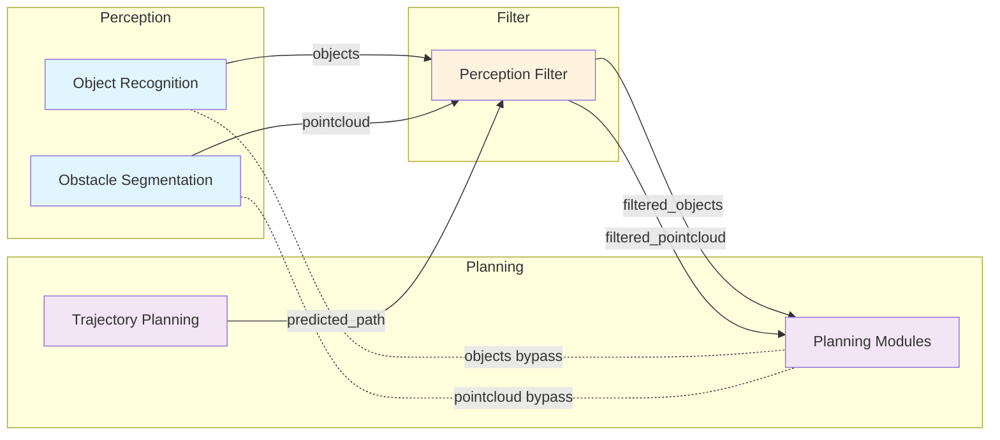
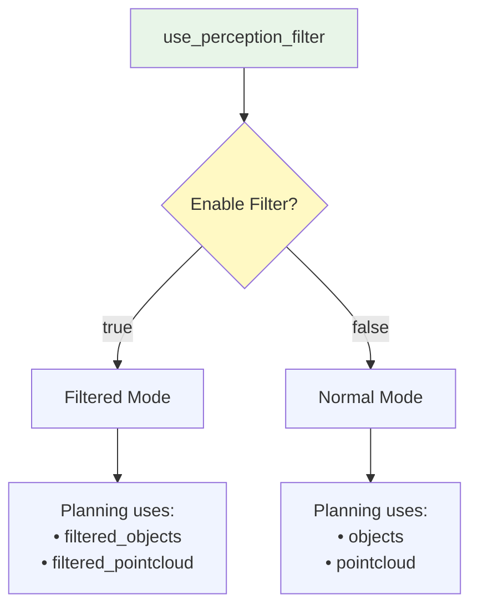

# autoware_perception_filter

## Purpose

This package provides a perception filter node that filters perception data based on external approval signals and predicted path proximity. It receives perception outputs (objects and pointcloud) and publishes filtered versions based on approval status and distance from the predicted path.

## Inputs / Outputs

### Input

| Name                 | Type                                              | Description                                |
| -------------------- | ------------------------------------------------- | ------------------------------------------ |
| `input/objects`      | `autoware_perception_msgs::msg::PredictedObjects` | Predicted objects from perception module   |
| `input/pointcloud`   | `sensor_msgs::msg::PointCloud2`                   | Obstacle pointcloud from perception module |
| `input/approval`     | `std_msgs::msg::Bool`                             | External approval signal                   |
| `input/predicted_path` | `autoware_planning_msgs::msg::Trajectory`         | Predicted path/trajectory for filtering    |

### Output

| Name                         | Type                                              | Description                  |
| ---------------------------- | ------------------------------------------------- | ---------------------------- |
| `output/filtered_objects`    | `autoware_perception_msgs::msg::PredictedObjects` | Filtered predicted objects   |
| `output/filtered_pointcloud` | `sensor_msgs::msg::PointCloud2`                   | Filtered obstacle pointcloud |

## Parameters

### Core Parameters

| Name                          | Type   | Default Value | Description                                    |
| ----------------------------- | ------ | ------------- | ---------------------------------------------- |
| `enable_object_filtering`     | bool   | true          | Enable/disable object filtering                |
| `enable_pointcloud_filtering` | bool   | true          | Enable/disable pointcloud filtering            |
| `filter_distance`             | double | 3.0           | Distance from predicted path to filter objects [m] |
| `min_distance`                | double | 1.0           | Minimum distance for pointcloud filtering [m]  |

## Topic Name Switching Strategy

### Overview

The perception filter integrates with Autoware's launch system through a topic name switching strategy. This allows the system to seamlessly switch between filtered and unfiltered perception data based on the `use_perception_filter` launch argument.

### Launch Arguments

| Name                    | Type | Default Value | Description                                  |
| ----------------------- | ---- | ------------- | -------------------------------------------- |
| `use_perception_filter` | bool | false         | Enable/disable perception filter integration |

### Topic Remapping Strategy

When `use_perception_filter` is enabled, the following topic remapping occurs:

#### Objects Topic

- **Filtered mode** (`use_perception_filter:=true`): Planning modules subscribe to `/perception/object_recognition/filtered_objects`
- **Normal mode** (`use_perception_filter:=false`): Planning modules subscribe to `/perception/object_recognition/objects`

#### Pointcloud Topic

- **Filtered mode** (`use_perception_filter:=true`): Planning modules subscribe to `/perception/obstacle_segmentation/filtered_pointcloud`
- **Normal mode** (`use_perception_filter:=false`): Planning modules subscribe to `/perception/obstacle_segmentation/pointcloud`

#### Topic Flow Diagram



#### Topic Switching States



### Integration Points

The topic switching is implemented at multiple levels in the launch hierarchy:

1. **autoware.launch.xml**: Defines conditional topic variables
2. **tier4_planning_component.launch.xml**: Receives and passes topic arguments
3. **Planning modules**: Use remapped topics for perception input

### Example Usage

#### Enable Perception Filter (Real Vehicle)

```bash
ros2 launch autoware_launch autoware.launch.xml \
  map_path:=/path/to/map \
  vehicle_model:=your_vehicle \
  sensor_model:=your_sensor \
  use_perception_filter:=true
```

#### Disable Perception Filter (Default)

```bash
ros2 launch autoware_launch autoware.launch.xml \
  map_path:=/path/to/map \
  vehicle_model:=your_vehicle \
  sensor_model:=your_sensor \
  use_perception_filter:=false
```

#### Planning Simulator with Perception Filter

```bash
ros2 launch autoware_launch planning_simulator.launch.xml \
  map_path:=/path/to/map \
  vehicle_model:=your_vehicle \
  sensor_model:=your_sensor \
  use_perception_filter:=true
```

### Implementation Details

The topic switching is implemented using ROS 2 launch system's conditional logic:

```xml
<!-- Conditional topic remapping based on perception filter usage -->
<let name="objects_topic" value="/perception/object_recognition/filtered_objects" if="$(var use_perception_filter)"/>
<let name="objects_topic" value="/perception/object_recognition/objects" unless="$(var use_perception_filter)"/>
<let name="pointcloud_topic" value="/perception/obstacle_segmentation/filtered_pointcloud" if="$(var use_perception_filter)"/>
<let name="pointcloud_topic" value="/perception/obstacle_segmentation/pointcloud" unless="$(var use_perception_filter)"/>
```

These variables are then passed through the launch hierarchy to ensure all planning modules receive the correct topic names.

## Usage

### Launch

```bash
ros2 launch autoware_perception_filter perception_filter.launch.xml
```

### Default Topic Mapping

- Input objects: `/perception/object_recognition/objects`
- Input pointcloud: `/perception/obstacle_segmentation/pointcloud`
- Input approval: `/external/approval`
- Input predicted path: `/planning/scenario_planning/trajectory`
- Output filtered objects: `/perception/object_recognition/filtered_objects`
- Output filtered pointcloud: `/perception/obstacle_segmentation/filtered_pointcloud`

## Behavior

### Approval-based Filtering
- **When approval is received (true)**: Proceeds to path-based filtering
- **When approval is not received (false)**:
  - Objects are filtered out (empty object list is published)
  - Pointcloud is filtered out (empty pointcloud is published)

### Path-based Filtering
When approval is received and a predicted path is available:

#### Object Filtering
- **Objects**: Objects that are closer than `filter_distance` meters from the predicted path are filtered out
- **Logic**: `distance_to_path < filter_distance` → Filter out

#### Pointcloud Filtering
- **Points**: Points that are between `min_distance` and `filter_distance` meters from the predicted path are filtered out
- **Logic**: `min_distance < distance_to_path < filter_distance` → Filter out
- **Points closer than min_distance**: Always kept (safety margin)
- **Points farther than filter_distance**: Always kept

### Fallback Behavior
- **When no predicted path is available**: All perception data is passed through unchanged
- **When path is empty**: All perception data is passed through unchanged

## Node Graph


_See [perception_filter_node_graph.drawio](docs/perception_filter_node_architecture.drawio) for the editable DrawIO diagram._
