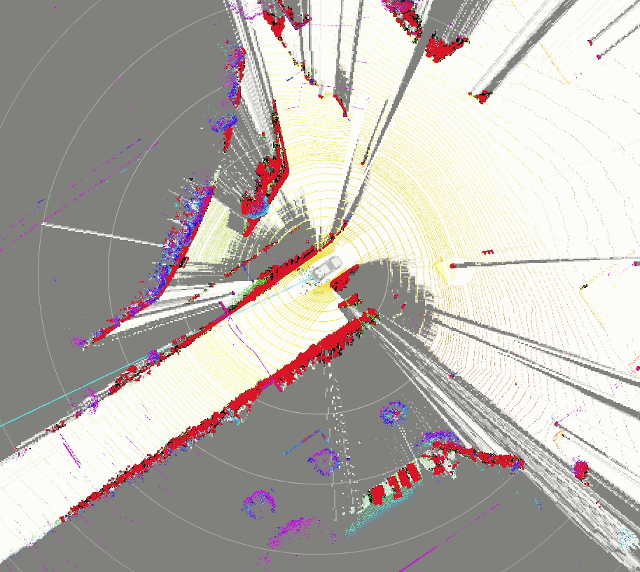
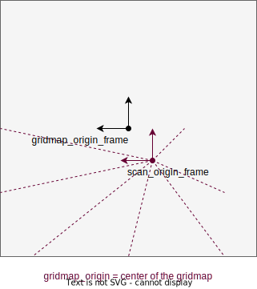

# autoware_probabilistic_occupancy_grid_map

## 目的

このパッケージは、障害物の確率をオキュパンシーグリッドマップとして出力します。


## 参照/外部リンク

- [ポイントクラウドベースのオキュパンシーグリッドマップ](pointcloud-based-occupancy-grid-map.md)
- [レーザースキャンベースのオキュパンシーグリッドマップ](laserscan-based-occupancy-grid-map.md)
- [グリッドマップフュージョン](synchronized_grid_map_fusion.md)

## 設定

オキュパンシーグリッドマップは`map_frame`上に生成され、グリッドの向きは固定されています。

`scan_origin_frame`と`gridmap_origin_frame`を選択する必要があります。これらはそれぞれセンサー原点とグリッドマップ原点です。特に、メインLiDARセンサーフレーム（サンプルビークルでは`velodyne_top`）を`scan_origin_frame`として設定すると、パフォーマンスが向上します。



### パラメーター

{{ json_to_markdown("perception/autoware_probabilistic_occupancy_grid_map/schema/binary_bayes_filter_updater.schema.json") }}
{{ json_to_markdown("perception/autoware_probabilistic_occupancy_grid_map/schema/grid_map.schema.json") }}
{{ json_to_markdown("perception/autoware_probabilistic_occupancy_grid_map/schema/laserscan_based_occupancy_grid_map.schema.json") }}
{{ json_to_markdown("perception/autoware_probabilistic_occupancy_grid_map/schema/multi_lidar_pointcloud_based_occupancy_grid_map.schema.json") }}
{{ json_to_markdown("perception/autoware_probabilistic_occupancy_grid_map/schema/pointcloud_based_occupancy_grid_map.schema.json") }}
{{ json_to_markdown("perception/autoware_probabilistic_occupancy_grid_map/schema/synchronized_grid_map_fusion_node.schema.json") }}

### 入力ポイントクラウドをダウンサンプリング（オプション）

`downsample_input_pointcloud`を`true`に設定すると、入力ポイントクラウドがダウンサンプリングされ、以下のトピックも使用されます。この機能は現在、ポイントクラウドベースのオキュパンシーグリッドマップ用のみです。

- pointcloud_based_occupancy_grid_map method


```yaml
# downsampled raw and obstacle pointcloud
/perception/occupancy_grid_map/obstacle/downsample/pointcloud
/perception/occupancy_grid_map/raw/downsample/pointcloud
```

- multi_lidar_pointcloud_based_point_cloud


```yaml
# downsampled raw and obstacle pointcloud
/perception/occupancy_grid_map/obstacle/downsample/pointcloud
/perception/occupancy_grid_map/<sensor_name>/raw/downsample/pointcloud
```

### テスト

このパッケージは `gtest` を使用したユニットテストを提供します。
次のコマンドでテストを実行できます。


```bash
colcon test --packages-select autoware_probabilistic_occupancy_grid_map --event-handlers console_direct+
```

**テストは次の内容を含みます。**

- コスト値変換関数のユニットテスト
- ユーティリティ関数のユニットテスト
- オキュパンシグリッドマップ融合関数のユニットテスト
- ポイントクラウドベースオキュパンシグリッドマップの入出力テスト

