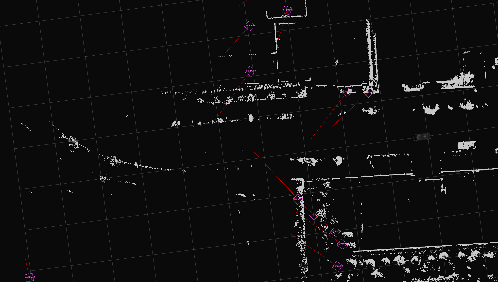
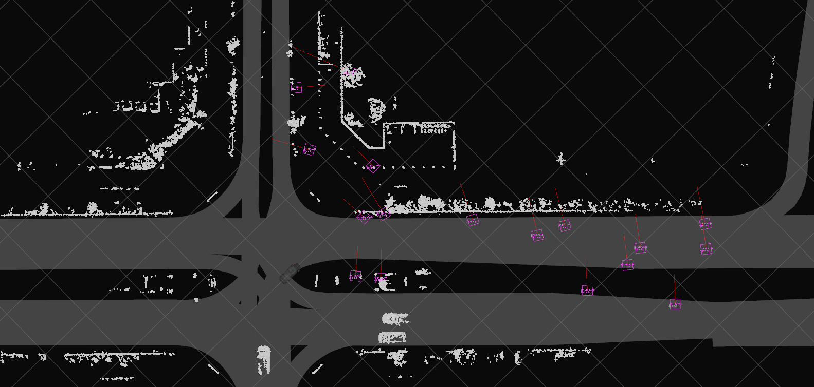
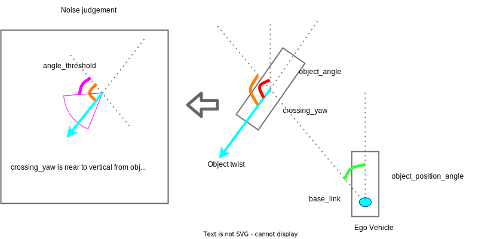

# autoware_radar_crossing_objects_noise_filter

このパッケージには、[autoware_perception_msgs/msg/DetectedObject](https://github.com/autowarefoundation/autoware_msgs/tree/main/autoware_perception_msgs/msg/DetectedObject.idl) のレーダーノイズフィルタモジュールが含まれます。
このパッケージは、自車と交差するノイズオブジェクトをフィルタリングできます。

## 設計

### 背景

このパッケージは、自車と交差するノイズオブジェクトをフィルタすることを目的としています。
これらのオブジェクトがノイズである理由は次のとおりです。

- 1. ドップラー速度を持つ物体は、鉛直速度を持つ物体よりも信頼できます。

レーダーはオブジェクトの速度情報をドップラー速度として取得できますが、ドップラー速度に対する鉛直速度を直接取得することはできません。
一部のレーダーは、推定によってドップラー速度だけでなく鉛直速度も出力できます。
鉛直速度の推定が不十分な場合、ノイズオブジェクトが出力されます。
言い換えると、自車から見て鉛直方向のひねりを持つオブジェクトはノイズオブジェクトになりやすいということです。

例を下の図に示します。速度の推定が静止オブジェクトで失敗し、自車の前面にゴーストオブジェクトが交差してしまいます。



- 2. 自車の旋回はレーダーの出力に影響します。

自車が旋回すると、オブジェクトレベルで出力を生成するレーダーは、[radar_tracks_msgs_converter](https://github.com/autowarefoundation/autoware.universe/tree/main/perception/autoware_radar_tracks_msgs_converter) が自車ひねりで補償を行っていても、オブジェクトのひねりを正しく推定できない場合があります。
したがって、レーダーによって検出されるオブジェクトがベースリンクに対して円運動をしている場合、速度が正しく推定されていない可能性が高く、そのオブジェクトは静止オブジェクトである可能性があります。

例を下の図に示します。自車が右折すると、周囲のオブジェクトは左回りの円運動をします。



### アルゴリズム

自車と交差するオブジェクトをフィルタリングするために、このパッケージは次のアルゴリズムでオブジェクトをフィルタリングします。




```cpp
  // If velocity of an object is rather than the velocity_threshold,
  // and crossing_yaw is near to vertical
  // angle_threshold < crossing_yaw < pi - angle_threshold
  if (
    velocity > node_param_.velocity_threshold &&
    abs(std::cos(crossing_yaw)) < abs(std::cos(node_param_.angle_threshold))) {
    // Object is noise object;
  } else {
    // Object is not noise object;
  }
```

## インターフェース

### 入力

- `~/input/objects` (`autoware_perception_msgs/msg/DetectedObjects.msg`)
  - 入力レーダーオブジェクト

### 出力

- `~/output/noise_objects` (`autoware_perception_msgs/msg/DetectedObjects.msg`)
  - ノイズオブジェクト
- `~/output/filtered_objects` (`autoware_perception_msgs/msg/DetectedObjects.msg`)
  - フィルタリングオブジェクト

### パラメータ

- `angle_threshold` (double) [rad]
  - デフォルトパラメータは1.0472です。

このパラメータはフィルタリングする角度の閾値であり、0 < `angle_threshold` < pi / 2の条件があります。交差角がこのパラメータより大きい場合、ノイズオブジェクトの候補となります。言い換えると、このパラメータより小さい場合はフィルタリングされたオブジェクトです。
このパラメータを小さく設定すると、より多くのオブジェクトがノイズと見なされます。詳細はアルゴリズムの章を参照してください。

- `velocity_threshold` (double) [m/s]
  - デフォルトパラメータは3.0です。

このパラメータは、フィルタリングする速度の閾値です。オブジェクトの速度がこのパラメータより大きい場合、ノイズオブジェクトの候補となります。言い換えると、オブジェクトの速度がこのパラメータより小さい場合はフィルタリングされたオブジェクトです。
このパラメータを小さく設定すると、より多くのオブジェクトがノイズと見なされます。詳細はアルゴリズムの章を参照してください。

