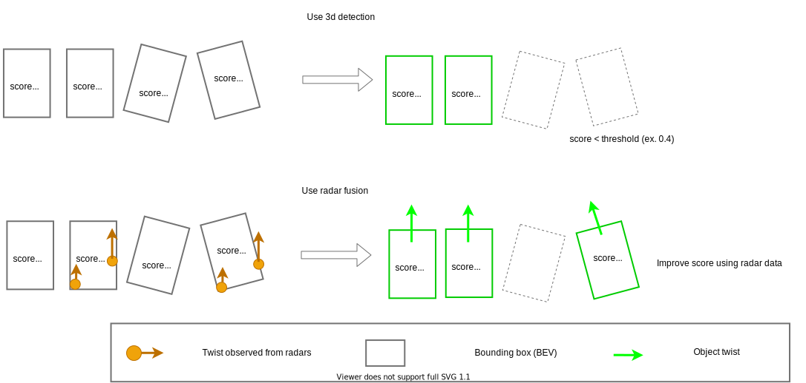

# `autoware_radar_fusion_to_detected_object`

このパッケージは、レーダー検出オブジェクトと 3D 検出オブジェクトのセンサフュージョンモジュールを含んでいます。

フュージョンノードは次のことができます。

- レーダーデータを正常にマッチングした場合に、3D 検出に速度を付加します。トラッキングモジュールはこの速度情報を使用してトラッキング結果を向上させ、プランニングモジュールはこの情報を使用して適応型クルーズコントロールなどのアクションを実行します。
- 対応するレーダー検出が見つかったときに、低信頼性の 3D 検出を向上させます。



## 設計

### 背景

このパッケージは、LiDAR ベースの 3D 検出出力とレーダーデータを融合するものです。
LiDAR ベースの 3D 検出は、オブジェクトの位置とサイズを高精度で推定できますが、オブジェクトの速度を推定できません。
レーダーデータはオブジェクトのドップラー速度を推定できますが、オブジェクトの位置とサイズを高精度で推定できません。
このフュージョンパッケージは、これらの特性データを融合し、オブジェクトの位置、サイズ、速度を高精度で推定することを目的としています。

### アルゴリズム

コアアルゴリズムのドキュメントは [こちら](docs/algorithm.md) にあります。

## コアアルゴリズムのインターフェイス

コアアルゴリズムのパラメータは `core_params` として設定できます。

### センサフュージョン用パラメータ

- `bounding_box_margin` (double) [m]
  - デフォルトパラメータは 2.0 です。

このパラメータは、2D バードビューバウンディングボックスを各辺で拡張するための距離です。
このパラメータは、拡張されたボックス内にあるレーダー重心を検出するためのしきい値として使用されます。

- `split_threshold_velocity` (double) [m/s]
  - デフォルトパラメータは 5.0 です。

このパラメータは、レーダー情報から 2 つのオブジェクトに分割するかどうかを決定するためのオブジェクトの速度しきい値です。
この機能は現在実装されていません。

- `threshold_yaw_diff` (double) [rad]
  - デフォルトパラメータは 0.35 です。

このパラメータは、ヨー方向のしきい値です。
LiDAR ベースの検出オブジェクトとレーダー速度のヨー度の差が大きい場合、レーダー情報は出力オブジェクトに付加されます。

### 速度推定用の重みパラメータ

これらの重みパラメータを調整するには、[ドキュメント](docs/algorithm.md) を詳しく参照してください。

- `velocity_weight_average` (double)
- デフォルトパラメータは 0.0 です。

このパラメータは、速度推定におけるレーダーデータの平均ツイストの係数です。

- `velocity_weight_median` (double)
- デフォルトパラメータは 0.0 です。

このパラメータは、速度推定におけるレーダーデータのメディアンねじれのねじれ係数です。

- `velocity_weight_min_distance` (double)
- デフォルトのパラメータは 1.0 です。

このパラメータは、速度推定においてバウンディングボックスの中心付近にあるレーダーデータのねじれ係数です。

- `velocity_weight_target_value_average` (double)
- デフォルトのパラメータは 0.0 です。

このパラメータは、速度推定におけるターゲット値加重平均のねじれ係数です。レーダーポイントクラウドを使用している場合、ターゲット値は振幅です。レーダーオブジェクトを使用している場合、ターゲット値は確率です。

- `velocity_weight_target_value_top` (double)
- デフォルトのパラメータは 0.0 です。

このパラメータは、速度推定における最上位ターゲット値レーダーデータのねじれ係数です。レーダーポイントクラウドを使用している場合、ターゲット値は振幅です。レーダーオブジェクトを使用している場合、ターゲット値は確率です。

### 固定オブジェクト情報の parámetros

- `convert_doppler_to_twist` (bool)
  - デフォルトのパラメータは false です。

このパラメータは、検出されたオブジェクトのヨー情報を用いてドップラー速度のねじれに変換するかのフラグです。

- `threshold_probability` (float)
  - デフォルトのパラメータは 0.4 です。

このパラメータは、出力オブジェクトをフィルタするためのしきい値です。出力オブジェクトの確率がこのパラメータよりも低く、出力オブジェクトにレーダーポイント/オブジェクトがない場合、そのオブジェクトを削除します。

- `compensate_probability` (bool)
  - デフォルトのパラメータは false です。

このパラメータは、確率補正を使用するかのフラグです。このパラメータが true の場合、オブジェクトの確率をしきい値確率で補正します。

## `autoware_radar_object_fusion_to_detected_object` のインターフェース

レーダーオブジェクトと検出されたオブジェクトによるセンサーフュージョン。

- 計算コストは O(nm) です。
  - n: レーダーオブジェクトの数。
  - m: 3 次元物体検出のオブジェクトの数。

### 起動方法


```sh
ros2 launch autoware_radar_fusion_to_detected_object radar_object_to_detected_object.launch.xml
```

### 入力

- `~/input/objects` (`autoware_perception_msgs/msg/DetectedObjects.msg`)
  - 3D検出オブジェクト

- `~/input/radar_objects` (`autoware_perception_msgs/msg/DetectedObjects.msg`)
  - レーダーオブジェクト。frame_idは`~/input/objects`と同じである必要があることに注意

### 出力

- `~/output/objects` (`autoware_perception_msgs/msg/DetectedObjects.msg`)
  - ねじれを持った3D検出オブジェクト

- `~/debug/low_confidence_objects` (`autoware_perception_msgs/msg/DetectedObjects.msg`)
  - 信頼度の低さにより`~/output/objects`として出力されない3D検出オブジェクト

### パラメータ

コアアルゴリズムのパラメータは`node_params`として設定できます。

- `update_rate_hz` (double) [hz]
  - デフォルトパラメータは20.0です。

このパラメータは`onTimer`関数の更新レートです。このパラメータは入力トピックのフレームレートと同じである必要があります。

## radar_scan_fusion_to_detected_objectのインターフェイス（未定）

実装中

