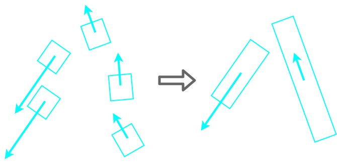
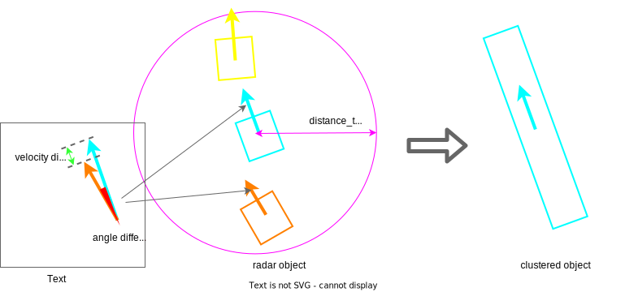

# `autoware_radar_object_clustering`

このパッケージは、[autoware_perception_msgs/msg/DetectedObject](https://github.com/autowarefoundation/autoware_msgs/tree/main/autoware_perception_msgs/msg/DetectedObject.idl) 入力向けのレーダーオブジェクトクラスタリングを含んでいます。

このパッケージは、[radar_tracks_msgs_converter](https://github.com/autowarefoundation/autoware.universe/tree/main/perception/autoware_radar_tracks_msgs_converter) によって RadarTracks から変換され、ノイズフィルタによって処理された DetectedObjects からクラスタリングされたオブジェクトを作成できます。
つまり、このパッケージは、1 つのオブジェクトからの複数のレーダー検出を 1 つに結合して、クラスとサイズを調整できます。



## 設計

### 背景

オブジェクト出力を備えたレーダーでは、特に大型車 (トラックやトレーラー) では、1 つのオブジェクトから複数の検出結果が得られる場合があります。
その複数の検出結果は、追跡モジュールでオブジェクトが分離される原因となります。
そこで、このパッケージによって、複数の検出結果が事前に 1 つのオブジェクトにクラスタリングされます。

### アルゴリズム

- 1. `base_link` からの距離でソート

最初に、DetectedObjects 内のオブジェクトの順番による結果の変更を防ぐために、入力オブジェクトは `base_link` からの距離でソートされます。
さらに、閉塞を考慮して近さ順にマッチングを適用するために、オブジェクトは距離の短い順にソートされます。

- 2. クラスタリング

2 つのレーダーオブジェクトが近く、2 つのレーダーオブジェクト間の進行方向と速度が類似している (この程度はパラメータによって定義されます) 場合、それらはクラスタリングされます。
このマッチングのパラメータはレーダーの特性に影響を受けることに注意してください。
たとえば、距離レンジまたは角度の分解能が低く、速度の精度が高い場合、`distance_threshold` パラメータを大きくし、速度の類似性に強く注目したマッチングを設定する必要があります。



すべてのレーダーオブジェクトのグループ化後、複数のレーダーオブジェクトがグループ化されている場合、新しいクラスタリングされたオブジェクトの運動学はその平均から、新しいクラスタリングされたオブジェクトのラベルと形状はレーダーオブジェクト内の最上位の自信から計算されます。

- 3. 固定ラベル修正

レーダー出力からのラベル情報が不正確な場合は、`is_fixed_label` パラメータを `true` に設定することをお勧めします。
パラメータが `true` の場合、クラスタリングされたオブジェクトのラベルは `fixed_label` パラメータで設定されたラベルで上書きされます。
このパッケージをレーダーを使った遠くの動的オブジェクト検出に使用する場合、パラメータは `VEHICLE` に設定することをお勧めします。

- 4. 固定サイズ修正

レーダー出力からのサイズ情報が不正確な場合は、`is_fixed_size` パラメータを `true` に設定することをお勧めします。
パラメータが `true` の場合、クラスタリングされたオブジェクトのサイズは `size_x`、`size_y`、および `size_z` パラメータで設定されたラベルで上書きされます。
このパッケージをレーダーを使った遠くの動的オブジェクト検出に使用する場合、パラメータは車両の平均サイズに近い `size_x`、`size_y`、`size_z` に設定することをお勧めします。
[multi_objects_tracker](https://github.com/autowarefoundation/autoware.universe/tree/main/perception/autoware_multi_object_tracker) で使用するには、サイズパラメータは `min_area_matrix` パラメータを超える必要があります。

### 制限事項

現時点では、クラスタリングされたオブジェクトのサイズの推定は実装されていません。
そのため、`is_fixed_size` パラメータを `true` に設定し、サイズパラメータを車両の平均サイズに近い値に設定することをお勧めします。

## インターフェイス

### 入力

- `~/input/objects` (`autoware_perception_msgs/msg/DetectedObjects.msg`)
  - レーダーオブジェクト

### 出力

- `~/output/objects` (`autoware_perception_msgs/msg/DetectedObjects.msg`)
  - 出力オブジェクト

### パラメータ

- `angle_threshold` (double) [rad]
  - デフォルト値は0.174です。
- `distance_threshold` (double) [m]
  - デフォルト値は4.0です。
- `velocity_threshold` (double) [m/s]
  - デフォルト値は2.0です。

これらのパラメータは、アルゴリズムセクションに詳細に記載されている「クラスタリング」処理において、レーダー検出が1つのオブジェクトから来ており、角度、距離、速度の差がしきい値よりも小さい場合、2つのオブジェクトは1つのクラスタリングされたオブジェクトにマージされます。
これらのパラメータが大きいほど、より多くのオブジェクトが1つのクラスタリングされたオブジェクトにマージされます。

これらは以下のように`isSameObject`関数で使用されます。


```cpp

bool RadarObjectClusteringNode::isSameObject(
  const DetectedObject & object_1, const DetectedObject & object_2)
{
  const double angle_diff = std::abs(autoware::universe_utils::normalizeRadian(
    tf2::getYaw(object_1.kinematics.pose_with_covariance.pose.orientation) -
    tf2::getYaw(object_2.kinematics.pose_with_covariance.pose.orientation)));
  const double velocity_diff = std::abs(
    object_1.kinematics.twist_with_covariance.twist.linear.x -
    object_2.kinematics.twist_with_covariance.twist.linear.x);
  const double distance = autoware::universe_utils::calcDistance2d(
    object_1.kinematics.pose_with_covariance.pose.position,
    object_2.kinematics.pose_with_covariance.pose.position);

  if (
    distance < node_param_.distance_threshold && angle_diff < node_param_.angle_threshold &&
    velocity_diff < node_param_.velocity_threshold) {
    return true;
  } else {
    return false;
  }
}
```

- `is_fixed_label` (bool)
  - デフォルトパラメータはFalseです。
- `fixed_label` (string)
  - デフォルトパラメータは"UNKNOWN"です。

`is_fixed_label`は固定ラベルを使用するフラグです。
Trueの場合、クラスタ化されたオブジェクトのラベルは`fixed_label`パラメータで設定されたラベルで上書きされます。
レーダーオブジェクトにラベル情報がない場合は、固定ラベルを使用することを推奨します。

- `is_fixed_size` (bool)
  - デフォルトパラメータはFalseです。
- `size_x` (double) [m]
  - デフォルトパラメータは4.0です。
- `size_y` (double) [m]
  - デフォルトパラメータは1.5です。
- `size_z` (double) [m]
  - デフォルトパラメータは1.5です。

`is_fixed_size`は固定サイズのフラグです。
Trueの場合、クラスタ化されたオブジェクトの大きさは、`size_x`、`size_y`、`size_z`パラメータで設定されたラベルで上書きされます。

