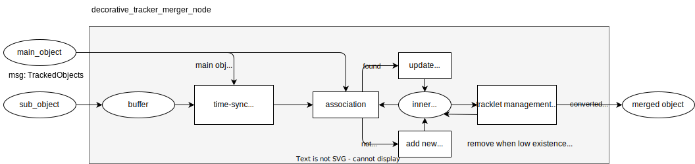

# 追跡オブジェクトのマージ

## 目的

このパッケージは、異なるセンサーから 2 つの追跡オブジェクトをマージします。

## 仕組み / アルゴリズム

異なるセンサーからの追跡オブジェクトのマージは、データアソシエーションと状態融合アルゴリズムの組み合わせです。

詳細なプロセスはマージポリシーによって異なります。

### decorative_tracker_merger

``decorative_tracker_merger``では、支配的な追跡オブジェクトと従属的な追跡オブジェクトがあることを想定しています。 ``decorative``という名前は、従属的な追跡オブジェクトがメインのオブジェクトを補完するために使用されることを意味します。

通常、支配的な追跡オブジェクトは LiDAR から、従属的な追跡オブジェクトはレーダーまたはカメラからです。

処理パイプラインを以下に示します。



#### 時間同期

従属オブジェクト（レーダーまたはカメラ）は、一般に支配オブジェクト（LiDAR）よりも頻度が高いです。そのため、従属オブジェクトの時間を支配オブジェクトに同期させる必要があります。


#### データアソシエーション

データアソシエーションでは、以下のルールを使用して 2 つの追跡オブジェクトが同一のオブジェクトであるかどうかを判断します。

- ゲーティング
  - ``distance gate``: 2 つの追跡オブジェクト間の距離
  - ``angle gate``: 2 つの追跡オブジェクト間の角度
  - ``mahalanobis_distance_gate``: 2 つの追跡オブジェクト間のマハラノビス距離
  - ``min_iou_gate``: 2 つの追跡オブジェクト間の最小 IoU
  - ``max_velocity_gate``: 2 つの追跡オブジェクト間の最大速度差
- スコア
  - マッチングで使用されるスコアは、2 つの追跡オブジェクト間の距離と同等です

#### トラックレットの更新

従属的な追跡オブジェクトは支配的な追跡オブジェクトにマージされます。

トラックレットの入力センサーの状態に応じて、異なるルールでトラックレットの状態を更新します。

| 状態\優先度             | 1つ目 | 2つ目 | 3つ目 |
| -------------------------- | ------ | ----- | ------ |
| 運動学（速度除外） | LiDAR  | レーダー | カメラ |
| 前進速度           | レーダー | LiDAR | カメラ |
| オブジェクト分類      | カメラ | LiDAR | レーダー

#### トラックレット管理

トラックレット管理には`existence_probability`を使用しています。

- 新しいトラックレットを作成する場合、`existence_probability`を$p_{sensor}$値に設定します。
- 特定のセンサーで各更新が実行されると、`existence_probability`を$p_{sensor}$値に設定します。
- トラックレットが特定のセンサーを使用して更新されない場合、`decay_rate`で`existence_probability`を減らします。
- `existence_probability`が`publish_probability_threshold`より大きく、最後の更新からの時間が`max_dt`より小さい場合は、オブジェクトを公開できます。
- `existence_probability`が`remove_probability_threshold`より小さい場合や、最後の更新からの時間が`max_dt`より大きい場合は、オブジェクトは削除されます。


これらのパラメータは`config/decorative_tracker_merger.param.yaml`で設定できます。


```yaml
tracker_state_parameter:
  remove_probability_threshold: 0.3
  publish_probability_threshold: 0.6
  default_lidar_existence_probability: 0.7
  default_radar_existence_probability: 0.6
  default_camera_existence_probability: 0.6
  decay_rate: 0.1
  max_dt: 1.0
```

#### インプット/パラメーター

| トピック名                      | メッセージタイプ                              | 説明                                                                               |
| ------------------------------- | ------------------------------------------- | ----------------------------------------------------------------------------------- |
| `~input/main_object`            | `autoware_perception_msgs::TrackedObjects` | 主要な追跡オブジェクト。出力はこの主要オブジェクトのスタンプと共に公開されます。 |
| `~input/sub_object`             | `autoware_perception_msgs::TrackedObjects` | サブ追跡オブジェクト。                                                                 |
| `output/object`                 | `autoware_perception_msgs::TrackedObjects` | マージされた追跡オブジェクト。                                                             |
| `debug/interpolated_sub_object` | `autoware_perception_msgs::TrackedObjects` | 補間されたサブ追跡オブジェクト。                                                      |

デフォルトパラメータは [config/decorative_tracker_merger.param.yaml](./config/decorative_tracker_merger.param.yaml) に設定されています。

| パラメータ名            | 説明                                                                                                                                                      | デフォルト値 |
| ------------------------- | ---------------------------------------------------------------------------------------------------------------------------------------------------------------- | ------------- |
| `base_link_frame_id`      | base link フレーム ID。これは追跡オブジェクトを変換するために使用されます。                                                                                               | "base_link"   |
| `time_sync_threshold`     | タイム同期しきい値。2 つの追跡オブジェクト間の時間差がこの値よりも小さい場合、それらの 2 つの追跡オブジェクトは同じオブジェクトであるとみなされます。 | 0.05          |
| `sub_object_timeout_sec`  | サブオブジェクトのタイムアウト。サブオブジェクトがこの時間更新されない場合、このオブジェクトは存在しないとみなされます。                                                        | 0.5           |
| `main_sensor_type`        | メインセンサーの種別。主に使用される追跡オブジェクトを決定するために使用されます。                                                                                        | "lidar"       |
| `sub_sensor_type`         | サブセンサーの種別。サブ追跡オブジェクトを決定するために使用されます。                                                                                              | "radar"       |
| `tracker_state_parameter` | 追跡器の状態パラメータ。これは軌跡を管理するために使用されます。                                                                                                    |               |

- `tracker_state_parameter` の詳細は [トラックレット管理] (#tracklet-management) に記載されています

#### チューニング

[トラックレット管理] (#tracklet-management) で説明されているように、この Tracker Merger は、両方の入力追跡対象を維持する傾向にあります。

複数の誤検知の追跡対象がある場合は、次の操作を行います:

- そのセンサの `default_<sensor>_existence_probability` を下げる。
- `decay_rate` を上げる。
- 信頼できる追跡対象のみを公開するために、`publish_probability_threshold` を上げる。

### equivalent_tracker_merger

これは将来の作業です。

