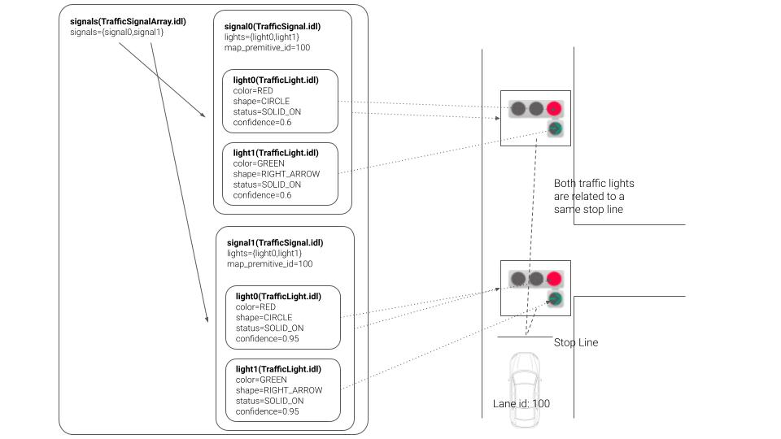

# traffic_light_classifier

## 目的

traffic_light_classifierは、交通信号機周辺の切り抜き画像を使用して交通信号機のラベルを分類するパッケージです。このパッケージには、以下の2つの分類器モデルがあります。`cnn_classifier`と`hsv_classifier`

## 内部動作/アルゴリズム

### cnn_classifier

交通信号機のラベルは、EfficientNet-b1またはMobileNet-v2によって分類されます。
ティアフォー社内の日本国内交通信号機の画像83,400枚（58,600枚をトレーニング用、14,800枚を評価用、10,000枚をテスト用）を使用して微調整を行いました。
各モデルの情報は次のとおりです。

| 名称            | 入力サイズ | テスト精度 |
| --------------- | ---------- | ------------- |
| EfficientNet-b1 | 128 x 128  | 99.76%        |
| MobileNet-v2    | 224 x 224  | 99.81%        |

### hsv_classifier

信号機の色（緑、黄、赤）の分類はHSVモデルで行われます。

### ラベルについて

メッセージのタイプは、[ビエンナ条約](https://en.wikipedia.org/wiki/Vienna_Convention_on_Road_Signs_and_Signals#Traffic_lights)で提案された統一道路標識に準拠するように設計されています。このアイデアは[Autoware.Auto](https://gitlab.com/autowarefoundation/autoware.auto/autoware_auto_msgs/-/merge_requests/16)でも提案されています。

ノードが受け取るラベルの命名規則があります。1つの信号機は、コンマで区切られた次の文字列で表されます。`color1-shape1, color2-shape2`。

たとえば、シンプルな赤と赤十字の信号機のラベルは「red-circle, red-cross」と表現する必要があります。

これらの色と形状はメッセージに次のように割り当てられます。


## 入出力

### 入力

| 名前                | タイプ                                            | 説明           |
| -------------------- | -------------------------------------------------- | --------------- |
| `~/input/image`       | `sensor_msgs::msg::Image`                         | 入力画像          |
| `~/input/rois`        | `tier4_perception_msgs::msg::TrafficLightRoiArray` | 交通信号のRoI |

### 出力

障害物回避モジュールは、Autoware.Auto の Planning コンポーネントの一部です。障害物を検出して回避経路を生成し、それを Planning コンポーネントに引き渡します。

**機能:**

* センサデータから障害物を検出
* 障害物特性（種類、形状、サイズ、速度）を推定
* 自車位置と障害物位置から回避経路を生成
* 回避経路を最適化（安全性、滑らかさ、実行可能性）

**アーキテクチャ:**

* **感知モジュール:** 障害物を検出し、特性を抽出します。
* **計画モジュール:** 回避経路を生成し、最適化します。

**インターフェース:**

* **入力:**
    * センサデータ（レーダー、LiDAR）
    * 自車位置
* **出力:**
    * 回避経路

**主なアルゴリズム:**

* **'post resampling' ベースの障害物検出**
* **拡張カルマンフィルタ**を使用した障害物特性推定
* **動的計画法**を使用した回避経路生成
* **微分進化**を使用した回避経路最適化

| 名前                      | タイプ                                        | 説明                                 |
| ------------------------- | --------------------------------------------- | ------------------------------------ |
| `~/output/traffic_signals` | `tier4_perception_msgs::msg::TrafficLightArray` | 分類された信号                      |
| `~/output/debug/image`     | `sensor_msgs::msg::Image`                       | デバッグ用画像                      |

## パラメータ

### ノードパラメータ

| 名称                  | タイプ  | 説明                                                                                                                                                                                                                                                                                                                                                |
| --------------------- | ----- | ---------------------------------------------------------------------------------------------------------------------------------------------------------------------------------------------------------------------------------------------------------------------------------------------------------------------------------------------------------- |
| `classifier_type`     | int   | 値が `1` の場合、cnn_classifier が使用されます                                                                                                                                                                                                                                                                                                                |
| `data_path`           | str   | パッケージデータとアーティファクトディレクトリのパス                                                                                                                                                                                                                                                                                                                 |
| `backlight_threshold` | float | 強度がこれを超えた場合、それに対応する RoI に UNKNOWN が上書きされます。この値が著しく大きい場合、ノードは強い逆光時のみ上書きを行います。したがって、この機能を使用したくない場合は、この値を `1.0` に設定してください。値は `[0.0, 1.0]` です。上書きされる信号の信頼性は `0.0` に設定されます。 |

### コアパラメータ

#### cnn分類器

| 名前                    | 種類            | 説明                          |
| ----------------------- | --------------- | ------------------------------------ |
| `classifier_label_path` | 文字列             | モデルファイルへのパス               |
| `classifier_model_path` | 文字列             | ラベルファイルへのパス               |
| `classifier_precision`  | 文字列             | TensorRT精度の`fp16`または`int8` |
| `classifier_mean`       | 倍精度浮動小数点型ベクトル | 3チャンネル入力画像の平均           |
| `classifier_std`        | 倍精度浮動小数点型ベクトル | 3チャンネル入力画像の標準偏差            |
| `apply_softmax`         | 論理値            | ソフトマックスを適用するか         |

#### hsv_classifier

| 名前         | 型 | 説明                                           |
| ------------ | --- | ---------------------------------------------- |
| `green_min_h` | int | 緑色の最小色相                                  |
| `green_min_s` | int | 緑色の最小彩度                                  |
| `green_min_v` | int | 緑色の最小値（輝度）                            |
| `green_max_h` | int | 緑色の最大色相                                  |
| `green_max_s` | int | 緑色の最大彩度                                  |
| `green_max_v` | int | 緑色の最大値（輝度）                            |
| `yellow_min_h` | int | 黄色の最小色相                                 |
| `yellow_min_s` | int | 黄色の最小彩度                                 |
| `yellow_min_v` | int | 黄色の最小値（輝度）                           |
| `yellow_max_h` | int | 黄色の最大色相                                 |
| `yellow_max_s` | int | 黄色の最大彩度                                 |
| `yellow_max_v` | int | 黄色の最大値（輝度）                           |
| `red_min_h` | int | 赤色の最小色相                                  |
| `red_min_s` | int | 赤色の最小彩度                                  |
| `red_min_v` | int | 赤色の最小値（輝度）                            |
| `red_max_h` | int | 赤色の最大色相                                  |
| `red_max_s` | int | 赤色の最大彩度                                  |
| `red_max_v` | int | 赤色の最大値（輝度）                            |

## 信号機分類器モデルのトレーニング

### 概要

このガイドでは、**[mmlab/mmpretrain](https://github.com/open-mmlab/mmpretrain)** リポジトリを使用して信号機分類器モデルをトレーニングし、**[mmlab/mmdeploy](https://github.com/open-mmlab/mmdeploy)**を使用して展開するための詳細な手順を説明します。独自のデータセットを使用してカスタム信号機分類器モデルを作成する場合は、以下の手順に従ってください。

### データ準備

#### サンプルデータセットを使用する

Autowareは、信号機分類のトレーニング手順を説明するサンプルデータセットを提供しています。このデータセットは、赤、緑、黄色の3つのラベルに分類された1045枚の画像で構成されています。このサンプルデータセットを使用するには、**[リンク](https://autoware-files.s3.us-west-2.amazonaws.com/dataset/traffic_light_sample_dataset.tar.gz)**からダウンロードし、任意の指定されたフォルダに解凍してください。

#### カスタムデータセットを使用する

信号機分類器をトレーニングするには、各サブフォルダが異なるクラスを表すように構造化されたサブフォルダ形式を使用します。以下は、データセット構造の例です。
```
└─── dataset
    └─── class1
        └─── img1.jpg
        └─── img2.jpg
    └─── class2
        └─── img1.jpg
        └─── img2.jpg
    └─── class3
        └─── img1.jpg
        └─── img2.jpg
```
```
└─── dataset
    └─── red
        └─── img1.jpg
        └─── img2.jpg
    └─── green
        └─── img1.jpg
        └─── img2.jpg
    └─── yellow
        └─── img1.jpg
        └─── img2.jpg
```

### Model Training

To train a traffic light classifier model, follow these steps:

1. Clone the **[mmlab/mmpretrain](https://github.com/open-mmlab/mmpretrain)** repository.
2. Install the required dependencies.
3. Prepare the training dataset by following the instructions in [Using Sample Dataset](#use-sample-dataset) or [Using Your Custom Dataset](#use-your-custom-dataset).
4. Specify the following training parameters in the provided `config` files:
    - Dataset path
    - Output directory
    - Number of epochs
    - Batch size
    - Learning rate
5. Train the model using the following command:
```
mmtrain config.py [--options] [args...]
```

### Model Deployment

To deploy the trained model using **[mmdeploy](https://github.com/open-mmlab/mmdeploy)**, follow these steps:

1. Clone the **[mmlab/mmdeploy](https://github.com/open-mmlab/mmdeploy)** repository.
2. Install the required dependencies.
3. Convert the trained model to a deployable format using `mmdeploy`:
```
mmdeploy model convert --config config.yml --model model.pth --output output.bin
```
4. Integrate the deployed model into your `Planning` component/module.

### Post-processing for Traffic Light Detection

The model will return class probabilities. To determine the detected traffic light color from these probabilities, the following steps are carried out:

1. Use a predefined threshold (usually 0.5) to determine the most likely class.
2. If the most likely class is 'red', 'green', or 'yellow', that color is considered the detected color.
3. If the most likely class is 'other', the detected color is considered unknown.

### Validation

To evaluate the performance of the trained model, use a validation dataset that is not part of the training set. The validation dataset should contain a representative sample of the types of traffic lights that the model will encounter in real-world scenarios. Calculate the accuracy of the model by comparing the predicted traffic light colors to the ground truth labels.

### Additional Information

- If you encounter any issues during the training or deployment process, please refer to the documentation on the **[mmlab/mmpretrain](https://github.com/open-mmlab/mmpretrain)** and **[mmlab/mmdeploy](https://github.com/open-mmlab/mmdeploy)** repositories.
- For further guidance on integrating the deployed model, consult the Autoware documentation or seek assistance from the Autoware community.

### 変更履歴

- 2023-03-13: リリース


```python
DATASET_ROOT
    ├── TRAIN
    │    ├── RED
    │    │   ├── 001.png
    │    │   ├── 002.png
    │    │   └── ...
    │    │
    │    ├── GREEN
    │    │    ├── 001.png
    │    │    ├── 002.png
    │    │    └──...
    │    │
    │    ├── YELLOW
    │    │    ├── 001.png
    │    │    ├── 002.png
    │    │    └──...
    │    └── ...
    │
    ├── VAL
    │       └──...
    │
    │
    └── TEST
           └── ...


```

### インストール

#### 前提条件

**手順 1.** 公式ウェブサイトから Miniconda をダウンロードしてインストールする ([こちら](https://mmpretrain.readthedocs.io/en/latest/get_started.html))

**手順 2.** conda 仮想環境を作成してアクティベートする


```bash
conda create --name tl-classifier python=3.8 -y
conda activate tl-classifier
```

**ステップ 3.** PyTorch のインストール

PyTorch をインストールしてください。CUDA 11.6 と互換性のあるバージョンである必要があります。これは、現在の Autoware の必要条件です。


```bash
conda install pytorch==1.13.1 torchvision==0.14.1 pytorch-cuda=11.6 -c pytorch -c nvidia
```

#### mmlab/mmpretrainをインストールする

**ステップ1.** mmpretrainをソースからインストールする


```bash
cd ~/
git clone https://github.com/open-mmlab/mmpretrain.git
cd mmpretrain
pip install -U openmim && mim install -e .
```

### トレーニング

MMPretrain には、コンフィギュレーションファイルによって制御されるトレーニングスクリプトが用意されています。
継承設計パターンを利用すると、Python ファイルをコンフィギュレーションファイルとして使用して、トレーニングスクリプトを簡単にカスタマイズできます。

この例では、MobileNetV2 モデルでトレーニング手順を紹介しますが、EfficientNetV2、EfficientNetV3、ResNet などの他の分類モデルを使用することもできます。

#### コンフィギュレーションファイルの作成

`configs` フォルダー内に、好みのモデルのコンフィギュレーションファイルを生成します。


```bash
touch ~/mmpretrain/configs/mobilenet_v2/mobilenet-v2_8xb32_custom.py
```

テキストエディタでお好みの設定ファイルを開き、提供されたコンテンツのコピーを作成します。**data_root** バリアブルをデータセットのパスに変更します。モデル、データセット、スケジューラの設定パラメータはお好みのものに変更してカスタマイズできます。


```python
# Inherit model, schedule and default_runtime from base model
_base_ = [
    '../_base_/models/mobilenet_v2_1x.py',
    '../_base_/schedules/imagenet_bs256_epochstep.py',
    '../_base_/default_runtime.py'
]

# Set the number of classes to the model
# You can also change other model parameters here
# For detailed descriptions of model parameters, please refer to link below
# (Customize model)[https://mmpretrain.readthedocs.io/en/latest/advanced_guides/modules.html]
model = dict(head=dict(num_classes=3, topk=(1, 3)))

# Set max epochs and validation interval
train_cfg = dict(by_epoch=True, max_epochs=50, val_interval=5)

# Set optimizer and lr scheduler
optim_wrapper = dict(
    optimizer=dict(type='SGD', lr=0.001, momentum=0.9))
param_scheduler = dict(type='StepLR', by_epoch=True, step_size=1, gamma=0.98)

dataset_type = 'CustomDataset'
data_root = "/PATH/OF/YOUR/DATASET"

# Customize data preprocessing and dataloader pipeline for training set
# These parameters calculated for the sample dataset
data_preprocessor = dict(
    mean=[0.2888 * 256, 0.2570 * 256, 0.2329 * 256],
    std=[0.2106 * 256, 0.2037 * 256, 0.1864 * 256],
    num_classes=3,
    to_rgb=True,
)

# Customize data preprocessing and dataloader pipeline for train set
# For detailed descriptions of data pipeline, please refer to link below
# (Customize data pipeline)[https://mmpretrain.readthedocs.io/en/latest/advanced_guides/pipeline.html]
train_pipeline = [
    dict(type='LoadImageFromFile'),
    dict(type='Resize', scale=224),
    dict(type='RandomFlip', prob=0.5, direction='horizontal'),
    dict(type='PackInputs'),
]
train_dataloader = dict(
    dataset=dict(
        type=dataset_type,
        data_root=data_root,
        ann_file='',
        data_prefix='train',
        with_label=True,
        pipeline=train_pipeline,
    ),
    num_workers=8,
    batch_size=32,
    sampler=dict(type='DefaultSampler', shuffle=True)
)

# Customize data preprocessing and dataloader pipeline for test set
test_pipeline = [
    dict(type='LoadImageFromFile'),
    dict(type='Resize', scale=224),
    dict(type='PackInputs'),
]

# Customize data preprocessing and dataloader pipeline for validation set
val_cfg = dict()
val_dataloader = dict(
    dataset=dict(
        type=dataset_type,
        data_root=data_root,
        ann_file='',
        data_prefix='val',
        with_label=True,
        pipeline=test_pipeline,
    ),
    num_workers=8,
    batch_size=32,
    sampler=dict(type='DefaultSampler', shuffle=True)
)

val_evaluator = dict(topk=(1, 3,), type='Accuracy')

test_dataloader = val_dataloader
test_evaluator = val_evaluator

```

#### トレーニングを開始する


```bash
cd ~/mmpretrain
python tools/train.py configs/mobilenet_v2/mobilenet-v2_8xb32_custom.py
```

トレーニングログと重みは `work_dirs/mobilenet-v2_8xb32_custom` フォルダに保存されます。

### PyTorchモデルからONNXモデルへ変換

#### mmdeployのインストール

'mmdeploy' ツールセットは、トレーニング済みモデルをさまざまなターゲットデバイスに展開するために設計されています。
その機能により、PyTorchモデルをONNX形式にシームレスに変換できます。


```bash
# Activate your conda environment
conda activate tl-classifier

# Install mmenigne and mmcv
mim install mmengine
mim install "mmcv>=2.0.0rc2"

# Install mmdeploy
pip install mmdeploy==1.2.0

# Support onnxruntime
pip install mmdeploy-runtime==1.2.0
pip install mmdeploy-runtime-gpu==1.2.0
pip install onnxruntime-gpu==1.8.1

#Clone mmdeploy repository
cd ~/
git clone -b main https://github.com/open-mmlab/mmdeploy.git
```

#### PyTorchモデルからONNXモデルへの変換


```bash
cd ~/mmdeploy

# Run deploy.py script
# deploy.py script takes 5 main arguments with these order; config file path, train config file path,
# checkpoint file path, demo image path, and work directory path
python tools/deploy.py \
~/mmdeploy/configs/mmpretrain/classification_onnxruntime_static.py\
~/mmpretrain/configs/mobilenet_v2/train_mobilenet_v2.py \
~/mmpretrain/work_dirs/train_mobilenet_v2/epoch_300.pth \
/SAMPLE/IAMGE/DIRECTORY \
--work-dir mmdeploy_model/mobilenet_v2
```

変換後の ONNX モデルは `mmdeploy/mmdeploy_model/mobilenet_v2` フォルダに保存されます。

onnx モデルを入手したら、起動ファイル (例: `model_file_path`, `label_file_path`, `input_h`, `input_w` ) で定義されたパラメータを更新します。
[tier4_perception_msgs::msg::TrafficLightElement](https://github.com/tier4/tier4_autoware_msgs/blob/tier4/universe/tier4_perception_msgs/msg/traffic_light/TrafficLightElement.msg) で定義されているラベルのみサポートすることに注意してください。

## 仮定 / 既知の制限

<!-- 実装の仮定と制限を記載します。

例:
  このアルゴリズムは障害物が動かないことを前提としています。そのため、車両が障害物の回避を開始した後、障害物が急速に動いた場合は、車両が障害物と衝突する可能性があります。
  また、このアルゴリズムは死角を考慮しません。一般的に、検知性能の限界により近すぎる障害物が表示されないため、障害物との間に十分な余白を確保してください。
-->

## (オプション) エラーの検出と処理

<!-- エラーを検出する方法と、それらから回復する方法を記載します。

例:
  このパッケージでは、最大 20 個の障害物を処理できます。障害物がさらに見つかった場合、このノードは処理を放棄し、診断エラーを発生させます。
-->

## (オプション) パフォーマンス特性

<!-- 複雑さなどのパフォーマンス情報を記載します。ボトルネックにならない場合は、不要です。

例:

  ### 複雑さ

  このアルゴリズムは O(N) です。

  ### 処理時間

  ...
-->

<!-- cspell:ignore Mingxing, Quoc, PMLR -->

## リファレンス/外部リンク

[1] M. Sandler, A. Howard, M. Zhu, A. Zhmoginov and L. Chen, "MobileNetV2: Inverted Residuals and Linear Bottlenecks," 2018 IEEE/CVF Conference on Computer Vision and Pattern Recognition, Salt Lake City, UT, 2018, pp. 4510-4520, doi: 10.1109/CVPR.2018.00474.

[2] Tan, Mingxing, and Quoc Le. "EfficientNet: Rethinking model scaling for convolutional neural networks." International conference on machine learning. PMLR, 2019.

## (オプション) 将来の拡張 / 未実装部分

<!-- このパッケージの将来の拡張を記載します。

例:
  現在、このパッケージはチャタリング障害物をうまく処理できません。知覚層に確率フィルタを追加して、改善することを計画しています。
  また、グローバルにするべきパラメータがいくつかあります (例: 車両サイズ、最大ステアリングなど)。これらはリファクタリングされ、グローバルパラメータとして定義されるため、異なるノード間で同じパラメータを共有できます。
-->

