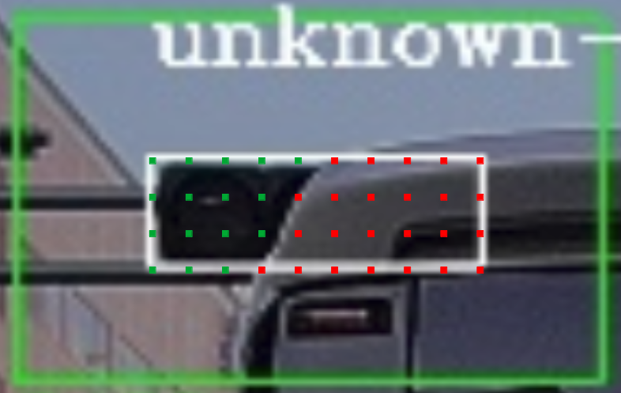

# `autoware_traffic_light_occlusion_predictor` パッケージ

## 概要

`autoware_traffic_light_occlusion_predictor` は検出された交通信号機の ROI を受信し、各 ROI と点群とのオクルージョン率を計算します。

各交通信号機の ROI に対して、数百のピクセルが選択され、3D 空間へ投影されます。その後、カメラの視点から、点群によってオクルージョンされる投影ピクセルの数がカウントされ、ROI のオクルージョン率の計算に使用されます。次の画像に示すように、赤いピクセルはオクルージョンされ、オクルージョン率は赤いピクセルの数をピクセル合計数で割ったものです。

点群が受信されなかった場合、またはすべての点群がカメラ画像と非常に大きなスタンプの違いがある場合、各 ROI のオクルージョン率は 0 に設定されます。

## 入力トピック

| 名称                 | 型                                           | 説明              |
| -------------------- | ---------------------------------------------- | ------------------------ |
| `~input/vector_map`  | `autoware_map_msgs::msg::LaneletMapBin`          | ベクターマップ               |
| `~/input/rois`       | `autoware_perception_msgs::TrafficLightRoiArray` | 交通信号の検出             |
| `~input/camera_info` | `sensor_msgs::CameraInfo`                        | カメラパラメータ               |
| `~/input/cloud`      | `sensor_msgs::PointCloud2`                       | LiDAR の点群データ             |

## 出力トピック

| Name                 | Type                                                | Description                  |
| -------------------- | --------------------------------------------------- | ---------------------------- |
| `~/output/occlusion` | autoware_perception_msgs::TrafficLightOcclusionArray | 各ROIの被覆率               |

## ノードパラメーター

| パラメータ                            | タイプ   | 説明                                                     |
| ------------------------------------ | ------ | ----------------------------------------------------------- |
| `azimuth_occlusion_resolution_deg`   | double | LiDAR点群のアジマス分解能（度）                          |
| `elevation_occlusion_resolution_deg` | double | LiDAR点群の仰角分解能（度）                            |
| `max_valid_pt_dist`                  | double | この距離内での点は計算に使用されます                  |
| `max_image_cloud_delay`              | double | LiDAR点群とカメラ画像の最大遅延                          |
| `max_wait_t`                         | double | LiDAR点群を待つ最大時間                                 |

