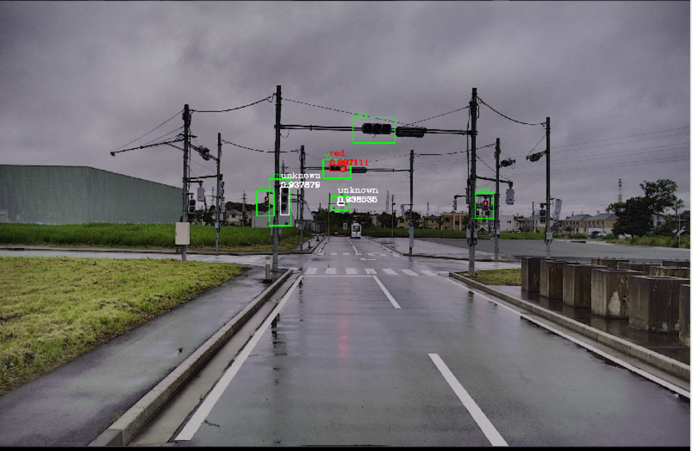

# autoware_traffic_light_visualization

## 目的

`autoware_traffic_light_visualization`は、2つの視覚化ノードを含むパッケージです。

- **traffic_light_map_visualizer**は、rviz上のマーカーとして、信号の色状態や位置を表示するノードです。
- **traffic_light_roi_visualizer**は、以下の図に示すように、入力画像に信号認識ノード（信号状態、位置、識別確率）の結果を描画し、公開するノードです。

## 仕組み / アルゴリズム

## 入出力

### traffic_light_map_visualizer

#### 入力

| 名称 | 種類 | 説明 |
|---|---|---|
| `~/input/tl_state` | `tier4_perception_msgs::msg::TrafficLightGroupArray` | 信号状態 |
| `~/input/vector_map` | `autoware_map_msgs::msg::LaneletMapBin` | ベクターマップ |

**自動運転ソフトウェアドキュメント（日本語訳）**

#### 1. Planningモジュール

**目的:** 安全かつ効率的な経路を計画する。

**サブモジュール:**

- **Path Planning (経路計画):** 目的地への経路を生成する。
- **Behavior Planning (行動計画):** 経路上での車両の挙動を決定する。
- **Trajectory Generator (軌道生成):** 車両の運動軌跡を計算する。

#### 2. Localizationモジュール

**目的:** 自車位置と姿勢を正確に推定する。

**サブモジュール:**

- **Sensor Fusion:** GNSS、IMU、LiDARなどの複数のセンサーから情報を融合する。
- **Mapping:** 環境マップを構築し、自車位置を推定する。
- **State Estimation:** 自車位置と姿勢の確率的推定を生成する。

#### 3. Perceptionモジュール

**目的:** 周囲環境を認識し、物体や障害物を特定する。

**サブモジュール:**

- **Object Detection:** 車両、歩行者、障害物などの物体を検出する。
- **Free Space Estimation:** 走行可能な領域を特定する。
- **Lane Detection:** 車線を検出し、自車位置の把握を改善する。

#### 4. Controlモジュール

**目的:** 車両の動きを制御し、安全で快適な走行を実現する。

**サブモジュール:**

- **Longitudinal Control:** 加速と減速を制御する。
- **Lateral Control:** ヨーレートとステアリングを制御する。
- **Controller Tuning**: 制御パラメータを調整する。

#### 5. その他のコンポーネント

**Communication:** 他車両やインフラストラクチャとの通信を処理する。
**Decision Making:** 運転状況を評価し、適切な行動を決定する。
**Diagnostics:** システムの健全性を監視し、エラーを検出する。
**Visualization:** センサーデータと計算結果を視覚化する。

#### 6. 主要技術

- **SLAM (Simultaneous Localization and Mapping)**: 位置推定とマッピングを同時に行う。
- **'post resampling'** パティクルフィルター: より正確な推定を可能にする。
- **AI (Artificial Intelligence)**: 物体検出や経路計画に使用される。
- **ROS (Robot Operating System)**: モジュールの統合に使用される。

#### 7. Autoware (オープンソース自動運転ソフトウェア)

**特徴:**

- 自動運転機能の開発と展開を簡素化するプラットフォーム。
- Planning、Localization、Perception、Controlなどのコンポーネントを含む。
- コミュニティ主導で開発されており、活発な開発が行われている。

| Name                     | Type                                   | Description                                          |
| ------------------------ | -------------------------------------- | ---------------------------------------------------- |
| `~/output/traffic_light` | `visualization_msgs::msg::MarkerArray` | マーカーアレイが信号の状態を示します |

### traffic_light_roi_visualizer

#### 入力

| 名前                          | タイプ                                             | 説明                                                   |
| ----------------------------- | -------------------------------------------------- | -------------------------------------------------------- |
| `~/input/tl_state`            | `tier4_perception_msgs::msg::TrafficLightArray`    | 信号の状態                                             |
| `~/input/image`               | `sensor_msgs::msg::Image`                          | 検知カメラで取得した画像                             |
| `~/input/rois`                | `tier4_perception_msgs::msg::TrafficLightRoiArray` | `traffic_light_fine_detector` で検知された ROI          |
| `~/input/rough/rois` (オプション) | `tier4_perception_msgs::msg::TrafficLightRoiArray` | `traffic_light_map_based_detector` で検知された ROI      |

#### 出力

説明:
このドキュメントは、自動運転ソフトウェアAutowareのPlanningコンポーネントに関する設計仕様を記載しています。

**目的**
Planningコンポーネントの目的は、自律走行車両の経路と速度を計画することです。Planningコンポーネントは、次のタスクを実行します。

- 自車位置の追跡
- 周囲環境の感知
- 障害物の検出と予測
- 経路計画
- 速度計画

**設計**
Planningコンポーネントは、以下で構成されています。

- **Perceptionモジュール:** 周囲環境を認識します。
- **Localizationモジュール:** 自車位置を追跡します。
- **Predictionモジュール:** 障害物を検出し、予測します。
- **RoutePlanningモジュール:** 経路を計画します。
- **SpeedPlanningモジュール:** 速度を計画します。

**入出力**

**入力:**
- Perceptionモジュールからの感知データ
- Localizationモジュールからの自車位置データ
- 障害物検出と予測モジュールからの予測データ

**出力:**
- RoutePlanningモジュールから計画された経路
- SpeedPlanningモジュールから計画された速度
- Planningコンポーネントの状態と診断情報

**機能**
Planningコンポーネントは、以下を含む数多くの機能を実行します。

- **リアルタイム経路計画:** Planningコンポーネントは、リアルタイムで経路を計画します。
- **障害物回避:** Planningコンポーネントは、障害物を回避する経路を計画します。
- **交通信号制御:** Planningコンポーネントは、交通信号機の制御情報を考慮して経路を計画します。
- **速度制御:** Planningコンポーネントは、安全かつ効率的な速度を計画します。
- **バックアップ機能:** Planningコンポーネントは、障害が発生した場合のバックアップ機能を提供します。

**インターフェース**
Planningコンポーネントは、以下のような他のAutowareコンポーネントとインターフェースします。

- Perceptionモジュール
- Localizationモジュール
- Controlモジュール

**要件**
Planningコンポーネントは、以下の要件を満たす必要があります。

- **リアルタイム処理:** Planningコンポーネントは、リアルタイムで処理を実行する必要があります。
- **精度:** Planningコンポーネントは、高精度の経路と速度を計画する必要があります。
- **堅牢性:** Planningコンポーネントは、さまざまな運転状況で堅牢に動作する必要があります。
- **拡張性:** Planningコンポーネントは、新しい機能やアルゴリズムを簡単に統合できるように拡張可能である必要があります。

**評価**
Planningコンポーネントは、以下のようなメトリクスを使用して評価されます。

- 経路計画の正確性
- 障害物回避の成功率
- 交通信号制御への準拠率
- 速度計画の効率性
- バックアップ機能の信頼性
- `post resampling`の速度

| 名前              | タイプ                       | 説明                |
|--------------------|----------------------------|---------------------|
| `~/output/image` | `sensor_msgs::msg::Image` | ROI付き出力画像  |

## パラメータ

### traffic_light_map_visualizer

なし

### traffic_light_roi_visualizer

#### ノードパラメータ

{{json_to_markdown("perception/autoware_traffic_light_visualization/schema/traffic_light_visualization.schema.json")}}

## 前提条件/既知の制限

## (オプション) エラー検出と処理

## (オプション) パフォーマンス特性

## (オプション) 参照/外部リンク

## (オプション) 将来の拡張/未実装部分

