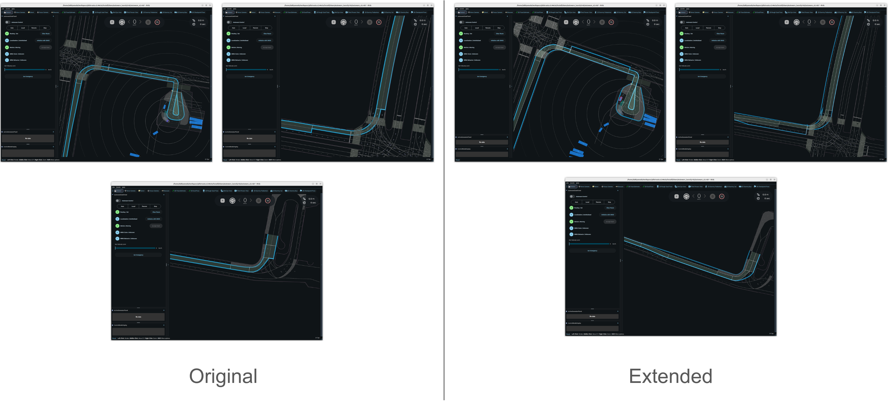

# autoware_avoidance_target_detector

Experimental toy package for developing auxiliary planning functions. The reference node (`AvoidanceTargetDetectorNode`) shows how to wire the library; the reusable pieces are **`ExtendedRouteHandler`** (route / boundary construction) and **`ObjectSelector`** (avoidance target filtering).

When integrating into another package, your node typically owns:

```cpp
std::shared_ptr<ExtendedRouteHandler> extended_route_handler_;
ObjectSelector object_selector_;
```

Headers:

- `autoware/avoidance_target_detector/boundary.hpp` — `ExtendedRouteHandler`, `RouteBounds`, `to_path_msg`
- `autoware/avoidance_target_detector/object_filtering.hpp` — `ObjectSelector`

---

## Required subscriptions

Rebuild `ExtendedRouteHandler` whenever the **map** or **route** changes. Call `ObjectSelector::get_avoidance_targets()` on each **objects** update (with the latest trajectory and route bounds).

| Topic (reference node)    | Message type                                    | Role                                                  |
| ------------------------- | ----------------------------------------------- | ----------------------------------------------------- |
| `~/input/lanelet_map_bin` | `autoware_map_msgs/msg/LaneletMapBin`           | Vector map. QoS: transient local.                     |
| `~/input/route`           | `autoware_planning_msgs/msg/LaneletRoute`       | Current route. QoS: transient local.                  |
| `~/input/trajectory`      | `autoware_planning_msgs/msg/Trajectory`         | Reference trajectory for deviation / distance checks. |
| `~/input/objects`         | `autoware_perception_msgs/msg/PredictedObjects` | Predicted objects to filter.                          |

Until map, route, and trajectory are available, boundary and object-selection APIs are not meaningful.

---

## Integration flow

1. On map or route update: construct `ExtendedRouteHandler`, call `create_map()`, then read cached bounds (see below).
2. On each objects callback: select route bounds, optionally publish via `to_path_msg`, then call `get_avoidance_targets()`.

Minimal pattern (see `src/node.cpp`):

```cpp
// After map + route received:
extended_route_handler_ = std::make_shared<ExtendedRouteHandler>(*map_bin_, *route_);
extended_route_handler_->create_map();

// Each cycle (with trajectory + objects):
const auto & bounds = extended_route_handler_->get_extended_route_bounds();  // or get_original_route_bounds()
pub_drivable_area_path_->publish(to_path_msg(bounds, trajectory));

const auto targets = object_selector_.get_avoidance_targets(
  get_clock()->now(), objects, trajectory, bounds);
```

Parameter `use_extended_route_bounds` (reference node) switches between original and extended route bounds for the drivable area.

---

## API overview

### `ExtendedRouteHandler`

Builds a route-local lanelet map, extended lanelet segments, and cached left/right route bounds.

#### Constructor

```cpp
ExtendedRouteHandler(const LaneletMapBin & map, const LaneletRoute & route);
```

| Argument | Description                                                                                                                                                                           |
| -------- | ------------------------------------------------------------------------------------------------------------------------------------------------------------------------------------- |
| `map`    | Full vector map (`LaneletMapBin`). Stored in an internal `RouteHandler`; must contain all lanelets referenced by `route`.                                                             |
| `route`  | Current mission route (`LaneletRoute`). Must have at least one non-empty segment. Does not need to match the latest map revision if IDs are stable, but map/route must be consistent. |

Does **not** build anything yet — call `create_map()` next.

#### `create_map()`

No arguments.

**Preconditions:** Handler constructed with valid `map` and `route`.

**Effect:** Builds the goal-purpose routing graph, extended lanelet segments, `route_map_` (route lanelets + nearby `road_border` linestrings), and caches `original_route_bounds_` / `extended_route_bounds_`.

**When to call:** Once after construction, and again whenever the subscribed map or route message changes.

#### `get_road_borders()`

No arguments.

| Returns                              | Description                                                                                                                                   |
| ------------------------------------ | --------------------------------------------------------------------------------------------------------------------------------------------- |
| `std::vector<lanelet::LineString2d>` | All `type=road_border` linestrings in `route_map_` (2D). Empty if `create_map()` has not been called or no borders were found near the route. |

**Preconditions:** `create_map()` completed.

#### `get_original_route_bounds()` / `get_extended_route_bounds()`

No arguments.

| Returns                                         | Description                                                                                             |
| ----------------------------------------------- | ------------------------------------------------------------------------------------------------------- |
| `const std::pair<LineString2d, LineString2d> &` | `.first`: concatenated **left** bound. `.second`: concatenated **right** bound. Map-frame 2D polylines. |

| Method                        | Bound source                                                                                                   |
| ----------------------------- | -------------------------------------------------------------------------------------------------------------- |
| `get_original_route_bounds()` | Route-message primitives only (per segment: left bound of leftmost lanelet, right bound of rightmost lanelet). |
| `get_extended_route_bounds()` | Extended primitives (lateral expansion + sibling lanelets where found). Wider corridor than original.          |

**Preconditions:** `create_map()` completed. Values are cached and do not change until the next `create_map()`.



---

### Route bounds and `to_path_msg`

#### `RouteBounds`

```cpp
using RouteBounds = std::pair<lanelet::LineString2d, lanelet::LineString2d>;
```

Left and right route boundary linestrings from `get_original_route_bounds()` or `get_extended_route_bounds()`. Passed directly to `ObjectSelector::get_avoidance_targets()` and `to_path_msg()`.

#### `to_path_msg(bounds, trajectory)`

```cpp
Path to_path_msg(const RouteBounds & bounds, const Trajectory & trajectory);
```

| Argument     | Description                                                                                                                                                                                                                                      |
| ------------ | ------------------------------------------------------------------------------------------------------------------------------------------------------------------------------------------------------------------------------------------------ |
| `bounds`     | Left and right route bounds. Each `LineString2d` is converted point-by-point to `geometry_msgs/Point` (z = 0) for `Path::left_bound` / `Path::right_bound`.                                                                                      |
| `trajectory` | Reference trajectory. `trajectory.header` is copied into the path. Each `TrajectoryPoint` is copied into `Path::points` as the path centerline (pose and velocities preserved). Used for RViz / downstream path consumers, not for filter logic. |

| Returns                           | Description                                                                       |
| --------------------------------- | --------------------------------------------------------------------------------- |
| `autoware_planning_msgs/msg/Path` | Visualization / debug output. Bounds from `bounds`; centerline from `trajectory`. |

---

### `ObjectSelector::get_avoidance_targets()`

```cpp
PredictedObjects get_avoidance_targets(
  const rclcpp::Time & current_time,
  const PredictedObjects & objects,
  const Trajectory & trajectory,
  const RouteBounds & route_bounds);
```

Maintains per-object Bayesian filter state internally (keyed by object UUID). Same `ObjectSelector` instance must be reused across callbacks so filters can converge and hysteresis can apply.

| Argument       | Description                                                                                                                                                                                                                     |
| -------------- | ------------------------------------------------------------------------------------------------------------------------------------------------------------------------------------------------------------------------------- |
| `current_time` | ROS time for this update cycle. Used for filter staleness, hysteresis timing, and Bayesian updates. Typically `node->get_clock()->now()`.                                                                                       |
| `objects`      | Full predicted-objects message for the current frame. Every object in `objects.objects` is observed; objects not seen for longer than `FilterManagerParams::stale_threshold_seconds` are removed from internal state.           |
| `trajectory`   | Reference trajectory (same source as subscribed trajectory). Must have **at least two points** for deviation and distance checks. Used for on-trajectory deviation, longitudinal extent filtering, and lateral corridor checks. |
| `route_bounds` | Left/right corridor for lateral filtering. Objects whose footprint lies entirely outside the bounds are removed. Typically from `get_original_route_bounds()` or `get_extended_route_bounds()`.                                 |

| Returns            | Description                                                                                                                                                       |
| ------------------ | ----------------------------------------------------------------------------------------------------------------------------------------------------------------- |
| `PredictedObjects` | Subset of input objects classified as avoidance targets. Header and structure match input style; `objects` contains only selected targets. Empty if none qualify. |

**Brief behavior:**

- Updates per-object filters (classification, stationary, on-trajectory deviation).
- Applies hysteresis before toggling target / non-target state.
- Removes objects outside trajectory longitudinal range or outside the route corridor.
- Filter tuning constants: `parameter.hpp` (`OnTrajectoryDValidationParams`, `FilterManagerParams`, `MovingObjectFilterParams`, etc.).

---

## Reference launch

```bash
ros2 launch autoware_avoidance_target_detector avoidance_target_detector.launch.xml
```

Default remaps are defined in `launch/avoidance_target_detector.launch.xml`.

---

## Package layout

| File                                            | Role                                                                |
| ----------------------------------------------- | ------------------------------------------------------------------- |
| `boundary.hpp` / `boundary.cpp`                 | `ExtendedRouteHandler`, traffic rules, `RouteBounds`, `to_path_msg` |
| `object_filtering.hpp` / `object_filtering.cpp` | `ObjectSelector`, filters                                           |
| `parameter.hpp` / `parameter.cpp`               | Shared constants                                                    |
| `node.hpp` / `node.cpp`                         | Example ROS 2 node                                                  |

This package is not intended for production use as-is; copy or depend on the library pieces above when moving logic into the target package.
