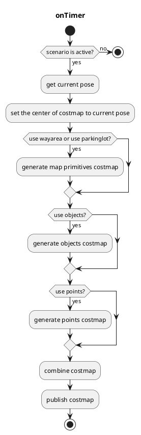

# costmap_generator

## costmap_generator_node

このノードは`PointCloud`や`DynamicObjectArray`を読み込み、`OccupancyGrid`と`GridMap`を作成します。`VectorMap(Lanelet2)`はオプションです。

### 入力トピック

| 名称 | タイプ | 説明 |
| ------------------------- | ------------------------------------------ | ---------------------------------------------------------------------------- |
| `~input/objects` | `autoware_perception_msgs::PredictedObjects` | obstacles エリアの予測オブジェクト |
| `~input/points_no_ground` | `sensor_msgs::PointCloud2` | 物体として検出できない障害物エリアの地表除去済みポイント |
| `~input/vector_map` | `autoware_map_msgs::msg::LaneletMapBin` | 走行可能なエリアのベクターマップ |
| `~input/scenario` | `tier4_planning_msgs::Scenario` | ノードをアクティベートするアクティブ化対象のシナリオ |

### 出力トピック

| 名称                     | 種類                    | 説明                                        |
| ------------------------ | ----------------------- | -------------------------------------------------- |
| `~output/grid_map`       | grid_map_msgs::GridMap  | GridMapとしてのコストマップ、値は0.0から1.0     |
| `~output/occupancy_grid` | nav_msgs::OccupancyGrid | OccupancyGridとしてのコストマップ、値は0から100 |

### 出力TF

なし

### 起動方法

1. 環境をセットアップするにはコマンド `source install/setup.bash` を実行します

2. ノードを起動するには `ros2 launch costmap_generator costmap_generator.launch.xml` を実行します

### パラメーター

| Name                         | Type   | Description                                                                                    |
| ---------------------------- | ------ | ---------------------------------------------------------------------------------------------- |
| `update_rate`                | double | タイマーの更新レート                                                                            |
| `activate_by_scenario`       | bool   | trueの場合、シナリオ「駐車」でアクティベート。そうでない場合、駐車エリア内の車両でアクティベート |
| `use_objects`                | bool   | `~input/objects`を使用するかどうか                                                          |
| `use_points`                 | bool   | `~input/points_no_ground`を使用するかどうか                                                 |
| `use_wayarea`                | bool   | `~input/vector_map`の`wayarea`を使用するかどうか                                        |
| `use_parkinglot`             | bool   | `~input/vector_map`の`parkinglot`を使用するかどうか                                     |
| `costmap_frame`              | string | 生成されたCostmapの座標                                                                   |
| `vehicle_frame`              | string | 車両の座標                                                                           |
| `map_frame`                  | string | 地図の座標                                                                               |
| `grid_min_value`             | double | Gridmapの最小コスト                                                                       |
| `grid_max_value`             | double | Gridmapの最大コスト                                                                       |
| `grid_resolution`            | double | Gridmapの解像度                                                                         |
| `grid_length_x`              | int    | Gridmapのx方向の長さ                                                                |
| `grid_length_y`              | int    | Gridmapのy方向の長さ                                                                |
| `grid_position_x`            | int    | x方向の座標からのオフセット                                                          |
| `grid_position_y`            | int    | y方向の座標からのオフセット                                                          |
| `maximum_lidar_height_thres` | double | 点群データの最大高さ閾値（vehicle_frameに対して相対的）                                                  |
| `minimum_lidar_height_thres` | double | 点群データの最小高さ閾値（vehicle_frameに対して相対的）                                                  |
| `expand_rectangle_size`      | double | オブジェクトの矩形をこの値で拡張                                                      |
| `size_of_expansion_kernel`   | int    | オブジェクトのCostmapにぼかし効果をかけるためのカーネルサイズ                                            |

### フローチャート

