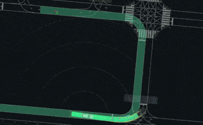
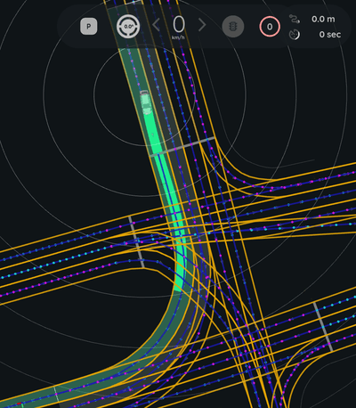
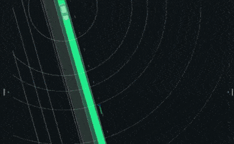
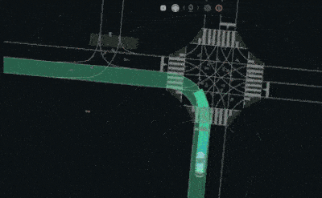
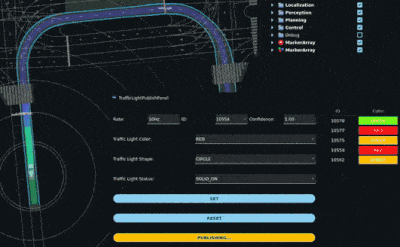

# Autoware Diffusion Planner

## Overview

The **Autoware Diffusion Planner** is a trajectory generation module for autonomous vehicles, designed to work within the [Autoware](https://autoware.org/) ecosystem. It leverages the [Diffusion Planner](https://github.com/ZhengYinan-AIR/Diffusion-Planner) model, as described in the paper ["Diffusion-Based Planning for Autonomous Driving with Flexible Guidance"](https://arxiv.org/abs/2501.15564) by Zheng et al. <!-- cSpell:ignore Zheng -->

This planner generates smooth, feasible, and safe trajectories by considering:

- Dynamic and static obstacles
- Vehicle kinematics
- User-defined constraints
- Lanelet2 map context
- Traffic signals and speed limits

It is implemented as a ROS 2 component node, making it easy to integrate into Autoware-based stacks. The node is aimed at working within the proposed [Autoware new planning framework](https://github.com/tier4/new_planning_framework).

The node publishes raw diffusion trajectories. The downstream `autoware_trajectory_processor` pipeline applies optional optimizers, including MPPI, and safety modifiers.

---

## How to use

### (1) Prerequisites

Make sure that the directory specified in `planning/autoware_diffusion_planner/config/diffusion_planner.param.yaml` points to the correct model version and contains the required model weight and parameter files.

```bash
$ ls ~/autoware_data/diffusion_planner/v3.1/
diffusion_planner.onnx diffusion_planner.param.json
```

This can be downloaded from [setup-dev-env.sh](https://github.com/autowarefoundation/autoware/blob/main/setup-dev-env.sh).

### (2) Modify launch files

Currently, some launch files must be changed to run the planning simulator with `autoware_diffusion_planner`.

```diff
diff --git a/autoware_launch/config/control/trajectory_follower/longitudinal/pid.param.yaml b/autoware_launch/config/control/trajectory_follower/longitudinal/pid.param.yaml
--- a/autoware_launch/config/control/trajectory_follower/longitudinal/pid.param.yaml
+++ b/autoware_launch/config/control/trajectory_follower/longitudinal/pid.param.yaml
@@ -6,7 +6,7 @@
     enable_overshoot_emergency: false
     enable_large_tracking_error_emergency: true
     enable_slope_compensation: true
-    enable_keep_stopped_until_steer_convergence: true
+    enable_keep_stopped_until_steer_convergence: false

     # state transition
     drive_state_stop_dist: 0.5
diff --git a/autoware_launch/config/planning/scenario_planning/common/common.param.yaml b/autoware_launch/config/planning/scenario_planning/common/common.param.yaml
--- a/autoware_launch/config/planning/scenario_planning/common/common.param.yaml
+++ b/autoware_launch/config/planning/scenario_planning/common/common.param.yaml
@@ -1,6 +1,6 @@
 /**:
   ros__parameters:
-    max_vel: 4.17           # max velocity limit [m/s]
+    max_vel: 22.2           # max velocity limit [m/s]

     # constraints param for normal driving
     normal:
diff --git a/autoware_launch/config/system/diagnostics/planning.yaml b/autoware_launch/config/system/diagnostics/planning.yaml
--- a/autoware_launch/config/system/diagnostics/planning.yaml
+++ b/autoware_launch/config/system/diagnostics/planning.yaml
@@ -11,19 +11,7 @@ units:
           - { type: link, link: /autoware/planning/trajectory_validation }

   - path: /autoware/planning/trajectory_validation
-    type: and
-    list:
-      - { type: link, link: /autoware/planning/trajectory_validation/finite }
-      - { type: link, link: /autoware/planning/trajectory_validation/interval }
-      - { type: link, link: /autoware/planning/trajectory_validation/curvature }
-      - { type: link, link: /autoware/planning/trajectory_validation/angle }
-      - { type: link, link: /autoware/planning/trajectory_validation/lateral_acceleration }
-      - { type: link, link: /autoware/planning/trajectory_validation/acceleration }
-      - { type: link, link: /autoware/planning/trajectory_validation/deceleration }
-      - { type: link, link: /autoware/planning/trajectory_validation/steering }
-      - { type: link, link: /autoware/planning/trajectory_validation/steering_rate }
-      - { type: link, link: /autoware/planning/trajectory_validation/velocity_deviation }
-      - { type: link, link: /autoware/planning/trajectory_validation/trajectory_shift }
+    type: ok

   - path: /autoware/planning/routing/state
     type: diag
diff --git a/tier4_universe_launch/tier4_planning_launch/launch/planning.launch.xml b/tier4_universe_launch/tier4_planning_launch/launch/planning.launch.xml
--- a/tier4_universe_launch/tier4_planning_launch/launch/planning.launch.xml
+++ b/tier4_universe_launch/tier4_planning_launch/launch/planning.launch.xml
@@ -47,12 +47,34 @@
       </include>
     </group>

+    <!-- trajectory generator -->
+    <group>
+      <push-ros-namespace namespace="trajectory_generator"/>
+      <include file="$(find-pkg-share autoware_diffusion_planner)/launch/diffusion_planner.launch.xml">
+        <arg name="input_odometry" value="/localization/kinematic_state"/>
+        <arg name="input_acceleration" value="/localization/acceleration"/>
+        <arg name="input_route" value="/planning/mission_planning/route"/>
+        <arg name="input_traffic_signals" value="/perception/traffic_light_recognition/traffic_signals"/>
+        <arg name="input_tracked_objects" value="/perception/object_recognition/tracking/objects"/>
+        <arg name="input_vector_map" value="/map/vector_map"/>
+        <arg name="input_turn_indicators" value="/vehicle/status/turn_indicators_status"/>
+        <arg name="output_trajectories" value="/planning/generator/diffusion_planner/candidate_trajectories"/>
+        <arg name="output_turn_indicators" value="/planning/turn_indicators_cmd"/>
+      </include>
+      <include file="$(find-pkg-share autoware_trajectory_processor)/launch/trajectory_optimizer.launch.xml">
+        <arg name="input_trajectories" value="/planning/generator/diffusion_planner/candidate_trajectories"/>
+        <arg name="output_traj" value="/planning/trajectory"/>
+        <arg name="output_trajectories" value="/planning/generator/trajectory_optimizer/candidate_trajectories"/>
+      </include>
+    </group>
+
     <!-- planning validator -->
     <group>
       <include file="$(find-pkg-share autoware_planning_validator)/launch/planning_validator.launch.xml">
         <arg name="container_type" value="component_container_mt"/>
         <arg name="input_trajectory" value="/planning/scenario_planning/velocity_smoother/trajectory"/>
-        <arg name="output_trajectory" value="/planning/trajectory"/>
+        <arg name="output_trajectory" value="/planning/trajectory/unused"/>
         <arg name="input_objects_topic_name" value="$(var input_objects_topic_name)"/>
         <arg name="input_pointcloud_topic_name" value="$(var input_pointcloud_topic_name)"/>
         <arg name="planning_validator_param_path" value="$(var planning_validator_param_path)"/>
diff --git a/tier4_universe_launch/tier4_planning_launch/launch/scenario_planning/lane_driving/behavior_planning/behavior_planning_deprecated.launch.xml b/tier4_universe_launch/tier4_planning_launch/launch/scenario_planning/lane_driving/behavior_planning/behavior_planning_deprecated.launch.xml
--- a/tier4_universe_launch/tier4_planning_launch/launch/scenario_planning/lane_driving/behavior_planning/behavior_planning_deprecated.launch.xml
+++ b/tier4_universe_launch/tier4_planning_launch/launch/scenario_planning/lane_driving/behavior_planning/behavior_planning_deprecated.launch.xml
@@ -240,7 +240,7 @@
         <remap from="~/input/accel" to="/localization/acceleration"/>
         <remap from="~/input/scenario" to="/planning/scenario_planning/scenario"/>
         <remap from="~/output/path" to="path_with_lane_id"/>
-        <remap from="~/output/turn_indicators_cmd" to="/planning/turn_indicators_cmd"/>
+        <remap from="~/output/turn_indicators_cmd" to="/planning/turn_indicators_cmd/unused"/>
         <remap from="~/output/hazard_lights_cmd" to="/planning/behavior_path_planner/hazard_lights_cmd"/>
         <remap from="~/output/modified_goal" to="/planning/scenario_planning/modified_goal"/>
         <remap from="~/output/stop_reasons" to="/planning/scenario_planning/status/stop_reasons"/>
```

### (3) Launch the planning simulator

```bash
ros2 launch autoware_launch planning_simulator.launch.xml \
  map_path:=/path/to/your/map \
  vehicle_model:=sample_vehicle \
  sensor_model:=sample_sensor_kit
```

## Features

- **Diffusion-based trajectory generation** for flexible and robust planning

  [](media/diffusion_planner.gif)

- **Integration with Lanelet2 maps** for lane-level context

  [](media/lanelet_map_integration.png)

- **Dynamic and static obstacle handling** using perception inputs

  [](media/diffusion_planner_reacts_to_bus.gif)

  [](media/reaction_to_other_agents.gif)

- **Traffic signal and speed limit awareness**

  [](media/traffic_light_support.gif)

- **ONNX Runtime** inference for fast neural network execution
- **ROS 2 publishers** for planned trajectories, predicted objects, and debug markers

---

## Scene Representation

The encoder of a checkpoint reads the scene in one of two ways, and the node picks the matching
path automatically from the `input_type` field of the model's args JSON. A checkpoint that predates
the image encoder carries no such field and is treated as `vector`.

| `input_type` | Encoder input                                                          | Encoder tokens |
| ------------ | ---------------------------------------------------------------------- | -------------- |
| `vector`     | One token per lane segment, route segment, polygon, line string, agent | 501            |
| `image`      | BEV rasters, plus the ego motion and turn-indicator scalar tokens      | 100            |

In `image` mode the node rasterizes the same vector scene it builds for `vector` mode into a stack
of binary bird's-eye-view masks - a mirror of `diffusion_planner/utils/render_bev.py` in the
training repository - and feeds that to the encoder instead of the polylines:

- Two scales share the ego pose as their origin, both 224x224 pixels with the ego heading
  pointing up. The figure is the full side length of the view, not its reach from the ego:

  | View  | Side  | Around ego | Resolution   |
  | ----- | ----- | ---------- | ------------ |
  | near  | 50 m  | +/-25 m    | 0.223 m/pixel |
  | far   | 200 m | +/-100 m   | 0.893 m/pixel |
- 17 semantic channels, each its own binary mask so overlapping elements never hide each other:
  lane boundary, lane centerline, route, four traffic light planes, polygon, line string, static
  object, goal pose, vehicle, pedestrian, bicycle, ego, neighbor history, ego history.
- The traffic light state gets one plane per colour - go (green), caution (yellow), stop (red) and
  unknown (the lane has a light whose colour never arrived) - so none of them is folded into
  another. A lane with no traffic light at all is silent on all four planes, and that silence is
  what identifies it.
- Motion lives in the history channels: an agent's past track is a polyline that ends at its
  current bounding box.

Rendering happens before normalization, since the rasterizer works in meters. The elements the
raster cannot carry stay as tensors: the ego velocity and acceleration (from `ego_current_state`)
and the turn-indicator history. `goal_pose`, `ego_shape` and `ego_agent_past` are not passed at all
in `image` mode - the encoder does not read them - though the renderer still draws them.

Set `debug_params.publish_debug_bev_image` to `true` to publish a colorized preview of each scale
on `~/debug/bev_image_50m` and `~/debug/bev_image_200m`. This is the quickest way to confirm the
node's rasters match what the model was trained on.

---

## Parameters

{{ json_to_markdown("planning/autoware_diffusion_planner/schema/diffusion_planner.schema.json") }}

Parameters can be set via YAML (see `config/diffusion_planner.param.yaml`).

---

## Inputs

| Topic                     | Message Type                                        | Description                |
| ------------------------- | --------------------------------------------------- | -------------------------- |
| `~/input/odometry`        | nav_msgs/msg/Odometry                               | Ego vehicle odometry       |
| `~/input/acceleration`    | geometry_msgs/msg/AccelWithCovarianceStamped        | Ego acceleration           |
| `~/input/tracked_objects` | autoware_perception_msgs/msg/TrackedObjects         | Detected dynamic objects   |
| `~/input/traffic_signals` | autoware_perception_msgs/msg/TrafficLightGroupArray | Traffic light states       |
| `~/input/vector_map`      | autoware_map_msgs/msg/LaneletMapBin                 | Lanelet2 map               |
| `~/input/route`           | autoware_planning_msgs/msg/LaneletRoute             | Route information          |
| `~/input/turn_indicators` | autoware_vehicle_msgs/msg/TurnIndicatorsReport      | Turn indicator information |

## Outputs

| Topic                           | Message Type                                              | Description                                                |
| ------------------------------- | --------------------------------------------------------- | ---------------------------------------------------------- |
| `~/output/trajectory`           | autoware_planning_msgs/msg/Trajectory                     | Planned trajectory for the ego vehicle                     |
| `~/output/trajectories`         | autoware_internal_planning_msgs/msg/CandidateTrajectories | Multiple candidate trajectories                            |
| `~/output/predicted_objects`    | autoware_perception_msgs/msg/PredictedObjects             | Predicted future states of dynamic objects                 |
| `~/output/turn_indicators`      | autoware_vehicle_msgs/msg/TurnIndicatorsCommand           | Planned turn indicator command                             |
| `~/output/debug/traffic_signal` | autoware_perception_msgs/msg/TrafficLightGroup            | First traffic light on route (ego forward) for RViz/ad_api |
| `~/debug/lane_marker`           | visualization_msgs/msg/MarkerArray                        | Lane debug markers                                         |
| `~/debug/route_marker`          | visualization_msgs/msg/MarkerArray                        | Route debug markers                                        |
| `~/debug/bev_image_50m`         | sensor_msgs/msg/Image                                     | BEV raster preview, near view (image-input models only)    |
| `~/debug/bev_image_200m`        | sensor_msgs/msg/Image                                     | BEV raster preview, far view (image-input models only)     |

---

## Testing

Unit tests are provided and can be run with:

```bash
colcon test --packages-select autoware_diffusion_planner
colcon test-result --all
```

---

## ONNX Model and Versioning

The Diffusion Planner relies on an ONNX model for inference.
To ensure compatibility between models and the ROS 2 node implementation, the model versioning scheme follows **major** and **minor** numbers:
The model version is defined either by the directory name provided to the node or within the `diffusion_planner.param.json` configuration file.

- **Major version**
  Incremented when there are changes in the model **inputs/outputs or architecture**.

  > :warning: Models with different major versions are **not compatible** with the current ROS node.

- **Minor version**
  Incremented when **only the weight files are updated**.
  As long as the major version matches, the node remains compatible, and the new model can be used directly.

To download the latest model, simply run the provided setup script:
[How to set up a development environment](https://autowarefoundation.github.io/autoware-documentation/main/installation/autoware/source-installation/#how-to-set-up-a-development-environment)

### Model Version History

| Version | Release Date | Notes                                                                                                                                                                                                                                                                                                                                                                                                                                    | ROS Node Compatibility |
| ------- | ------------ | ---------------------------------------------------------------------------------------------------------------------------------------------------------------------------------------------------------------------------------------------------------------------------------------------------------------------------------------------------------------------------------------------------------------------------------------- | ---------------------- |
| **0.1** | 2025/07/05   | - First public release<br>- Route planning based on TIER IV real data                                                                                                                                                                                                                                                                                                                                                                    | NG                     |
| **1.0** | 2025/09/12   | - Route Termination learning<br>- Output turn-signal (indicator) <br>- Lane type integration in HD map for improved accuracy<br>- Added datasets:<br>&nbsp;&nbsp;- Synthetic Data: **4.0M points**<br>&nbsp;&nbsp;- Real Data: **1.5M points**                                                                                                                                                                                           | NG                     |
| **2.0** | 2025/11/26   | - Increased the number of acceptable lane types ("crosswalk", "pedestrian_lane" and "walkway") for left and right boundaries. <br>- Added `Polygon` and `LineString` as acceptable input types. <br>- Increased the maximum length of each history record to 3 seconds. <br>- Added support for turn_indicator as an input (this is just an interface, not used in v2.0 weights). <br>- Increased `NUM_SEGMENTS_IN_LANE` from 70 to 140. | NG                     |
| **3.0** | 2026/01/09   | - Added `TURN_INDICATOR_OUTPUT_KEEP` to allow the model to focus on the timing of status change. <br>- Conducted Supervised Fine-Tuning (SFT) with carefully filtered data. <br>- Increased the encoder layers from 3 to 6.                                                                                                                                                                                                              | OK                     |
| **3.1** | 2026/03/05   | - ONNX simplified model for faster TRT engine build and reduced GPU memory. <br>- Same weights as v3.0 (no retraining).                                                                                                                                                                                                                                                                                                                  | OK                     |
| **4.0** | 2026/03/23   | - Added `delay` input for Real-Time Chunking (RTC): reuses first N timesteps from the previous prediction for trajectory continuity. <br>- Added one-hot type encoding for polygons (`intersection_area`) and line strings (`stop_line`, `road_border`). <br>- Increased `NUM_LINE_STRINGS` from 10 to 60. <br>- Added line string resampling (`line_string_max_step_m`). <br>- Added debug visualization for line strings.              | OK                     |

---

## Development & Contribution

- Follow the [Autoware coding guidelines](https://autowarefoundation.github.io/autoware-documentation/main/contributing/).
- Contributions, bug reports, and feature requests are welcome via GitHub issues and pull requests.

---

## References

- [Diffusion Planner (original repo)](https://github.com/ZhengYinan-AIR/Diffusion-Planner)
- [Diffusion planner (our fork of the previous repo, used to train the model)](https://github.com/tier4/Diffusion-Planner)
- ["Diffusion-Based Planning for Autonomous Driving with Flexible Guidance"](https://arxiv.org/abs/2309.00615)

---

## License

This package is released under the Apache 2.0 License.
