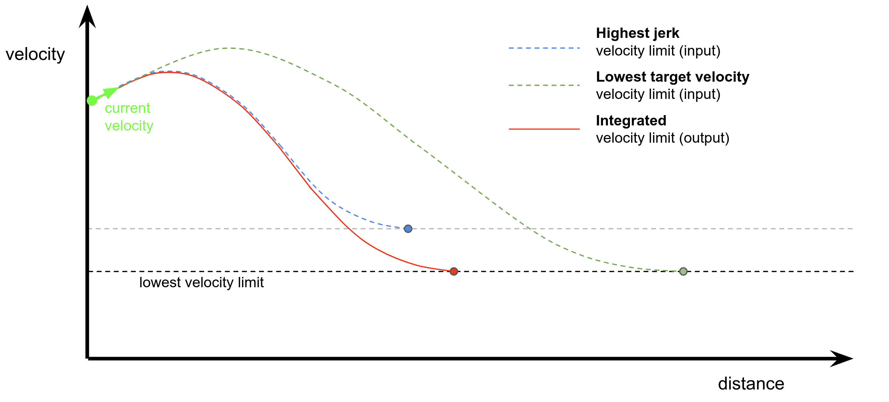

# 外部速度制限セレクター

## 目的

`external_velocity_limit_selector_node`は外部速度制限の一貫性を保つノードです。このモジュールは次のものをサブスクライブします。

1. **API**によって送信される速度制限コマンド
2. **Autoware内部モジュール**によって送信される速度制限コマンド

VelocityLimit.msgには、**最大速度**だけでなく、減速時の**加速度/ジャーク制約**に関する情報も含まれています。`external_velocity_limit_selector_node`は、APIおよびAutoware内部モジュールによって送信されたすべての減速ポイントと最大速度を保護する**最も厳しい速度制限**を計算するために、最も低い速度制限と最も高いジャーク制約を統合します。

## 内部動作/アルゴリズム

WIP

| 名前                                                | タイプ                                           | 説明                                           |
| --------------------------------------------------- | ---------------------------------------------- | ---------------------------------------------- |
| `~input/velocity_limit_from_api`                    | tier4_planning_msgs::VelocityLimit             | APIからの速度制限                              |
| `~input/velocity_limit_from_internal`               | tier4_planning_msgs::VelocityLimit             | Autoware内部モジュールからの速度制限            |
| `~input/velocity_limit_clear_command_from_internal` | tier4_planning_msgs::VelocityLimitClearCommand | 内部からの速度制限クリアコマンド                |

## 出力

| 名前                   | タイプ                               | 説明                                       |
| ---------------------- | ---------------------------------- | ------------------------------------------------- |
| `~output/max_velocity` | `tier4_planning_msgs::VelocityLimit` | 最も厳しい速度制限に関する現在の情報 |

## パラメーター

| パラメータ        | タイプ   | 説明                                       |
| ----------------- | ------ | ------------------------------------------ |
| `max_velocity`    | double | デフォルト最大速度 [m/s]                 |
| `normal.min_acc`  | double | 最小加速度 [m/ss]                        |
| `normal.max_acc`  | double | 最大加速度 [m/ss]                        |
| `normal.min_jerk` | double | 最小ジャーク [m/sss]                     |
| `normal.max_jerk` | double | 最大ジャーク [m/sss]                     |
| `limit.min_acc`   | double | 遵守する最小加速度 [m/ss]               |
| `limit.max_acc`   | double | 遵守する最大加速度 [m/ss]               |
| `limit.min_jerk`  | double | 遵守する最小ジャーク [m/sss]            |
| `limit.max_jerk`  | double | 遵守する最大ジャーク [m/sss]            |

## 前提条件 / 制限事項

<!-- 実装の仮定と制限事項を記述する。

例:
  このアルゴリズムでは障害物が動かないと仮定されています。そのため、車両が障害物を回避し始めた後に急に障害物が動くと、衝突する可能性があります。
  また、このアルゴリズムは死角を考慮しません。一般的に、検知性能の限界により近すぎる障害物は見えなくなるため、障害物に十分な余裕を持ってください。
-->

## (省略可) エラー検出と処理

<!-- エラーの検出方法と回復方法を記述する。

例:
  このパッケージでは、最大 20 個の障害物を処理できます。 それ以上の障害物が発見された場合、このノードは放棄して診断エラーを発生させます。
-->

## (省略可) パフォーマンス特性

<!-- 複雑さなどのパフォーマンス情報を記述する。ボトルネックにならない場合は不要です。

例:
  ### 複雑さ

  このアルゴリズムは O(N) です。

  ### 処理時間

  ...
-->

## (省略可) 参考文献 / 外部リンク

<!-- 実装時に参照したリンクを記述する。

例:
  [1] {link_to_a_thesis}
  [2] {link_to_an_issue}
-->

## (省略可) 将来の拡張 / 未実装部分

<!-- このパッケージの将来の拡張について記述する。

例:
  現在、このパッケージはチャタリング障害物をうまく処理できません。検知層に確率的フィルタを追加して改善する予定です。
  また、グローバルであるべきパラメータがいくつかあります (例: 車両サイズ、最大ステアリングなど)。これらはリファクタリングされ、グローバルパラメータとして定義されるため、異なるノード間で同じパラメータを共有できます。
-->

