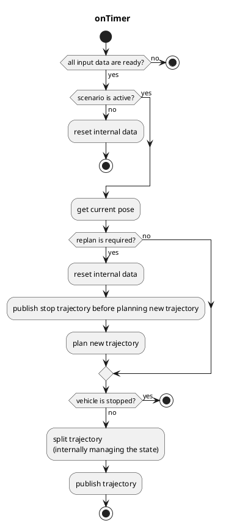

# `autoware_freespace_planner`

## `freespace_planner_node`

`freespace_planner_node` は、静的/動的障害物のある空間内での経路を計画するグローバルパスプランナーノードです。このノードは現在、`freespace_planning_algorithms` パッケージのハイブリッド A\* 検索アルゴリズムに基づいています。rrt\* などの他のアルゴリズムも追加され、将来選択できるようになります。

**注記**
軌跡追従の制約により、出力軌跡は一方向のパスのみを含めるように分割されます。言い換えると、出力軌跡には、前方と後方の軌跡が同時に含まれません。

### 入力トピック

| 名前                    | 型                          | 説明                                                 |
| ----------------------- | ----------------------------- | -------------------------------------------------------- |
| `~input/route`          | autoware_planning_msgs::Route | ルートと目標位置                                     |
| `~input/occupancy_grid` | nav_msgs::OccupancyGrid       | 走行可能な領域のコストマップ                             |
| `~input/odometry`       | nav_msgs::Odometry            | 車両速度（車両停止のチェック用）                       |
| `~input/scenario`       | tier4_planning_msgs::Scenario | アクティブにするシナリオ（ノードの起動用）              |

### 出力トピック

| 名前                  | 型                                | 説明                                               |
| -------------------- | ---------------------------------- | --------------------------------------------------- |
| `~output/trajectory`  | autoware_planning_msgs::Trajectory | 走行すべき軌跡                                        |
| `is_completed`        | bool (rosparamとして実装)           | すべての分割された軌跡がパブリッシュされたかどうか |

### 出力TF

なし

### 起動方法

1. `freespace_planner.launch` にリマッピング情報を記載するか、`roslaunch` 実行時に引数を追加する
2. `roslaunch freespace_planner freespace_planner.launch`

### パラメーター

{{json_to_markdown("planning/autoware_freespace_planner/schema/freespace_planner.schema.json")}}

#### ノードパラメーター

| パラメータ                    | タイプ   | 説明                                                                     |
| ---------------------------- | ------ | ------------------------------------------------------------------------------- |
| `planning_algorithms`        | 文字列 | ノードで使用されるアルゴリズム                                                     |
| `vehicle_shape_margin_m`     | 浮動小数点 | Planningアルゴリズムでの衝突マージン                                          |
| `update_rate`                | 倍精度浮動小数点数 | タイマーの更新レート                                                             |
| `waypoints_velocity`         | 倍精度浮動小数点数 | 出力軌跡の速度（現在、定速度のみサポートされています）  |
| `th_arrived_distance_m`      | 倍精度浮動小数点数 | 車両が軌跡の終点に到着したかどうかを確認するための閾値距離 |
| `th_stopped_time_sec`        | 倍精度浮動小数点数 | 車両が停止しているかどうかを確認するための閾値時間                                   |
| `th_stopped_velocity_mps`    | 倍精度浮動小数点数 | 車両が停止しているかどうかを確認するための閾値速度                               |
| `th_course_out_distance_m`   | 倍精度浮動小数点数 | 車両がコースアウトしているかどうかを確認するための閾値距離                         |
| `th_obstacle_time_sec`       | 倍精度浮動小数点数 | 軌跡上に障害物があるかどうかを確認するための閾値時間                        |
| `vehicle_shape_margin_m`     | 倍精度浮動小数点数 | 車両の余裕                                                                          |
| `replan_when_obstacle_found` | ブール   | 軌跡上に障害物が見つかったときに再計画するか                                                   |
| `replan_when_course_out`     | ブール   | 車両がコースアウトしたときに再計画するか                                |

#### Planner共通パラメータ

| パラメータ                 | タイプ   | 説明                                          |
| ------------------------- | ------ | ----------------------------------------------- |
| `time_limit`              | double | Planningの時間制限                            |
| `maximum_turning_ratio`   | double | カーブに実際に使う最大範囲比                  |
| `turning_steps`           | double | カーブ範囲内のターンステップ数              |
| `theta_size`              | double | 角度の離散化の数                              |
| `lateral_goal_range`      | double | 横方向位置のゴール範囲                        |
| `longitudinal_goal_range` | double | 縦方向位置のゴール範囲                       |
| `angle_goal_range`        | double | 角度のゴール範囲                              |
| `curve_weight`            | double | カーブするアクションに対する追加コスト係数     |
| `reverse_weight`          | double | 後退するアクションに対する追加コスト係数     |
| `direction_change_weight` | double | 進行方向の切り替えに対する追加コスト係数   |
| `obstacle_threshold`      | double | グリッドを障害物とみなすしきい値              |

#### A\* サーチパラメータ

| パラメータ                  | 型   | 説明                                                |
| --------------------------- | ------ | ------------------------------------------------------ |
| `search_method`             | 文字列 | 検索方式（スタートからゴール、またはその逆）       |
| `only_behind_solutions`     | ブール値 | 解をゴールの背後限定するかどうか                   |
| `use_back`                  | ブール値 | 後方軌跡を使用するかどうか                         |
| `adapt_expansion_distance`  | ブール値 | trueの場合、環境に基づいて展開距離を調整する      |
| `expansion_distance`        | 2倍精度浮動小数点型 | ノード遷移の展開長さ                                |
| `near_goal_distance`        | 2倍精度浮動小数点型 | ゴール近接距離しきい値                                |
| `distance_heuristic_weight` | 2倍精度浮動小数点型 | ノードコストを推定するためのヒューリスティック重み |
| `smoothness_weight`         | 2倍精度浮動小数点型 | 曲率変化のコストファクター                            |
| `obstacle_distance_weight`  | 2倍精度浮動小数点型 | 障害物までの距離のコストファクター                  |
| `goal_lat_distance_weight`  | 2倍精度浮動小数点型 | ゴールからの横方向距離のコストファクター            |

#### RRT\* の探索パラメータ

<!-- cspell:ignore Gammell -->

| パラメータ | タイプ | 説明 |
| ----------------------- | ------ | ---------------------------------------------------------------------------- |
| `max planning time` | double | 最大プランニング時間 [msec] (`enable_update` が`true`に設定されている場合のみ使用) |
| `enable_update` | bool | feasibleなソリューションが見つかるまで、`max_planning time` が経過するまで更新するかどうか |
| `use_informed_sampling` | bool | 情報に基づく RRT* (Gammell et al. による) を使用する |
| `neighbor_radius` | double | RRT* アルゴリズムの近傍半径 |
| `margin` | double | RRT* アルゴリズムの経路の衝突チェックで確保される安全マージン |

### フローチャート

