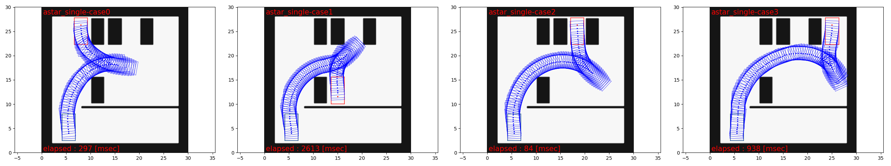
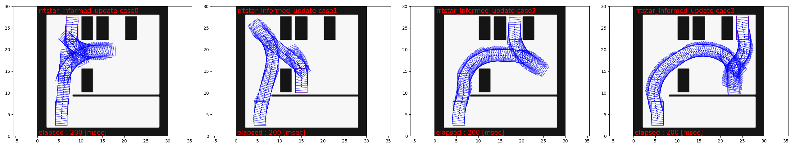
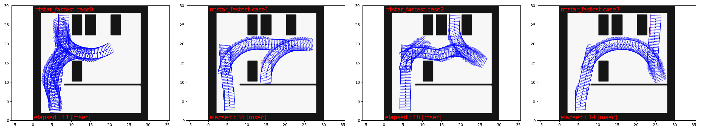

# フリースペース計画アルゴリズム

## 役割

このパッケージは、フリースペースにおける経路計画アルゴリズムを開発するためのものです。

### 実装されているアルゴリズム

- ハイブリッドA\*およびRRT\*（RRTおよびinformed RRT\*を含む）

informed-RRT\*の実装に関する注意については、[rrtstar.md](rrtstar.md)を参照してください。

<!-- cspell:ignore Gammell -->

注: RRT\*について、RRT\*で実現可能なソリューションが見つかった後の更新を実行するかどうを選択できます。
そうしない場合、アルゴリズムはバニラRRTと同じになります（正確には再配線手順のためですが）。
更新を選択した場合、実現可能なソリューションが見つかった後のサンプリングが「情報を与えられる」かどうかというオプションがあります。
Trueに設定すると、アルゴリズムは「Gammell et al. 2014のinformed RRT\*」と同等になります。

## アルゴリズムの選択

アルゴリズムの速度と結果のソリューションの品質の間にトレードオフがあります。
アルゴリズムを（高品質のソリューション/低速）->（低品質のソリューション/高速）の範囲で並べると、
A\* -> informed RRT\* -> RRTになります。ほとんどの場合、informed RRT\*は同じ計算時間予算が与えられたときにソリューションの品質がRRT\*よりも優れていることに注意してください。そのため、RRT\*は比較から除外されています。

選択基準としては以下のようなものがあります。

- 障害物の形状が複雑な場合: -> RRTおよびRRT\*は避けます。結果として得られる経路は乱雑になる可能性があります。
- 目標位置がスタートから遠い場合: -> A\*は避けます。グリッドの離散化に基づいているため、時間がかかりすぎます。

## 新しいアルゴリズムを実装するためのガイド

- このパッケージ内のすべての計画アルゴリズムクラスは`AbstractPlanningAlgorithm`クラスを継承する必要があります。必要に応じて、仮想関数をオーバーライドしてください。
- すべてのアルゴリズムは`nav_msgs::OccupancyGrid`型のcostmapを使用する必要があります。
そのため、`AbstractPlanningAlgorithm`クラスは主に、costmapを使用した衝突チェック、グリッドベースのインデックス付け、costmapに関連する座標変換を実装しています。
- すべてのアルゴリズムは、`PlannerCommonParam`型の構造体とアルゴリズム固有の型の構造体の両方をコンストラクターの入力として使用する必要があります。たとえば、`AstarSearch`クラスのコンストラクターは`PlannerCommonParam`と`AstarParam`の両方を取得します。

## スタンドアロンテストと可視化の実行

ros-testでパッケージをビルドし、テストを実行する:


```sh
colcon build --packages-select autoware_freespace_planning_algorithms
colcon test --packages-select autoware_freespace_planning_algorithms
```

## テストの実行

テストでは、シミュレーション結果は `rosbag` として `/tmp/fpalgos-{algorithm_type}-case{scenario_number}` に格納されます。
[test/debug_plot.py](test/debug_plot.py) を使用してこれらの結果ファイルを読み込むことで、以下の図に示すようにパスと障害物の視覚化プロットを作成できます。作成された図は `tmp` に保存されます。

### A\*（単一曲率ケース）



### `post resampling` 付き情報取得 RRT\*（200msec のタイムバジェット）



### `post resampling` なし RRT\*（RRT とほぼ同じ）



黒のセル、緑のボックス、赤のボックスはそれぞれ、障害物、スタート構成、ゴール構成を示しています。
青のボックスのシーケンスは、ソリューションパスを示しています。

## Python モジュールへの拡張（A\* のみサポート）

Python モジュールへの拡張機能実装があります。
次のように設定することで、Python 経由で A\* の探索を試すことができます。

- パラメータ
- コストマップ
- 自車位置
- ゴール位置

次に、次の情報を入手できます。

- 成功または失敗
- 検索された軌跡

サンプルコードは [scripts/example/example.py](scripts/example/example.py) です。
このパッケージをビルドし、事前のセットアップシェルスクリプトをソース指定する必要があることに注意してください。

## ライセンスの注意事項

ファイル `src/reeds_shepp.cpp` と `include/astar_search/reeds_shepp.h`
は [pyReedsShepp](https://github.com/ghliu/pyReedsShepp) から取得されています。
`pyReedsShepp` の実装は [ompl](https://github.com/ompl/ompl) のコードにも大きく依存しています。
`pyReedsShepp` および `ompl` はどちらも 3 項 BSD ライセンスに基づいて配布されています。

